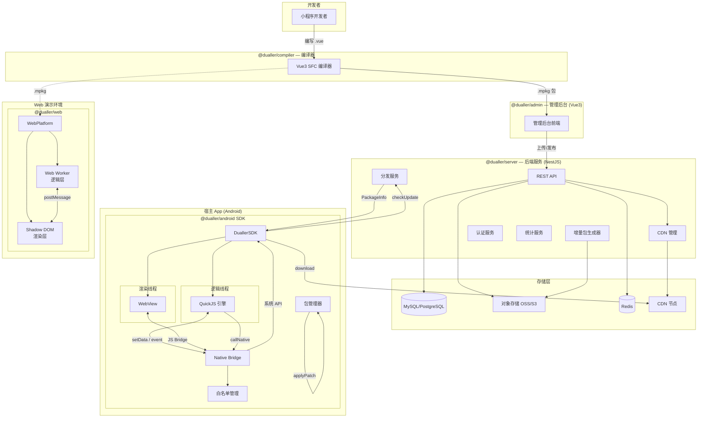
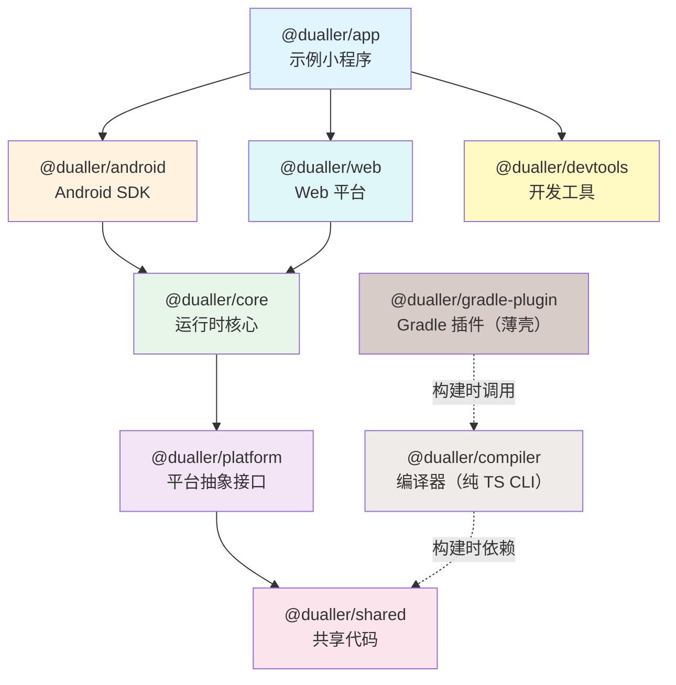
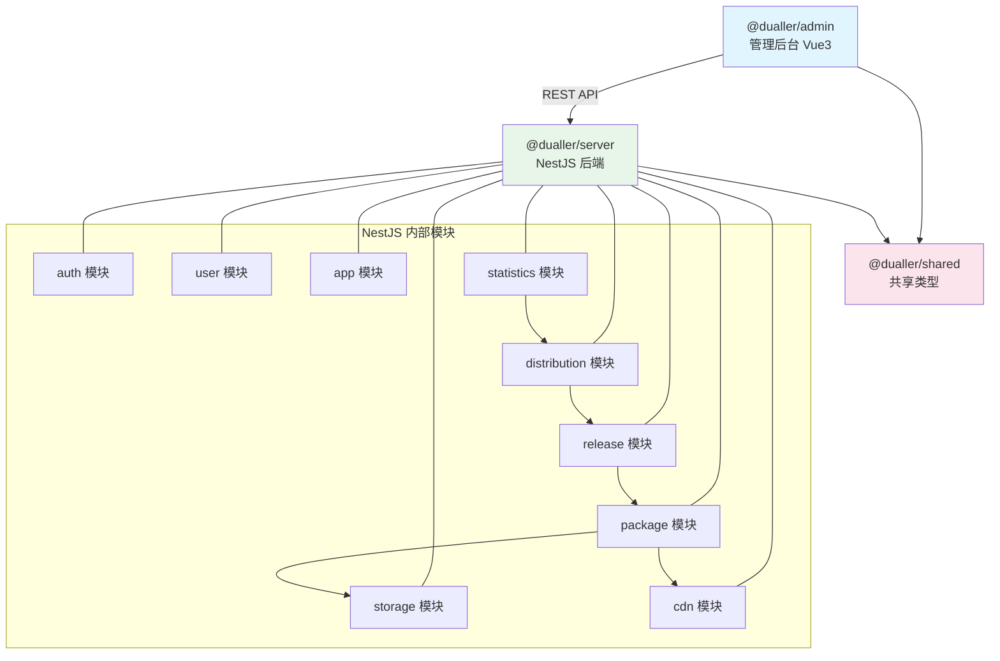
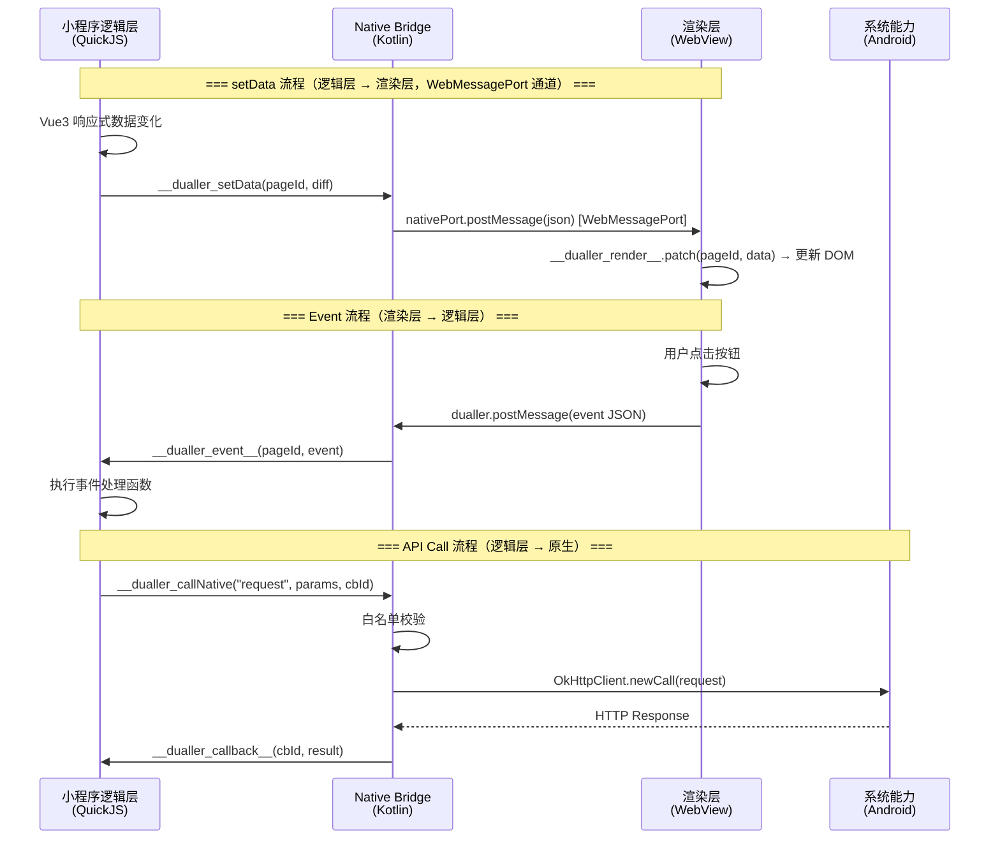
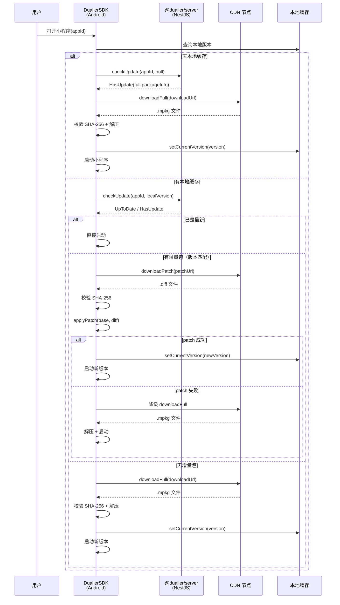
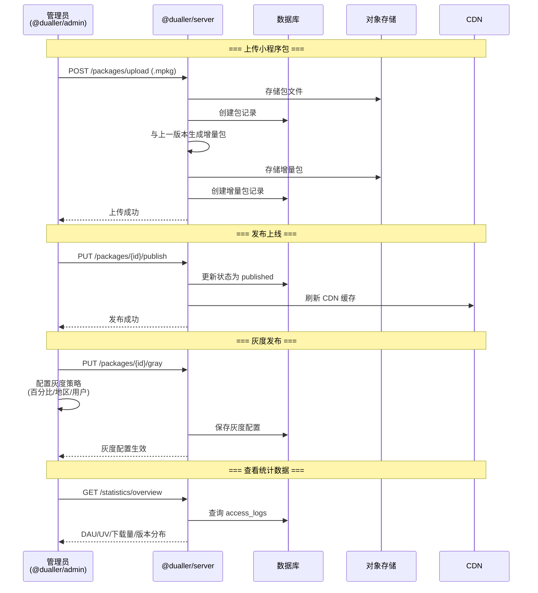
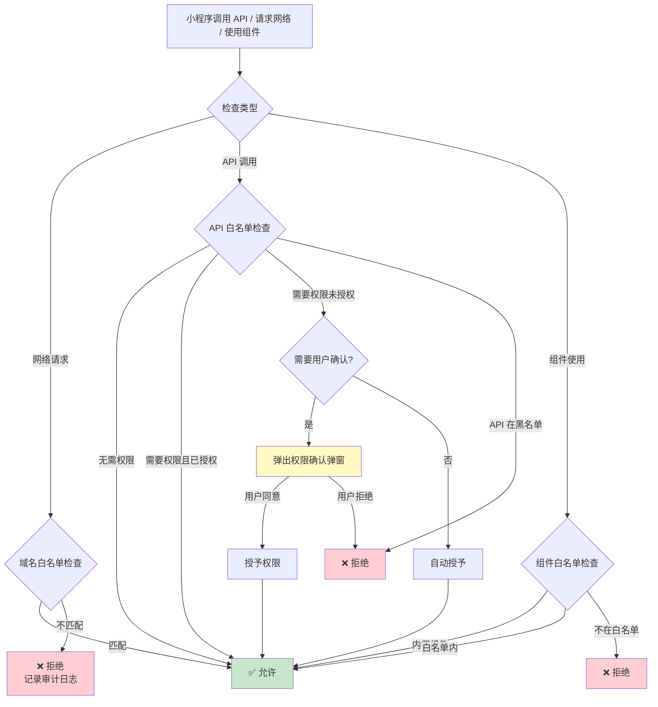

# Dualler — 小程序引擎技术设计文档

> **项目名称**：Dualler
> **版本**：v1.2（业界对标优化版）
> **日期**：2026-06-06（v1.0）→ 2026-06-07（v1.1）→ 2026-06-07（v1.2 业界对标）
> **状态**：设计阶段

### 核心技术规格

| 模块 | 方案 | 说明 |
|------|------|------|
| 通信通道 | `WebMessagePort`（Android 6.0+） | 非阻塞双向通道，消除主线程卡顿和 JNI 拷贝 |
| setData 优化 | 路径式更新 + 自动批量 + 256KB 上限 | 16ms 窗口合并，超出自动分片 |
| 分包加载 | 主包 2MB + 子包按需 + 预加载策略 | 对标微信分包机制，支持独立分包 |
| 增量更新 | 字节级 Bsdiff + 拆包策略 | 公共库/业务代码分离，字节级差量节省 80%+ 流量 |
| 安全沙箱 | JS 层同步拦截 + Native 异步校验 + HTTPS 强制 | QuickJS 剔除 std/os、锁定 Bridge、禁用 eval |
| 同层渲染 | 占位符 + TextureView 动态挂载 | video/map 等组件由原生覆盖渲染 |
| Worker 线程 | 独立 QuickJS 实例 | CPU 密集计算卸载到 Worker，不阻塞主线程 |
| 生命周期 | PageDataStore + Ready 机制 | Bridge 层缓存首屏数据，WebView ready 后 flush |
| 编译器 | Vue3 Render Function + WXS 视图层脚本 | 逻辑层输出纯 JSON VNode Diff，WXS 零 Bridge 开销 |
| 资源隔离 | 虚拟域名 `dualler.local` | WebViewAssetLoader 拦截，断绝 file:// 逃逸路径 |
| 错误处理 | 全局捕获 + 组件隔离 + 崩溃恢复 | App.onError + onUnhandledRejection + 状态持久化 |
| 长列表 | 虚拟列表（recycle-view） | DOM 节点上限 1000，超出使用虚拟滚动 |
| 未来方向 | Skyline 自绘引擎 | v2.0 规划：Skia 自绘 + 单线程架构，消除 Bridge |

---

## 目录

1. [项目概述](#1-项目概述)
2. [整体架构](#2-整体架构)
3. [模块设计](#3-模块设计)
   - 3.1 Monorepo 结构概览
   - 3.2 模块依赖关系
   - 3.3 各模块职责
   - 3.4 包体积预估
   - 3.5 Monorepo 完整目录结构
   - 3.6 模块交互关系图（Mermaid）
4. [双线程通信架构](#4-双线程通信架构)
5. [@dualler/compiler — 编译器](#5-duallercompiler--编译器)
6. [@dualler/platform — 平台抽象层](#6-duallerplatform--平台抽象层)
7. [@dualler/core — 运行时核心](#7-duallercore--运行时核心)
   - 7.4 数据通道（路径式 setData + 自动批量）
   - 7.6 同层渲染（Same-layer Rendering）
   - 7.7 Worker 线程
8. [@dualler/android — Android 实现](#8-duallerandroid--android-实现)
9. [包管理与增量更新](#9-包管理与增量更新)
   - 9.9 分包加载（Subpackaging）
   - 9.10 小程序分发系统
10. [跨平台扩展设计](#10-跨平台扩展设计)
   - 10.5 Skyline 自绘引擎（未来方向）
11. [安全设计](#11-安全设计)
   - 11.1 沙箱隔离（双重沙箱）
   - 11.2 白名单体系（域名/API/组件，HTTPS 强制）
12. [错误处理与崩溃恢复](#12-错误处理与崩溃恢复)
   - 12.1 全局错误处理
   - 12.2 组件级错误隔离
   - 12.3 崩溃恢复机制
   - 12.4 错误上报与监控
13. [性能优化策略](#13-性能优化策略)
   - 13.3 长列表优化（虚拟列表）
   - 13.4 视图层脚本（WXS 等价物）
14. [开发工具链](#14-开发工具链)
15. [SDK 集成指南](#15-sdk-集成指南)
16. [附录：数据结构与协议](#16-附录数据结构与协议)

---

## 1. 项目概述

### 1.1 背景

Dualler 是一个基于 Kotlin 的小程序引擎 SDK，目标是让宿主 App 能够运行基于 Vue3 开发的小程序。引擎采用双线程架构，将 Vue3 代码编译分离为逻辑层（JS）和渲染层（HTML/CSS），通过 QuickJS 和 WebView 分别执行，由 Kotlin Native Bridge 统一调度。

### 1.2 核心目标

- **高性能**：双线程隔离，逻辑层和渲染层并行执行
- **轻量级**：QuickJS 引擎体积小（~200KB），嵌入方便
- **安全**：沙箱隔离，小程序代码无法访问宿主环境
- **跨平台**：Android 优先，预留 iOS 和鸿蒙扩展接口
- **增量更新**：支持包级别增量更新，节省流量和存储

### 1.3 技术选型

| 模块 | 技术选型 | 理由 |
|------|---------|------|
| 逻辑层 JS 引擎 | QuickJS | 轻量（~200KB）、ES2020 完整支持、易于嵌入 |
| 渲染层 | Android WebView | HTML/CSS 渲染成熟、布局能力强 |
| 前端框架 | Vue 3（定制版） | 响应式系统、模板编译、组件化 |
| 构建工具 | Gradle Plugin + Vite/Rollup | Android 生态集成 + 前端生态 |
| 语言 | Kotlin（主体）+ TypeScript（编译器） | 类型安全、协程支持、跨平台潜力 |
| 包管理 | 自研增量更新（Bsdiff） | 字节级 diff/patch，针对压缩后 .mpkg 或大 JS 文件做字节级差量，节省 80%+ 流量 |

### 1.4 目标平台

- **v1.0**：Android（API 21+）
- **预留**：iOS（Swift/Kotlin Multiplatform）、鸿蒙（ArkTS）

---

## 2. 整体架构

### 2.1 分层架构图

```
┌─────────────────────────────────────────────────────────────────┐
│                       小程序应用 (.mpkg)                          │
│               Vue3 SFC → 编译产物（JS + HTML + CSS）               │
└───────────────────────────────┬─────────────────────────────────┘
                                │
┌───────────────────────────────▼─────────────────────────────────┐
│                    Framework Layer（框架层）                       │
│                                                                  │
│  ┌──────────────┐  ┌──────────────┐  ┌────────────────────────┐  │
│  │ @dualler/     │  │ @dualler/    │  │ @dualler/              │  │
│  │ compiler      │  │ core         │  │ devtools               │  │
│  │               │  │              │  │                        │  │
│  │ Vue3 SFC      │  │ 生命周期      │  │ 日志 / 网络面板         │  │
│  │ → JS+HTML+CSS │  │ 路由 / 数据   │  │ 组件树 / 性能监控       │  │
│  │               │  │ 组件注册      │  │                        │  │
│  └───────┬──────┘  └──────┬───────┘  └────────────────────────┘  │
│          │                │                                      │
│          │         ┌──────▼──────────────────────────────────┐   │
│          │         │         @dualler/platform               │   │
│          │         │                                        │   │
│          │         │  PlatformBridge / JSEngineProvider      │   │
│          │         │  WebViewProvider / StorageProvider      │   │
│          │         │  NetworkProvider / FileProvider         │   │
│          │         │  PackageManager / DeviceProvider        │   │
│          │         └───────────┬────────────┬───────────────┘   │
│          │                     │            │                    │
└──────────┼─────────────────────┼────────────┼────────────────────┘
           │                     │            │
┌──────────▼─────────────────────▼────────────▼────────────────────┐
│                    Platform Layer（平台层）                        │
│                                                                   │
│  ┌────────────────┐  ┌────────────────┐  ┌─────────────────────┐  │
│  │ @dualler/       │  │ @dualler/      │  │ @dualler/           │  │
│  │ android         │  │ ios            │  │ harmony             │  │
│  │                 │  │                │  │                     │  │
│  │ QuickJS Engine  │  │ JSCore Engine  │  │ NAPI Engine         │  │
│  │ Android WebView │  │ WKWebView      │  │ ArkWeb              │  │
│  │ Kotlin Bridge   │  │ Swift Bridge   │  │ ArkTS Bridge        │  │
│  │ System APIs     │  │ System APIs    │  │ System APIs         │  │
│  │                 │  │                │  │                     │  │
│  │  v1.0 实现       │  │  预留接口       │  │  预留接口            │  │
│  └─────────────────┘  └────────────────┘  └─────────────────────┘  │
│                                                                    │
└────────────────────────────────────────────────────────────────────┘
           │
┌──────────▼────────────────────────────────────────────────────────┐
│                    Engine Layer（引擎层）                           │
│                                                                    │
│  ┌──────────────┐   ┌───────────────┐   ┌──────────────────────┐  │
│  │  QuickJS      │   │   WebView     │   │   Native Bridge      │  │
│  │  逻辑层引擎    │   │   渲染层       │   │   系统能力桥接         │  │
│  │              │   │               │   │                      │  │
│  │ Vue3 compiled│   │ compiled HTML │   │ 网络 / 文件 / 设备     │  │
│  │ script logic │   │ CSS template  │   │ 路由 / 存储 / 权限     │  │
│  └──────────────┘   └───────────────┘   └──────────────────────┘  │
│                                                                    │
└────────────────────────────────────────────────────────────────────┘
```

### 2.2 数据流概览

```
 Vue3 SFC Source
      │
      ▼
 ┌─────────────┐
 │  @dualler/   │
 │  compiler    │──── <template> ──► HTML/CSS（渲染层产物）
 │              │──── <script>   ──► JS（逻辑层产物）
 │              │──── <style>   ──► CSS（注入 WebView）
 └──────┬──────┘
        │ .mpkg 包
        ▼
 ┌─────────────┐
 │ @dualler/    │
 │ core         │──── 解析 app.json → 路由表
 │              │──── 初始化 AppRuntime / PageRuntime
 └──────┬──────┘
        │
        ▼
 ┌─────────────────────────────────────────────────────────┐
 │           @dualler/android                              │
 │                                                         │
 │  ┌─────────────┐  WebMessagePort   ┌─────────────────┐ │
 │  │  QuickJS     │  (Android 6.0+)   │   WebView        │ │
 │  │  沙箱加固     │                   │   虚拟域名        │ │
 │  │             │  setData(json)     │                  │ │
 │  │  app.js     │ ────────────────►  │  index.html     │ │
 │  │  page.js    │                    │  page.css       │ │
 │  │  Vue3 Runtime│  ◄──────────────  │  __dualler_on() │ │
 │  │  (裁剪版)    │  event(json)      │                  │ │
 │  └──────┬──────┘                   └────────┬─────────┘ │
 │         │                                   │           │
 │         └───── PageDataStore ─ Native Bridge ┘           │
 │                   │   (首屏就绪对齐)                     │
 │         ┌─────────▼──────────┐                          │
 │         │   System APIs      │                          │
 │         │   网络/文件/设备/路由 │                          │
 │         └────────────────────┘                          │
 └─────────────────────────────────────────────────────────┘
```

---

## 3. 模块设计

### 3.1 Monorepo 结构概览

```
dualler (monorepo)
│
├── packages/                    # 所有子包
│   │
│   │   ──── SDK 层（客户端） ────
│   ├── platform/                # @dualler/platform — 跨平台抽象接口
│   ├── core/                    # @dualler/core — 运行时核心
│   ├── android/                 # @dualler/android — Android SDK
│   ├── web/                     # @dualler/web — Web 平台（演示用）
│   ├── ios/                     # @dualler/ios — iOS SDK（预留）
│   ├── harmony/                 # @dualler/harmony — 鸿蒙 SDK（预留）
│   │
│   │   ──── 工具链层 ────
│   ├── compiler/                # @dualler/compiler — Vue3 编译器（纯 TypeScript CLI）
│   ├── gradle-plugin/           # @dualler/gradle-plugin — Android 构建集成（极薄 Kotlin 壳）
│   ├── devtools/                # @dualler/devtools — 开发调试工具
│   │
│   │   ──── 服务端层 ────
│   ├── server/                  # @dualler/server — NestJS 后端服务
│   ├── admin/                   # @dualler/admin — 管理后台（Vue3）
│   │
│   │   ──── 共享层 ────
│   ├── shared/                  # @dualler/shared — 前后端共享代码
│   │
│   └── app/                     # @dualler/app — 示例小程序
│
├── pnpm-workspace.yaml          # pnpm workspace 配置
├── package.json                 # 根 package.json
├── turbo.json                   # Turborepo 构建编排
├── tsconfig.base.json           # TypeScript 基础配置
├── .eslintrc.js                 # ESLint 统一配置
├── .prettierrc                  # Prettier 统一配置
└── .github/                     # CI/CD
    └── workflows/
        ├── ci.yml
        └── release.yml
```

### 3.2 模块依赖关系

```
┌─────────────────────────────────────────────────────────────────────┐
│                        dualler monorepo                              │
│                                                                      │
│  ┌─── 客户端 SDK ─────────────────────────────────────────────────┐  │
│  │                                                                 │  │
│  │  @dualler/app                                                   │  │
│  │      │                                                          │  │
│  │      ├── @dualler/devtools                                      │  │
│  │      │                                                          │  │
│  │      ├── @dualler/web ─────────┐                                │  │
│  │      │       │                 │                                │  │
│  │      │       ├── @dualler/core ┤                                │  │
│  │      │       │                 │                                │  │
│  │      │       └─────────────────├── @dualler/platform            │  │
│  │      │                         │        │                       │  │
│  │      │                         │        └── @dualler/shared     │  │
│  │      │                                                          │  │
│  │      └── @dualler/android ─────┐                                │  │
│  │             │                  │                                │  │
│  │             ├── @dualler/core ─┤                                │  │
│  │             │       │          │                                │  │
│  │             │       └──────────├── @dualler/platform            │  │
│  │             │                  │        │                       │  │
│  │             └──────────────────┘        └── @dualler/shared     │  │
│  │                                                                 │  │
│  │  @dualler/compiler（独立，纯 TS CLI，不参与运行时依赖）             │  │
│  │  @dualler/gradle-plugin（独立，Kotlin 壳，构建时调用 compiler）     │  │
│  └─────────────────────────────────────────────────────────────────┘  │
│                                                                      │
│  ┌─── 服务端 ─────────────────────────────────────────────────────┐  │
│  │                                                                 │  │
│  │  @dualler/admin（Vue3 + Element Plus）                          │  │
│  │      │                                                          │  │
│  │      └── @dualler/shared                                        │  │
│  │                                                                 │  │
│  │  @dualler/server（NestJS）                                      │  │
│  │      │                                                          │  │
│  │      └── @dualler/shared                                        │  │
│  │                                                                 │  │
│  └─────────────────────────────────────────────────────────────────┘  │
│                                                                      │
│  ┌─── 共享 ───────────────────────────────────────────────────────┐  │
│  │  @dualler/shared                                                │  │
│  │      ├── 类型定义（PackageInfo, API 接口等）                      │  │
│  │      ├── 常量定义                                                │  │
│  │      └── 工具函数                                                │  │
│  └─────────────────────────────────────────────────────────────────┘  │
└──────────────────────────────────────────────────────────────────────┘
```

### 3.3 各模块职责

| 模块 | 包名 | 语言/框架 | 职责 |
|------|------|----------|------|
| **SDK 层** | | | |
| 平台抽象 | `@dualler/platform` | Kotlin Interface | 定义所有平台契约接口 |
| 运行时核心 | `@dualler/core` | Kotlin | 生命周期、路由、数据管理、组件注册表 |
| Android SDK | `@dualler/android` | Kotlin | QuickJS、WebView、Bridge、系统 API、包管理 |
| Web 平台 | `@dualler/web` | TypeScript | 浏览器演示环境，逻辑层+渲染层在同一 WebView |
| iOS SDK | `@dualler/ios` | Swift | 预留：JSCore + WKWebView |
| 鸿蒙 SDK | `@dualler/harmony` | ArkTS | 预留：NAPI + ArkWeb |
| **工具链层** | | | |
| 编译器 | `@dualler/compiler` | TypeScript | Vue3 SFC → JS + HTML/CSS，纯 CLI 工具，可被 Web/CI/Gradle 独立调用 |
| Gradle 插件 | `@dualler/gradle-plugin` | Kotlin | Android 构建集成，极薄壳，调用 `@dualler/compiler` CLI |
| 开发工具 | `@dualler/devtools` | Kotlin + Web | 日志、网络面板、组件树、性能监控 |
| **服务端层** | | | |
| 后端服务 | `@dualler/server` | NestJS (TypeScript) | 包管理 API、增量包生成、分发、灰度、统计 |
| 管理后台 | `@dualler/admin` | Vue3 + Element Plus | 小程序上传、版本管理、审核、发布、数据看板 |
| **共享层** | | | |
| 共享代码 | `@dualler/shared` | TypeScript | 前后端共享类型、常量、工具函数 |
| **示例** | | | |
| 示例小程序 | `@dualler/app` | Kotlin + Vue3 | 演示用小程序 |

### 3.4 包体积预估

**客户端 SDK（打入宿主 App）：**

| 模块 | 预估大小 | 说明 |
|------|---------|------|
| QuickJS JNI | ~200KB | JS 引擎 |
| @dualler/core | ~150KB | 运行时核心 |
| @dualler/platform | ~30KB | 纯接口 |
| @dualler/android | ~300KB | Bridge + WebView + 系统 API |
| **合计（运行时）** | **~680KB** | 不含小程序包本身 |

**工具链（仅构建时）：**

| 模块 | 预估大小 | 说明 |
|------|---------|------|
| @dualler/compiler | ~400KB | 纯 TypeScript CLI，npm 包 |
| @dualler/gradle-plugin | ~50KB | 极薄 Kotlin 壳，调用 compiler CLI |
| @dualler/shared | ~50KB | 共享类型和工具 |

**服务端（独立部署）：**

| 模块 | 技术栈 | 说明 |
|------|--------|------|
| @dualler/server | NestJS + TypeORM | 包管理、分发、灰度、统计 |
| @dualler/admin | Vue3 + Element Plus | 管理后台 SPA |

### 3.5 Monorepo 完整目录结构

```
dualler/
│
│ ═══════════════════════════════════════════════════════════════
│  根目录配置
│ ═══════════════════════════════════════════════════════════════
│
├── package.json                            # 根 package.json（workspace 管理）
├── pnpm-workspace.yaml                     # pnpm workspace 配置
├── turbo.json                              # Turborepo 构建编排
├── tsconfig.base.json                      # TypeScript 基础配置
├── .eslintrc.js                            # ESLint 统一配置
├── .prettierrc                             # Prettier 统一配置
├── .gitignore
├── .env.example
├── README.md
│
├── .github/
│   └── workflows/
│       ├── ci.yml                          # CI 流水线
│       └── release.yml                     # 发布流水线
│
│ ═══════════════════════════════════════════════════════════════
│  packages/ — 所有子包
│ ═══════════════════════════════════════════════════════════════
│
├── packages/
│   │
│   │ ──────── 共享层 ────────
│   │
│   ├── shared/                             # @dualler/shared — 前后端共享代码
│   │   ├── package.json
│   │   ├── tsconfig.json
│   │   └── src/
│   │       ├── index.ts
│   │       ├── types/
│   │       │   ├── package.ts              # PackageInfo, LocalPackage 等类型
│   │       │   ├── api.ts                  # API 请求/响应类型
│   │       │   ├── bridge.ts               # Bridge 消息类型
│   │       │   └── security.ts             # 安全配置类型
│   │       ├── constants/
│   │       │   ├── version.ts              # 版本号
│   │       │   ├── error-codes.ts          # 错误码定义
│   │       │   └── api-paths.ts            # API 路径常量
│   │       └── utils/
│   │           ├── hash.ts                 # SHA-256 计算
│   │           ├── validator.ts            # 数据校验
│   │           └── rpx.ts                  # rpx 单位转换
│   │
│   │ ──────── 服务端层 ────────
│   │
│   ├── server/                             # @dualler/server — NestJS 后端服务
│   │   ├── package.json
│   │   ├── tsconfig.json
│   │   ├── nest-cli.json
│   │   ├── Dockerfile
│   │   ├── docker-compose.yml
│   │   └── src/
│   │       ├── main.ts                     # NestJS 入口
│   │       ├── app.module.ts               # 根模块
│   │       │
│   │       ├── common/                     # 公共模块
│   │       │   ├── guards/
│   │       │   │   ├── auth.guard.ts       # 认证守卫
│   │       │   │   └── admin.guard.ts      # 管理员权限守卫
│   │       │   ├── interceptors/
│   │       │   │   ├── logging.interceptor.ts
│   │       │   │   └── transform.interceptor.ts
│   │       │   ├── filters/
│   │       │   │   └── http-exception.filter.ts
│   │       │   └── decorators/
│   │       │       └── current-user.decorator.ts
│   │       │
│   │       ├── auth/                       # 认证模块
│   │       │   ├── auth.module.ts
│   │       │   ├── auth.controller.ts      # 登录/注册/Token
│   │       │   ├── auth.service.ts
│   │       │   ├── jwt.strategy.ts         # JWT 策略
│   │       │   └── dto/
│   │       │       ├── login.dto.ts
│   │       │       └── register.dto.ts
│   │       │
│   │       ├── user/                       # 用户模块
│   │       │   ├── user.module.ts
│   │       │   ├── user.controller.ts
│   │       │   ├── user.service.ts
│   │       │   ├── entities/
│   │       │   │   └── user.entity.ts
│   │       │   └── dto/
│   │       │       ├── create-user.dto.ts
│   │       │       └── update-user.dto.ts
│   │       │
│   │       ├── app/                        # 小程序管理模块
│   │       │   ├── app.module.ts
│   │       │   ├── app.controller.ts       # 小程序 CRUD
│   │       │   ├── app.service.ts
│   │       │   ├── entities/
│   │       │   │   ├── mini-app.entity.ts  # 小程序基本信息
│   │       │   │   └── app-version.entity.ts # 版本记录
│   │       │   └── dto/
│   │       │       ├── create-app.dto.ts
│   │       │       └── update-app.dto.ts
│   │       │
│   │       ├── package/                    # 包管理模块
│   │       │   ├── package.module.ts
│   │       │   ├── package.controller.ts   # 包上传/下载/查询
│   │       │   ├── package.service.ts
│   │       │   ├── package-downloader.service.ts  # 包存储
│   │       │   ├── patch-generator.service.ts     # 增量包生成
│   │       │   ├── entities/
│   │       │   │   ├── package.entity.ts   # 包记录
│   │       │   │   └── patch.entity.ts     # 增量包记录
│   │       │   └── dto/
│   │       │       ├── upload-package.dto.ts
│   │       │       └── check-update.dto.ts
│   │       │
│   │       ├── release/                    # 发布管理模块
│   │       │   ├── release.module.ts
│   │       │   ├── release.controller.ts   # 发布/下架/灰度
│   │       │   ├── release.service.ts
│   │       │   ├── gray-release.service.ts # 灰度发布
│   │       │   ├── entities/
│   │       │   │   ├── release.entity.ts   # 发布记录
│   │       │   │   └── gray-config.entity.ts # 灰度配置
│   │       │   └── dto/
│   │       │       ├── publish.dto.ts
│   │       │       └── gray-config.dto.ts
│   │       │
│   │       ├── distribution/               # 分发模块（客户端 SDK 调用）
│   │       │   ├── distribution.module.ts
│   │       │   ├── distribution.controller.ts  # checkUpdate / download
│   │       │   └── distribution.service.ts
│   │       │
│   │       ├── storage/                    # 文件存储模块
│   │       │   ├── storage.module.ts
│   │       │   ├── storage.service.ts      # OSS/S3/本地存储抽象
│   │       │   ├── providers/
│   │       │   │   ├── local-storage.provider.ts
│   │       │   │   ├── oss-storage.provider.ts
│   │       │   │   └── s3-storage.provider.ts
│   │       │   └── interfaces/
│   │       │       └── storage-provider.interface.ts
│   │       │
│   │       ├── cdn/                        # CDN 管理模块
│   │       │   ├── cdn.module.ts
│   │       │   ├── cdn.service.ts          # CDN 刷新/预热
│   │       │   └── providers/
│   │       │       ├── aliyun-cdn.provider.ts
│   │       │       └── tencent-cdn.provider.ts
│   │       │
│   │       ├── statistics/                 # 统计分析模块
│   │       │   ├── statistics.module.ts
│   │       │   ├── statistics.controller.ts # DAU/UV/下载量
│   │       │   ├── statistics.service.ts
│   │       │   └── entities/
│   │       │       └── access-log.entity.ts
│   │       │
│   │       ├── config/                     # 配置
│   │       │   ├── database.config.ts      # 数据库配置
│   │       │   ├── redis.config.ts         # Redis 配置
│   │       │   ├── oss.config.ts           # OSS 配置
│   │       │   └── jwt.config.ts           # JWT 配置
│   │       │
│   │       └── database/                   # 数据库
│   │           ├── migrations/             # 数据库迁移
│   │           └── seeds/                  # 初始数据
│   │
│   ├── admin/                              # @dualler/admin — 管理后台
│   │   ├── package.json
│   │   ├── tsconfig.json
│   │   ├── vite.config.ts
│   │   ├── .env
│   │   ├── .env.production
│   │   ├── index.html
│   │   └── src/
│   │       ├── main.ts                     # Vue 入口
│   │       ├── App.vue
│   │       ├── router/
│   │       │   └── index.ts                # 路由配置
│   │       ├── stores/                     # Pinia 状态管理
│   │       │   ├── user.ts                 # 用户状态
│   │       │   ├── app.ts                  # 小程序状态
│   │       │   └── package.ts              # 包管理状态
│   │       ├── api/                        # API 请求封装
│   │       │   ├── request.ts              # Axios 封装
│   │       │   ├── auth.ts                 # 认证 API
│   │       │   ├── app.ts                  # 小程序 API
│   │       │   ├── package.ts              # 包管理 API
│   │       │   └── statistics.ts           # 统计 API
│   │       ├── layouts/
│   │       │   ├── DefaultLayout.vue       # 默认布局
│   │       │   └── BlankLayout.vue         # 空白布局
│   │       ├── views/
│   │       │   ├── login/
│   │       │   │   └── LoginView.vue       # 登录页
│   │       │   ├── dashboard/
│   │       │   │   └── DashboardView.vue   # 数据看板
│   │       │   ├── app/
│   │       │   │   ├── AppListView.vue     # 小程序列表
│   │       │   │   ├── AppDetailView.vue   # 小程序详情
│   │       │   │   └── AppCreateView.vue   # 创建小程序
│   │       │   ├── package/
│   │       │   │   ├── PackageUploadView.vue   # 包上传
│   │       │   │   ├── PackageListView.vue     # 版本列表
│   │       │   │   └── PatchManageView.vue     # 增量包管理
│   │       │   ├── release/
│   │       │   │   ├── ReleaseView.vue         # 发布管理
│   │       │   │   └── GrayReleaseView.vue     # 灰度发布
│   │       │   ├── user/
│   │       │   │   └── UserManageView.vue      # 用户管理
│   │       │   └── statistics/
│   │       │       ├── OverviewView.vue        # 统计概览
│   │       │       └── DetailView.vue          # 详细统计
│   │       ├── components/                 # 公共组件
│   │       │   ├── PackageUploader.vue     # 包上传组件
│   │       │   ├── VersionTimeline.vue     # 版本时间线
│   │       │   ├── GrayConfigForm.vue      # 灰度配置表单
│   │       │   └── StatsChart.vue          # 统计图表
│   │       └── styles/
│   │           ├── variables.scss
│   │           └── global.scss
│   │
│   │ ──────── SDK 层（客户端） ────────
│   │
│   ├── platform/                           # @dualler/platform — 平台抽象接口
│   │   ├── build.gradle.kts
│   │   └── src/
│   │       └── main/
│   │           └── kotlin/
│   │               └── com/dualler/platform/
│   │                   ├── Platform.kt
│   │                   ├── JSEngine.kt
│   │                   ├── WebViewProvider.kt
│   │                   ├── PlatformBridge.kt
│   │                   ├── PackageManager.kt
│   │                   ├── provider/
│   │                   │   ├── NetworkProvider.kt
│   │                   │   ├── StorageProvider.kt
│   │                   │   ├── FileProvider.kt
│   │                   │   └── DeviceProvider.kt
│   │                   ├── model/
│   │                   │   ├── JSValue.kt
│   │                   │   ├── DOMEvent.kt
│   │                   │   ├── BridgeMessage.kt
│   │                   │   ├── PackageInfo.kt
│   │                   │   └── APIResult.kt
│   │                   └── security/
│   │                       ├── SecurityPolicy.kt
│   │                       └── Permission.kt
│   │
│   ├── core/                               # @dualler/core — 运行时核心
│   │   ├── build.gradle.kts
│   │   └── src/
│   │       └── main/
│   │           └── kotlin/
│   │               └── com/dualler/core/
│   │                   ├── AppRuntime.kt
│   │                   ├── PageRuntime.kt
│   │                   ├── Router.kt
│   │                   ├── DataChannel.kt
│   │                   ├── ComponentRegistry.kt
│   │                   ├── Lifecycle.kt
│   │                   ├── model/
│   │                   │   ├── AppConfig.kt
│   │                   │   ├── PageConfig.kt
│   │                   │   └── RouterConfig.kt
│   │                   └── runtime/
│   │                       └── DuallerRuntime.kt
│   │
│   ├── android/                            # @dualler/android — Android SDK
│   │   ├── build.gradle.kts
│   │   ├── proguard-rules.pro
│   │   └── src/
│   │       ├── main/
│   │       │   ├── AndroidManifest.xml
│   │       │   └── kotlin/
│   │       │       └── com/dualler/android/
│   │       │           ├── DuallerSDK.kt
│   │       │           ├── DuallerConfig.kt
│   │       │           ├── DuallerActivity.kt
│   │       │           ├── platform/
│   │       │           │   └── AndroidPlatform.kt
│   │       │           ├── engine/
│   │       │           │   ├── QuickJSEngine.kt
│   │       │           │   └── QuickJSBridge.kt
│   │       │           ├── webview/
│   │       │           │   ├── DuallerWebView.kt
│   │       │           │   ├── DuallerWebViewClient.kt
│   │       │           │   └── DuallerWebChromeClient.kt
│   │       │           ├── bridge/
│   │       │           │   ├── AndroidPlatformBridge.kt
│   │       │           │   ├── RenderBridge.kt
│   │       │           │   └── LogicBridge.kt
│   │       │           ├── api/
│   │       │           │   ├── APIHandler.kt
│   │       │           │   ├── NetworkAPIHandler.kt
│   │       │           │   ├── StorageAPIHandler.kt
│   │       │           │   ├── DeviceAPIHandler.kt
│   │       │           │   ├── FileAPIHandler.kt
│   │       │           │   ├── UIAPIHandler.kt
│   │       │           │   └── RouterAPIHandler.kt
│   │       │           ├── package/
│   │       │           │   ├── AndroidPackageManager.kt
│   │       │           │   ├── PackageDownloader.kt
│   │       │           │   ├── PackagePatcher.kt
│   │       │           │   ├── PackageCacheStore.kt
│   │       │           │   └── UpdateScheduler.kt
│   │       │           ├── security/
│   │       │           │   ├── AndroidSecurityPolicy.kt
│   │       │           │   ├── DomainWhitelist.kt
│   │       │           │   └── APIWhitelist.kt
│   │       │           └── devtools/
│   │       │               ├── DevToolsServer.kt
│   │       │               └── DevToolsBridge.kt
│   │       └── test/
│   │           └── kotlin/
│   │               └── com/dualler/android/
│   │                   ├── QuickJSEngineTest.kt
│   │                   ├── BridgeTest.kt
│   │                   └── PackageManagerTest.kt
│   │
│   ├── web/                                # @dualler/web — Web 平台（演示用）
│   │   ├── package.json
│   │   ├── tsconfig.json
│   │   ├── vite.config.ts
│   │   ├── index.html
│   │   └── src/
│   │       ├── main.ts                     # 入口
│   │       ├── platform/
│   │       │   ├── WebPlatform.ts           # Platform 实现
│   │       │   ├── WebJSEngine.ts          # 逻辑层（iframe 沙箱 / Worker）
│   │       │   ├── WebWebViewProvider.ts   # 渲染层（Shadow DOM / iframe）
│   │       │   └── WebPlatformBridge.ts    # Bridge 实现
│   │       ├── api/
│   │       │   ├── WebNetworkProvider.ts    # fetch 封装
│   │       │   ├── WebStorageProvider.ts    # localStorage 封装
│   │       │   ├── WebFileProvider.ts       # 虚拟文件系统（Memory FS）
│   │       │   └── WebDeviceProvider.ts     # 浏览器信息
│   │       ├── components/
│   │       │   ├── MiniAppContainer.vue     # 小程序容器组件
│   │       │   ├── DevToolsPanel.vue        # 内置调试面板
│   │       │   └── SimulatorFrame.vue       # 模拟器框架
│   │       └── styles/
│   │           └── simulator.scss
│   │
│   ├── ios/                                # @dualler/ios — iOS SDK（预留）
│   │   ├── build.gradle.kts
│   │   ├── Dualler.podspec
│   │   └── Sources/
│   │       └── DuallerIOS/
│   │           ├── IOSPlatform.swift
│   │           ├── JSCoreEngine.swift
│   │           ├── WKWebViewProvider.swift
│   │           └── ...
│   │
│   ├── harmony/                            # @dualler/harmony — 鸿蒙 SDK（预留）
│   │   ├── build.gradle.kts
│   │   └── src/
│   │       └── main/
│   │           └── ets/
│   │               └── com/dualler/harmony/
│   │                   ├── HarmonyPlatform.ets
│   │                   ├── NAPIEngine.ets
│   │                   └── ...
│   │
│   │ ──────── 工具链层 ────────
│   │
│   ├── compiler/                           # @dualler/compiler — Vue3 编译器（纯 TypeScript）
│   │   ├── package.json
│   │   ├── tsconfig.json
│   │   └── src/
│   │       ├── index.ts                    # 编译器 API 入口
│   │       ├── cli.ts                      # CLI 入口
│   │       ├── parser/
│   │       │   ├── sfc-parser.ts           # SFC 解析器
│   │       │   ├── template-compiler.ts    # 模板 → Render Function
│   │       │   ├── script-compiler.ts      # 脚本 → Dualler 代码
│   │       │   └── style-compiler.ts       # 样式编译（rpx + scoped）
│   │       ├── codegen/
│   │       │   └── render-function.ts      # Render Function 代码生成
│   │       ├── bundler/
│   │       │   ├── package-bundler.ts      # 打包器（含拆包策略）
│   │       │   └── manifest-generator.ts   # manifest.json 生成
│   │       ├── postcss-scoped-plugin.ts    # PostCSS scoped 插件
│   │       └── test/
│   │           ├── sfc-parser.test.ts
│   │           ├── template-compiler.test.ts
│   │           ├── script-compiler.test.ts
│   │           └── bundler.test.ts
│   │
│   ├── gradle-plugin/                      # @dualler/gradle-plugin — Android 构建集成（极薄壳）
│   │   ├── build.gradle.kts
│   │   └── src/
│   │       ├── main/
│   │       │   ├── kotlin/
│   │       │   │   └── com/dualler/plugin/
│   │       │   │       ├── DuallerPlugin.kt
│   │       │   │       └── DuallerExtension.kt
│   │       │   └── resources/
│   │       │       └── META-INF/
│   │       │           └── gradle-plugins/
│   │       │               └── com.dualler.gradle-plugin.properties
│   │       └── test/
│   │           └── kotlin/
│   │               └── DuallerPluginTest.kt
│   │
│   ├── devtools/                           # @dualler/devtools — 开发调试工具
│   │   ├── package.json
│   │   ├── tsconfig.json
│   │   └── src/
│   │       ├── kotlin/
│   │       │   └── com/dualler/devtools/
│   │       │       ├── DevToolsServer.kt
│   │       │       ├── ConsoleBridge.kt
│   │       │       ├── NetworkInspector.kt
│   │       │       ├── ComponentInspector.kt
│   │       │       └── PerformanceMonitor.kt
│   │       └── web/
│   │           ├── index.html
│   │           ├── console.js
│   │           ├── network.js
│   │           └── components.js
│   │
│   │ ──────── 示例 ────────
│   │
│   └── app/                                # @dualler/app — 示例小程序
│       ├── build.gradle.kts
│       ├── src/
│       │   └── main/
│       │       ├── kotlin/
│       │       │   └── com/dualler/app/
│       │       │       ├── App.kt
│       │       │       └── MainActivity.kt
│       │       └── miniapp/
│       │           ├── app.vue
│       │           ├── app.json
│       │           └── pages/
│       │               ├── index/
│       │               │   ├── index.vue
│       │               │   └── index.json
│       │               └── detail/
│       │                   ├── detail.vue
│       │                   └── detail.json
│       └── dist/
│           ├── app.js
│           ├── app.json
│           ├── manifest.json
│           └── pages/
│               ├── index/
│               │   ├── index.js
│               │   ├── index.html
│               │   └── index.css
│               └── detail/
│                   ├── detail.js
│                   ├── detail.html
│                   └── detail.css
│
│ ═══════════════════════════════════════════════════════════════
│  文档
│ ═══════════════════════════════════════════════════════════════
│
└── docs/
    ├── superpowers/
    │   └── specs/
    │       └── 2026-06-06-dualler-mini-program-engine-design.md
    ├── api/
    │   └── server-api.md                   # 服务端 API 文档
    ├── guide/
    │   ├── quick-start.md                  # 快速开始
    │   ├── android-integration.md          # Android 集成指南
    │   └── mini-app-dev.md                 # 小程序开发指南
    └── changelog/
        └── CHANGELOG.md
```

### 3.6 模块交互关系图（Mermaid）

#### 3.6.1 整体系统架构



#### 3.6.2 客户端 SDK 模块依赖



#### 3.6.3 服务端模块依赖



#### 3.6.4 双线程通信时序图



#### 3.6.5 小程序包分发与更新时序图



#### 3.6.6 管理后台操作流程



#### 3.6.7 安全检查流程



---

## 4. 双线程通信架构

### 4.1 线程模型

```
┌───────────────────────────────────────────────────────────────┐
│                      Android 进程                              │
│                                                               │
│  ┌─── Logic Thread ──────────┐  ┌─── Render Thread ────────┐ │
│  │  (QuickJS 线程)            │  │  (WebView 线程)           │ │
│  │                           │  │                          │ │
│  │  ┌─────────────────────┐  │  │  ┌────────────────────┐  │ │
│  │  │     QuickJS         │  │  │  │     WebView        │  │ │
│  │  │                     │  │  │  │                    │  │ │
│  │  │  Vue3 compiled JS   │  │  │  │  compiled HTML     │  │ │
│  │  │  - reactive data    │  │  │  │  - template        │  │ │
│  │  │  - lifecycle        │  │  │  │  - components      │  │ │
│  │  │  - event handlers   │  │  │  │  - styles          │  │ │
│  │  │  - API calls        │  │  │  │  - event binding   │  │ │
│  │  └─────────┬───────────┘  │  │  └─────────┬──────────┘  │ │
│  │            │              │  │            │             │ │
│  │  ┌─────────▼───────────┐  │  │  ┌─────────▼──────────┐  │ │
│  │  │   Logic Bridge      │  │  │  │  Render Bridge     │  │ │
│  │  │   (JS → Kotlin)     │  │  │  │  (Kotlin → WV)     │  │ │
│  │  └─────────┬───────────┘  │  │  └─────────▲──────────┘  │ │
│  └────────────┼──────────────┘  └────────────┼─────────────┘ │
│               │                              │               │
│  ┌────────────▼──────────────────────────────┴─────────────┐  │
│  │              Main Thread (Kotlin Native Bridge)          │  │
│  │                                                         │  │
│  │  ┌──────────┐ ┌──────────┐ ┌──────────┐ ┌───────────┐  │  │
│  │  │ setData  │ │ 事件分发  │ │ 系统API   │ │ 包管理器   │  │  │
│  │  │ 数据同步  │ │ DOM事件   │ │ 网络/文件 │ │ 增量更新   │  │  │
│  │  └──────────┘ └──────────┘ └──────────┘ └───────────┘  │  │
│  └─────────────────────────────────────────────────────────┘  │
└───────────────────────────────────────────────────────────────┘
```

### 4.2 通信协议

所有跨线程消息使用统一的 JSON 消息格式：

```json
{
  "id": "msg_001",
  "type": "setData | event | api | callback | lifecycle",
  "target": "logic | render | native",
  "method": "具体方法名",
  "pageId": "pages/index",
  "payload": { ... },
  "timestamp": 1717651200000
}
```

#### 消息类型定义

| type | 方向 | 说明 |
|------|------|------|
| `setData` | Logic → Render | 逻辑层数据变化，驱动视图更新 |
| `event` | Render → Logic | 用户交互事件回传（tap、input 等） |
| `api` | Logic → Native | 系统能力调用（request、storage 等） |
| `callback` | Native → Logic | API 调用结果回调 |
| `lifecycle` | Core → All | 生命周期事件（onLoad、onShow 等） |

### 4.3 三条核心通信链路

#### 链路 1：setData（逻辑层 → 渲染层）

> **通信通道：WebMessagePort（Android 6.0+）**
>
> 采用 `WebMessagePort` 双向通道传输 setData 和 Event。在 WebView 初始化时通过 `createWebMessageChannel` 建立非阻塞的 MessageTunnel，避免 `evaluateJavascript` 的主线程卡顿和 JNI 字符串拷贝开销。

```
QuickJS                          Native Bridge                      WebView
   │                                  │                                 │
   │  Vue3 reactive data change       │                                 │
   │  ────────────────────────►       │                                 │
   │  __dualler_setData({             │                                 │
   │    pageId: "pages/index",        │                                 │
   │    data: { count: 1, list: [] }  │                                 │
   │  })                              │                                 │
   │                                  │  通过 WebMessagePort 转发        │
   │                                  │  nativePort.postMessage(json)    │
   │                                  │  ────────────────────────►       │
   │                                  │  __dualler_render__.patch(       │
   │                                  │    "pages/index",                │
   │                                  │    { count: 1, list: [] }        │
   │                                  │  )                               │
   │                                  │                                 │
   │                                  │                                 │  更新 DOM
```

**WebMessagePort 通道初始化（Kotlin）：**

```kotlin
// Android 6.0+ WebMessagePort 通道初始化
if (Build.VERSION.SDK_INT >= Build.VERSION_CODES.M) {
    val ports = webView.createWebMessageChannel()
    val nativePort = ports[0]
    val webPort = ports[1]

    // 将 webPort 注入给 WebView，nativePort 留在 Kotlin 侧
    webView.postWebMessage(
        WebMessage("init_tunnel", arrayOf(webPort)),
        Uri.parse("https://*.dualler.local")
    )

    // 后面所有的 setData 和 Event 均通过 nativePort.postMessage() 传输
    nativePort.setWebMessageCallback(object : WebMessagePort.WebMessageCallback() {
        override fun onMessage(port: WebMessagePort?, message: WebMessage?) {
            logicBridge.dispatch(message?.data)
        }
    })
}
```

**大数据传输优化：**
- 对于超过 100KB 的变更数据，Bridge 层支持分片拆分（chunked transfer）
- 对于二进制数据（图片 Base64、文件流），支持通过 SharedArrayBuffer 或直接传递 ArrayBuffer 避免 JSON 序列化开销
- 支持批量合并：连续 16ms 内的多次 setData 自动合并为一次传输

#### 链路 2：Event（渲染层 → 逻辑层）

```
WebView                          Native Bridge                      QuickJS
   │                                  │                                 │
   │  User tap button                 │                                 │
   │  ────────────────────────►       │                                 │
   │  dualler.onEvent({               │                                 │
   │    pageId: "pages/index",        │                                 │
   │    event: "tap",                 │                                 │
   │    target: "#btn-submit",        │                                 │
   │    detail: {}                    │                                 │
   │  })                              │                                 │
   │                                  │  转发到 QuickJS                   │
   │                                  │  ────────────────────────►       │
   │                                  │  __dualler_event__(              │
   │                                  │    "pages/index",                │
   │                                  │    { event: "tap", ... }         │
   │                                  │  )                               │
   │                                  │                                 │
   │                                  │                                 │  执行 handler
```

#### 链路 3：API Call（逻辑层 ↔ 原生）

```
QuickJS                          Native Bridge                      System
   │                                  │                                 │
   │  wx.request({url: "..."})        │                                 │
   │  ────────────────────────►       │                                 │
   │  __dualler_callNative({          │                                 │
   │    api: "request",               │  OkHttpClient                   │
   │    params: { url: "..." },       │  ────────────────────────►       │
   │    callbackId: "cb_001"          │                                 │
   │  })                              │                                 │
   │                                  │                                 │  HTTP Request
   │                                  │                                 │  ────────────►
   │                                  │                                 │
   │                                  │  Response                       │
   │                                  │  ◄────────────────────────       │
   │                                  │                                 │
   │  callback result                 │                                 │
   │  ◄────────────────────────       │                                 │
   │  __dualler_callback__(           │                                 │
   │    "cb_001",                     │                                 │
   │    { statusCode: 200, data: ... }│                                 │
   │  )                               │                                 │
```

---

## 5. @dualler/compiler — 编译器

### 5.1 编译流程

```
Vue3 SFC (.vue 文件)
    │
    ├─ Step 1: parse() ──────────── 解析 SFC 为 descriptor
    │     ├── template AST (Vue3 compiler-dom)
    │     ├── script AST (@babel/parser)
    │     └── style AST (postcss)
    │
    ├─ Step 2: compileTemplate() ── 模板编译（基于 Vue3 Render Function）
    │
    │     利用 Vue3 编译器原生的 Render Function 机制：
    │
    │     编译流程：
    │       1. 逻辑层生成标准的 Vue3 VNode / Render 函数
    │       2. 在 QuickJS 内部跑一个轻量级剪裁版的 Vue3 Runtime
    │          （收集依赖、计算 Diff）
    │       3. QuickJS 计算出纯 JSON 结构的 VNode Diff (Patch Object)
    │       4. 渲染层（WebView）只负责接收 JSON 树，用极简 Virtual DOM 库
    │          把 JSON 直接刷成真实 DOM，无需任何业务表达式解析逻辑
    │
    │     自定义标签映射规则（编译时）:
    │       <view>      → <div>
    │       <text>      → <span>
    │       <image>     → 
    │       <scroll-view> → <div data-scroll="true">
    │       <swiper>    → <div data-swiper="true">
    │       <button>    → <button>
    │       <input>     → <input>
    │       <textarea>  → <textarea>
    │       <video>     → <div data-native-component="video" data-component-id="{id}">
    │       <map>       → <div data-native-component="map" data-component-id="{id}">
    │       <canvas>    → <canvas>
    │       <web-view>  → <iframe>
    │
    │     ⚠️ 同层渲染预留（Same-layer Rendering）:
    │       <video>、<map> 等需要原生能力的组件不直接编译为 HTML 标签，
    │       而是生成占位符元素（带特定宽高和 component-id）。
    │       渲染层加载时通知 Native Bridge 该元素的绝对坐标与层级，
    │       由 Android 原生将 Native 组件（如原生 VideoView）动态挂载
    │       并覆盖在 WebView 相应坐标上，随 WebView 滚动同步滚动。
    │
    │     Render Function 输出示例:
    │     ┌─────────────────────────────────────────────────────────────┐
    │     │ // 编译器输出的 Render 函数（在 QuickJS 中执行）              │
    │     │ function render(ctx) {                                      │
    │     │   return {                                                   │
    │     │     tag: 'div',                                             │
    │     │     props: { class: 'box' },                                │
    │     │     children: [                                             │
    │     │       { tag: '__text__', props: {}, children: [ctx.msg] }   │
    │     │     ]                                                        │
    │     │   }                                                          │
    │     │ }                                                            │
    │     │                                                              │
    │     │ // QuickJS Vue3 Runtime 计算出的 Diff（JSON）                 │
    │     │ { op: 'patch', path: [0, 0], key: 'children',              │
    │     │   value: [{ text: 'Hello World' }] }                        │
    │     └─────────────────────────────────────────────────────────────┘
    │
    ├─ Step 3: compileScript() ─── 脚本编译
    │     提取并转换:
    │       - setup() 函数体 → 页面初始化逻辑
    │       - ref() / reactive() → __dualler_reactive()
    │       - computed → __dualler_computed()
    │       - watch → __dualler_watch()
    │       - methods → 事件处理函数注册
    │       - 生命周期钩子 → __dualler_onLoad() 等
    │
    │     输出结构:
    │     ┌─────────────────────────────────────────┐
    │     │ __dualler_page__({                       │
    │     │   data() { return { count: 0 } },       │
    │     │   setup() {                              │
    │     │     const count = __dualler_ref(0)       │
    │     │     return { count }                     │
    │     │   },                                     │
    │     │   methods: {                             │
    │     │     increment() { this.count.value++ }   │
    │     │   },                                     │
    │     │   onLoad() { ... },                      │
    │     │   onShow() { ... }                       │
    │     │ })                                       │
    │     └─────────────────────────────────────────┘
    │
    ├─ Step 4: compileStyle() ──── 样式编译
    │     - scoped CSS → 加 hash 后缀 [data-v-xxxx]
    │     - rpx 单位 → px 转换（基于屏幕宽度 750rpx）
    │     - CSS 变量保持不变
    │     - 压缩输出
    │
    └─ Step 5: bundle() ────────── 打包输出
          打包工具: Rollup / esbuild
          产物格式:
            - app.js          (逻辑层入口)
            - pages/*.js      (页面逻辑)
            - pages/*.html    (页面模板)
            - pages/*.css     (页面样式)
            - app.json        (配置)
            - manifest.json   (编译清单)
```

### 5.2 编译产物结构

```
output/
├── app.js                    # 应用入口（逻辑层）
├── app.json                  # 全局配置
├── manifest.json             # 编译清单
├── pages/
│   ├── index/
│   │   ├── index.js          # 页面逻辑
│   │   ├── index.html        # 页面模板
│   │   └── index.css         # 页面样式
│   └── detail/
│       ├── detail.js
│       ├── detail.html
│       └── detail.css
├── components/
│   └── my-button/
│       ├── my-button.js
│       ├── my-button.html
│       └── my-button.css
└── assets/
    └── images/
```

### 5.3 manifest.json

```json
{
  "appId": "com.example.myapp",
  "version": "1.0.0",
  "compilerVersion": "1.0.0",
  "pages": [
    "pages/index/index",
    "pages/detail/detail"
  ],
  "components": [
    "components/my-button/my-button"
  ],
  "files": {
    "pages/index/index.js": { "sha256": "abc123", "size": 1234 },
    "pages/index/index.html": { "sha256": "def456", "size": 567 },
    "pages/index/index.css": { "sha256": "ghi789", "size": 890 }
  },
  "totalSize": 45678
}
```

### 5.4 Gradle Plugin 集成

编译器是纯 TypeScript CLI 工具（`@dualler/compiler`），Gradle Plugin 只是一个极薄的壳，负责在 Android 构建流程中调用它。

**宿主 App 的 build.gradle.kts：**

```kotlin
// build.gradle.kts
plugins {
    id("com.android.application")
    id("com.dualler.gradle-plugin") version "1.0.0"
}

dualler {
    appId = "com.example.myapp"
    entry = "src/app.vue"
    pages = listOf(
        "src/pages/index.vue",
        "src/pages/detail.vue"
    )
    components = listOf(
        "src/components/my-button.vue"
    )
    outputDir = buildDir.resolve("dualler/dist")

    options {
        minify = true
        sourceMap = false
    }
}
```

**Gradle Plugin 实现（极薄壳）：**

```kotlin
// packages/gradle-plugin/src/main/kotlin/com/dualler/plugin/DuallerPlugin.kt
package com.dualler.plugin

import org.gradle.api.Plugin
import org.gradle.api.Project

/**
 * Dualler Gradle Plugin
 *
 * 职责单一：在 Android 构建流程中调用 @dualler/compiler CLI
 * 编译逻辑全部在 TypeScript 端，这里只是一个薄壳
 */
class DuallerPlugin : Plugin<Project> {
    override fun apply(project: Project) {
        val extension = project.extensions.create("dualler", DuallerExtension::class.java)

        project.tasks.register("compileDualler") { task ->
            task.group = "dualler"
            task.description = "Compile Vue3 SFC to Dualler mini-program package"

            task.doLast {
                val args = buildList {
                    add("npx")
                    add("@dualler/compiler")
                    add("build")
                    add("--appId"); add(extension.appId)
                    add("--entry"); add(extension.entry)
                    add("--pages"); add(extension.pages.joinToString(","))
                    if (extension.components.isNotEmpty()) {
                        add("--components"); add(extension.components.joinToString(","))
                    }
                    add("--outputDir"); add(extension.outputDir.absolutePath)
                    add("--minify"); add(extension.options.minify.toString())
                    add("--sourceMap"); add(extension.options.sourceMap.toString())
                }

                project.exec { exec ->
                    exec.commandLine(args)
                    exec.workingDir = project.projectDir
                }
            }
        }

        // 挂接到 Android 构建流程
        project.tasks.findByName("preBuild")?.dependsOn("compileDualler")
    }
}

open class DuallerExtension {
    var appId: String = ""
    var entry: String = ""
    var pages: List<String> = emptyList()
    var components: List<String> = emptyList()
    var outputDir: java.io.File = java.io.File("build/dualler/dist")
    val options = CompileOptions()

    fun options(block: CompileOptions.() -> Unit) = options.apply(block)
}

open class CompileOptions {
    var minify: Boolean = true
    var sourceMap: Boolean = false
}
```

**Gradle Plugin 目录结构：**

```
packages/gradle-plugin/            # 纯 Kotlin，极薄壳
├── build.gradle.kts
└── src/
    ├── main/
    │   ├── kotlin/
    │   │   └── com/dualler/plugin/
    │   │       ├── DuallerPlugin.kt      # Plugin 入口（~60 行）
    │   │       └── DuallerExtension.kt   # 配置 DSL
    │   └── resources/
    │       └── META-INF/
    │           └── gradle-plugins/
    │               └── com.dualler.gradle-plugin.properties
    └── test/
        └── kotlin/
            └── DuallerPluginTest.kt
```

### 5.5 编译器实现代码

#### 5.5.1 SFC 解析器

```typescript
// packages/compiler/src/parser/sfc-parser.ts
import { parse as vueParse, SFCDescriptor } from '@vue/compiler-sfc'

export interface SFCLangInfo {
  templateLang: string
  scriptLang: string
  styleLang: string
}

/**
 * 解析 Vue3 SFC 文件为 descriptor
 * 支持 <template lang="pug">、<script lang="ts">、<style lang="scss">
 */
export function parseSFC(source: string, filename: string): {
  descriptor: SFCDescriptor
  langInfo: SFCLangInfo
} {
  const { descriptor, errors } = vueParse(source, {
    filename,
    sourceMap: true,
    templateParseOptions: {
      isCustomElement: (tag) => isDuallerComponent(tag)
    }
  })

  if (errors.length > 0) {
    throw new SFCParseError(errors, filename)
  }

  const langInfo: SFCLangInfo = {
    templateLang: descriptor.template?.lang ?? 'html',
    scriptLang: descriptor.script?.lang ?? 'js',
    styleLang: descriptor.styles[0]?.lang ?? 'css'
  }

  return { descriptor, langInfo }
}

/**
 * Dualler 内置组件标签列表
 */
const DUELLER_BUILTIN_TAGS = new Set([
  'view', 'text', 'image', 'scroll-view', 'swiper', 'swiper-item',
  'button', 'input', 'textarea', 'checkbox', 'radio', 'picker',
  'slider', 'switch', 'video', 'audio', 'camera', 'map', 'canvas',
  'navigator', 'web-view', 'icon', 'progress', 'rich-text',
  'live-player', 'live-pusher'
])

export function isDuallerComponent(tag: string): boolean {
  return DUELLER_BUILTIN_TAGS.has(tag)
}

class SFCParseError extends Error {
  constructor(public errors: Error[], public filename: string) {
    super(`SFC parse errors in ${filename}: ${errors.map(e => e.message).join('\n')}`)
  }
}
```

#### 5.5.2 模板编译器（Render Function 生成）

```typescript
// packages/compiler/src/parser/template-compiler.ts
import {
  baseParse,
  transform,
  generate,
  NodeTypes,
  RootNode,
  TemplateChildNode,
  ElementNode,
  InterpolationNode,
  AttributeNode,
  DirectiveNode,
  SimpleExpressionNode
} from '@vue/compiler-dom'

/**
 * 编译时标签映射：Dualler 标签 → HTML 标签
 */
const TAG_MAP: Record<string, string> = {
  'view': 'div',
  'text': 'span',
  'image': 'img',
  'scroll-view': 'div',
  'swiper': 'div',
  'swiper-item': 'div',
  'navigator': 'a',
  'web-view': 'iframe',
  'icon': 'span',
  'progress': 'div',
  'rich-text': 'div'
}

/**
 * 需要同层渲染的原生组件（编译为占位符）
 */
const NATIVE_COMPONENTS = new Set(['video', 'map', 'live-player', 'live-pusher'])

export interface CompileTemplateOptions {
  /** 是否生产模式 */
  isProduction?: boolean
  /** 自定义组件列表 */
  customComponents?: string[]
}

export interface CompileTemplateResult {
  /** 生成的 Render 函数代码 */
  code: string
  /** 依赖的响应式变量列表 */
  deps: string[]
  /** 使用的原生组件列表 */
  nativeComponents: string[]
  /** Source map */
  map?: string
}

/**
 * 编译 Dualler 模板为 Vue3 Render Function
 *
 * 输入: <view class="box">{{ msg }}</view>
 * 输出: function render(ctx) { return h('div', { class: 'box' }, [h('__text__', {}, [ctx.msg])]) }
 */
export function compileTemplate(
  template: string,
  options: CompileTemplateOptions = {}
): CompileTemplateResult {
  const deps: string[] = []
  const nativeComponents: string[] = []

  // 1. 解析模板为 AST
  const ast = baseParse(template, {
    getNamespace: () => 'html',
    isVoidTag: (tag) => ['img', 'input', 'br', 'hr'].includes(tag),
    isCustomElement: (tag) => {
      if (NATIVE_COMPONENTS.has(tag)) {
        nativeComponents.push(tag)
        return true
      }
      return options.customComponents?.includes(tag) ?? false
    }
  })

  // 2. 转换 AST：标签映射 + 收集依赖
  transform(ast, {
    nodeTransforms: [
      // 标签映射转换
      (node) => transformElementTag(node, nativeComponents),
      // 收集响应式依赖
      (node) => collectReactiveDeps(node, deps),
      // 同层渲染占位符转换
      (node) => transformNativeComponent(node)
    ],
    directiveTransforms: {
      // 将 v-on 转换为 props 中的事件处理
      on: transformOn,
      // 将 v-bind 转换为 props
      bind: transformBind,
      // 将 v-model 转换为双向绑定
      model: transformModel
    }
  })

  // 3. 生成 Render Function 代码
  const { code, map } = generate(ast, {
    mode: 'module',
    sourceMap: true,
    optimizeBindings: true
  })

  return { code, deps, nativeComponents, map }
}

/**
 * 标签映射转换：Dualler 标签 → HTML 标签
 */
function transformElementTag(node: TemplateChildNode, nativeComponents: string[]) {
  if (node.type !== NodeTypes.ELEMENT) return

  const element = node as ElementNode
  const tag = element.tag

  // 同层渲染组件：不映射标签，添加占位符属性
  if (NATIVE_COMPONENTS.has(tag)) {
    element.tag = 'div'
    if (!element.props) element.props = []
    element.props.push(
      createAttributeNode('data-native-component', tag),
      createAttributeNode('data-component-id', `${tag}_${generateId()}`)
    )
    return
  }

  // 普通标签映射
  const mappedTag = TAG_MAP[tag]
  if (mappedTag) {
    element.tag = mappedTag
  }
}

/**
 * 收集响应式依赖：提取模板中使用的 ref/reactive 变量名
 */
function collectReactiveDeps(node: TemplateChildNode, deps: string[]) {
  if (node.type === NodeTypes.INTERPOLATION) {
    const interpolation = node as InterpolationNode
    if (interpolation.content.type === NodeTypes.SIMPLE_EXPRESSION) {
      const expr = (interpolation.content as SimpleExpressionNode).content
      extractIdentifiers(expr).forEach(id => {
        if (!deps.includes(id)) deps.push(id)
      })
    }
  }
}

/**
 * 同层渲染组件转换：添加占位符标记
 */
function transformNativeComponent(node: TemplateChildNode) {
  if (node.type !== NodeTypes.ELEMENT) return
  const element = node as ElementNode

  if (NATIVE_COMPONENTS.has(element.tag)) {
    // 确保占位符有宽高样式
    const styleAttr = element.props?.find(
      p => p.type === NodeTypes.ATTRIBUTE && p.name === 'style'
    ) as AttributeNode | undefined

    if (!styleAttr) {
      if (!element.props) element.props = []
      element.props.push(createAttributeNode('style', 'width:100%;height:200px;'))
    }
  }
}

// === 工具函数 ===

function createAttributeNode(name: string, value: string): AttributeNode {
  return {
    type: NodeTypes.ATTRIBUTE,
    name,
    value: { type: NodeTypes.TEXT, content: value, loc: null! },
    loc: null!
  }
}

function extractIdentifiers(expr: string): string[] {
  // 简化的标识符提取，实际应使用 babel 解析
  const matches = expr.match(/\b[a-zA-Z_$][a-zA-Z0-9_$]*\b/g) ?? []
  const builtins = new Set(['true', 'false', 'null', 'undefined', 'this',
    'Math', 'JSON', 'String', 'Number', 'Boolean', 'Array', 'Object',
    'parseInt', 'parseFloat', 'isNaN', 'isFinite'])
  return matches.filter(m => !builtins.has(m))
}

let idCounter = 0
function generateId(): string {
  return (++idCounter).toString(36)
}
```

#### 5.5.3 脚本编译器

```typescript
// packages/compiler/src/parser/script-compiler.ts
import { parse as babelParse } from '@babel/parser'
import traverse from '@babel/traverse'
import generate from '@babel/generator'
import * as t from '@babel/types'

export interface CompileScriptOptions {
  /** 页面 ID */
  pageId: string
  /** 是否生产模式 */
  isProduction?: boolean
}

/**
 * 编译 Vue3 <script> 为 Dualler 运行时代码
 *
 * 转换规则：
 *   - ref() → __dualler_ref()
 *   - reactive() → __dualler_reactive()
 *   - computed() → __dualler_computed()
 *   - watch() → __dualler_watch()
 *   - onMounted() → __dualler_onReady()
 *   - onUnmounted() → __dualler_onUnload()
 *   - setup() 返回值 → 页面 data
 */
export function compileScript(
  source: string,
  options: CompileScriptOptions
): string {
  const ast = babelParse(source, {
    sourceType: 'module',
    plugins: ['typescript', 'jsx']
  })

  // 1. 替换 Vue3 API 为 Dualler 运行时 API
  traverse(ast, {
    // 替换 import 来源
    ImportDeclaration(path) {
      if (path.node.source.value === 'vue') {
        transformVueImports(path)
      }
    },
    // 替换 ref/reactive/computed/watch 调用
    CallExpression(path) {
      transformVueCalls(path)
    },
    // 替换生命周期钩子
    Identifier(path) {
      transformLifecycleHooks(path)
    }
  })

  // 2. 提取 setup 函数
  const setupFn = extractSetupFunction(ast)

  // 3. 提取生命周期钩子
  const lifecycleHooks = extractLifecycleHooks(ast)

  // 4. 生成 Dualler 页面注册代码
  const output = generatePageRegistration(options.pageId, setupFn, lifecycleHooks)

  return output
}

/**
 * 替换 Vue3 import 为 Dualler 运行时 import
 */
function transformVueImports(path: babel.NodePath<t.ImportDeclaration>) {
  const specifiers = path.node.specifiers.map(spec => {
    if (t.isImportSpecifier(spec)) {
      const name = t.isIdentifier(spec.imported) ? spec.imported.name : spec.imported.value
      const duallerName = mapVueApiToDualler(name)
      return t.importSpecifier(spec.local, t.identifier(duallerName))
    }
    return spec
  })

  path.node.source.value = 'dualler://runtime'
  path.node.specifiers = specifiers
}

/**
 * Vue3 API → Dualler 运行时 API 映射
 */
function mapVueApiToDualler(name: string): string {
  const mapping: Record<string, string> = {
    'ref': '__dualler_ref',
    'reactive': '__dualler_reactive',
    'computed': '__dualler_computed',
    'watch': '__dualler_watch',
    'watchEffect': '__dualler_watchEffect',
    'toRef': '__dualler_toRef',
    'toRefs': '__dualler_toRefs',
    'onMounted': '__dualler_onReady',
    'onUnmounted': '__dualler_onUnload',
    'onShow': '__dualler_onShow',
    'onHide': '__dualler_onHide',
    'onLoad': '__dualler_onLoad',
    'nextTick': '__dualler_nextTick'
  }
  return mapping[name] ?? name
}

/**
 * 替换 Vue3 函数调用
 */
function transformVueCalls(path: babel.NodePath<t.CallExpression>) {
  if (!t.isIdentifier(path.node.callee)) return

  const name = path.node.callee.name
  const duallerName = mapVueApiToDualler(name)

  if (duallerName !== name) {
    path.node.callee = t.identifier(duallerName)
  }
}

/**
 * 替换生命周期钩子标识符
 */
function transformLifecycleHooks(path: babel.NodePath<t.Identifier>) {
  const name = path.node.name
  const mapping: Record<string, string> = {
    'onMounted': '__dualler_onReady',
    'onUnmounted': '__dualler_onUnload',
    'onShow': '__dualler_onShow',
    'onHide': '__dualler_onHide',
    'onLoad': '__dualler_onLoad'
  }
  if (mapping[name]) {
    path.node.name = mapping[name]
  }
}

/**
 * 提取 setup 函数体
 */
function extractSetupFunction(ast: t.File): string | null {
  let setupBody: string | null = null

  traverse(ast, {
    ExportDefaultDeclaration(path) {
      const declaration = path.node.declaration
      if (t.isObjectExpression(declaration)) {
        const setupProp = declaration.properties.find(prop =>
          t.isObjectProperty(prop) && t.isIdentifier(prop.key, { name: 'setup' })
        ) as t.ObjectProperty | undefined

        if (setupProp && t.isFunctionExpression(setupProp.value)) {
          setupBody = generate(setupProp.value.body).code
        }
      }
    }
  })

  return setupBody
}

/**
 * 提取生命周期钩子
 */
function extractLifecycleHooks(ast: t.File): Map<string, string> {
  const hooks = new Map<string, string>()

  traverse(ast, {
    CallExpression(path) {
      if (!t.isIdentifier(path.node.callee)) return
      const name = path.node.callee.name

      if (name.startsWith('__dualler_on') && path.node.arguments.length > 0) {
        const hookName = name.replace('__dualler_', '')
        const callback = generate(path.node.arguments[0]).code
        hooks.set(hookName, callback)
      }
    }
  })

  return hooks
}

/**
 * 生成 Dualler 页面注册代码
 */
function generatePageRegistration(
  pageId: string,
  setupBody: string | null,
  lifecycleHooks: Map<string, string>
): string {
  const hooksCode = Array.from(lifecycleHooks.entries())
    .map(([name, body]) => `${name}(${body})`)
    .join(',\n    ')

  return `
// Auto-generated by @dualler/compiler
// Page: ${pageId}

__dualler_page__('${pageId}', {
  setup() {
    ${setupBody ?? '// no setup'}
    return { ${extractReturnNames(setupBody).join(', ')} }
  },
  ${hooksCode}
})
`.trim()
}

/**
 * 从 setup 函数体中提取 return 的变量名
 */
function extractReturnNames(setupBody: string | null): string[] {
  if (!setupBody) return []
  const match = setupBody.match(/return\s*\{([^}]+)\}/)
  if (!match) return []
  return match[1].split(',').map(s => s.trim().split(':')[0].trim())
}
```

#### 5.5.4 样式编译器

```typescript
// packages/compiler/src/parser/style-compiler.ts
import postcss from 'postcss'
import scopedPlugin from './postcss-scoped-plugin'

export interface CompileStyleOptions {
  /** 是否 scoped */
  scoped?: boolean
  /** 页面/组件 ID（用于 scope hash） */
  id?: string
  /** 是否压缩 */
  minify?: boolean
  /** rpx 转换基准宽度 */
  designWidth?: number
}

/**
 * 编译样式：
 *   - rpx → px 转换
 *   - scoped CSS → 添加 [data-v-xxxx] 属性选择器
 *   - 压缩输出
 */
export async function compileStyle(
  source: string,
  options: CompileStyleOptions = {}
): Promise<string> {
  const {
    scoped = true,
    id = generateId(),
    minify = true,
    designWidth = 750
  } = options

  const plugins: postcss.AcceptedPlugin[] = [
    // rpx → px 转换插件
    rpxToPxPlugin(designWidth),
    // scoped 插件
    ...(scoped ? [scopedPlugin(id)] : []),
    // 压缩插件
    ...(minify ? [cssnano({ preset: 'default' })] : [])
  ]

  const result = await postcss(plugins).process(source, {
    from: undefined,
    map: false
  })

  return result.css
}

/**
 * PostCSS 插件：rpx → vw 转换
 * rpx 定义：1rpx = 1/750 屏幕宽度
 * 编译时转换为 vw 视口单位，运行时由浏览器自动适配实际屏幕宽度
 *
 * 示例：750rpx → 100vw，375rpx → 50vw，100rpx → 13.3333vw
 */
function rpxToPxPlugin(designWidth: number): postcss.Plugin {
  return {
    postcssPlugin: 'dualler-rpx-to-vw',
    Declaration(decl) {
      if (decl.value.includes('rpx')) {
        decl.value = decl.value.replace(
          /(\d+(?:\.\d+)?)rpx/g,
          (_, num) => `${(parseFloat(num) / 750 * 100).toFixed(4)}vw`
        )
      }
    }
  }
}
rpxToPxPlugin.postcss = true

/**
 * PostCSS 插件：Scoped CSS
 * 为选择器添加 [data-v-xxxx] 属性选择器
 */
// packages/compiler/src/postcss-scoped-plugin.ts
import postcss from 'postcss'

export default function scopedPlugin(id: string): postcss.Plugin {
  return {
    postcssPlugin: 'dualler-scoped',
    Rule(rule) {
      rule.selector = addScopeToSelector(rule.selector, id)
    }
  }
}
scopedPlugin.postcss = true

function addScopeToSelector(selector: string, id: string): string {
  const scopeAttr = `[data-v-${id}]`

  return selector.replace(/([^,]+)/g, (match) => {
    const trimmed = match.trim()
    // 伪元素和伪类不添加 scope
    if (trimmed.startsWith(':') || trimmed.startsWith('::')) {
      return match
    }
    // 在最后一个简单选择器后添加 scope 属性
    return `${match}${scopeAttr}`
  })
}

function generateId(): string {
  return Math.random().toString(36).substring(2, 8)
}
```

#### 5.5.5 包构建器（含拆包策略）

```typescript
// packages/compiler/src/bundler/package-bundler.ts
import { build } from 'esbuild'
import { createHash } from 'crypto'
import { readFileSync, writeFileSync, mkdirSync, existsSync } from 'fs'
import { join, dirname } from 'path'

export interface BundleOptions {
  /** 小程序 appId */
  appId: string
  /** 入口文件 */
  entry: string
  /** 页面列表 */
  pages: string[]
  /** 组件列表 */
  components: string[]
  /** 输出目录 */
  outputDir: string
  /** 是否压缩 */
  minify?: boolean
  /** 是否生成 source map */
  sourceMap?: boolean
}

export interface BundleResult {
  /** 输出文件列表 */
  files: Map<string, FileInfo>
  /** manifest.json 内容 */
  manifest: Manifest
}

export interface FileInfo {
  path: string
  sha256: string
  size: number
}

export interface Manifest {
  appId: string
  version: string
  compilerVersion: string
  pages: string[]
  components: string[]
  files: Record<string, FileInfo>
  totalSize: number
  buildTime: string
}

/**
 * 构建小程序包
 *
 * 拆包策略：
 *   - chunks/：公共基础库（runtime、vue runtime）→ 低频变更
 *   - pages/：页面业务代码 → 高频变更
 *   - components/：组件代码 → 中频变更
 *
 * 这样框架升级只更新 chunks/，业务迭代只更新 pages/，
 * 增量更新时 Bsdiff 差量更小。
 */
export async function bundle(options: BundleOptions): Promise<BundleResult> {
  const { appId, entry, pages, components, outputDir, minify = true, sourceMap = false } = options

  const files = new Map<string, FileInfo>()

  // 1. 构建公共基础库（chunks）
  const chunksDir = join(outputDir, 'chunks')
  mkdirSync(chunksDir, { recursive: true })

  await buildChunk('runtime', DUALLER_RUNTIME_CODE, chunksDir, minify, files)
  await buildChunk('vue-runtime', VUE_RUNTIME_CODE, chunksDir, minify, files)

  // 2. 构建应用入口
  const appJs = await buildEntry(entry, outputDir, minify, sourceMap)
  files.set('app.js', createFileInfo('app.js', appJs))

  // 3. 构建页面
  for (const page of pages) {
    const pageFiles = await buildPage(page, outputDir, minify, sourceMap)
    pageFiles.forEach((info, path) => files.set(path, info))
  }

  // 4. 构建组件
  for (const component of components) {
    const compFiles = await buildComponent(component, outputDir, minify, sourceMap)
    compFiles.forEach((info, path) => files.set(path, info))
  }

  // 5. 生成 manifest.json
  const manifest: Manifest = {
    appId,
    version: readPackageVersion(),
    compilerVersion: COMPILER_VERSION,
    pages: pages.map(p => normalizePath(p)),
    components: components.map(c => normalizePath(c)),
    files: Object.fromEntries(files),
    totalSize: Array.from(files.values()).reduce((sum, f) => sum + f.size, 0),
    buildTime: new Date().toISOString()
  }

  writeFileSync(join(outputDir, 'manifest.json'), JSON.stringify(manifest, null, 2))

  return { files, manifest }
}

/**
 * 构建公共 chunk
 */
async function buildChunk(
  name: string,
  code: string,
  outputDir: string,
  minify: boolean,
  files: Map<string, FileInfo>
): Promise<void> {
  const result = await build({
    stdin: {
      contents: code,
      resolveDir: outputDir,
      loader: 'js'
    },
    bundle: true,
    minify,
    write: false,
    format: 'iife',
    target: 'es2015'
  })

  const outputCode = result.outputFiles[0].text
  const outputPath = `chunks/${name}.js`
  writeFileSync(join(outputDir, '..', outputPath), outputCode)

  files.set(outputPath, createFileInfo(outputPath, outputCode))
}

/**
 * 构建页面：生成逻辑层 JS + 渲染层 HTML + 样式 CSS
 */
async function buildPage(
  pagePath: string,
  outputDir: string,
  minify: boolean,
  sourceMap: boolean
): Promise<Map<string, FileInfo>> {
  const files = new Map<string, FileInfo>()
  const pageName = normalizePath(pagePath)

  // 编译逻辑层 JS
  const jsResult = await build({
    entryPoints: [pagePath],
    bundle: true,
    minify,
    write: false,
    format: 'iife',
    target: 'es2015',
    sourceMap
  })

  const jsCode = jsResult.outputFiles[0].text
  const jsPath = `${pageName}.js`
  writeFileSync(join(outputDir, jsPath), jsCode)
  files.set(jsPath, createFileInfo(jsPath, jsCode))

  // 编译渲染层 HTML（从 SFC template 提取）
  const htmlCode = await compileTemplateForPage(pagePath)
  const htmlPath = `${pageName}.html`
  writeFileSync(join(outputDir, htmlPath), htmlCode)
  files.set(htmlPath, createFileInfo(htmlPath, htmlCode))

  // 编译样式 CSS
  const cssCode = await compileStyleForPage(pagePath)
  const cssPath = `${pageName}.css`
  writeFileSync(join(outputDir, cssPath), cssCode)
  files.set(cssPath, createFileInfo(cssPath, cssCode))

  return files
}

// === 工具函数 ===

function createFileInfo(path: string, content: string): FileInfo {
  const sha256 = createHash('sha256').update(content).digest('hex')
  return { path, sha256, size: Buffer.byteLength(content) }
}

function normalizePath(path: string): string {
  return path.replace(/\\/g, '/').replace(/\.vue$/, '').replace(/^src\//, '')
}
```

#### 5.5.6 编译器入口（Gradle Plugin 调用）

```typescript
// packages/compiler/src/index.ts
import { parseSFC } from './parser/sfc-parser'
import { compileTemplate } from './parser/template-compiler'
import { compileScript } from './parser/script-compiler'
import { compileStyle } from './parser/style-compiler'
import { bundle, BundleOptions, BundleResult } from './bundler/package-bundler'

export interface CompileOptions {
  appId: string
  entry: string
  pages: string[]
  components: string[]
  outputDir: string
  minify?: boolean
  sourceMap?: boolean
  designWidth?: number
}

export interface CompileResult {
  success: boolean
  manifest?: Manifest
  errors?: CompileError[]
}

export interface CompileError {
  file: string
  message: string
  line?: number
  column?: number
}

/**
 * 编译入口：Vue3 SFC → Dualler 小程序包
 *
 * 编译流程：
 *   1. parse() — 解析 SFC 为 descriptor
 *   2. compileTemplate() — 模板 → Vue3 Render Function
 *   3. compileScript() — 脚本 → Dualler 运行时代码
 *   4. compileStyle() — 样式 → rpx 转换 + scoped + 压缩
 *   5. bundle() — 打包输出（含拆包策略）
 */
export async function compile(options: CompileOptions): Promise<CompileResult> {
  const errors: CompileError[] = []

  try {
    // 1. 解析 SFC 文件
    const sfcResults = new Map<string, ReturnType<typeof parseSFC>>()

    for (const file of [options.entry, ...options.pages, ...options.components]) {
      const source = readFileSync(file, 'utf-8')
      const { descriptor, langInfo } = parseSFC(source, file)
      sfcResults.set(file, { descriptor, langInfo })
    }

    // 2. SFC 校验（预检语法错误，提前报错）
    //    实际编译由 bundle() 统一完成，避免重复编译
    for (const [file, { descriptor }] of sfcResults) {
      if (descriptor.template) {
        compileTemplate(descriptor.template.content, {
          isProduction: !options.sourceMap,
          customComponents: options.components.map(c => extractComponentName(c))
        })
      }
      if (descriptor.script || descriptor.scriptSetup) {
        const scriptSource = descriptor.script?.content ?? descriptor.scriptSetup?.content ?? ''
        const pageId = normalizePageId(file)
        compileScript(scriptSource, { pageId })
      }
    }

    // 3. 打包输出
    const bundleResult = await bundle({
      appId: options.appId,
      entry: options.entry,
      pages: options.pages,
      components: options.components,
      outputDir: options.outputDir,
      minify: options.minify,
      sourceMap: options.sourceMap
    })

    return {
      success: true,
      manifest: bundleResult.manifest
    }

  } catch (e) {
    errors.push({
      file: 'unknown',
      message: e instanceof Error ? e.message : String(e)
    })
    return { success: false, errors }
  }
}

/**
 * 生成渲染层 HTML（极简 VDOM Patch 引擎）
 *
 * 渲染层不包含任何业务表达式解析逻辑，
 * 只接收 QuickJS 计算出的 JSON VNode Diff 并刷成真实 DOM
 */
function generateRenderPatchHtml(templateResult: CompileTemplateResult, pageId: string): string {
  return `
<!DOCTYPE html>
<html>
<head>
  <meta charset="UTF-8">
  <meta name="viewport" content="width=device-width, initial-scale=1.0">
</head>
<body>
  <div id="app"></div>
  <script>
    // 极简 VDOM Patch 引擎
    window.__dualler_render__ = {
      // 当前 VNode 树
      _vnode: null,

      /**
       * 接收 QuickJS 计算出的 JSON VNode Diff 并应用到真实 DOM
       * @param {string} pageId - 页面 ID
       * @param {object} patch - JSON 格式的 VNode Diff
       */
      patch: function(pageId, patch) {
        var container = document.getElementById('app');
        if (!this._vnode) {
          // 首次渲染：从 JSON VNode 创建完整 DOM
          this._vnode = patch;
          container.innerHTML = '';
          container.appendChild(this._createDom(patch));
        } else {
          // 增量更新：应用 Diff
          this._applyPatch(container, patch);
          this._vnode = this._mergePatch(this._vnode, patch);
        }
      },

      /**
       * 从 JSON VNode 创建真实 DOM 节点
       */
      _createDom: function(vnode) {
        if (typeof vnode === 'string' || typeof vnode === 'number') {
          return document.createTextNode(String(vnode));
        }
        if (!vnode || !vnode.tag) return document.createTextNode('');

        var el = document.createElement(vnode.tag);

        // 设置属性
        if (vnode.props) {
          for (var key in vnode.props) {
            if (key === 'class') {
              el.className = vnode.props[key];
            } else if (key === 'style') {
              el.style.cssText = vnode.props[key];
            } else if (key.startsWith('data-event-')) {
              // 事件绑定
              var eventType = key.replace('data-event-', '');
              el.addEventListener(eventType, (function(handler) {
                return function(e) {
                  dualler.postMessage(JSON.stringify({
                    type: 'event',
                    event: eventType,
                    target: el.id || '',
                    detail: { value: e.target.value }
                  }));
                };
              })(vnode.props[key]));
            } else if (key.startsWith('data-native-component')) {
              el.setAttribute(key, vnode.props[key]);
            } else {
              el.setAttribute(key, vnode.props[key]);
            }
          }
        }

        // 递归创建子节点
        if (vnode.children) {
          vnode.children.forEach(function(child) {
            el.appendChild(this._createDom(child));
          }.bind(this));
        }

        return el;
      },

      /**
       * 应用增量 Diff（简化版，实际实现需要完整的 diff 算法）
       */
      _applyPatch: function(container, patch) {
        // 根据 patch 的 path 定位到目标节点并更新
        // 实际实现需要完整的 VNode diff/patch 算法
        // 这里简化为全量替换
        container.innerHTML = '';
        container.appendChild(this._createDom(patch));
      },

      /**
       * 合并 patch 到当前 VNode 树
       */
      _mergePatch: function(vnode, patch) {
        return patch; // 简化版：直接替换
      }
    };

    // 通知逻辑层渲染层已就绪
    dualler.postMessage(JSON.stringify({ type: 'ready', pageId: '${pageId}' }));
  </script>
</body>
</html>
`.trim()
}

// === 常量 ===
const COMPILER_VERSION = '1.0.0'
const DUALLER_RUNTIME_CODE = readFileSync(join(__dirname, '../runtime/dualler-runtime.js'), 'utf-8')
const VUE_RUNTIME_CODE = readFileSync(join(__dirname, '../runtime/vue-runtime-lite.js'), 'utf-8')
```

#### 5.5.7 CLI 入口

```typescript
// packages/compiler/src/cli.ts
#!/usr/bin/env node
import { compile, CompileOptions } from './index'
import { resolve } from 'path'

interface CLIArgs {
  appId: string
  entry: string
  pages: string
  components: string
  outputDir: string
  minify: string
  sourceMap: string
  designWidth: string
}

/**
 * CLI 入口
 *
 * 用法：
 *   npx @dualler/compiler build \
 *     --appId com.example.myapp \
 *     --entry src/app.vue \
 *     --pages src/pages/index.vue,src/pages/detail.vue \
 *     --components src/components/my-button.vue \
 *     --outputDir dist \
 *     --minify true
 */
async function main() {
  const args = parseArgs(process.argv.slice(2))

  if (!args.appId || !args.entry || !args.pages) {
    console.error(`
Usage: dualler-compiler build [options]

Required:
  --appId        小程序 appId
  --entry        入口文件路径
  --pages        页面文件列表（逗号分隔）

Optional:
  --components   组件文件列表（逗号分隔）
  --outputDir    输出目录（默认 ./dist）
  --minify       是否压缩（默认 true）
  --sourceMap    是否生成 source map（默认 false）
  --designWidth  设计稿宽度（默认 750）
`)
    process.exit(1)
  }

  const options: CompileOptions = {
    appId: args.appId,
    entry: resolve(args.entry),
    pages: args.pages.split(',').map(p => resolve(p.trim())),
    components: args.components ? args.components.split(',').map(c => resolve(c.trim())) : [],
    outputDir: resolve(args.outputDir || './dist'),
    minify: args.minify !== 'false',
    sourceMap: args.sourceMap === 'true',
    designWidth: parseInt(args.designWidth || '750', 10)
  }

  console.log(`\n🔨 Dualler Compiler v${require('../package.json').version}`)
  console.log(`   appId: ${options.appId}`)
  console.log(`   pages: ${options.pages.length}`)
  console.log(`   output: ${options.outputDir}\n`)

  const result = await compile(options)

  if (result.success) {
    console.log('✅ Build succeeded!')
    console.log(`   files: ${Object.keys(result.manifest!.files).length}`)
    console.log(`   total size: ${(result.manifest!.totalSize / 1024).toFixed(1)}KB`)
    process.exit(0)
  } else {
    console.error('❌ Build failed:')
    result.errors?.forEach(e => {
      console.error(`   ${e.file}: ${e.message}`)
    })
    process.exit(1)
  }
}

function parseArgs(argv: string[]): CLIArgs {
  const args: any = {}
  for (let i = 0; i < argv.length; i += 2) {
    const key = argv[i]?.replace(/^--/, '')
    const value = argv[i + 1]
    if (key && value) args[key] = value
  }
  return args
}

main()
```

#### 5.5.8 编译器文件结构

```
packages/compiler/                 # 纯 TypeScript，无 Kotlin 依赖
├── package.json                   # npm 包，提供 CLI 和 API
│   # {
│   #   "name": "@dualler/compiler",
│   #   "version": "1.0.0",
│   #   "bin": { "dualler-compiler": "./dist/cli.js" },
│   #   "main": "./dist/index.js",
│   #   "scripts": {
│   #     "build": "tsc",
│   #     "test": "vitest"
│   #   },
│   #   "dependencies": {
│   #     "@vue/compiler-sfc": "^3.4.0",
│   #     "@babel/parser": "^7.24.0",
│   #     "@babel/generator": "^7.24.0",
│   #     "@babel/traverse": "^7.24.0",
│   #     "postcss": "^8.4.0",
│   #     "cssnano": "^6.0.0",
│   #     "esbuild": "^0.20.0"
│   #   }
│   # }
├── tsconfig.json
└── src/
    ├── index.ts                   # 编译器 API 入口（可被 Node.js 代码 import）
    ├── cli.ts                     # CLI 入口（npx @dualler/compiler build）
    ├── parser/
    │   ├── sfc-parser.ts          # SFC 解析器
    │   ├── template-compiler.ts   # 模板 → Render Function
    │   ├── script-compiler.ts     # 脚本 → Dualler 代码
    │   └── style-compiler.ts      # 样式编译（rpx + scoped）
    ├── codegen/
    │   └── render-function.ts     # Render Function 代码生成
    ├── bundler/
    │   ├── package-bundler.ts     # 打包器（含拆包策略）
    │   └── manifest-generator.ts  # manifest.json 生成
    ├── postcss-scoped-plugin.ts   # PostCSS scoped 插件
    └── test/
        ├── sfc-parser.test.ts
        ├── template-compiler.test.ts
        ├── script-compiler.test.ts
        └── bundler.test.ts
```

---

## 6. @dualler/platform — 平台抽象层

### 6.1 核心接口

```kotlin
package com.dualler.platform

// ============================================================
// 平台总入口
// ============================================================
interface Platform {
    val name: String  // "android" | "ios" | "harmony"

    fun createJSEngine(): JSEngine
    fun createWebView(): WebViewProvider
    fun createBridge(): PlatformBridge
    fun createPackageManager(): PackageManager

    val network: NetworkProvider
    val storage: StorageProvider
    val file: FileProvider
    val device: DeviceProvider
}

// ============================================================
// JS 引擎抽象
// ============================================================
interface JSEngine {
    /** 执行 JS 脚本 */
    fun evaluateScript(script: String, sourceUrl: String = "dualler://inline"): JSValue

    /** 注册 Kotlin 回调到 JS 全局对象 */
    fun registerCallback(name: String, callback: (JSArray) -> JSValue)

    /** 注册 Kotlin 对象到 JS */
    fun registerObject(name: String, obj: Map<String, (JSArray) -> JSValue>)

    /** 销毁引擎 */
    fun destroy()
}

/** JS 值类型封装 */
sealed class JSValue {
    object Undefined : JSValue()
    object Null : JSValue()
    data class Boolean(val value: kotlin.Boolean) : JSValue()
    data class Number(val value: Double) : JSValue()
    data class String(val value: kotlin.String) : JSValue()
    data class Array(val elements: List<JSValue>) : JSValue()
    data class Object(val properties: Map<kotlin.String, JSValue>) : JSValue()

    fun toKotlinString(): kotlin.String = (this as? String)?.value ?: ""
    fun toInt(): Int = (this as? Number)?.value?.toInt() ?: 0
    fun toBoolean(): kotlin.Boolean = (this as? Boolean)?.value ?: false
    fun toJson(): kotlin.String // 序列化为 JSON 字符串
}

/** JS 数组参数 */
data class JSArray(val elements: List<JSValue>) {
    fun getString(index: Int): kotlin.String = elements[index].toKotlinString()
    fun getInt(index: Int): Int = elements[index].toInt()
    fun getBoolean(index: Int): kotlin.Boolean = elements[index].toBoolean()
    fun get(index: Int): JSValue = elements[index]
    val size: Int get() = elements.size
}

// ============================================================
// WebView 抽象
// ============================================================
interface WebViewProvider {
    /** 加载 URL */
    fun loadUrl(url: String)

    /** 加载 HTML 内容 */
    fun loadHtml(html: String, baseUrl: String = "")

    /** 执行 JS */
    fun evaluateJavascript(script: String, callback: ((String) -> Unit)? = null)

    /** 注入 JS 接口对象 */
    fun addJavascriptInterface(name: String, handler: (String) -> Unit)

    /** 注入 CSS */
    fun injectCSS(css: String)

    /** 注入 JS 文件 */
    fun injectScript(script: String)

    /** 设置 WebView 配置 */
    fun configure(config: WebViewConfig)

    /** 销毁 */
    fun destroy()
}

data class WebViewConfig(
    val javaScriptEnabled: Boolean = true,
    val domStorageEnabled: Boolean = true,
    // ⚠️ 安全加固：默认禁止 file:// 访问，使用虚拟域名
    val allowFileAccess: Boolean = false,
    val allowFileAccessFromFileURLs: Boolean = false,
    val allowUniversalAccessFromFileURLs: Boolean = false,
    val allowContentAccess: Boolean = false,
    val cacheMode: Int = 0,
    val userAgent: String? = null,
    // 虚拟域名（用于资源拦截）
    val virtualDomain: String = "dualler.local"
)

// ============================================================
// Bridge 抽象
// ============================================================
interface PlatformBridge {
    /** 逻辑层 → 渲染层：数据更新 */
    fun setData(pageId: String, data: Map<String, Any>)

    /** 渲染层 → 逻辑层：事件分发 */
    fun dispatchEvent(pageId: String, event: DOMEvent)

    /** 逻辑层 → 原生：API 调用 */
    fun callNative(api: String, params: Map<String, Any>, callbackId: String)

    /** 原生 → 逻辑层：回调 */
    fun invokeCallback(callbackId: String, result: Any)

    /** 原生 → 逻辑层：调用 JS 方法 */
    fun invokeJS(pageId: String, method: String, params: Any)

    /** 注册系统 API 处理器 */
    fun registerAPI(name: String, handler: APIHandler)
}

data class DOMEvent(
    val type: String,       // tap, input, scroll, longpress...
    val target: String,     // CSS 选择器或元素 ID
    val currentTarget: String,
    val detail: Map<String, Any>?,
    val timestamp: Long
)

interface APIHandler {
    fun invoke(params: Map<String, Any>, callback: (APIResult) -> Unit)
}

sealed class APIResult {
    data class Success(val data: Any) : APIResult()
    data class Fail(val errCode: Int, val errMsg: String) : APIResult()
}
```

### 6.2 系统能力接口

```kotlin
// ============================================================
// 网络
// ============================================================
interface NetworkProvider {
    fun request(config: NetworkRequest, callback: (NetworkResponse) -> Unit)
    fun uploadFile(config: UploadConfig, callback: (NetworkResponse) -> Unit)
    fun downloadFile(config: DownloadConfig, callback: (DownloadResult) -> Unit)
    fun connectSocket(url: String, callback: SocketCallback)
}

data class NetworkRequest(
    val url: String,
    val method: String = "GET",
    val headers: Map<String, String> = emptyMap(),
    val data: String? = null,
    val timeout: Long = 30000
)

data class NetworkResponse(
    val statusCode: Int,
    val header: Map<String, String>,
    val data: String?,
    val cookies: List<String>
)

data class UploadConfig(
    val url: String,
    val filePath: String,
    val name: String,
    val formData: Map<String, String> = emptyMap()
)

data class DownloadConfig(
    val url: String,
    val filePath: String? = null
)

sealed class DownloadResult {
    data class Progress(val percent: Int, val bytes: Long) : DownloadResult()
    data class Success(val filePath: String) : DownloadResult()
    data class Failed(val error: String) : DownloadResult()
}

interface SocketCallback {
    fun onOpen()
    fun onMessage(data: String)
    fun onClose(code: Int, reason: String)
    fun onError(error: String)
}

// ============================================================
// 存储
// ============================================================
interface StorageProvider {
    fun getItem(key: String): String?
    fun setItem(key: String, value: String)
    fun removeItem(key: String)
    fun clear()
    fun getKeys(): List<String>
    fun getInfo(): StorageInfo
}

data class StorageInfo(
    val keys: List<String>,
    val currentSize: Long,
    val limitSize: Long
)

// ============================================================
// 文件
// ============================================================
interface FileProvider {
    fun readFile(path: String, encoding: String = "utf8"): String?
    fun readFileBytes(path: String): ByteArray?
    fun writeFile(path: String, data: String, encoding: String = "utf8"): Boolean
    fun writeFileBytes(path: String, data: ByteArray): Boolean
    fun appendFile(path: String, data: String): Boolean
    fun unlink(path: String): Boolean
    fun mkdir(path: String, recursive: Boolean = true): Boolean
    fun readdir(path: String): List<FileInfo>?
    fun stat(path: String): FileInfo?
    fun saveFile(tempPath: String, destPath: String): String?
}

data class FileInfo(
    val path: String,
    val size: Long,
    val isDirectory: Boolean,
    val lastModified: Long
)

// ============================================================
// 设备
// ============================================================
interface DeviceProvider {
    fun getSystemInfo(): SystemInfo
    fun vibrate(type: VibrateType)
    fun getNetworkType(): NetworkType
    fun onNetworkChange(callback: (NetworkType) -> Unit)
    fun offNetworkChange(callback: (NetworkType) -> Unit)
}

data class SystemInfo(
    val brand: String,          // 设备品牌
    val model: String,          // 设备型号
    val pixelRatio: Float,      // 设备像素比
    val screenWidth: Int,       // 屏幕宽度
    val screenHeight: Int,      // 屏幕高度
    val windowWidth: Int,       // 可使用窗口宽度
    val windowHeight: Int,      // 可使用窗口高度
    val statusBarHeight: Int,   // 状态栏高度
    val language: String,       // 系统语言
    val version: String,        // 系统版本
    val platform: String,       // 客户端平台
    val SDKVersion: String      // Dualler 版本
)

enum class VibrateType { SHORT, LONG, HEAVY, MEDIUM, LIGHT }
enum class NetworkType { WIFI, CELLULAR_2G, CELLULAR_3G, CELLULAR_4G, CELLULAR_5G, NONE, UNKNOWN }
```

---

## 7. @dualler/core — 运行时核心

### 7.1 应用运行时

```kotlin
package com.dualler.core

/**
 * 应用级运行时，管理整个小程序的生命周期
 */
class AppRuntime(
    private val platform: Platform,
    private val config: AppConfig
) {
    private val router: Router = Router(platform)
    private val pageManager: PageManager = PageManager(platform)
    private val appBridge: PlatformBridge = platform.createBridge()

    /** 启动小程序 */
    fun launch(entryPath: String, query: Map<String, String> = emptyMap()) {
        // 1. 初始化 JS 引擎
        initJSEngine()

        // 2. 加载 app.js 逻辑层入口
        loadAppScript()

        // 3. 注册系统 API
        registerSystemAPIs()

        // 4. 打开首页
        router.navigateTo(entryPath, query)

        // 5. 触发 onLaunch
        triggerLifecycle("onLaunch", mapOf("path" to entryPath, "query" to query))
    }

    /** 初始化 JS 引擎 */
    private fun initJSEngine() {
        val jsEngine = platform.createJSEngine()

        // 注入 dualler 运行时
        jsEngine.evaluateScript(DUALLER_RUNTIME_JS)

        // 注入 bridge 函数
        jsEngine.registerCallback("__dualler_setData") { args ->
            val pageId = args.getString(0)
            val data = args.getString(1) // JSON
            appBridge.setData(pageId, Json.parse(data))
            JSValue.Undefined
        }

        jsEngine.registerCallback("__dualler_callNative") { args ->
            val api = args.getString(0)
            val params = args.getString(1)
            val callbackId = args.getString(2)
            appBridge.callNative(api, Json.parse(params), callbackId)
            JSValue.Undefined
        }
    }

    private fun loadAppScript() {
        val appJs = readFile("app.js")
        platform.createJSEngine().evaluateScript(appJs, "app.js")
    }

    private fun registerSystemAPIs() {
        appBridge.registerAPI("navigateTo", NavigateToHandler(router))
        appBridge.registerAPI("navigateBack", NavigateBackHandler(router))
        appBridge.registerAPI("redirectTo", RedirectToHandler(router))
        appBridge.registerAPI("reLaunch", ReLaunchHandler(router))
        appBridge.registerAPI("switchTab", SwitchTabHandler(router))
        // 更多系统 API 由平台层注册
    }

    fun triggerLifecycle(event: String, params: Map<String, Any> = emptyMap()) {
        platform.createJSEngine().evaluateScript(
            "__dualler_app__.$event(${Json.stringify(params)})"
        )
    }

    fun destroy() {
        router.clear()
        pageManager.destroyAll()
        platform.createJSEngine().destroy()
    }
}

data class AppConfig(
    val appId: String,
    val appName: String,
    val pages: List<String>,
    val window: WindowConfig = WindowConfig(),
    val tabBar: TabBarConfig? = null
)

data class WindowConfig(
    val backgroundColor: String = "#ffffff",
    val navigationBarTitleText: String = "",
    val navigationBarBackgroundColor: String = "#000000",
    val navigationBarTextStyle: String = "white",
    val enablePullDownRefresh: Boolean = false
)

data class TabBarConfig(
    val color: String,
    val selectedColor: String,
    val backgroundColor: String,
    val list: List<TabBarItem>
)

data class TabBarItem(
    val pagePath: String,
    val text: String,
    val iconPath: String,
    val selectedIconPath: String
)
```

### 7.2 页面运行时

> **首屏就绪对齐：PageDataStore + Ready 机制**
>
> 逻辑层产生 setData 后，Bridge 层根据 pageId 缓存一份当前页面的最新状态。WebView 加载就绪后，主动向 Bridge 发送 `__render_ready__` 事件，Bridge 再将缓存的数据推给 WebView 进行首屏渲染，消除白屏竞态。

```kotlin
/**
 * 页面级运行时
 */
class PageRuntime(
    val pageId: String,
    private val platform: Platform,
    private val bridge: PlatformBridge
) {
    private val webView: WebViewProvider = platform.createWebView()
    private val dataChannel: DataChannel = DataChannel(bridge)
    private var renderReady: Boolean = false

    /** 加载页面 */
    fun load(query: Map<String, String> = emptyMap()) {
        // 1. 加载模板到 WebView
        val html = loadPageTemplate(pageId)
        webView.loadHtml(html)

        // 2. 注入渲染层 Bridge
        webView.addJavascriptInterface("dualler") { message ->
            handleRenderMessage(message)
        }

        // 3. 注入页面样式
        val css = loadPageCSS(pageId)
        webView.injectCSS(css)

        // 4. 触发 onLoad（逻辑层开始执行，可能发出 setData）
        triggerLifecycle("onLoad", mapOf("query" to query))
    }

    /** 处理渲染层消息 */
    private fun handleRenderMessage(message: String) {
        val msg = Json.parse<BridgeMessage>(message)
        when (msg.type) {
            "event" -> {
                // 渲染层事件 → 逻辑层
                bridge.dispatchEvent(pageId, msg.toDOMEvent())
            }
            "ready" -> {
                // WebView 加载就绪，标记状态
                renderReady = true
                // 将 Bridge 层缓存的首屏数据一次性推送给 WebView
                flushPendingData()
                triggerLifecycle("onReady")
            }
        }
    }

    /**
     * 将缓存的首屏数据推送给 WebView
     * 解决白屏竞态：WebView 未就绪时 setData 的数据会被缓存，
     * 等 WebView ready 后一次性 flush
     */
    private fun flushPendingData() {
        val cachedData = PageDataStore.getPageData(pageId)
        if (cachedData.isNotEmpty()) {
            bridge.setData(pageId, cachedData)
        }
    }

    /** 数据更新 */
    fun setData(data: Map<String, Any>) {
        // 始终缓存最新数据到 PageDataStore
        PageDataStore.updatePageData(pageId, data)
        // 如果 WebView 已就绪，立即同步；否则等 ready 后 flush
        if (renderReady) {
            dataChannel.syncData(pageId, data)
        }
    }

    /** 触发生命周期 */
    private fun triggerLifecycle(event: String, params: Map<String, Any> = emptyMap()) {
        platform.createJSEngine().evaluateScript(
            "__dualler_page__['$pageId'].$event(${Json.stringify(params)})"
        )
    }

    fun show() { triggerLifecycle("onShow") }
    fun hide() { triggerLifecycle("onHide") }
    fun unload() {
        triggerLifecycle("onUnload")
        PageDataStore.clearPageData(pageId)
        webView.destroy()
    }
}

/**
 * 页面数据缓存层（Bridge 层）
 * 解决双线程架构下的白屏竞态问题
 */
object PageDataStore {
    private val pageData = mutableMapOf<String, Map<String, Any>>()

    fun updatePageData(pageId: String, data: Map<String, Any>) {
        val existing = pageData[pageId] ?: emptyMap()
        pageData[pageId] = existing + data
    }

    fun getPageData(pageId: String): Map<String, Any> {
        return pageData[pageId] ?: emptyMap()
    }

    fun clearPageData(pageId: String) {
        pageData.remove(pageId)
    }
}
```

### 7.3 路由系统

```kotlin
/**
 * 页面路由管理
 */
class Router(private val platform: Platform) {
    private val pageStack = mutableListOf<PageRuntime>()
    private var currentPage: PageRuntime? = null

    /** 保留当前页，跳转到新页面 */
    fun navigateTo(pageId: String, query: Map<String, String> = emptyMap()) {
        currentPage?.hide()

        val page = PageRuntime(pageId, platform, platform.createBridge())
        page.load(query)
        pageStack.add(page)
        currentPage = page
    }

    /** 关闭当前页，跳转到新页面 */
    fun redirectTo(pageId: String, query: Map<String, String> = emptyMap()) {
        currentPage?.unload()
        pageStack.removeLast()

        val page = PageRuntime(pageId, platform, platform.createBridge())
        page.load(query)
        pageStack.add(page)
        currentPage = page
    }

    /** 关闭当前页，返回上一页或多级 */
    fun navigateBack(delta: Int = 1) {
        repeat(minOf(delta, pageStack.size - 1)) {
            val page = pageStack.removeLast()
            page.unload()
        }
        currentPage = pageStack.lastOrNull()
        currentPage?.show()
    }

    /** 关闭所有页面，打开新页面 */
    fun reLaunch(pageId: String, query: Map<String, String> = emptyMap()) {
        pageStack.forEach { it.unload() }
        pageStack.clear()

        val page = PageRuntime(pageId, platform, platform.createBridge())
        page.load(query)
        pageStack.add(page)
        currentPage = page
    }

    /** 切换 Tab */
    fun switchTab(pageId: String) {
        // Tab 页不销毁，只切换显示
        pageStack.forEach { it.hide() }
        val existing = pageStack.find { it.pageId == pageId }
        if (existing != null) {
            existing.show()
            currentPage = existing
        } else {
            navigateTo(pageId)
        }
    }

    fun clear() {
        pageStack.forEach { it.unload() }
        pageStack.clear()
        currentPage = null
    }

    val currentPath: String get() = currentPage?.pageId ?: ""
    val stackSize: Int get() = pageStack.size
}
```

### 7.4 数据通道

> **业界对标：微信 setData 机制**
>
> 微信使用 JSON.stringify 深比较 + 路径式更新，单次 setData 上限约 256KB。
> Dualler 在此基础上增加自动批量合并（requestAnimationFrame 调度）和数据上限校验。

```kotlin
/**
 * 逻辑层与渲染层之间的数据同步通道
 *
 * 优化策略：
 *   1. 路径式 setData — 直接指定更新路径，跳过全量 diff
 *   2. 自动批量合并 — 连续 16ms 内的多次 setData 合并为一次 Bridge 调用
 *   3. 数据上限校验 — 单次传输不超过 256KB，超出则警告并分片
 *   4. 非 UI 数据分离 — 不触发渲染的数据不走 Bridge
 */
class DataChannel(private val bridge: PlatformBridge) {

    companion object {
        /** 单次 setData 最大 payload（字节），超出触发警告 */
        const val MAX_SETDATA_SIZE = 256 * 1024  // 256KB
        /** 批量合并窗口（毫秒） */
        const val BATCH_WINDOW_MS = 16L
    }

    private val dataCache = mutableMapOf<String, MutableMap<String, Any>>()
    private val pendingUpdates = mutableMapOf<String, MutableMap<String, Any>>()
    private val batchScheduled = mutableMapOf<String, Boolean>()

    /**
     * 全量 setData — diff 后发送变化的字段
     */
    fun syncData(pageId: String, newData: Map<String, Any>) {
        val diff = computeDiff(pageId, newData)
        if (diff.isNotEmpty()) {
            scheduleFlush(pageId, diff)
        }
    }

    /**
     * 路径式 setData — 直接指定更新路径，跳过全量 diff
     *
     * 用法：setPathData("pages/index", "list[0].name", "new value")
     * 等价于微信的 this.setData({ 'list[0].name': value })
     *
     * 优势：避免对大对象做 JSON.stringify 深比较
     */
    fun setPathData(pageId: String, path: String, value: Any) {
        // 更新本地缓存
        updatePathInCache(pageId, path, value)
        // 路径式更新直接入队，不走 diff
        val patch = mapOf("__path__" to path, "__value__" to value)
        scheduleFlush(pageId, patch)
    }

    /**
     * 批量 setData — 多个路径更新合并为一次调用
     */
    fun batchSetData(pageId: String, updates: Map<String, Any>) {
        updates.forEach { (path, value) ->
            updatePathInCache(pageId, path, value)
        }
        scheduleFlush(pageId, updates)
    }

    /**
     * 调度 flush — 在下一个 rAF / 16ms 窗口内合并发送
     *
     * 业界实践：微信每次 setData 立即触发 Bridge 调用，不做自动批量。
     * Dualler 改进：自动合并连续 16ms 内的多次 setData，减少 Bridge 调用次数。
     */
    private fun scheduleFlush(pageId: String, patch: Map<String, Any>) {
        val pending = pendingUpdates.getOrPut(pageId) { mutableMapOf() }
        pending.putAll(patch)

        if (batchScheduled[pageId] != true) {
            batchScheduled[pageId] = true
            scheduleNextFrame {
                val data = pendingUpdates.remove(pageId) ?: emptyMap()
                batchScheduled[pageId] = false
                if (data.isNotEmpty()) {
                    flushToBridge(pageId, data)
                }
            }
        }
    }

    /**
     * 发送到 Bridge，附带数据大小校验
     */
    private fun flushToBridge(pageId: String, data: Map<String, Any>) {
        val json = Gson().toJson(data)
        val size = json.toByteArray(Charsets.UTF_8).size

        if (size > MAX_SETDATA_SIZE) {
            Log.w("DataChannel",
                "⚠️ setData payload ${size}KB exceeds 256KB limit. " +
                "Consider using path-based setData or splitting data."
            )
            // 分片发送
            val chunks = chunkData(data, MAX_SETDATA_SIZE)
            chunks.forEach { chunk -> bridge.setData(pageId, chunk) }
        } else {
            bridge.setData(pageId, data)
        }
    }

    private fun computeDiff(pageId: String, newData: Map<String, Any>): Map<String, Any> {
        val oldData = dataCache[pageId] ?: mutableMapOf()
        val diff = mutableMapOf<String, Any>()

        for ((key, value) in newData) {
            if (oldData[key] != value) {
                diff[key] = value
            }
        }

        dataCache[pageId] = newData.toMutableMap()
        return diff
    }

    private fun updatePathInCache(pageId: String, path: String, value: Any) {
        val cache = dataCache.getOrPut(pageId) { mutableMapOf() }
        setNestedValue(cache, path, value)
    }

    /**
     * 按路径设置嵌套值
     * "list[0].name" → cache["list"][0]["name"] = value
     */
    private fun setNestedValue(obj: MutableMap<String, Any>, path: String, value: Any) {
        val segments = path.split(".")
        var current: Any = obj
        for (i in 0 until segments.size - 1) {
            val seg = segments[i]
            val arrayMatch = Regex("(.+)\\[(\\d+)]").find(seg)
            if (arrayMatch != null) {
                val key = arrayMatch.groupValues[1]
                val index = arrayMatch.groupValues[2].toInt()
                current = (current as MutableMap<String, Any>)[key] as MutableList<Any>
                current = (current as MutableList<Any>)[index]
            } else {
                current = (current as MutableMap<String, Any>).getOrPut(seg) { mutableMapOf<String, Any>() }
            }
        }
        val lastSeg = segments.last()
        val arrayMatch = Regex("(.+)\\[(\\d+)]").find(lastSeg)
        if (arrayMatch != null) {
            val key = arrayMatch.groupValues[1]
            val index = arrayMatch.groupValues[2].toInt()
            ((current as MutableMap<String, Any>)[key] as MutableList<Any>)[index] = value
        } else {
            (current as MutableMap<String, Any>)[lastSeg] = value
        }
    }

    private fun chunkData(data: Map<String, Any>, maxSize: Int): List<Map<String, Any>> {
        // 简单分片：按顶层 key 分组
        val chunks = mutableListOf<Map<String, Any>>()
        var current = mutableMapOf<String, Any>()
        var currentSize = 0
        for ((k, v) in data) {
            val entrySize = Gson().toJson(mapOf(k to v)).toByteArray().size
            if (currentSize + entrySize > maxSize && current.isNotEmpty()) {
                chunks.add(current)
                current = mutableMapOf()
                currentSize = 0
            }
            current[k] = v
            currentSize += entrySize
        }
        if (current.isNotEmpty()) chunks.add(current)
        return chunks
    }

    /** 平台相关：下一个渲染帧调度 */
    private fun scheduleNextFrame(action: () -> Unit) {
        // Android: Handler.postDelayed(action, BATCH_WINDOW_MS)
        // QuickJS: setTimeout(action, BATCH_WINDOW_MS)
        action() // 简化实现，实际由平台层提供
    }
}
```

### 7.5 组件注册表

```kotlin
/**
 * 内置组件映射表：Vue 标签名 → HTML 标签
 */
object BuiltinComponents {
    val mappings = mapOf(
        // 布局
        "view"           to "div",
        "text"           to "span",
        "image"          to "img",
        "scroll-view"    to "div",
        "swiper"         to "div",
        "swiper-item"    to "div",

        // 表单
        "button"         to "button",
        "input"          to "input",
        "textarea"       to "textarea",
        "checkbox"       to "input",
        "radio"          to "input",
        "picker"         to "select",
        "slider"         to "input",
        "switch"         to "input",

        // 多媒体
        "video"          to "video",
        "audio"          to "audio",
        "camera"         to "div",
        "map"            to "div",
        "canvas"         to "canvas",

        // 导航
        "navigator"      to "a",

        // 其他
        "web-view"       to "iframe",
        "icon"           to "span",
        "progress"       to "div",
        "rich-text"      to "div"
    )

    /** 获取 HTML 标签名 */
    fun toHtmlTag(component: String): String = mappings[component] ?: "div"

    /** 判断是否为内置组件 */
    fun isBuiltin(component: String): Boolean = component in mappings

    /**
     * 需要同层渲染的原生组件
     * 这些组件不直接编译为 HTML 标签，而是生成占位符元素，
     * 由 Android 原生将 Native 组件动态挂载到 WebView 对应坐标上
     */
    val nativeComponents = setOf("video", "map", "live-player", "live-pusher")

    /** 判断是否需要同层渲染 */
    fun needsSameLayerRendering(component: String): Boolean = component in nativeComponents
}
```

### 7.6 同层渲染（Same-layer Rendering）

> **同层渲染：占位符 + Native 动态挂载**
>
> `<video>`、`<map>` 等组件编译为占位符元素，渲染层加载后通知 Native Bridge 元素的绝对坐标与层级，由 Android 原生将 TextureView / SurfaceView 动态挂载到 WebView 对应位置，支持滚动同步和原生弹窗覆盖。

```
┌─────────────────────────────────────────────────────────────┐
│                    同层渲染架构                                │
│                                                              │
│  ┌── WebView ──────────────────────────────────────────────┐ │
│  │                                                        │ │
│  │  <div class="page">                                    │ │
│  │    <div class="header">标题</div>                       │ │
│  │                                                        │ │
│  │    <!-- 占位符元素：编译器生成 -->                        │ │
│  │    <div data-native-component="video"                  │ │
│  │         data-component-id="video_001"                  │ │
│  │         style="width:100%;height:200px;">              │ │
│  │    </div>                                              │ │
│  │                                                        │ │
│  │    <div class="footer">底部</div>                       │ │
│  │  </div>                                                │ │
│  │                                                        │ │
│  └────────────────────────────────────────────────────────┘ │
│                          │                                   │
│                          │ 通知绝对坐标 + 层级                │
│                          ▼                                   │
│  ┌── Native Layer ─────────────────────────────────────────┐│
│  │                                                        ││
│  │  TextureView / SurfaceView                             ││
│  │  ┌──────────────────────────────────────────────────┐  ││
│  │  │  原生 VideoView（动态挂载到 WebView 对应坐标）      │  ││
│  │  │  - 跟随 WebView 滚动同步移动                       │  ││
│  │  │  - 支持原生弹窗覆盖                                │  ││
│  │  │  - 支持调用原生地图 SDK                             │  ││
│  │  └──────────────────────────────────────────────────┘  ││
│  └────────────────────────────────────────────────────────┘│
└─────────────────────────────────────────────────────────────┘
```

**同层渲染实现流程：**

```kotlin
/**
 * 同层渲染管理器
 * 负责将原生组件动态挂载到 WebView 的占位符位置
 */
class SameLayerRenderer(
    private val webView: WebView,
    private val container: ViewGroup
) {
    private val nativeViews = mutableMapOf<String, View>()

    /**
     * 渲染层加载完成后，扫描占位符元素并挂载原生组件
     */
    fun mountNativeComponents() {
        // 1. 通过 JS Bridge 获取所有占位符元素的坐标信息
        webView.evaluateJavascript("""
            (function() {
                var placeholders = document.querySelectorAll('[data-native-component]');
                var result = [];
                placeholders.forEach(function(el) {
                    var rect = el.getBoundingClientRect();
                    result.push({
                        id: el.getAttribute('data-component-id'),
                        type: el.getAttribute('data-native-component'),
                        left: rect.left,
                        top: rect.top,
                        width: rect.width,
                        height: rect.height
                    });
                });
                return JSON.stringify(result);
            })()
        """) { json ->
            val placeholders = Gson().fromJson(json, Array<NativePlaceholder>::class.java)
            placeholders.forEach { mount(it) }
        }

        // 2. 监听滚动事件，同步更新原生组件位置
        webView.setOnScrollChangeListener { _, _, scrollY, _, _ ->
            updateNativeViewPositions(scrollY)
        }
    }

    private fun mount(placeholder: NativePlaceholder) {
        val nativeView = when (placeholder.type) {
            "video" -> createVideoView(placeholder.id)
            "map" -> createMapView(placeholder.id)
            else -> return
        }
        // 设置位置和大小，覆盖在 WebView 的占位符上
        nativeView.layoutParams = FrameLayout.LayoutParams(
            placeholder.width, placeholder.height
        ).apply {
            leftMargin = placeholder.left
            topMargin = placeholder.top
        }
        container.addView(nativeView)
        nativeViews[placeholder.id] = nativeView
    }

    private fun updateNativeViewPositions(scrollY: Int) {
        // 重新获取占位符坐标并更新原生组件位置
        // 实现跟随 WebView 滚动同步
    }
}
```

### 7.7 Worker 线程

> **业界对标：微信 Worker API**
>
> 微信 Worker 运行在独立 JsCore 实例中，不能调用 `wx.*` API，不能访问 DOM。
> 适用于 CPU 密集计算：大数据排序、图片处理、加密解密等。

```
┌─────────────────────────────────────────────────────────────┐
│                    Worker 线程架构                             │
│                                                              │
│  ┌── 主逻辑线程 ─────────────┐  ┌── Worker 线程 ───────────┐ │
│  │  QuickJS (主实例)          │  │  QuickJS (独立实例)       │ │
│  │                          │  │                          │ │
│  │  Vue3 页面逻辑             │  │  CPU 密集计算             │ │
│  │  wx.* API 调用            │  │  数据处理 / 排序          │ │
│  │  生命周期管理              │  │  加密解密                │ │
│  │                          │  │                          │ │
│  │  ❌ 不能直接访问 Worker    │  │  ❌ 不能调用 wx.* API     │ │
│  │  ❌ 不能访问 DOM           │  │  ❌ 不能访问 DOM          │ │
│  │                          │  │  ✓ importScripts()       │ │
│  └──────────┬───────────────┘  └──────────┬───────────────┘ │
│             │                             │                  │
│             └──── postMessage / onMessage ─┘                  │
│                    (JSON 序列化通信)                           │
└─────────────────────────────────────────────────────────────┘
```

```kotlin
/**
 * Worker 线程管理器
 * 每个 Worker 是一个独立的 QuickJS 实例
 */
class WorkerManager {
    private val workers = mutableMapOf<String, QuickJSWorker>()

    /**
     * 创建 Worker
     * @param workerId Worker 标识
     * @param scriptPath Worker 脚本路径（相对于小程序包）
     */
    fun createWorker(workerId: String, scriptPath: String): QuickJSWorker {
        val worker = QuickJSWorker(workerId, heapSizeMB = 32)
        // 加载 Worker 脚本
        val script = readFile(scriptPath)
        worker.evaluate(script)
        workers[workerId] = worker
        return worker
    }

    fun getWorker(workerId: String): QuickJSWorker? = workers[workerId]

    fun terminateWorker(workerId: String) {
        workers.remove(workerId)?.destroy()
    }

    fun terminateAll() {
        workers.values.forEach { it.destroy() }
        workers.clear()
    }
}

/**
 * Worker 实例
 * 独立 QuickJS 运行时，通过 postMessage/onMessage 与主线程通信
 */
class QuickJSWorker(
    private val workerId: String,
    heapSizeMB: Int = 32
) {
    private val engine = QuickJSEngine(heapSizeMB)
    private var messageHandler: ((Any) -> Unit)? = null

    init {
        // Worker 中注入受限的 API（无 wx.*，无 DOM）
        engine.registerCallback("__worker_postMessage") { args ->
            val data = args.getString(0)
            messageHandler?.invoke(data)
            JSValue.Undefined
        }

        // 注入 importScripts（只能加载本地脚本）
        engine.registerCallback("__worker_importScripts") { args ->
            val path = args.getString(0)
            val script = readFile(path)
            engine.evaluateScript(script, "worker://$path")
            JSValue.Undefined
        }

        // 注入 Worker 端的 postMessage API
        engine.evaluateScript("""
            var onMessage = null;
            function postMessage(data) {
                __worker_postMessage(JSON.stringify(data));
            }
            function importScripts(url) {
                __worker_importScripts(url);
            }
        """.trimIndent(), "worker://init")
    }

    /**
     * 向 Worker 发送消息
     */
    fun postMessage(data: Any) {
        val json = if (data is String) data else Gson().toJson(data)
        engine.evaluateScript(
            "if (onMessage) onMessage({ data: JSON.parse('$json') })",
            "worker://message"
        )
    }

    /**
     * 注册消息回调（主线程侧）
     */
    fun onMessage(handler: (Any) -> Unit) {
        this.messageHandler = handler
    }

    fun destroy() {
        engine.destroy()
    }
}
```

**小程序端使用 Worker：**

```javascript
// 小程序代码中使用 Worker
const worker = wx.createWorker('workers/sort.js')

// 发送数据给 Worker
worker.postMessage({
    type: 'sort',
    data: largeArray,
    field: 'name'
})

// 接收 Worker 处理结果
worker.onMessage(function(res) {
    console.log('排序结果:', res.sorted)
})

// 不使用时销毁
worker.terminate()
```

```javascript
// workers/sort.js — Worker 脚本
// 注意：不能调用 wx.* API，不能访问 DOM
onMessage = function(e) {
    var msg = e.data
    if (msg.type === 'sort') {
        var sorted = msg.data.sort(function(a, b) {
            return a[msg.field] > b[msg.field] ? 1 : -1
        })
        postMessage({ sorted: sorted })
    }
}
```

---

## 8. @dualler/android — Android 实现

### 8.1 SDK 入口

```kotlin
package com.dualler.android

/**
 * Dualler SDK 主入口
 */
class DuallerSDK private constructor(
    private val context: Context,
    private val config: DuallerConfig
) {

    private lateinit var platform: AndroidPlatform
    private lateinit var packageManager: AndroidPackageManager

    companion object {
        @Volatile
        private var instance: DuallerSDK? = null

        /**
         * 初始化 SDK（在 Application.onCreate 中调用）
         */
        fun init(context: Context, config: DuallerConfig = DuallerConfig()): DuallerSDK {
            return instance ?: synchronized(this) {
                instance ?: DuallerSDK(context.applicationContext, config).also {
                    it.initialize()
                    instance = it
                }
            }
        }

        /** 获取 SDK 实例 */
        val instance: DuallerSDK
            get() = instance ?: throw IllegalStateException("DuallerSDK not initialized")
    }

    private fun initialize() {
        platform = AndroidPlatform(context, config)
        packageManager = AndroidPackageManager(context, config)
    }

    /**
     * 启动小程序（从本地路径）
     */
    fun launchApp(packagePath: String, activity: Activity) {
        val appRuntime = AppRuntime(platform, loadAppConfig(packagePath))
        appRuntime.launch("pages/index/index")

        // 打开小程序 Activity
        DuallerActivity.start(activity, appRuntime)
    }

    /**
     * 启动小程序（从 InputStream）
     */
    fun launchApp(inputStream: InputStream, activity: Activity) {
        val tempDir = File(context.cacheDir, "dualler/temp/${System.currentTimeMillis()}")
        unzip(inputStream, tempDir)
        launchApp(tempDir.absolutePath, activity)
    }

    /**
     * 检查更新并启动
     */
    fun launchWithUpdate(
        appId: String,
        serverApi: ServerApi,
        activity: Activity,
        callback: PackageCallback
    ) {
        packageManager.checkAndUpdate(appId, serverApi, UpdateStrategy.IMMEDIATE,
            object : PackageCallback {
                override fun onProgress(appId: String, progress: Int) {
                    callback.onProgress(appId, progress)
                }
                override fun onSuccess(appId: String, pkg: LocalPackage) {
                    launchApp(pkg.installPath.absolutePath, activity)
                    callback.onSuccess(appId, pkg)
                }
                override fun onFailed(appId: String, error: PackageError) {
                    // 降级：尝试使用本地缓存
                    val local = packageManager.getLocalPackage(appId)
                    if (local != null) {
                        launchApp(local.installPath.absolutePath, activity)
                        callback.onSuccess(appId, local)
                    } else {
                        callback.onFailed(appId, error)
                    }
                }
            }
        )
    }

    /**
     * 预下载小程序包
     */
    fun prefetch(appId: String, serverApi: ServerApi) {
        packageManager.prefetchPackage(appId, serverApi)
    }

    /**
     * 清理缓存
     */
    fun clearCache(appId: String? = null) {
        if (appId != null) {
            packageManager.clearCache(appId)
        } else {
            packageManager.clearAllCache()
        }
    }

    /**
     * 获取缓存大小
     */
    fun getCacheSize(appId: String? = null): Long {
        return if (appId != null) {
            packageManager.getCacheSize(appId)
        } else {
            packageManager.getTotalCacheSize()
        }
    }
}

data class DuallerConfig(
    val debug: Boolean = false,
    val maxPages: Int = 10,
    val jsHeapSizeMB: Int = 64,
    val cacheDir: File? = null,
    val maxCacheSizeMB: Int = 200,
    val keepVersions: Int = 2
)
```

### 8.2 Android Platform 实现

```kotlin
class AndroidPlatform(
    private val context: Context,
    private val config: DuallerConfig
) : Platform {

    override val name = "android"

    override fun createJSEngine(): JSEngine = QuickJSEngine(config.jsHeapSizeMB)
    override fun createWebView(): WebViewProvider = AndroidWebViewProvider(context)
    override fun createBridge(): PlatformBridge = AndroidPlatformBridge(context)
    override fun createPackageManager(): PackageManager = AndroidPackageManager(context, config)

    override val network: NetworkProvider = AndroidNetworkProvider(context)
    override val storage: StorageProvider = AndroidStorageProvider(context)
    override val file: FileProvider = AndroidFileProvider(context)
    override val device: DeviceProvider = AndroidDeviceProvider(context)
}
```

### 8.3 QuickJS 引擎集成

```kotlin
/**
 * QuickJS JS 引擎实现
 * 基于 quickjs-android JNI 封装
 */
class QuickJSEngine(private val heapSizeMB: Int) : JSEngine {

    private val runtime: QuickJSRuntime
    private val context: QuickJSContext

    init {
        runtime = QuickJS.createRuntime().apply {
            setMaxStackSize(heapSizeMB * 1024 * 1024)
        }
        context = runtime.createContext()

        // ⚠️ 安全加固：剔除 QuickJS 原生高危模块
        // 小程序 JS 代码在发出请求后无法立即在当前上下文中获得"拒绝"状态，
        // 可能导致 JS 状态机混乱。恶意脚本可能利用 std/os 模块逃逸沙箱。
        context.evaluate("delete std; delete os; delete ScriptInternals;", "dualler://sandbox")
        // 锁定全局对象，防止小程序代码篡改核心 Bridge 函数
        context.evaluate("""
            Object.defineProperty(globalThis, '__dualler_setData', { writable: false, configurable: false });
            Object.defineProperty(globalThis, '__dualler_callNative', { writable: false, configurable: false });
            Object.defineProperty(globalThis, '__dualler_event__', { writable: false, configurable: false });
            Object.defineProperty(globalThis, '__dualler_callback__', { writable: false, configurable: false });
            // 禁止 eval 和 Function 构造器
            globalThis.eval = undefined;
            globalThis.Function = undefined;
        """.trimIndent(), "dualler://sandbox-lock")

        // 注入 dualler 运行时核心
        context.evaluate(DUALLER_RUNTIME_JS, "dualler://runtime")

        // 注入 console
        context.set("console", mapOf(
            "log" to { args: JSArray -> Log.d("dualler", args.getString(0)); JSValue.Undefined },
            "warn" to { args: JSArray -> Log.w("dualler", args.getString(0)); JSValue.Undefined },
            "error" to { args: JSArray -> Log.e("dualler", args.getString(0)); JSValue.Undefined }
        ))
    }

    override fun evaluateScript(script: String, sourceUrl: String): JSValue {
        return try {
            context.evaluate(script, sourceUrl).toJSValue()
        } catch (e: QuickJSException) {
            Log.e("QuickJS", "Script error in $sourceUrl: ${e.message}")
            JSValue.Undefined
        }
    }

    override fun registerCallback(name: String, callback: (JSArray) -> JSValue) {
        context.set(name, object : QuickJSCallback {
            override fun invoke(args: QuickJSArray): QuickJSValue {
                return callback(args.toJSArray()).toQuickJSValue()
            }
        })
    }

    override fun registerObject(name: String, obj: Map<String, (JSArray) -> JSValue>) {
        val quickJSObj = mutableMapOf<String, QuickJSCallback>()
        for ((key, fn) in obj) {
            quickJSObj[key] = object : QuickJSCallback {
                override fun invoke(args: QuickJSArray): QuickJSValue {
                    return fn(args.toJSArray()).toQuickJSValue()
                }
            }
        }
        context.set(name, quickJSObj)
    }

    override fun destroy() {
        context.close()
        runtime.close()
    }
}

/**
 * dualler 运行时 JS（注入到 QuickJS 中）
 */
val DUALLER_RUNTIME_JS = """
    var __dualler_pages__ = {};
    var __dualler_app__ = {};
    var __dualler_currentPage__ = null;

    // 简化版响应式系统
    function __dualler_reactive(obj) {
        var handlers = {};
        var proxy = new Proxy(obj, {
            set: function(target, key, value) {
                target[key] = value;
                // 通知数据变化
                __dualler_setData(__dualler_currentPage__, JSON.stringify({[key]: value}));
                return true;
            },
            get: function(target, key) {
                return target[key];
            }
        });
        return proxy;
    }

    function __dualler_ref(value) {
        var ref = { value: value };
        return new Proxy(ref, {
            set: function(target, key, val) {
                target[key] = val;
                if (key === 'value') {
                    __dualler_setData(__dualler_currentPage__, JSON.stringify({value: val}));
                }
                return true;
            }
        });
    }

    function __dualler_computed(getter) {
        var cached;
        var dirty = true;
        return {
            get value() {
                if (dirty) {
                    cached = getter();
                    dirty = false;
                }
                return cached;
            }
        };
    }

    // 页面注册
    function __dualler_page__(pageId, options) {
        __dualler_pages__[pageId] = options;
        if (options.setup) {
            var data = options.setup();
            __dualler_pages__[pageId]._data = data;
        }
    }

    // 事件处理
    function __dualler_event__(pageId, event) {
        var page = __dualler_pages__[pageId];
        if (page && page.methods && page.methods[event.type]) {
            page.methods[event.type].call(page._data, event);
        }
    }

    // 回调处理
    var __dualler_callbacks__ = {};
    var __dualler_callback_id__ = 0;

    function __dualler_call(api, params, callback) {
        var id = 'cb_' + (++__dualler_callback_id__);
        if (callback) {
            __dualler_callbacks__[id] = callback;
        }
        __dualler_callNative(api, JSON.stringify(params), id);
    }

    function __dualler_callback__(callbackId, result) {
        var cb = __dualler_callbacks__[callbackId];
        if (cb) {
            cb(result);
            delete __dualler_callbacks__[callbackId];
        }
    }

    // wx API 对象
    var wx = {
        request: function(opts) {
            __dualler_call('request', opts, opts.success);
        },
        getStorageSync: function(key) {
            return __dualler_call('getStorage', {key: key});
        },
        setStorageSync: function(key, value) {
            __dualler_call('setStorage', {key: key, data: value});
        },
        navigateTo: function(opts) {
            __dualler_call('navigateTo', opts);
        },
        navigateBack: function(opts) {
            __dualler_call('navigateBack', opts || {});
        },
        showToast: function(opts) {
            __dualler_call('showToast', opts);
        },
        getSystemInfo: function(opts) {
            __dualler_call('getSystemInfo', {}, opts.success);
        }
    };
""".trimIndent()
```

### 8.4 WebView 容器

```kotlin
/**
 * Android WebView 渲染容器
 */
class AndroidWebViewProvider(private val context: Context) : WebViewProvider {

    private val webView: WebView = WebView(context).apply {
        settings.apply {
            javaScriptEnabled = true
            domStorageEnabled = true
            // ⚠️ 安全加固：严禁开启全局 file:// 访问
            // 如果小程序代码被注入恶意 JS，且能直接访问 file://，
            // 可以尝试读取宿主 App 私有目录下的 shared_preferences、
            // 数据库文件等敏感信息。
            allowFileAccess = false
            allowFileAccessFromFileURLs = false
            allowUniversalAccessFromFileURLs = false
            allowContentAccess = false
            mixedContentMode = WebSettings.MIXED_CONTENT_NEVER_ALLOW
            useWideViewPort = true
            loadWithOverviewMode = true
        }
        // 使用 WebViewAssetLoader 将本地资源伪装成虚拟域名
        // https://{appId}.dualler.local/pages/index/index.html
        // 这样既保证了同源策略（CORS），又彻底断绝了恶意代码
        // 通过 HTML 读取手机本地文件的路径
        val assetLoader = WebViewAssetLoader.Builder()
            .addPathHandler("/", DuallerAssetHandler(context))
            .build()
        webViewClient = DuallerWebViewClient(assetLoader)
        webChromeClient = DuallerWebChromeClient()
    }

    private val mainHandler = Handler(Looper.getMainLooper())

    override fun loadUrl(url: String) {
        mainHandler.post { webView.loadUrl(url) }
    }

    override fun loadHtml(html: String, baseUrl: String) {
        mainHandler.post {
            webView.loadDataWithBaseURL(baseUrl, wrapHtml(html), "text/html", "UTF-8", null)
        }
    }

    override fun evaluateJavascript(script: String, callback: ((String) -> Unit)?) {
        mainHandler.post {
            webView.evaluateJavascript(script) { result ->
                callback?.invoke(result)
            }
        }
    }

    override fun addJavascriptInterface(name: String, handler: (String) -> Unit) {
        webView.addJavascriptInterface(object {
            @JavascriptInterface
            fun postMessage(message: String) {
                handler(message)
            }
        }, name)
    }

    override fun injectCSS(css: String) {
        val escaped = css.replace("'", "\\'").replace("\n", " ")
        evaluateJavascript(
            "var style = document.createElement('style'); style.textContent = '$escaped'; document.head.appendChild(style);"
        )
    }

    override fun injectScript(script: String) {
        evaluateJavascript(script)
    }

    override fun configure(config: WebViewConfig) {
        mainHandler.post {
            webView.settings.javaScriptEnabled = config.javaScriptEnabled
            webView.settings.domStorageEnabled = config.domStorageEnabled
            webView.settings.allowFileAccess = config.allowFileAccess
            config.userAgent?.let { webView.settings.userAgentString = it }
        }
    }

    override fun destroy() {
        mainHandler.post {
            webView.stopLoading()
            webView.destroy()
        }
    }

    /** 获取底层 WebView（供高级用法） */
    fun getWebView(): WebView = webView

    /**
     * 包装 HTML，注入渲染层 Bridge
     */
    private fun wrapHtml(html: String): String {
        return """
            <!DOCTYPE html>
            <html>
            <head>
                <meta charset="UTF-8">
                <meta name="viewport" content="width=device-width, initial-scale=1.0, maximum-scale=1.0, user-scalable=no">
                <style>
                    * { margin: 0; padding: 0; box-sizing: border-box; }
                    body { font-family: -apple-system, BlinkMacSystemFont, "Segoe UI", Roboto, sans-serif; }
                </style>
            </head>
            <body>
                $html
                <script>
                    // 渲染层 Bridge
                    window.__dualler_render__ = {
                        patch: function(pageId, data) {
                            // 更新 data-bind-* 属性的元素
                            for (var key in data) {
                                var elements = document.querySelectorAll('[data-bind-text="' + key + '"]');
                                elements.forEach(function(el) {
                                    el.textContent = data[key];
                                });
                                var attrElements = document.querySelectorAll('[data-bind-attr-' + key + ']');
                                attrElements.forEach(function(el) {
                                    var attr = el.getAttribute('data-bind-attr-' + key);
                                    el.setAttribute(attr, data[key]);
                                });
                            }
                        },
                        createElement: function(tag, attrs, children) {
                            var el = document.createElement(tag);
                            for (var key in attrs) {
                                if (key.startsWith('data-event-')) {
                                    var eventType = key.replace('data-event-', '');
                                    el.addEventListener(eventType, function(e) {
                                        dualler.postMessage(JSON.stringify({
                                            type: 'event',
                                            event: eventType,
                                            target: attrs.id || '',
                                            detail: { value: e.target.value }
                                        }));
                                    });
                                } else {
                                    el.setAttribute(key, attrs[key]);
                                }
                            }
                            if (children) {
                                children.forEach(function(child) {
                                    if (typeof child === 'string') {
                                        el.appendChild(document.createTextNode(child));
                                    } else {
                                        el.appendChild(child);
                                    }
                                });
                            }
                            return el;
                        }
                    };

                    // 通知逻辑层渲染层已就绪
                    dualler.postMessage(JSON.stringify({ type: 'ready' }));
                </script>
            </body>
            </html>
        """.trimIndent()
    }
}
```

### 8.5 Native Bridge 实现

```kotlin
/**
 * Android 平台 Bridge 实现
 */
class AndroidPlatformBridge(
    private val context: Context
) : PlatformBridge {

    private val apiHandlers = mutableMapOf<String, APIHandler>()
    private val mainHandler = Handler(Looper.getMainLooper())
    private val callbacks = mutableMapOf<String, (APIResult) -> Unit>()
    private var nativePort: WebMessagePort? = null

    init {
        // 注册默认系统 API
        registerAPI("request", NetworkAPIHandler(context))
        registerAPI("getStorage", StorageGetAPIHandler(context))
        registerAPI("setStorage", StorageSetAPIHandler(context))
        registerAPI("removeStorage", StorageRemoveAPIHandler(context))
        registerAPI("getSystemInfo", DeviceInfoAPIHandler(context))
        registerAPI("showToast", ToastAPIHandler(context))
        registerAPI("showModal", ModalAPIHandler(context))
        registerAPI("vibrate", VibrateAPIHandler(context))
        registerAPI("getNetworkType", NetworkTypeAPIHandler(context))
    }

    override fun setData(pageId: String, data: Map<String, Any>) {
        val json = Gson().toJson(data)
        mainHandler.post {
            if (Build.VERSION.SDK_INT >= Build.VERSION_CODES.M && nativePort != null) {
                // ✅ 优先使用 WebMessagePort（Android 6.0+）
                // 避免 evaluateJavascript 的主线程卡顿和 JNI 字符串拷贝开销
                nativePort?.postMessage(WebMessage(json))
            } else {
                // 降级方案：evaluateJavascript
                webViewProvider?.evaluateJavascript(
                    "window.__dualler_render__.patch('$pageId', $json)"
                )
            }
        }
    }

    override fun dispatchEvent(pageId: String, event: DOMEvent) {
        val json = Gson().toJson(event)
        jsEngine?.evaluateScript(
            "__dualler_event__('$pageId', $json)",
            "bridge://event"
        )
    }

    override fun callNative(api: String, params: Map<String, Any>, callbackId: String) {
        val handler = apiHandlers[api]
        if (handler == null) {
            invokeCallback(callbackId, mapOf("errCode" to -1, "errMsg" to "Unknown API: $api"))
            return
        }

        handler.invoke(params) { result ->
            invokeCallback(callbackId, result)
        }
    }

    override fun invokeCallback(callbackId: String, result: Any) {
        val json = Gson().toJson(result)
        jsEngine?.evaluateScript(
            "__dualler_callback__('$callbackId', $json)",
            "bridge://callback"
        )
    }

    override fun invokeJS(pageId: String, method: String, params: Any) {
        val json = Gson().toJson(params)
        jsEngine?.evaluateScript(
            "__dualler_pages__['$pageId'].$method($json)",
            "bridge://invoke"
        )
    }

    override fun registerAPI(name: String, handler: APIHandler) {
        apiHandlers[name] = handler
    }

    // 持有引用，由 DuallerActivity 设置
    var jsEngine: JSEngine? = null
    var webViewProvider: WebViewProvider? = null
}
```

### 8.6 系统 API Handler 实现

```kotlin
// ============================================================
// 网络请求
// ============================================================
class NetworkAPIHandler(private val context: Context) : APIHandler {

    private val client = OkHttpClient.Builder()
        .connectTimeout(30, TimeUnit.SECONDS)
        .readTimeout(30, TimeUnit.SECONDS)
        .writeTimeout(30, TimeUnit.SECONDS)
        .build()

    override fun invoke(params: Map<String, Any>, callback: (APIResult) -> Unit) {
        val url = params["url"] as? String ?: run {
            callback(APIResult.Fail(-1, "url is required"))
            return
        }
        val method = (params["method"] as? String ?: "GET").uppercase()
        val headers = params["headers"] as? Map<String, String> ?: emptyMap()
        val data = params["data"]

        val requestBuilder = Request.Builder().url(url)
        headers.forEach { (k, v) -> requestBuilder.addHeader(k, v) }

        val body = if (data != null && method in listOf("POST", "PUT", "PATCH")) {
            val json = if (data is String) data else Gson().toJson(data)
            json.toRequestBody("application/json; charset=utf-8".toMediaType())
        } else null

        requestBuilder.method(method, body)

        client.newCall(requestBuilder.build()).enqueue(object : Callback {
            override fun onResponse(call: Call, response: Response) {
                val result = mapOf(
                    "statusCode" to response.code,
                    "header" to response.headers.toMap(),
                    "data" to (response.body?.string() ?: "")
                )
                callback(APIResult.Success(result))
            }

            override fun onFailure(call: Call, e: IOException) {
                callback(APIResult.Fail(-1, e.message ?: "Network error"))
            }
        })
    }
}

// ============================================================
// 存储
// ============================================================
class StorageSetAPIHandler(private val context: Context) : APIHandler {
    private val prefs = context.getSharedPreferences("dualler_storage", Context.MODE_PRIVATE)

    override fun invoke(params: Map<String, Any>, callback: (APIResult) -> Unit) {
        val key = params["key"] as? String ?: run {
            callback(APIResult.Fail(-1, "key is required"))
            return
        }
        val data = params["data"]
        val value = if (data is String) data else Gson().toJson(data)

        prefs.edit().putString(key, value).apply()
        callback(APIResult.Success(mapOf("errMsg" to "setStorage:ok")))
    }
}

class StorageGetAPIHandler(private val context: Context) : APIHandler {
    private val prefs = context.getSharedPreferences("dualler_storage", Context.MODE_PRIVATE)

    override fun invoke(params: Map<String, Any>, callback: (APIResult) -> Unit) {
        val key = params["key"] as? String ?: run {
            callback(APIResult.Fail(-1, "key is required"))
            return
        }
        val value = prefs.getString(key, null)
        callback(APIResult.Success(mapOf("data" to (value ?: ""))))
    }
}

// ============================================================
// 设备信息
// ============================================================
class DeviceInfoAPIHandler(private val context: Context) : APIHandler {
    override fun invoke(params: Map<String, Any>, callback: (APIResult) -> Unit) {
        val displayMetrics = context.resources.displayMetrics
        val result = mapOf(
            "brand" to Build.BRAND,
            "model" to Build.MODEL,
            "pixelRatio" to displayMetrics.density,
            "screenWidth" to displayMetrics.widthPixels,
            "screenHeight" to displayMetrics.heightPixels,
            "windowWidth" to displayMetrics.widthPixels,
            "windowHeight" to displayMetrics.heightPixels,
            "statusBarHeight" to getStatusBarHeight(),
            "language" to Locale.getDefault().language,
            "version" to Build.VERSION.RELEASE,
            "platform" to "android",
            "SDKVersion" to "1.0.0"
        )
        callback(APIResult.Success(result))
    }

    private fun getStatusBarHeight(): Int {
        val resourceId = context.resources.getIdentifier("status_bar_height", "dimen", "android")
        return if (resourceId > 0) context.resources.getDimensionPixelSize(resourceId) else 0
    }
}

// ============================================================
// Toast
// ============================================================
class ToastAPIHandler(private val context: Context) : APIHandler {
    override fun invoke(params: Map<String, Any>, callback: (APIResult) -> Unit) {
        val title = params["title"] as? String ?: ""
        val duration = params["duration"] as? Int ?: 1500

        Handler(Looper.getMainLooper()).post {
            val toast = Toast.makeText(context, title, if (duration > 1500) Toast.LENGTH_LONG else Toast.LENGTH_SHORT)
            toast.show()
        }
        callback(APIResult.Success(mapOf("errMsg" to "showToast:ok")))
    }
}
```

---

## 9. 包管理与增量更新

### 9.1 包管理架构

```
┌─────────────────────────────────────────────────────────────┐
│                    Package Manager                           │
│                                                              │
│  ┌──────────────┐   ┌──────────────┐   ┌────────────────┐   │
│  │  Downloader   │   │   Patcher    │   │   Cache Store  │   │
│  │  包下载器      │   │   增量打补丁   │   │   本地缓存管理  │   │
│  └──────┬───────┘   └──────┬───────┘   └───────┬────────┘   │
│         │                  │                    │            │
│  ┌──────▼──────────────────▼────────────────────▼────────┐   │
│  │                   Version Manager                      │   │
│  │              版本管理 / 差量比对 / 回滚                   │   │
│  └───────────────────────┬───────────────────────────────┘   │
│                          │                                   │
│  ┌───────────────────────▼───────────────────────────────┐   │
│  │                   Update Scheduler                     │   │
│  │              更新调度：预下载 / 静默更新 / 强制更新        │   │
│  └───────────────────────────────────────────────────────┘   │
└─────────────────────────────────────────────────────────────┘
```

### 9.2 包管理接口（@dualler/platform）

```kotlin
// ============================================================
// 包信息
// ============================================================
data class PackageInfo(
    val appId: String,
    val version: String,
    val baseVersion: String,
    val packageSize: Long,
    val sha256: String,
    val downloadUrl: String,
    val patchUrl: String?,
    val patchBaseVersion: String?,
    val patchSha256: String?,
    val forceUpdate: Boolean,
    val minSupportVersion: String
)

data class LocalPackage(
    val appId: String,
    val version: String,
    val installPath: File,
    val installedAt: Long,
    val status: PackageStatus
)

enum class PackageStatus {
    READY, DOWNLOADING, PATCHING, CORRUPTED, NEED_UPDATE
}

sealed class PackageError(val message: String) {
    class DownloadFailed(message: String) : PackageError(message)
    class PatchFailed(message: String) : PackageError(message)
    class VerifyFailed(message: String) : PackageError(message)
    class InsufficientSpace(message: String) : PackageError(message)
    class VersionTooOld(message: String) : PackageError(message)
}

// ============================================================
// 包管理器接口
// ============================================================
interface PackageManager {
    fun getLocalPackage(appId: String): LocalPackage?
    fun checkUpdate(appId: String, serverApi: ServerApi, callback: (UpdateCheckResult) -> Unit)
    fun downloadAndInstall(appId: String, packageInfo: PackageInfo, callback: PackageCallback)
    fun downloadAndPatch(appId: String, patchInfo: PackageInfo, callback: PackageCallback)
    fun removePackage(appId: String)
    fun clearCache(appId: String)
    fun getCacheSize(appId: String): Long
    fun getTotalCacheSize(): Long
    fun clearAllCache()
    fun prefetchPackage(appId: String, serverApi: ServerApi)
    fun checkAndUpdate(appId: String, serverApi: ServerApi, strategy: UpdateStrategy, callback: PackageCallback)
}

interface PackageCallback {
    fun onProgress(appId: String, progress: Int)
    fun onSuccess(appId: String, localPackage: LocalPackage)
    fun onFailed(appId: String, error: PackageError)
}

enum class UpdateStrategy {
    SILENT, IMMEDIATE, PREFETCH
}

sealed class UpdateCheckResult {
    object UpToDate : UpdateCheckResult()
    data class HasUpdate(val packageInfo: PackageInfo) : UpdateCheckResult()
    data class Error(val message: String) : UpdateCheckResult()
}

// ============================================================
// 服务端 API 契约
// ============================================================
interface ServerApi {
    fun checkUpdate(appId: String, localVersion: String?, callback: (UpdateCheckResult) -> Unit)
}
```

### 9.3 增量包格式

> **增量更新：字节级 Bsdiff + 拆包策略**
>
> 采用 Bsdiff 算法针对压缩后的 .mpkg 或单个大 JS 文件做字节级差量。编译器将公共基础库（chunks/runtime.js、chunks/vue.js）与页面业务代码（pages/index.js）物理分离，确保框架升级和业务升级互不干扰。

```json
{
  "baseVersion": "1.0.0",
  "targetVersion": "1.2.0",
  "diffAlgorithm": "bsdiff",
  "operations": [
    {
      "op": "add",
      "path": "pages/new/new.js",
      "size": 1234,
      "sha256": "abc123"
    },
    {
      "op": "modify",
      "path": "pages/index/index.js",
      "size": 5678,
      "sha256": "def456",
      "diffSize": 890,
      "diffSha256": "ghi789",
      "diffAlgorithm": "bsdiff"
    },
    {
      "op": "modify",
      "path": "chunks/runtime.js",
      "size": 12000,
      "sha256": "rtm001",
      "diffSize": 450,
      "diffSha256": "rtm002",
      "diffAlgorithm": "bsdiff"
    },
    {
      "op": "delete",
      "path": "pages/old/old.js"
    }
  ],
  "files": {
    "pages/new/new.js": "<base64 content>",
    "pages/index/index.diff": "<base64 bsdiff data>",
    "chunks/runtime.diff": "<base64 bsdiff data>"
  },
  "totalSize": 5678,
  "patchSha256": "whole_patch_sha256"
}
```

**拆包策略（编译器产物分离）：**

```
output/
├── chunks/                    # 公共基础库（框架级，变更频率低）
│   ├── runtime.js             # Dualler 运行时核心
│   ├── vue.runtime.js         # Vue3 轻量级 Runtime（裁剪版）
│   └── shared.css             # 公共样式
├── pages/                     # 页面业务代码（变更频率高）
│   ├── index/
│   │   ├── index.js           # 页面逻辑
│   │   ├── index.html         # 页面模板
│   │   └── index.css          # 页面样式
│   └── detail/
│       ├── detail.js
│       ├── detail.html
│       └── detail.css
├── components/                # 组件代码
├── app.js                     # 应用入口
├── app.json                   # 全局配置
└── manifest.json              # 编译清单
```

**优势：**
- 框架升级时只更新 chunks/ 目录，业务代码不受影响
- 业务迭代时只更新 pages/ 目录，框架代码不变
- Bsdiff 针对单个文件做字节级差量，即使大 JS 文件只改了一行，diff 也极小

### 9.4 Downloader 实现

```kotlin
class PackageDownloader(private val context: Context) {

    private val client = OkHttpClient.Builder()
        .connectTimeout(30, TimeUnit.SECONDS)
        .readTimeout(60, TimeUnit.SECONDS)
        .build()

    fun download(url: String, destFile: File, callback: (PackageDownloadResult) -> Unit) {
        val request = Request.Builder().url(url).build()

        client.newCall(request).enqueue(object : Callback {
            override fun onResponse(call: Call, response: Response) {
                if (!response.isSuccessful) {
                    callback(PackageDownloadResult.Failed("HTTP ${response.code}"))
                    return
                }

                val body = response.body ?: run {
                    callback(PackageDownloadResult.Failed("Empty body"))
                    return
                }

                val totalBytes = body.contentLength()
                var downloadedBytes = 0L

                destFile.parentFile?.mkdirs()
                destFile.outputStream().use { output ->
                    body.byteStream().use { input ->
                        val buffer = ByteArray(8192)
                        var bytesRead: Int
                        while (input.read(buffer).also { bytesRead = it } != -1) {
                            output.write(buffer, 0, bytesRead)
                            downloadedBytes += bytesRead
                            val progress = if (totalBytes > 0) {
                                (downloadedBytes * 100 / totalBytes).toInt()
                            } else -1
                            callback(PackageDownloadResult.Progress(progress, downloadedBytes))
                        }
                    }
                }

                callback(PackageDownloadResult.Success(destFile))
            }

            override fun onFailure(call: Call, e: IOException) {
                callback(PackageDownloadResult.Failed(e.message ?: "Unknown error"))
            }
        })
    }
}

sealed class PackageDownloadResult {
    data class Progress(val percent: Int, val bytes: Long) : PackageDownloadResult()
    data class Success(val file: File) : PackageDownloadResult()
    data class Failed(val reason: String) : PackageDownloadResult()
}
```

### 9.5 Patcher 实现

```kotlin
class PackagePatcher {

    data class PatchManifest(
        val baseVersion: String,
        val targetVersion: String,
        val operations: List<PatchOperation>,
        val files: Map<String, String>
    )

    sealed class PatchOperation {
        data class Add(val path: String) : PatchOperation()
        data class Modify(val path: String) : PatchOperation()
        data class Delete(val path: String) : PatchOperation()
    }

    /**
     * 应用增量包
     */
    fun applyPatch(baseDir: File, patchFile: File, outputDir: File): PatchResult {
        return try {
            // 1. 读取并解析增量包
            val patchData = patchFile.readBytes()
            val manifest = parsePatchManifest(patchData)

            // 2. 校验基准版本
            val localManifest = File(baseDir, "manifest.json")
            val localVersion = parseLocalVersion(localManifest)
            if (localVersion != manifest.baseVersion) {
                return PatchResult.Failed("Base version mismatch: expected ${manifest.baseVersion}, got $localVersion")
            }

            // 3. 复制基础版本到输出目录
            baseDir.copyRecursively(outputDir, overwrite = true)

            // 4. 应用操作
            for (op in manifest.operations) {
                val targetFile = File(outputDir, op.path)
                when (op) {
                    is PatchOperation.Add -> {
                        targetFile.parentFile?.mkdirs()
                        val content = manifest.files[op.path]
                            ?: return PatchResult.Failed("Missing file content: ${op.path}")
                        targetFile.writeBytes(Base64.decode(content, Base64.DEFAULT))
                    }
                    is PatchOperation.Modify -> {
                        if (!targetFile.exists()) {
                            return PatchResult.Failed("Base file not found: ${op.path}")
                        }
                        val diff = manifest.files["${op.path}.diff"]
                            ?: return PatchResult.Failed("Missing diff: ${op.path}")
                        val diffBytes = Base64.decode(diff, Base64.DEFAULT)
                        val patched = applyBsdiff(targetFile.readBytes(), diffBytes)
                        targetFile.writeBytes(patched)
                    }
                    is PatchOperation.Delete -> {
                        targetFile.delete()
                    }
                }
            }

            // 5. 更新 manifest
            updateManifest(outputDir, manifest.targetVersion)

            // 6. 校验完整性
            verifyPackage(outputDir)

            PatchResult.Success(outputDir, manifest.targetVersion)
        } catch (e: Exception) {
            outputDir.deleteRecursively()
            PatchResult.Failed(e.message ?: "Patch failed")
        }
    }

    /**
     * 生成增量包（服务端工具）
     */
    fun generatePatch(baseDir: File, targetDir: File, outputFile: File) {
        val baseFiles = hashFiles(baseDir)
        val targetFiles = hashFiles(targetDir)
        val operations = mutableListOf<PatchOperation>()
        val files = mutableMapOf<String, String>()

        // 新增文件
        for (path in targetFiles.keys - baseFiles.keys) {
            operations.add(PatchOperation.Add(path))
            files[path] = Base64.encodeToString(
                File(targetDir, path).readBytes(), Base64.NO_WRAP
            )
        }

        // 删除文件
        for (path in baseFiles.keys - targetFiles.keys) {
            operations.add(PatchOperation.Delete(path))
        }

        // 修改文件（生成 bsdiff）
        for (path in baseFiles.keys intersect targetFiles.keys) {
            if (baseFiles[path] != targetFiles[path]) {
                operations.add(PatchOperation.Modify(path))
                val diff = generateBsdiff(
                    File(baseDir, path).readBytes(),
                    File(targetDir, path).readBytes()
                )
                files["$path.diff"] = Base64.encodeToString(diff, Base64.NO_WRAP)
            }
        }

        val manifest = PatchManifest(
            baseVersion = parseLocalVersion(File(baseDir, "manifest.json")),
            targetVersion = parseLocalVersion(File(targetDir, "manifest.json")),
            operations = operations,
            files = files
        )

        outputFile.writeBytes(Json.encodeToString(manifest).toByteArray())
    }

    private fun hashFiles(dir: File): Map<String, String> {
        return dir.walkTopDown()
            .filter { it.isFile && it.name != "manifest.json" }
            .associate { it.relativeTo(dir).path to it.sha256() }
    }
}

sealed class PatchResult {
    data class Success(val outputDir: File, val newVersion: String) : PatchResult()
    data class Failed(val reason: String) : PatchResult()
}
```

### 9.6 CacheStore 实现

```kotlin
class PackageCacheStore(private val context: Context) {

    private val prefs = context.getSharedPreferences("dualler_packages", Context.MODE_PRIVATE)
    private val baseDir = File(context.filesDir, "dualler/packages")

    fun getPackageDir(appId: String): File = File(baseDir, appId)

    fun getCurrentVersion(appId: String): String? {
        return prefs.getString("version_$appId", null)
    }

    fun setCurrentVersion(appId: String, version: String) {
        prefs.edit().putString("version_$appId", version).apply()
    }

    fun getVersionDir(appId: String, version: String): File {
        return File(getPackageDir(appId), "v$version").also { it.mkdirs() }
    }

    fun getTempDir(appId: String): File {
        return File(getPackageDir(appId), "temp").also { it.mkdirs() }
    }

    fun getLocalPackage(appId: String): LocalPackage? {
        val version = getCurrentVersion(appId) ?: return null
        val dir = getVersionDir(appId, version)
        if (!dir.exists()) return null

        return LocalPackage(
            appId = appId,
            version = version,
            installPath = dir,
            installedAt = dir.lastModified(),
            status = PackageStatus.READY
        )
    }

    fun cleanOldVersions(appId: String, keepVersions: Int = 2) {
        val pkgDir = getPackageDir(appId)
        val current = getCurrentVersion(appId)

        val versions = pkgDir.listFiles()
            ?.filter { it.isDirectory && it.name.startsWith("v") }
            ?.sortedByDescending { it.name }
            ?: return

        versions.drop(keepVersions).forEach { dir ->
            if (dir.name != "v$current") {
                dir.deleteRecursively()
            }
        }
    }

    fun getCacheSize(appId: String): Long {
        return getPackageDir(appId).walkTopDown().filter { it.isFile }.sumOf { it.length() }
    }

    fun getTotalCacheSize(): Long {
        return baseDir.walkTopDown().filter { it.isFile }.sumOf { it.length() }
    }

    fun clearCache(appId: String) {
        getPackageDir(appId).deleteRecursively()
        prefs.edit().remove("version_$appId").apply()
    }

    fun clearAllCache() {
        baseDir.deleteRecursively()
        prefs.edit().clear().apply()
    }
}
```

### 9.7 UpdateScheduler 实现

```kotlin
class UpdateScheduler(
    private val downloader: PackageDownloader,
    private val patcher: PackagePatcher,
    private val cacheStore: PackageCacheStore,
    private val config: DuallerConfig
) {
    fun checkAndUpdate(
        appId: String,
        serverApi: ServerApi,
        strategy: UpdateStrategy,
        callback: PackageCallback
    ) {
        // 1. 检查本地缓存
        val localPackage = cacheStore.getLocalPackage(appId)

        // 2. 查询服务端
        serverApi.checkUpdate(appId, localPackage?.version) { result ->
            when (result) {
                is UpdateCheckResult.UpToDate -> {
                    localPackage?.let { callback.onSuccess(appId, it) }
                        ?: callback.onFailed(appId, PackageError.DownloadFailed("No local package"))
                }
                is UpdateCheckResult.HasUpdate -> {
                    handleUpdate(appId, result.packageInfo, localPackage, strategy, callback)
                }
                is UpdateCheckResult.Error -> {
                    if (localPackage != null) {
                        callback.onSuccess(appId, localPackage) // 降级使用本地版本
                    } else {
                        callback.onFailed(appId, PackageError.DownloadFailed(result.message))
                    }
                }
            }
        }
    }

    private fun handleUpdate(
        appId: String,
        info: PackageInfo,
        localPackage: LocalPackage?,
        strategy: UpdateStrategy,
        callback: PackageCallback
    ) {
        when {
            info.forceUpdate -> doFullUpdate(appId, info, callback)
            info.patchUrl != null && info.patchBaseVersion == localPackage?.version -> {
                doPatchUpdate(appId, info, callback)
            }
            strategy == UpdateStrategy.SILENT -> doBackgroundUpdate(appId, info, callback)
            else -> doFullUpdate(appId, info, callback)
        }
    }

    private fun doPatchUpdate(appId: String, info: PackageInfo, callback: PackageCallback) {
        val tempDir = cacheStore.getTempDir(appId)
        val patchFile = File(tempDir, "patch_${info.version}.diff")

        callback.onProgress(appId, 0)

        downloader.download(info.patchUrl!!, patchFile) { result ->
            when (result) {
                is PackageDownloadResult.Progress -> {
                    callback.onProgress(appId, result.percent / 2)
                }
                is PackageDownloadResult.Success -> {
                    // 校验 SHA-256
                    if (patchFile.sha256() != info.patchSha256) {
                        doFullUpdate(appId, info, callback) // 降级全量下载
                        return@download
                    }

                    // 应用补丁
                    val baseDir = cacheStore.getVersionDir(appId, info.patchBaseVersion!!)
                    val outputDir = cacheStore.getVersionDir(appId, info.version)

                    callback.onProgress(appId, 60)

                    val patchResult = patcher.applyPatch(baseDir, patchFile, outputDir)
                    when (patchResult) {
                        is PatchResult.Success -> {
                            cacheStore.setCurrentVersion(appId, info.version)
                            cacheStore.cleanOldVersions(appId, config.keepVersions)
                            tempDir.deleteRecursively()

                            callback.onProgress(appId, 100)
                            callback.onSuccess(appId, LocalPackage(
                                appId, info.version, outputDir,
                                System.currentTimeMillis(), PackageStatus.READY
                            ))
                        }
                        is PatchResult.Failed -> {
                            doFullUpdate(appId, info, callback) // 降级全量下载
                        }
                    }
                }
                is PackageDownloadResult.Failed -> {
                    callback.onFailed(appId, PackageError.DownloadFailed(result.reason))
                }
            }
        }
    }

    private fun doFullUpdate(appId: String, info: PackageInfo, callback: PackageCallback) {
        val tempDir = cacheStore.getTempDir(appId)
        val zipFile = File(tempDir, "package_${info.version}.mpkg")

        callback.onProgress(appId, 0)

        downloader.download(info.downloadUrl, zipFile) { result ->
            when (result) {
                is PackageDownloadResult.Progress -> {
                    callback.onProgress(appId, (result.percent * 0.8).toInt())
                }
                is PackageDownloadResult.Success -> {
                    // 校验
                    if (zipFile.sha256() != info.sha256) {
                        callback.onFailed(appId, PackageError.VerifyFailed("SHA-256 mismatch"))
                        return@download
                    }

                    callback.onProgress(appId, 85)

                    // 解压
                    val outputDir = cacheStore.getVersionDir(appId, info.version)
                    unzip(zipFile, outputDir)

                    // 更新
                    cacheStore.setCurrentVersion(appId, info.version)
                    cacheStore.cleanOldVersions(appId, config.keepVersions)
                    tempDir.deleteRecursively()

                    callback.onProgress(appId, 100)
                    callback.onSuccess(appId, LocalPackage(
                        appId, info.version, outputDir,
                        System.currentTimeMillis(), PackageStatus.READY
                    ))
                }
                is PackageDownloadResult.Failed -> {
                    tempDir.deleteRecursively()
                    callback.onFailed(appId, PackageError.DownloadFailed(result.reason))
                }
            }
        }
    }

    private fun doBackgroundUpdate(appId: String, info: PackageInfo, callback: PackageCallback) {
        // 后台静默更新，不阻塞当前启动
        Thread {
            doFullUpdate(appId, info, object : PackageCallback {
                override fun onProgress(appId: String, progress: Int) {}
                override fun onSuccess(appId: String, localPackage: LocalPackage) {
                    // 下次启动生效
                }
                override fun onFailed(appId: String, error: PackageError) {
                    Log.w("Dualler", "Background update failed: ${error.message}")
                }
            })
        }.start()

        // 立即返回本地版本
        cacheStore.getLocalPackage(appId)?.let {
            callback.onSuccess(appId, it)
        }
    }
}
```

### 9.8 更新流程图

```
用户打开小程序
    │
    ├─ 检查本地缓存 ──► 无缓存 ──► 全量下载 ──► 解压 ──► 启动
    │
    ├─ 有缓存 ──► 查询服务端最新版本
    │                │
    │                ├─ 已是最新 ──► 直接启动
    │                │
    │                ├─ 有增量包（版本匹配）──► 下载 diff（~10%体积）
    │                │                           │
    │                │                           ├─ patch 成功 ──► 启动新版本
    │                │                           │
    │                │                           └─ patch 失败 ──► 降级全量下载
    │                │
    │                ├─ 无增量包 ──► 全量下载 ──► 解压 ──► 启动新版本
    │                │
    │                └─ 强制更新 ──► 阻塞，必须更新完成才能启动
    │
    └─ 静默更新策略 ──► 用旧版本先启动，后台下载新版本，下次生效
```

### 9.9 分包加载（Subpackaging）

> **业界对标：微信小程序分包机制**
>
> 微信主包限 2MB，每个子包限 2MB，总计 20MB。子包按需下载，支持预加载策略。
> Dualler 采用相同的分包模型，适配自有的包管理架构。

#### 9.9.1 分包配置

```json
// app.json
{
  "appId": "com.example.myapp",
  "pages": [
    "pages/index/index",
    "pages/detail/detail"
  ],
  "subpackages": [
    {
      "root": "packageA",
      "name": "shop",
      "pages": [
        "pages/list/list",
        "pages/detail/detail"
      ]
    },
    {
      "root": "packageB",
      "name": "user",
      "pages": [
        "pages/profile/profile",
        "pages/settings/settings"
      ]
    }
  ],
  "preloadRule": {
    "pages/index/index": {
      "network": "all",
      "packages": ["shop"]
    },
    "pages/detail/detail": {
      "network": "wifi",
      "packages": ["shop", "user"]
    }
  },
  "independentPackages": ["packageB"]
}
```

#### 9.9.2 分包加载架构

```
┌─────────────────────────────────────────────────────────────┐
│                    小程序包结构                                │
│                                                              │
│  ┌── 主包（max 2MB）─────────────────────────────────────┐  │
│  │  app.js / app.json / app.css                         │  │
│  │  pages/index/                                        │  │
│  │  pages/detail/                                       │  │
│  │  chunks/runtime.js  (公共基础库)                      │  │
│  │  chunks/vue.js      (Vue3 裁剪版)                    │  │
│  └──────────────────────────────────────────────────────┘  │
│                                                              │
│  ┌── 子包 A: shop（max 2MB，按需加载）────────────────────┐  │
│  │  packageA/pages/list/list.js                         │  │
│  │  packageA/pages/list/list.html                       │  │
│  │  packageA/pages/detail/detail.js                     │  │
│  │  packageA/assets/                                    │  │
│  └──────────────────────────────────────────────────────┘  │
│                                                              │
│  ┌── 子包 B: user（max 2MB，独立分包）────────────────────┐  │
│  │  packageB/pages/profile/profile.js                   │  │
│  │  packageB/pages/settings/settings.js                 │  │
│  └──────────────────────────────────────────────────────┘  │
│                                                              │
│  限制：主包 + 所有子包 ≤ 20MB                                │
└─────────────────────────────────────────────────────────────┘
```

#### 9.9.3 分包加载时序

```
用户打开小程序
    │
    ├─ 下载并加载主包（必须先完成）
    │     ├── app.js + chunks/runtime.js + chunks/vue.js
    │     └── 首页 pages/index/
    │
    ├─ 启动小程序，显示首页
    │
    ├─ 检查 preloadRule → 预加载匹配的子包（后台）
    │     └── 用户在 index 页时，后台下载 packageA
    │
    ├─ 用户跳转到子包页面（如 packageA/pages/list/list）
    │     │
    │     ├─ 子包已下载 → 直接加载
    │     │
    │     └─ 子包未下载 → 显示 loading → 下载 → 加载
    │
    └─ 独立分包（independentPackages）
          └── 可绕过主包直接启动，适用于独立功能模块
```

#### 9.9.4 分包管理器实现

```kotlin
/**
 * 分包管理器
 *
 * 职责：
 *   1. 解析 app.json 中的 subpackages 配置
 *   2. 按需下载子包
 *   3. 预加载策略执行
 *   4. 子包版本管理
 */
class SubpackageManager(
    private val downloader: PackageDownloader,
    private val cacheStore: PackageCacheStore,
    private val config: SubpackageConfig
) {
    data class SubpackageConfig(
        val mainPackageMaxSize: Long = 2 * 1024 * 1024,      // 2MB
        val subpackageMaxSize: Long = 2 * 1024 * 1024,       // 2MB
        val totalMaxSize: Long = 20 * 1024 * 1024,           // 20MB
        val preloadMaxPerTrigger: Long = 512 * 1024,          // 512KB per trigger
        val preloadMaxTotal: Long = 2 * 1024 * 1024          // 2MB total preload
    )

    data class Subpackage(
        val root: String,
        val name: String,
        val pages: List<String>,
        val isIndependent: Boolean = false
    )

    data class PreloadRule(
        val triggerPage: String,
        val network: String = "all",  // "all" | "wifi"
        val packages: List<String>
    )

    private val subpackages = mutableListOf<Subpackage>()
    private val preloadRules = mutableListOf<PreloadRule>()
    private val loadedPackages = mutableSetOf<String>()
    private val downloadingPackages = mutableSetOf<String>()

    /**
     * 从 app.json 加载分包配置
     */
    fun loadConfig(appConfig: JSONObject) {
        // 解析 subpackages
        appConfig.optJSONArray("subpackages")?.let { array ->
            for (i in 0 until array.length()) {
                val pkg = array.getJSONObject(i)
                subpackages.add(Subpackage(
                    root = pkg.getString("root"),
                    name = pkg.optString("name", pkg.getString("root")),
                    pages = pkg.optJSONArray("pages")?.let { pages ->
                        (0 until pages.length()).map { pages.getString(it) }
                    } ?: emptyList(),
                    isIndependent = appConfig.optJSONArray("independentPackages")
                        ?.let { ip ->
                            (0 until ip.length()).any { ip.getString(it) == pkg.getString("root") }
                        } ?: false
                ))
            }
        }

        // 解析 preloadRule
        appConfig.optJSONObject("preloadRule")?.let { rules ->
            rules.keys().forEach { page ->
                val rule = rules.getJSONObject(page)
                preloadRules.add(PreloadRule(
                    triggerPage = page,
                    network = rule.optString("network", "all"),
                    packages = rule.optJSONArray("packages")?.let { pkgs ->
                        (0 until pkgs.length()).map { pkgs.getString(it) }
                    } ?: emptyList()
                ))
            }
        }
    }

    /**
     * 判断页面属于哪个子包
     */
    fun findSubpackage(pagePath: String): Subpackage? {
        return subpackages.find { pkg ->
            pagePath.startsWith("${pkg.root}/") ||
            pkg.pages.any { pagePath == "${pkg.root}/$it" || pagePath == it }
        }
    }

    /**
     * 加载子包（按需下载）
     * 返回 true 表示子包已就绪，false 表示需要下载
     */
    suspend fun ensureLoaded(subpackageName: String): Boolean {
        if (loadedPackages.contains(subpackageName)) return true
        if (downloadingPackages.contains(subpackageName)) return false

        val pkg = subpackages.find { it.name == subpackageName } ?: return false

        // 检查包大小限制
        val currentSize = cacheStore.getTotalCacheSize()
        if (currentSize + config.subpackageMaxSize > config.totalMaxSize) {
            // 清理最旧的子包
            evictOldestSubpackage()
        }

        // 下载子包
        downloadingPackages.add(subpackageName)
        try {
            val url = getSubpackageDownloadUrl(pkg.root)
            val destDir = cacheStore.getSubpackageDir(pkg.root)
            downloader.download(url, File(destDir, "${pkg.root}.mpkg")) { result ->
                when (result) {
                    is DownloadResult.Success -> {
                        unzip(result.file, destDir)
                        loadedPackages.add(subpackageName)
                        downloadingPackages.remove(subpackageName)
                    }
                    is DownloadResult.Failed -> {
                        downloadingPackages.remove(subpackageName)
                    }
                    else -> {}
                }
            }
            return loadedPackages.contains(subpackageName)
        } catch (e: Exception) {
            downloadingPackages.remove(subpackageName)
            return false
        }
    }

    /**
     * 预加载策略执行
     * 当用户进入触发页面时，后台预加载指定子包
     */
    fun onNavigateToPage(pagePath: String, networkType: String) {
        val matchingRules = preloadRules.filter { it.triggerPage == pagePath }

        for (rule in matchingRules) {
            // 网络条件检查
            if (rule.network == "wifi" && networkType != "wifi") continue

            for (pkgName in rule.packages) {
                if (loadedPackages.contains(pkgName) || downloadingPackages.contains(pkgName)) continue
                // 异步预加载，不阻塞当前页面
                CoroutineScope(Dispatchers.IO).launch {
                    ensureLoaded(pkgName)
                }
            }
        }
    }

    private fun evictOldestSubpackage() {
        // LRU 策略：清理最久未访问的非当前子包
    }

    private fun getSubpackageDownloadUrl(root: String): String {
        // 从服务端获取子包下载地址
        return "${config.cdnBase}/packages/${config.appId}/${config.version}/${root}.mpkg"
    }
}
```

#### 9.9.5 编译器分包支持

```typescript
// packages/compiler/src/bundler/subpackage-bundler.ts

export interface SubpackageConfig {
  root: string
  name: string
  pages: string[]
  isIndependent?: boolean
}

/**
 * 分包构建器
 * 将页面按 subpackages 配置分配到不同的输出目录
 */
export async function buildWithSubpackages(
  options: BundleOptions,
  subpackages: SubpackageConfig[]
): Promise<BundleResult> {
  const files = new Map<string, FileInfo>()

  // 1. 构建主包（只包含主包页面 + chunks）
  const mainPages = options.pages.filter(page =>
    !subpackages.some(pkg => page.startsWith(pkg.root + '/'))
  )

  const mainBundle = await bundle({
    ...options,
    pages: mainPages
  })
  mainBundle.files.forEach((info, path) => files.set(path, info))

  // 2. 构建每个子包
  for (const pkg of subpackages) {
    const pkgPages = options.pages.filter(page => page.startsWith(pkg.root + '/'))

    const pkgBundle = await bundle({
      ...options,
      pages: pkgPages,
      outputDir: join(options.outputDir, pkg.root)
    })

    // 子包文件路径加上 root 前缀
    pkgBundle.files.forEach((info, path) => {
      files.set(`${pkg.root}/${path}`, {
        ...info,
        path: `${pkg.root}/${info.path}`
      })
    })
  }

  // 3. 校验包大小限制
  validatePackageSize(files, subpackages)

  return {
    files,
    manifest: generateManifest(options, files, subpackages)
  }
}

function validatePackageSize(files: Map<string, FileInfo>, subpackages: SubpackageConfig[]) {
  const MAIN_MAX = 2 * 1024 * 1024   // 2MB
  const SUB_MAX = 2 * 1024 * 1024    // 2MB
  const TOTAL_MAX = 20 * 1024 * 1024 // 20MB

  // 主包大小
  let mainSize = 0
  files.forEach((info, path) => {
    if (!subpackages.some(pkg => path.startsWith(pkg.root + '/'))) {
      mainSize += info.size
    }
  })
  if (mainSize > MAIN_MAX) {
    throw new Error(`Main package size ${(mainSize/1024).toFixed(0)}KB exceeds 2MB limit`)
  }

  // 子包大小
  for (const pkg of subpackages) {
    let pkgSize = 0
    files.forEach((info, path) => {
      if (path.startsWith(pkg.root + '/')) pkgSize += info.size
    })
    if (pkgSize > SUB_MAX) {
      throw new Error(`Subpackage "${pkg.name}" size ${(pkgSize/1024).toFixed(0)}KB exceeds 2MB limit`)
    }
  }

  // 总大小
  const totalSize = Array.from(files.values()).reduce((sum, f) => sum + f.size, 0)
  if (totalSize > TOTAL_MAX) {
    throw new Error(`Total package size ${(totalSize/1024/1024).toFixed(1)}MB exceeds 20MB limit`)
  }
}
```

### 9.10 小程序分发系统

#### 9.9.1 分发架构

```
┌─────────────────────────────────────────────────────────────────┐
│                        管理后台（Admin）                          │
│                                                                  │
│  ┌──────────┐  ┌──────────────┐  ┌────────────┐  ┌───────────┐  │
│  │ 上传入口  │  │ 版本管理      │  │ 灰度发布    │  │ 数据统计   │  │
│  │ .mpkg    │  │ 审核 / 上架   │  │ 百分比 / 地区│  │ DAU/UV    │  │
│  └────┬─────┘  └──────┬───────┘  └─────┬──────┘  └───────────┘  │
│       │               │                │                         │
└───────┼───────────────┼────────────────┼─────────────────────────┘
        │               │                │
        ▼               ▼                ▼
┌─────────────────────────────────────────────────────────────────┐
│                     分发服务（Distribution）                       │
│                                                                  │
│  ┌───────────────┐  ┌───────────────┐  ┌──────────────────────┐  │
│  │ Package API    │  │ Patch Builder │  │   CDN Manager        │  │
│  │ 包查询/下载    │  │ 增量包生成器   │  │   文件分发/CDN 回源    │  │
│  └───────┬───────┘  └───────┬───────┘  └──────────┬───────────┘  │
│          │                  │                     │              │
│          ▼                  ▼                     ▼              │
│  ┌─────────────────────────────────────────────────────────┐    │
│  │                    Storage Layer                         │    │
│  │  ┌──────────┐  ┌──────────────┐  ┌───────────────────┐  │    │
│  │  │ 数据库    │  │ 文件存储      │  │ CDN 节点           │  │    │
│  │  │ MySQL    │  │ OSS/S3       │  │ 阿里云/腾讯云/自建  │  │    │
│  │  └──────────┘  └──────────────┘  └───────────────────┘  │    │
│  └─────────────────────────────────────────────────────────┘    │
└─────────────────────────────────────────────────────────────────┘
        │
        │ HTTPS
        ▼
┌─────────────────────────────────────────────────────────────────┐
│                      客户端 SDK                                  │
│                                                                  │
│  ┌──────────────┐  ┌──────────────┐  ┌──────────────────────┐   │
│  │ checkUpdate   │  │ download     │  │ applyPatch           │   │
│  │ 检查更新      │  │ 下载包       │  │ 增量更新              │   │
│  └──────────────┘  └──────────────┘  └──────────────────────┘   │
└─────────────────────────────────────────────────────────────────┘
```

#### 9.9.2 分发服务 API

```kotlin
// 服务端 API 接口定义
interface DistributionAPI {

    /**
     * 检查更新
     * GET /api/v1/packages/{appId}/check
     *
     * Query Params:
     *   version: 当前本地版本号
     *
     * Response:
     * {
     *   "code": 0,
     *   "data": {
     *     "needUpdate": true,
     *     "packageInfo": {
     *       "appId": "com.example.myapp",
     *       "version": "1.2.0",
     *       "baseVersion": "1.0.0",
     *       "packageSize": 45678,
     *       "sha256": "abc123...",
     *       "downloadUrl": "https://cdn.example.com/mp/1.2.0.mpkg",
     *       "patchUrl": "https://cdn.example.com/mp/1.0.0-1.2.0.patch",
     *       "patchBaseVersion": "1.0.0",
     *       "patchSha256": "def456...",
     *       "patchSize": 5678,
     *       "forceUpdate": false,
     *       "minSupportVersion": "1.0.0",
     *       "releaseNote": "修复已知问题"
     *     }
     *   }
     * }
     */

    /**
     * 获取包列表（管理后台用）
     * GET /api/v1/packages?appId={appId}
     */

    /**
     * 上传包
     * POST /api/v1/packages/upload
     * Content-Type: multipart/form-data
     * Body: file (.mpkg), appId, version, releaseNote
     */

    /**
     * 发布/下架
     * PUT /api/v1/packages/{packageId}/publish
     * PUT /api/v1/packages/{packageId}/unpublish
     */

    /**
     * 灰度发布配置
     * PUT /api/v1/packages/{packageId}/gray
     * Body: { "percentage": 10, "regions": ["guangdong", "shanghai"] }
     */

    /**
     * 生成增量包
     * POST /api/v1/packages/{appId}/patch
     * Body: { "baseVersion": "1.0.0", "targetVersion": "1.2.0" }
     */
}
```

#### 9.9.3 版本管理与发布流程

```
开发者                     管理后台                      分发服务
  │                          │                            │
  │  1. 构建 .mpkg           │                            │
  │  ─────────────────────►  │                            │
  │                          │                            │
  │  2. 上传包               │                            │
  │  ─────────────────────►  │  3. 存储到 OSS             │
  │                          │  ────────────────────────► │
  │                          │                            │
  │                          │  4. 生成增量包（与上一版本）  │
  │                          │  ────────────────────────► │
  │                          │                            │
  │  5. 配置发布策略          │                            │
  │  ─────────────────────►  │  6. 写入版本记录            │
  │     - 全量/灰度          │  ────────────────────────► │
  │     - 强制更新            │                            │
  │     - 百分比/地区         │                            │
  │                          │                            │
  │  7. 确认发布             │                            │
  │  ─────────────────────►  │  8. 更新 CDN 缓存          │
  │                          │  ────────────────────────► │
  │                          │                            │
  │                          │  9. 推送更新通知（可选）     │
  │                          │  ────────────────────────► │
```

#### 9.9.4 灰度发布策略

```kotlin
data class GrayReleaseConfig(
    val packageId: String,
    val strategy: GrayStrategy,
    val enabled: Boolean
)

sealed class GrayStrategy {
    /** 按百分比灰度 */
    data class Percentage(val percent: Int) : GrayStrategy()  // 0-100

    /** 按地区灰度 */
    data class Region(val regions: List<String>) : GrayStrategy()

    /** 按用户白名单灰度 */
    data class UserWhitelist(val userIds: List<String>) : GrayStrategy()

    /** 按设备灰度 */
    data class Device(val brands: List<String>, val models: List<String>) : GrayStrategy()

    /** 组合策略 */
    data class Combined(val strategies: List<GrayStrategy>) : GrayStrategy()
}

/**
 * 灰度判断逻辑
 */
class GrayReleaseManager {

    fun shouldServeNewVersion(
        appId: String,
        userId: String?,
        deviceId: String,
        region: String?,
        config: GrayReleaseConfig
    ): Boolean {
        if (!config.enabled) return true  // 未启用灰度，全量发布

        return when (val strategy = config.strategy) {
            is GrayStrategy.Percentage -> {
                val hash = (appId + deviceId).hashCode().absoluteValue
                hash % 100 < strategy.percent
            }
            is GrayStrategy.Region -> {
                region in strategy.regions
            }
            is GrayStrategy.UserWhitelist -> {
                userId in strategy.userIds
            }
            is GrayStrategy.Device -> {
                val deviceInfo = getDeviceInfo()
                deviceInfo.brand in strategy.brands || deviceInfo.model in strategy.models
            }
            is GrayStrategy.Combined -> {
                strategy.strategies.all { shouldServeNewVersion(appId, userId, deviceId, region, GrayReleaseConfig(config.packageId, it, true)) }
            }
        }
    }
}
```

#### 9.9.5 分发服务数据库设计

```sql
-- 小程序包表
CREATE TABLE packages (
    id              BIGINT PRIMARY KEY AUTO_INCREMENT,
    app_id          VARCHAR(128) NOT NULL,
    version         VARCHAR(32) NOT NULL,
    release_note    TEXT,
    package_size    BIGINT NOT NULL,
    sha256          VARCHAR(64) NOT NULL,
    download_url    VARCHAR(512) NOT NULL,
    status          ENUM('draft', 'published', 'unpublished') DEFAULT 'draft',
    force_update    BOOLEAN DEFAULT FALSE,
    min_support_ver VARCHAR(32),
    created_at      DATETIME DEFAULT CURRENT_TIMESTAMP,
    published_at    DATETIME,
    UNIQUE KEY uk_app_version (app_id, version)
);

-- 增量包表
CREATE TABLE patches (
    id              BIGINT PRIMARY KEY AUTO_INCREMENT,
    app_id          VARCHAR(128) NOT NULL,
    base_version    VARCHAR(32) NOT NULL,
    target_version  VARCHAR(32) NOT NULL,
    patch_size      BIGINT NOT NULL,
    sha256          VARCHAR(64) NOT NULL,
    download_url    VARCHAR(512) NOT NULL,
    created_at      DATETIME DEFAULT CURRENT_TIMESTAMP,
    UNIQUE KEY uk_patch (app_id, base_version, target_version)
);

-- 灰度配置表
CREATE TABLE gray_releases (
    id              BIGINT PRIMARY KEY AUTO_INCREMENT,
    package_id      BIGINT NOT NULL,
    strategy_type   VARCHAR(32) NOT NULL,
    strategy_config JSON NOT NULL,
    enabled         BOOLEAN DEFAULT TRUE,
    created_at      DATETIME DEFAULT CURRENT_TIMESTAMP,
    FOREIGN KEY (package_id) REFERENCES packages(id)
);

-- 访问统计表
CREATE TABLE access_logs (
    id              BIGINT PRIMARY KEY AUTO_INCREMENT,
    app_id          VARCHAR(128) NOT NULL,
    version         VARCHAR(32) NOT NULL,
    device_id       VARCHAR(128),
    user_id         VARCHAR(128),
    region          VARCHAR(64),
    action          ENUM('check', 'download_full', 'download_patch', 'launch'),
    created_at      DATETIME DEFAULT CURRENT_TIMESTAMP,
    INDEX idx_app_time (app_id, created_at)
);
```

#### 9.9.6 CDN 分发策略

```kotlin
/**
 * CDN 管理器
 */
class CDNManager(private val config: CDNConfig) {

    data class CDNConfig(
        val provider: CDNProvider,
        val bucket: String,
        val region: String,
        val domain: String,
        val accessKey: String,
        val secretKey: String
    )

    enum class CDNProvider { ALIYUN, TENCENT, QINIU, AWS, SELF }

    /**
     * 上传文件到 CDN
     */
    fun upload(localFile: File, remotePath: String): String {
        val url = "${config.domain}/$remotePath"
        // 实际实现根据 provider 调用对应 SDK
        when (config.provider) {
            CDNProvider.ALIYUN -> uploadToAliyun(localFile, remotePath)
            CDNProvider.TENCENT -> uploadToTencent(localFile, remotePath)
            CDNProvider.QINIU -> uploadToQiniu(localFile, remotePath)
            CDNProvider.AWS -> uploadToS3(localFile, remotePath)
            CDNProvider.SELF -> uploadToSelf(localFile, remotePath)
        }
        return url
    }

    /**
     * 刷新 CDN 缓存
     */
    fun refreshCache(urls: List<String>) {
        // 调用 CDN API 刷新缓存
    }

    /**
     * 获取 CDN 统计
     */
    fun getTrafficStats(startTime: Long, endTime: Long): TrafficStats {
        // 返回流量统计
        return TrafficStats(0, 0, 0)
    }

    data class TrafficStats(
        val totalTraffic: Long,    // 总流量（字节）
        val requestCount: Long,    // 请求数
        val hitRate: Long          // 命中率（百分比）
    )
}
```

---

## 10. 跨平台扩展设计

### 10.1 平台接口继承关系

```
@dualler/platform (纯接口)
    │
    ├── @dualler/android
    │     ├── AndroidPlatform : Platform
    │     ├── QuickJSEngine : JSEngine
    │     ├── AndroidWebViewProvider : WebViewProvider
    │     ├── AndroidPlatformBridge : PlatformBridge
    │     ├── AndroidNetworkProvider : NetworkProvider
    │     ├── AndroidStorageProvider : StorageProvider
    │     ├── AndroidFileProvider : FileProvider
    │     └── AndroidDeviceProvider : DeviceProvider
    │
    ├── @dualler/web
    │     ├── WebPlatform : Platform
    │     ├── WebWorkerJSEngine : JSEngine        (Web Worker)
    │     ├── ShadowDOMWebView : WebViewProvider  (Shadow DOM)
    │     ├── WebPlatformBridge : PlatformBridge   (postMessage)
    │     ├── WebNetworkProvider : NetworkProvider  (fetch)
    │     ├── WebStorageProvider : StorageProvider  (localStorage)
    │     ├── WebFileProvider : FileProvider        (Memory FS)
    │     └── WebDeviceProvider : DeviceProvider    (Navigator)
    │
    ├── @dualler/ios (预留)
    │     ├── IOSPlatform : Platform
    │     ├── JSCoreEngine : JSEngine
    │     ├── WKWebViewProvider : WebViewProvider
    │     ├── IOSPlatformBridge : PlatformBridge
    │     └── ...
    │
    └── @dualler/harmony (预留)
          ├── HarmonyPlatform : Platform
          ├── NAPIEngine : JSEngine
          ├── ArkWebProvider : WebViewProvider
          ├── HarmonyPlatformBridge : PlatformBridge
          └── ...
```

### 10.2 iOS 扩展预留（Swift 伪代码）

```swift
// @dualler/ios
import JavaScriptCore
import WebKit

class IOSPlatform: Platform {
    let name = "ios"

    func createJSEngine() -> JSEngine {
        return JSCoreEngine()
    }

    func createWebView() -> WebViewProvider {
        return WKWebViewProvider()
    }

    func createBridge() -> PlatformBridge {
        return IOSPlatformBridge()
    }

    // ... 其他接口实现
}

class JSCoreEngine: JSEngine {
    private let context = JSContext()!

    func evaluateScript(_ script: String, sourceUrl: String) -> JSValue {
        return context.evaluateScript(script, withSourceURL: URL(string: sourceUrl))
    }

    func registerCallback(_ name: String, callback: @escaping (JSArray) -> JSValue) {
        let block: @convention(block) (JSValue) -> JSValue = { args in
            return callback(JSArray.from(args))
        }
        context.setObject(block, forKeyedSubscript: name as NSString)
    }
}

class WKWebViewProvider: WebViewProvider {
    private let webView = WKWebView()

    func loadHtml(_ html: String, baseUrl: String) {
        webView.loadHTMLString(html, baseURL: URL(string: baseUrl))
    }

    func evaluateJavascript(_ script: String, callback: ((String) -> Void)?) {
        webView.evaluateJavaScript(script) { result, error in
            callback?(String(describing: result ?? ""))
        }
    }
}
```

### 10.3 鸿蒙扩展预留（ArkTS 伪代码）

```typescript
// @dualler/harmony
import webview from '@ohos.web.webview';

class HarmonyPlatform implements Platform {
    name = "harmony"

    createJSEngine(): JSEngine {
        return new NAPIEngine()
    }

    createWebView(): WebViewProvider {
        return new ArkWebProvider()
    }

    createBridge(): PlatformBridge {
        return new HarmonyPlatformBridge()
    }
}

class NAPIEngine implements JSEngine {
    private context: NAPIContext

    evaluateScript(script: string, sourceUrl: string): JSValue {
        return this.context.evaluate(script)
    }

    registerCallback(name: string, callback: (args: JSArray) => JSValue): void {
        this.context.set(name, callback)
    }
}

class ArkWebProvider implements WebViewProvider {
    private controller: webview.WebviewController = new webview.WebviewController()

    loadHtml(html: string, baseUrl: string): void {
        this.controller.loadDataWithBaseURL(baseUrl, html, 'text/html', 'UTF-8', '')
    }

    evaluateJavascript(script: string, callback?: (result: string) => void): void {
        this.controller.evaluateJavaScript(script, callback)
    }
}
```

### 10.4 Web 平台实现（演示环境）

Web 平台用于在浏览器中演示和调试小程序，无需 Android 设备。

#### 10.4.1 Web 平台架构

```
┌─────────────────────────────────────────────────────────────┐
│                    浏览器环境                                  │
│                                                              │
│  ┌────────────────────────────────────────────────────────┐  │
│  │  @dualler/web 容器                                      │  │
│  │                                                        │  │
│  │  ┌── 逻辑层 ──────────┐  ┌── 渲染层 ─────────────────┐  │  │
│  │  │                    │  │                           │  │  │
│  │  │  Web Worker        │  │  Shadow DOM / iframe      │  │  │
│  │  │  (隔离 JS 执行)     │  │  (隔离渲染)               │  │  │
│  │  │                    │  │                           │  │  │
│  │  │  Vue3 compiled JS  │  │  compiled HTML/CSS        │  │  │
│  │  │  → postMessage()   │  │  → DOM 操作               │  │  │
│  │  │                    │  │                           │  │  │
│  │  └────────┬───────────┘  └───────────┬───────────────┘  │  │
│  │           │                          │                  │  │
│  │  ┌────────▼──────────────────────────▼───────────────┐  │  │
│  │  │              WebPlatformBridge                     │  │  │
│  │  │         postMessage / CustomEvent                  │  │  │
│  │  └───────────────────────┬───────────────────────────┘  │  │
│  │                          │                              │  │
│  │  ┌───────────────────────▼───────────────────────────┐  │  │
│  │  │              系统 API（浏览器适配）                  │  │  │
│  │  │  fetch / localStorage / Navigator / File API      │  │  │
│  │  └───────────────────────────────────────────────────┘  │  │
│  └────────────────────────────────────────────────────────┘  │
│                                                              │
│  ┌────────────────────────────────────────────────────────┐  │
│  │  DevTools Panel（内嵌调试工具）                          │  │
│  │  Console / Network / Components / Storage               │  │
│  └────────────────────────────────────────────────────────┘  │
└─────────────────────────────────────────────────────────────┘
```

#### 10.4.2 Web Platform 实现

```typescript
// @dualler/web — Web 平台实现
import type { Platform, JSEngine, WebViewProvider, PlatformBridge } from '@dualler/platform'

export class WebPlatform implements Platform {
    readonly name = 'web'

    createJSEngine(): JSEngine {
        return new WebWorkerJSEngine()
    }

    createWebView(): WebViewProvider {
        return new ShadowDOMWebView()
    }

    createBridge(): PlatformBridge {
        return new WebPlatformBridge()
    }

    readonly network = new WebNetworkProvider()
    readonly storage = new WebStorageProvider()
    readonly file = new WebFileProvider()       // 虚拟文件系统
    readonly device = new WebDeviceProvider()
}

/**
 * 逻辑层：Web Worker 隔离执行
 * 小程序 JS 代码在 Worker 中运行，与主线程隔离
 */
export class WebWorkerJSEngine implements JSEngine {
    private worker: Worker
    private callbacks = new Map<string, (args: any[]) => any>()

    constructor() {
        this.worker = new Worker(
            new URL('./worker/dualler-worker.ts', import.meta.url),
            { type: 'module' }
        )

        this.worker.onmessage = (e) => {
            const { type, id, method, args } = e.data
            if (type === 'callback') {
                this.callbacks.get(method)?.(args)
            }
        }
    }

    evaluateScript(script: string, sourceUrl: string): any {
        this.worker.postMessage({
            type: 'evaluate',
            script,
            sourceUrl
        })
    }

    registerCallback(name: string, callback: (args: any[]) => any): void {
        this.callbacks.set(name, callback)
        this.worker.postMessage({
            type: 'register',
            name
        })
    }

    destroy(): void {
        this.worker.terminate()
    }
}

/**
 * 渲染层：Shadow DOM 隔离渲染
 * 小程序 HTML 渲染在 Shadow DOM 中，样式隔离
 */
export class ShadowDOMWebView implements WebViewProvider {
    private container: HTMLElement
    private shadow: ShadowRoot

    constructor(container: HTMLElement) {
        this.container = container
        this.shadow = container.attachShadow({ mode: 'closed' })
    }

    loadHtml(html: string, baseUrl: string): void {
        this.shadow.innerHTML = `
            <style>
                * { margin: 0; padding: 0; box-sizing: border-box; }
                body { font-family: -apple-system, BlinkMacSystemFont, sans-serif; }
            </style>
            <div id="app">${html}</div>
        `
        this.injectBridgeScript()
    }

    evaluateJavascript(script: string, callback?: (result: string) => void): void {
        try {
            // ⚠️ Web 平台仅用于开发调试，不用于生产环境
            // 生产环境由 Android WebView 的沙箱机制保障安全
            // 此处使用 Function 构造器仅为演示目的
            const fn = new Function('shadow', `"use strict"; ${script}`)
            const result = fn(this.shadow)
            callback?.(JSON.stringify(result))
        } catch (e) {
            console.error('Script error:', e)
        }
    }

    private injectBridgeScript(): void {
        // 注入 Bridge 到 Shadow DOM
        const bridgeScript = document.createElement('script')
        bridgeScript.textContent = `
            window.dualler = {
                postMessage: (msg) => {
                    window.parent.postMessage({ type: 'dualler', data: msg }, '*')
                }
            }
        `
        this.shadow.appendChild(bridgeScript)
    }

    destroy(): void {
        this.shadow.innerHTML = ''
    }
}

/**
 * Bridge：postMessage 通信
 * 逻辑层(Worker) ↔ 渲染层(Shadow DOM) ↔ 系统 API
 */
export class WebPlatformBridge implements PlatformBridge {
    private handlers = new Map<string, Function>()
    private messageTarget: Window | Worker

    setData(pageId: string, data: Record<string, any>): void {
        this.postMessage({
            type: 'setData',
            pageId,
            data
        })
    }

    dispatchEvent(pageId: string, event: any): void {
        this.postMessage({
            type: 'event',
            pageId,
            event
        })
    }

    callNative(api: string, params: any, callbackId: string): void {
        const handler = this.handlers.get(api)
        if (handler) {
            handler(params, (result: any) => {
                this.invokeCallback(callbackId, result)
            })
        }
    }

    registerAPI(name: string, handler: any): void {
        this.handlers.set(name, handler)
    }

    private postMessage(msg: any): void {
        this.messageTarget?.postMessage(msg)
    }
}

/**
 * 浏览器系统 API 适配
 */
export class WebNetworkProvider {
    async request(config: any): Promise<any> {
        const response = await fetch(config.url, {
            method: config.method || 'GET',
            headers: config.headers,
            body: config.data
        })
        return {
            statusCode: response.status,
            header: Object.fromEntries(response.headers.entries()),
            data: await response.text()
        }
    }
}

export class WebStorageProvider {
    getItem(key: string): string | null {
        return localStorage.getItem(key)
    }
    setItem(key: string, value: string): void {
        localStorage.setItem(key, value)
    }
    removeItem(key: string): void {
        localStorage.removeItem(key)
    }
    clear(): void {
        localStorage.clear()
    }
}

export class WebDeviceProvider {
    getSystemInfo(): any {
        return {
            brand: navigator.vendor,
            model: navigator.userAgent,
            pixelRatio: window.devicePixelRatio,
            screenWidth: screen.width,
            screenHeight: screen.height,
            windowWidth: window.innerWidth,
            windowHeight: window.innerHeight,
            language: navigator.language,
            platform: 'web',
            SDKVersion: '1.0.0'
        }
    }
}
```

#### 10.4.3 Web 演示页面

```vue
<!-- @dualler/web/src/components/SimulatorFrame.vue -->
<template>
  <div class="simulator">
    <div class="simulator-header">
      <div class="phone-frame">
        <div class="status-bar">
          <span>{{ time }}</span>
          <span class="battery">🔋 100%</span>
        </div>
        <div class="nav-bar">
          <button @click="goBack">←</button>
          <span>{{ currentPageTitle }}</span>
          <span></span>
        </div>
        <div ref="appContainer" class="app-container"></div>
      </div>
    </div>

    <div class="devtools-panel">
      <div class="tabs">
        <button v-for="tab in tabs" :key="tab"
                :class="{ active: activeTab === tab }"
                @click="activeTab = tab">
          {{ tab }}
        </button>
      </div>
      <div class="tab-content">
        <ConsolePanel v-if="activeTab === 'Console'" :logs="logs" />
        <NetworkPanel v-if="activeTab === 'Network'" :requests="requests" />
        <StoragePanel v-if="activeTab === 'Storage'" />
      </div>
    </div>
  </div>
</template>

<script setup lang="ts">
import { ref, onMounted } from 'vue'
import { WebPlatform } from '../platform/WebPlatform'

const platform = new WebPlatform()
const appContainer = ref<HTMLElement>()
const activeTab = ref('Console')

onMounted(() => {
    // 加载小程序
    const webView = platform.createWebView()
    webView.loadHtml('<div id="app">Loading...</div>')
})
</script>
```

### 10.5 Skyline 自绘引擎（未来方向）

> **业界对标：微信 Skyline 渲染引擎**
>
> 微信 Skyline 使用 Skia 自绘替代 WebView，单线程合并逻辑与渲染，
> 消除 Bridge 通信开销，内存占用降低 30%+，滚动性能接近原生。
> Dualler v1.0 采用 WebView 方案快速落地，v2.0 规划 Skyline 自绘引擎。

```
┌─────────────────────────────────────────────────────────────┐
│                    渲染引擎演进路线                            │
│                                                              │
│  v1.0（当前）                   v2.0（规划）                   │
│  ┌─────────────────────┐      ┌─────────────────────────┐   │
│  │  QuickJS + WebView   │      │  QuickJS + Skyline       │   │
│  │  双线程架构           │      │  单线程自绘架构            │   │
│  │                     │      │                         │   │
│  │  逻辑层: QuickJS     │      │  逻辑+渲染: QuickJS      │   │
│  │  渲染层: WebView     │      │  绘制层: Skia/自绘引擎    │   │
│  │  通信: WebMessagePort│      │  通信: 进程内直接调用      │   │
│  │                     │      │                         │   │
│  │  ✓ 快速落地          │  →   │  ✓ 零 Bridge 开销        │   │
│  │  ✓ 生态兼容          │      │  ✓ 内存降低 30%+         │   │
│  │  ✗ Bridge 开销       │      │  ✓ 滚动性能接近原生       │   │
│  │  ✗ 内存占用较高       │      │  ✗ 需要自建布局引擎       │   │
│  └─────────────────────┘      └─────────────────────────┘   │
└─────────────────────────────────────────────────────────────┘
```

**Skyline 架构对比：**

| 维度 | WebView（v1.0） | Skyline（v2.0） |
|------|-----------------|-----------------|
| 线程模型 | 双线程（逻辑 + 渲染） | 单线程（逻辑 + 渲染合并） |
| 渲染引擎 | Chromium WebView | Skia 自绘 |
| 通信方式 | WebMessagePort（序列化） | 进程内直接函数调用 |
| 布局引擎 | 浏览器 CSS 布局 | 自建 CSS 子集布局 |
| 内存占用 | 较高（完整浏览器引擎） | 较低（轻量自绘引擎） |
| 启动速度 | 较慢（WebView 初始化） | 较快 |
| 滚动性能 | 良好 | 接近原生 |
| 共享元素动画 | 困难 | 原生支持 |
| 组件覆盖 | 完整（浏览器标准） | 逐步扩展中 |

**v2.0 规划路径：**

1. **Phase 1**：实现轻量级 CSS 布局引擎（Flexbox 子集）
2. **Phase 2**：基于 Skia 的 GPU 渲染管线
3. **Phase 3**：单线程合并逻辑与渲染，消除 Bridge
4. **Phase 4**：逐步迁移组件，支持页面级 `renderer: "skyline"` 切换

---

## 11. 安全设计

### 11.1 沙箱隔离

> **安全沙箱：JS 层 + Native 层双重沙箱**
>
> QuickJS 初始化时剔除 `std`、`os`、`ScriptInternals` 高危模块，锁定核心 Bridge 函数（`writable: false`），禁用 `eval` 和 `Function` 构造器。高危 API（文件写入等）在 JS 线程同步阻断，不走异步 Bridge。

```
┌─────────────────────────────────────────────────┐
│                宿主 App 进程                      │
│                                                  │
│  ┌────────────────────────────────────────────┐  │
│  │           Dualler 双重沙箱                   │  │
│  │                                            │  │
│  │  ┌─────────────┐    ┌─────────────────┐   │  │
│  │  │  QuickJS     │    │   WebView        │   │  │
│  │  │  隔离的 JS    │    │   隔离的 DOM     │   │  │
│  │  │  上下文       │    │   环境           │   │  │
│  │  │              │    │                 │   │  │
│  │  │ ✗ 无 window  │    │ ✗ 无 file://    │   │  │
│  │  │ ✗ 无 document│    │ ✗ 无 eval()     │   │  │
│  │  │ ✗ 无 fetch   │    │ ✗ 限制域名      │   │  │
│  │  │ ✗ 无 std/os  │    │ ✗ 无 inline     │   │  │
│  │  │ ✗ 无 eval()  │    │ ✓ 虚拟域名      │   │  │
│  │  │ ✗ Bridge锁定 │    │ ✓ dualler.local │   │  │
│  │  │ ✓ 仅 wx API  │    │                 │   │  │
│  │  │ ✓ 高危同步拦截│    │                 │   │  │
│  │  └─────────────┘    └─────────────────┘   │  │
│  │                                            │  │
│  │  ┌────────────────────────────────────┐    │  │
│  │  │        Native Bridge               │    │  │
│  │  │        权限检查 + 白名单              │    │  │
│  │  │        异步校验 + 审计日志            │    │  │
│  │  └────────────────────────────────────┘    │  │
│  └────────────────────────────────────────────┘  │
└─────────────────────────────────────────────────┘
```

**QuickJS 沙箱初始化代码：**

```kotlin
// QuickJS 沙箱加固（在引擎初始化时执行）
context.evaluate("""
    // 1. 剔除 QuickJS 原生高危模块
    delete std;
    delete os;
    delete ScriptInternals;

    // 2. 锁定核心 Bridge 函数，防止小程序代码篡改
    Object.defineProperty(globalThis, '__dualler_setData', {
        writable: false, configurable: false
    });
    Object.defineProperty(globalThis, '__dualler_callNative', {
        writable: false, configurable: false
    });
    Object.defineProperty(globalThis, '__dualler_event__', {
        writable: false, configurable: false
    });
    Object.defineProperty(globalThis, '__dualler_callback__', {
        writable: false, configurable: false
    });

    // 3. 禁用 eval 和 Function 构造器
    globalThis.eval = undefined;
    globalThis.Function = undefined;

    // 4. 冻结 console 对象（防止日志注入）
    Object.freeze(console);
""".trimIndent(), "dualler://sandbox")
```

**WebView 虚拟域名资源拦截（替代 allowFileAccess）：**

```kotlin
// 严禁 WebView 直接开启全局 file:// 访问
// 利用 WebViewAssetLoader 将小程序的本地资源伪装成虚拟域名
override fun shouldInterceptRequest(
    view: WebView?, request: WebResourceRequest?
): WebResourceResponse? {
    val url = request?.url ?: return null
    if (url.host?.endsWith("dualler.local") == true) {
        // 从 PackageManager 的加密沙箱解压目录中读取对应的 html/css/image
        val localPath = convertUrlToLocalPath(url)
        val inputStream = packageManager.openFile(localPath)
        return WebResourceResponse(getMimeType(url.toString()), "UTF-8", inputStream)
    }
    return super.shouldInterceptRequest(view, request)
}
```

### 11.2 白名单体系

#### 11.2.1 白名单架构

```
┌─────────────────────────────────────────────────────────────────┐
│                    白名单管理中心                                  │
│                                                                  │
│  ┌─────────────────┐  ┌─────────────────┐  ┌────────────────┐   │
│  │  域名白名单       │  │  API 白名单      │  │  组件白名单     │   │
│  │  DomainWhitelist │  │  APIWhitelist   │  │  ComponentWL   │   │
│  └────────┬────────┘  └────────┬────────┘  └───────┬────────┘   │
│           │                    │                    │            │
│  ┌────────▼────────────────────▼────────────────────▼────────┐   │
│  │                  WhitelistManager                         │   │
│  │              统一管理 / 配置加载 / 策略执行                   │   │
│  └────────────────────────────┬──────────────────────────────┘   │
│                               │                                  │
│  ┌────────────────────────────▼──────────────────────────────┐   │
│  │                    配置来源                                 │   │
│  │  ┌──────────┐  ┌──────────────┐  ┌───────────────────┐   │   │
│  │  │ app.json │  │ 服务端下发     │  │ SDK 默认策略       │   │   │
│  │  │ 本地配置  │  │ 动态更新       │  │ 安全基线           │   │   │
│  │  └──────────┘  └──────────────┘  └───────────────────┘   │   │
│  └───────────────────────────────────────────────────────────┘   │
└─────────────────────────────────────────────────────────────────┘
```

#### 11.2.2 域名白名单

```kotlin
/**
 * 域名白名单管理器
 *
 * 小程序只能请求白名单内的域名，防止恶意请求
 * 支持通配符匹配、协议限制、端口限制
 */
class DomainWhitelist {

    private val rules = mutableListOf<DomainRule>()

    data class DomainRule(
        val domain: String,              // 域名（支持通配符 *.example.com）
        val schemes: Set<String>,        // 允许的协议：http, https, wss
        val ports: Set<Int>?,            // 允许的端口，null 表示不限制
        val pathPrefix: String?,         // 路径前缀限制
        val source: ConfigSource         // 配置来源
    )

    enum class ConfigSource { APP_CONFIG, SERVER_PUSH, SDK_DEFAULT }

    /**
     * 从 app.json 加载域名配置
     *
     * app.json 中的配置格式：
     * {
     *   "networkTimeout": { "request": 30000 },
     *   "domainWhitelist": {
     *     "request": [
     *       "https://api.example.com",
     *       "https://*.cdn.example.com",
     *       "https://third-party.com:8443/path"
     *     ],
     *     "websocket": [
     *       "wss://ws.example.com"
     *     ]
     *   }
     * }
     */
    fun loadFromAppConfig(config: JSONObject) {
        val whitelist = config.optJSONObject("domainWhitelist") ?: return

        // 请求域名（强制 HTTPS）
        whitelist.optJSONArray("request")?.let { array ->
            for (i in 0 until array.length()) {
                val url = array.getString(i)
                // 安全强制：阻止 HTTP 明文传输
                if (!url.startsWith("https://")) {
                    Log.w("Security", "⚠️ Non-HTTPS domain rejected: $url. All domains must use HTTPS.")
                    continue
                }
                addRule(parseDomainRule(url, setOf("https"), ConfigSource.APP_CONFIG))
            }
        }

        // WebSocket 域名（强制 WSS）
        whitelist.optJSONArray("websocket")?.let { array ->
            for (i in 0 until array.length()) {
                val url = array.getString(i)
                if (!url.startsWith("wss://")) {
                    Log.w("Security", "⚠️ Non-WSS websocket rejected: $url. All websockets must use WSS.")
                    continue
                }
                addRule(parseDomainRule(url, setOf("wss"), ConfigSource.APP_CONFIG))
            }
        }
    }

    /**
     * 从服务端动态加载（运行时更新）
     */
    fun loadFromServer(rules: List<DomainRule>) {
        // 移除旧的服务端规则
        this.rules.removeAll { it.source == ConfigSource.SERVER_PUSH }
        // 添加新规则
        rules.forEach { addRule(it) }
    }

    fun addRule(rule: DomainRule) {
        rules.add(rule)
    }

    /**
     * 检查 URL 是否在白名单内
     */
    fun isAllowed(url: String): DomainCheckResult {
        if (rules.isEmpty()) {
            return DomainCheckResult.Allowed  // 未配置白名单则放行（或可配置为拒绝）
        }

        val uri = Uri.parse(url)
        val scheme = uri.scheme?.lowercase() ?: return DomainCheckResult.Denied("Missing scheme")
        val host = uri.host?.lowercase() ?: return DomainCheckResult.Denied("Missing host")
        val port = uri.port.takeIf { it > 0 }
        val path = uri.path

        for (rule in rules) {
            if (matchesDomain(rule, host) &&
                matchesScheme(rule, scheme) &&
                matchesPort(rule, port) &&
                matchesPath(rule, path)
            ) {
                return DomainCheckResult.Allowed
            }
        }

        return DomainCheckResult.Denied("Domain not in whitelist: $host")
    }

    private fun matchesDomain(rule: DomainRule, host: String): Boolean {
        val ruleDomain = rule.domain.lowercase()
        return if (ruleDomain.startsWith("*.")) {
            // 通配符匹配：*.example.com 匹配 a.example.com, b.example.com
            val suffix = ruleDomain.substring(1) // .example.com
            host.endsWith(suffix) && host.length > suffix.length
        } else {
            host == ruleDomain
        }
    }

    private fun matchesScheme(rule: DomainRule, scheme: String): Boolean {
        return rule.schemes.isEmpty() || scheme in rule.schemes
    }

    private fun matchesPort(rule: DomainRule, port: Int?): Boolean {
        return rule.ports == null || port == null || port in rule.ports
    }

    private fun matchesPath(rule: DomainRule, path: String?): Boolean {
        return rule.pathPrefix == null || path?.startsWith(rule.pathPrefix) == true
    }

    private fun parseDomainRule(url: String, schemes: Set<String>, source: ConfigSource): DomainRule {
        val uri = Uri.parse(url)
        return DomainRule(
            domain = uri.host ?: url,
            schemes = schemes,
            ports = if (uri.port > 0) setOf(uri.port) else null,
            pathPrefix = uri.path.takeIf { it.isNotEmpty() },
            source = source
        )
    }
}

sealed class DomainCheckResult {
    object Allowed : DomainCheckResult()
    data class Denied(val reason: String) : DomainCheckResult()
}
```

#### 11.2.3 API 白名单

```kotlin
/**
 * API 白名单管理器
 *
 * 控制小程序可以调用哪些系统 API
 * 支持细粒度的权限控制
 */
class APIWhitelist {

    // API → 所需权限
    private val apiPermissions = mutableMapOf<String, APIPermission>()

    // 已授予的权限
    private val grantedPermissions = mutableSetOf<Permission>()

    data class APIPermission(
        val api: String,
        val requiredPermission: Permission,
        val description: String,
        val isDangerous: Boolean,       // 是否为敏感 API
        val needUserConfirm: Boolean    // 是否需要用户确认
    )

    init {
        // 注册默认 API 权限映射
        registerDefaults()
    }

    private fun registerDefaults() {
        // 网络类
        register("request", Permission.NETWORK, "发起网络请求", dangerous = false, needConfirm = false)
        register("uploadFile", Permission.NETWORK, "上传文件", dangerous = false, needConfirm = false)
        register("downloadFile", Permission.NETWORK, "下载文件", dangerous = false, needConfirm = false)
        register("connectSocket", Permission.NETWORK, "建立 WebSocket 连接", dangerous = false, needConfirm = false)

        // 存储类
        register("getStorage", Permission.STORAGE, "读取本地存储", dangerous = false, needConfirm = false)
        register("setStorage", Permission.STORAGE, "写入本地存储", dangerous = false, needConfirm = false)
        register("removeStorage", Permission.STORAGE, "删除本地存储", dangerous = false, needConfirm = false)
        register("clearStorage", Permission.STORAGE, "清空本地存储", dangerous = true, needConfirm = true)

        // 文件类
        register("readFile", Permission.FILE, "读取文件", dangerous = true, needConfirm = false)
        register("writeFile", Permission.FILE, "写入文件", dangerous = true, needConfirm = false)
        register("saveFile", Permission.FILE, "保存文件", dangerous = true, needConfirm = false)

        // 设备类
        register("getSystemInfo", Permission.DEVICE, "获取设备信息", dangerous = false, needConfirm = false)
        register("getNetworkType", Permission.DEVICE, "获取网络状态", dangerous = false, needConfirm = false)
        register("vibrate", Permission.DEVICE, "震动", dangerous = false, needConfirm = false)

        // 位置类
        register("getLocation", Permission.LOCATION, "获取位置", dangerous = true, needConfirm = true)
        register("chooseLocation", Permission.LOCATION, "选择位置", dangerous = true, needConfirm = true)

        // 多媒体类
        register("chooseImage", Permission.CAMERA, "选择图片", dangerous = true, needConfirm = true)
        register("takePhoto", Permission.CAMERA, "拍照", dangerous = true, needConfirm = true)
        register("chooseVideo", Permission.CAMERA, "选择视频", dangerous = true, needConfirm = true)

        // UI 类（无权限要求）
        register("showToast", Permission.NONE, "显示提示", dangerous = false, needConfirm = false)
        register("showModal", Permission.NONE, "显示弹窗", dangerous = false, needConfirm = false)
        register("showLoading", Permission.NONE, "显示加载", dangerous = false, needConfirm = false)
        register("navigateTo", Permission.NONE, "页面跳转", dangerous = false, needConfirm = false)
        register("navigateBack", Permission.NONE, "返回上一页", dangerous = false, needConfirm = false)
    }

    fun register(api: String, permission: Permission, description: String,
                 dangerous: Boolean, needConfirm: Boolean) {
        apiPermissions[api] = APIPermission(api, permission, description, dangerous, needConfirm)
    }

    /**
     * 检查 API 是否可调用
     */
    fun checkAPI(api: String): APICheckResult {
        val permission = apiPermissions[api]
            ?: return APICheckResult.Denied("Unknown API: $api")

        // 无权限要求的 API 直接放行
        if (permission.requiredPermission == Permission.NONE) {
            return APICheckResult.Allowed
        }

        // 检查权限是否已授予
        if (permission.requiredPermission !in grantedPermissions) {
            return APICheckResult.NeedPermission(
                permission = permission.requiredPermission,
                description = permission.description,
                isDangerous = permission.isDangerous,
                needUserConfirm = permission.needUserConfirm
            )
        }

        return APICheckResult.Allowed
    }

    /**
     * 授予权限
     */
    fun grantPermission(permission: Permission) {
        grantedPermissions.add(permission)
    }

    /**
     * 撤销权限
     */
    fun revokePermission(permission: Permission) {
        grantedPermissions.remove(permission)
    }

    /**
     * 从 app.json 加载权限配置
     *
     * app.json 配置格式：
     * {
     *   "permission": {
     *     "scope.userLocation": {
     *       "desc": "用于获取您的位置信息，提供附近服务"
     *     },
     *     "scope.camera": {
     *       "desc": "用于拍照和扫码功能"
     *     },
     *     "scope.storage": {
     *       "desc": "用于缓存您的数据"
     *     }
     *   }
     * }
     */
    fun loadFromAppConfig(config: JSONObject) {
        val permission = config.optJSONObject("permission") ?: return

        // 自动授予声明的权限（用户启动小程序时可看到权限说明）
        if (permission.has("scope.userLocation")) grantPermission(Permission.LOCATION)
        if (permission.has("scope.camera")) grantPermission(Permission.CAMERA)
        if (permission.has("scope.storage")) grantPermission(Permission.STORAGE)
        if (permission.has("scope.file")) grantPermission(Permission.FILE)
    }
}

sealed class APICheckResult {
    object Allowed : APICheckResult()
    data class Denied(val reason: String) : APICheckResult()
    data class NeedPermission(
        val permission: Permission,
        val description: String,
        val isDangerous: Boolean,
        val needUserConfirm: Boolean
    ) : APICheckResult()
}
```

#### 11.2.4 组件白名单

```kotlin
/**
 * 组件白名单管理器
 *
 * 控制小程序可以使用哪些自定义组件
 * 防止使用未注册的组件
 */
class ComponentWhitelist {

    private val allowedComponents = mutableSetOf<String>()
    private val blockedComponents = mutableSetOf<String>()

    /**
     * 从编译产物 manifest.json 加载组件列表
     */
    fun loadFromManifest(manifest: JSONObject) {
        manifest.optJSONArray("components")?.let { array ->
            for (i in 0 until array.length()) {
                allowedComponents.add(array.getString(i))
            }
        }
    }

    /**
     * 添加允许的组件
     */
    fun allow(component: String) {
        allowedComponents.add(component)
        blockedComponents.remove(component)
    }

    /**
     * 禁止组件
     */
    fun block(component: String) {
        blockedComponents.add(component)
        allowedComponents.remove(component)
    }

    /**
     * 检查组件是否允许使用
     */
    fun isAllowed(component: String): Boolean {
        // 内置组件始终允许
        if (BuiltinComponents.isBuiltin(component)) return true

        // 检查黑名单
        if (component in blockedComponents) return false

        // 检查白名单
        return allowedComponents.isEmpty() || component in allowedComponents
    }
}
```

#### 11.2.5 统一安全管理器

```kotlin
/**
 * 统一安全管理器
 * 整合所有白名单，提供统一的安全检查入口
 */
class DuallerSecurityManager {

    val domainWhitelist = DomainWhitelist()
    val apiWhitelist = APIWhitelist()
    val componentWhitelist = ComponentWhitelist()

    // 操作审计日志
    private val auditLog = mutableListOf<AuditEntry>()

    data class AuditEntry(
        val timestamp: Long,
        val appId: String,
        val action: String,
        val target: String,
        val result: String,
        val detail: String?
    )

    /**
     * 初始化安全策略
     */
    fun init(appConfig: JSONObject, serverConfig: JSONObject? = null) {
        // 加载 app.json 配置
        domainWhitelist.loadFromAppConfig(appConfig)
        apiWhitelist.loadFromAppConfig(appConfig)

        // 加载服务端动态配置
        serverConfig?.let {
            domainWhitelist.loadFromServer(parseServerDomainRules(it))
        }
    }

    /**
     * 检查网络请求是否安全
     */
    fun checkNetworkRequest(url: String, method: String): SecurityCheckResult {
        val domainResult = domainWhitelist.isAllowed(url)
        if (domainResult is DomainCheckResult.Denied) {
            logAudit("network_request", url, "denied", domainResult.reason)
            return SecurityCheckResult.Denied(domainResult.reason)
        }

        logAudit("network_request", url, "allowed", null)
        return SecurityCheckResult.Allowed
    }

    /**
     * 检查 API 调用是否安全
     */
    fun checkAPICall(api: String): SecurityCheckResult {
        val apiResult = apiWhitelist.checkAPI(api)
        return when (apiResult) {
            is APICheckResult.Allowed -> SecurityCheckResult.Allowed
            is APICheckResult.Denied -> {
                logAudit("api_call", api, "denied", apiResult.reason)
                SecurityCheckResult.Denied(apiResult.reason)
            }
            is APICheckResult.NeedPermission -> {
                logAudit("api_call", api, "need_permission", apiResult.permission.name)
                SecurityCheckResult.NeedUserConfirm(
                    title = "权限申请",
                    message = "小程序需要${apiResult.description}权限",
                    onConfirm = { apiWhitelist.grantPermission(apiResult.permission) }
                )
            }
        }
    }

    /**
     * 检查组件使用是否安全
     */
    fun checkComponent(component: String): SecurityCheckResult {
        return if (componentWhitelist.isAllowed(component)) {
            SecurityCheckResult.Allowed
        } else {
            logAudit("component_use", component, "denied", "Not in whitelist")
            SecurityCheckResult.Denied("Component not allowed: $component")
        }
    }

    private fun logAudit(action: String, target: String, result: String, detail: String?) {
        auditLog.add(AuditEntry(
            timestamp = System.currentTimeMillis(),
            appId = "", // 由调用方填充
            action = action,
            target = target,
            result = result,
            detail = detail
        ))
    }

    fun getAuditLog(): List<AuditEntry> = auditLog.toList()
}

sealed class SecurityCheckResult {
    object Allowed : SecurityCheckResult()
    data class Denied(val reason: String) : SecurityCheckResult()
    data class NeedUserConfirm(
        val title: String,
        val message: String,
        val onConfirm: () -> Unit
    ) : SecurityCheckResult()
}
```

#### 11.2.6 白名单配置示例

**app.json 中的完整安全配置：**

```json
{
  "appId": "com.example.myapp",
  "appName": "我的小程序",

  "domainWhitelist": {
    "request": [
      "https://api.example.com",
      "https://*.cdn.example.com",
      "https://third-party.com:8443/api"
    ],
    "websocket": [
      "wss://ws.example.com"
    ]
  },

  "permission": {
    "scope.userLocation": {
      "desc": "用于获取您的位置信息，提供附近服务推荐"
    },
    "scope.camera": {
      "desc": "用于拍照和扫码功能"
    },
    "scope.storage": {
      "desc": "用于缓存您的数据，提升使用体验"
    }
  },

  "componentWhitelist": {
    "allow": [
      "custom-button",
      "custom-card"
    ],
    "block": [
      "dangerous-iframe"
    ]
  },

  "security": {
    "enableAuditLog": true,
    "maxStorageSize": 10485760,
    "maxRequestTimeout": 30000,
    "allowEval": false,
    "allowInlineScript": false
  }
}
```

**服务端动态下发的安全配置：**

```json
{
  "code": 0,
  "data": {
    "securityConfig": {
      "domainWhitelist": {
        "request": [
          "https://api.example.com",
          "https://new-api.example.com"
        ]
      },
      "apiBlacklist": [
        "dangerousApi1",
        "dangerousApi2"
      ],
      "forceUpdate": false
    }
  }
}
```

---

## 12. 错误处理与崩溃恢复

> **业界对标：微信 App.onError / onUnhandledRejection**
>
> 微信提供全局错误捕获（App.onError）、Promise 拒绝处理（onUnhandledRejection）、
> 组件级错误隔离、以及崩溃后的状态恢复机制。

### 12.1 全局错误处理

```kotlin
/**
 * Dualler 全局错误管理器
 *
 * 对标微信：
 *   App.onError        → catchUncaughtErrors()
 *   App.onPageNotFound → onPageNotFound()
 *   wx.onError         → registerErrorCallback()
 */
class DuallerErrorHandler {

    /** 全局错误回调列表 */
    private val errorCallbacks = mutableListOf<(ErrorInfo) -> Unit>()

    /** 未处理 Promise 拒绝回调 */
    private val rejectionCallbacks = mutableListOf<(RejectionInfo) -> Unit>()

    data class ErrorInfo(
        val message: String,
        val stack: String?,
        val pageId: String?,
        val timestamp: Long = System.currentTimeMillis()
    )

    data class RejectionInfo(
        val reason: String,
        val promise: String?,
        val pageId: String?,
        val timestamp: Long = System.currentTimeMillis()
    )

    /**
     * 注册全局错误捕获（对应 App.onError）
     * 捕获所有未被 try-catch 的 JS 运行时错误
     */
    fun catchUncaughtErrors(jsEngine: JSEngine) {
        jsEngine.evaluateScript("""
            (function() {
                // 捕获同步错误
                var _originalSetData = __dualler_setData;
                var _originalCallNative = __dualler_callNative;

                // 包装所有 Bridge 调用，添加错误边界
                globalThis.__dualler_safeCall = function(fn) {
                    try {
                        return fn.apply(this, arguments);
                    } catch (e) {
                        __dualler_error__(e.message, e.stack || '');
                        return undefined;
                    }
                };

                // 全局错误处理器
                globalThis.__dualler_error__ = function(message, stack) {
                    // 通过 Bridge 通知 Native 层
                    __dualler_callNative('__error', JSON.stringify({
                        message: message,
                        stack: stack,
                        pageId: __dualler_currentPage__ || 'unknown'
                    }), '');
                };
            })();
        """.trimIndent(), "dualler://error-handler")
    }

    /**
     * 注册未处理 Promise 拒绝捕获（对应 App.onUnhandledRejection）
     */
    fun catchUnhandledRejections(jsEngine: JSEngine) {
        jsEngine.evaluateScript("""
            (function() {
                // QuickJS 中通过 Proxy 拦截 unhandledrejection
                // 实际实现需要 QuickJS 原生支持或运行时 Hook
                var _promiseReject = Promise.reject;

                // 记录未处理的 rejection
                globalThis.__dualler_rejection__ = function(reason) {
                    __dualler_callNative('__rejection', JSON.stringify({
                        reason: String(reason),
                        pageId: __dualler_currentPage__ || 'unknown'
                    }), '');
                };
            })();
        """.trimIndent(), "dualler://rejection-handler")
    }

    /**
     * 处理来自 JS 层的错误
     */
    fun onError(info: ErrorInfo) {
        Log.e("Dualler", "JS Error: ${info.message}\n${info.stack}")
        errorCallbacks.forEach { it(info) }
    }

    /**
     * 处理来自 JS 层的未处理 Promise 拒绝
     */
    fun onRejection(info: RejectionInfo) {
        Log.w("Dualler", "Unhandled Rejection: ${info.reason}")
        rejectionCallbacks.forEach { it(info) }
    }

    /** 注册错误回调（对应 wx.onError） */
    fun registerErrorCallback(callback: (ErrorInfo) -> Unit) {
        errorCallbacks.add(callback)
    }

    /** 注册 Promise 拒绝回调 */
    fun registerRejectionCallback(callback: (RejectionInfo) -> Unit) {
        rejectionCallbacks.add(callback)
    }
}
```

### 12.2 组件级错误隔离

```kotlin
/**
 * 组件错误隔离
 *
 * 业界实践：微信隔离组件渲染失败，防止级联崩溃。
 * 单个组件的渲染错误不应导致整个页面白屏。
 */
class ComponentErrorBoundary {

    /**
     * 包装组件渲染，捕获错误并显示降级 UI
     */
    fun wrapWithErrorBoundary(
        pageId: String,
        componentId: String,
        renderFn: () -> Unit,
        fallbackFn: () -> Unit = { renderErrorPlaceholder(componentId) }
    ) {
        try {
            renderFn()
        } catch (e: Exception) {
            Log.e("Dualler", "Component render error: $componentId in $pageId", e)
            fallbackFn()
            // 上报错误但不阻断页面
            reportComponentError(pageId, componentId, e)
        }
    }

    /**
     * 渲染错误占位符
     */
    private fun renderErrorPlaceholder(componentId: String) {
        // 在 WebView 中渲染一个错误提示占位符
        // "组件加载失败，请稍后重试"
    }

    private fun reportComponentError(pageId: String, componentId: String, error: Exception) {
        // 上报到错误监控系统
    }
}
```

### 12.3 崩溃恢复机制

```kotlin
/**
 * 崩溃恢复管理器
 *
 * 业界实践：微信通过 wx.setStorageSync 保存关键状态，
 * 崩溃重启后在 App.onLaunch 中恢复。
 */
class CrashRecoveryManager(
    private val context: Context,
    private val storage: StorageProvider
) {
    companion object {
        private const val KEY_APP_STATE = "__dualler_crash_state__"
        private const val KEY_LAST_PAGE = "__dualler_last_page__"
        private const val KEY_LAST_TIMESTAMP = "__dualler_last_timestamp__"
        private const val CRASH_TIMEOUT_MS = 30_000L // 30 秒内重启视为崩溃恢复
    }

    /**
     * 保存当前应用状态（在关键生命周期节点调用）
     */
    fun saveAppState(appId: String, currentPage: String, data: Map<String, Any>) {
        storage.setItem("${appId}_$KEY_APP_STATE", Gson().toJson(data))
        storage.setItem("${appId}_$KEY_LAST_PAGE", currentPage)
        storage.setItem("${appId}_$KEY_LAST_TIMESTAMP", System.currentTimeMillis().toString())
    }

    /**
     * 检测是否为崩溃恢复启动
     * @return 恢复信息，null 表示正常启动
     */
    fun detectCrashRecovery(appId: String): CrashRecoveryInfo? {
        val lastTimestamp = storage.getItem("${appId}_$KEY_LAST_TIMESTAMP")?.toLongOrNull()
            ?: return null

        val elapsed = System.currentTimeMillis() - lastTimestamp
        if (elapsed > CRASH_TIMEOUT_MS) return null // 超时，不算崩溃

        val lastPage = storage.getItem("${appId}_$KEY_LAST_PAGE") ?: return null
        val stateJson = storage.getItem("${appId}_$KEY_APP_STATE") ?: return null

        return CrashRecoveryInfo(
            lastPage = lastPage,
            savedState = Gson().fromJson(stateJson, Map::class.java) as Map<String, Any>,
            crashedAt = lastTimestamp,
            recoveredAt = System.currentTimeMillis()
        )
    }

    /**
     * 执行崩溃恢复
     */
    fun recover(appId: String, info: CrashRecoveryInfo, appRuntime: AppRuntime) {
        Log.i("Dualler", "Recovering from crash: lastPage=${info.lastPage}")

        // 清除恢复数据，防止循环恢复
        clearRecoveryData(appId)

        // 恢复到崩溃前的页面
        appRuntime.launch(info.lastPage, query = emptyMap())

        // 恢复页面数据
        // 注意：仅恢复 UI 数据，不恢复网络请求等状态
    }

    fun clearRecoveryData(appId: String) {
        storage.removeItem("${appId}_$KEY_APP_STATE")
        storage.removeItem("${appId}_$KEY_LAST_PAGE")
        storage.removeItem("${appId}_$KEY_LAST_TIMESTAMP")
    }

    data class CrashRecoveryInfo(
        val lastPage: String,
        val savedState: Map<String, Any>,
        val crashedAt: Long,
        val recoveredAt: Long
    )
}
```

### 12.4 错误上报与监控

```kotlin
/**
 * 错误上报管道
 * 将运行时错误上报到服务端，支持生产环境监控
 */
class ErrorReporter(
    private val serverApi: ServerApi,
    private val appId: String
) {
    /**
     * 上报 JS 运行时错误
     */
    fun reportError(error: DuallerErrorHandler.ErrorInfo) {
        serverApi.reportError(ErrorReport(
            appId = appId,
            type = "js_error",
            message = error.message,
            stack = error.stack,
            pageId = error.pageId,
            deviceInfo = getDeviceInfo(),
            timestamp = error.timestamp
        ))
    }

    /**
     * 上报性能指标
     */
    fun reportPerformance(metric: PerformanceMetric) {
        serverApi.reportPerformance(metric)
    }

    data class ErrorReport(
        val appId: String,
        val type: String,
        val message: String,
        val stack: String?,
        val pageId: String?,
        val deviceInfo: Map<String, Any>,
        val timestamp: Long
    )

    data class PerformanceMetric(
        val appId: String,
        val type: String,        // "first_paint", "set_data", "page_load"
        val value: Long,         // 毫秒
        val pageId: String?,
        val timestamp: Long
    )
}
```

---

## 13. 性能优化策略

> **业界对标：微信小程序性能优化最佳实践**
>
> 核心指标：首屏渲染时间 < 1.5s，setData 耗时 < 100ms，DOM 节点数 < 1000。

### 13.1 启动优化

| 策略 | 说明 | 业界参考 |
|------|------|----------|
| QuickJS 预热 | SDK 初始化时预创建 QuickJS 运行时池 | 微信预创建 JsCore |
| WebView 预创建 | Application 阶段预创建 WebView 实例池 | 微信预创建 WebView |
| 包预下载 | 闲时预下载热门小程序 | 微信分包预下载 |
| 增量更新 | Bsdiff 字节级差量，减少 80%+ 流量 | — |
| **骨架屏** | 首屏加载时显示骨架占位，减少白屏感知 | 微信骨架屏组件 |
| **首屏数据 < 64KB** | onLoad/onReady 中 setData 的数据量控制在 64KB 以内 | 微信最佳实践 |

**骨架屏实现：**

```json
// page.json
{
  "skeleton": {
    "enable": true,
    "config": {
      "backgroundColor": "#f0f0f0",
      "animation": "blink"
    }
  }
}
```

编译器在 `index.html` 中注入骨架屏 DOM，WebView 加载后立即显示骨架，
逻辑层 ready 后用真实数据替换。

### 13.2 运行时优化

| 策略 | 说明 | 业界参考 |
|------|------|----------|
| **WebMessagePort 通道** | Android 6.0+ 非阻塞双向通道 | 微信用 evaluateJavascript |
| **路径式 setData** | `setPathData("list[0].name", value)` 跳过全量 diff | 得物/京东优化 |
| **自动批量合并** | 16ms 窗口内多次 setData 自动合并 | — |
| **256KB 数据上限** | 单次 setData 超限警告并分片 | 微信 ~256KB 限制 |
| **Render Function 驱动** | Vue3 VNode Diff 纯 JSON，渲染层只做 DOM Patch | — |
| 事件防抖 | input 等高频事件做防抖处理 | — |
| **DOM 节点上限 1000** | 编译期检查，超限警告 | 微信最佳实践 |
| 页面回收 | 超出 maxPages 时回收最久未访问的页面 | — |
| **首屏就绪对齐** | PageDataStore 缓存，WebView ready 后 flush | — |

### 13.3 长列表优化

> **业界对标：微信 recycle-view 虚拟列表组件**
>
> 当页面 DOM 节点超过 1000 时，必须使用虚拟列表。

```typescript
// 编译器识别 <recycle-view> 标签，生成虚拟列表实现
// <recycle-view :list="data" :item-height="100">
//   <template #item="{ item }">
//     <view>{{ item.name }}</view>
//   </template>
// </recycle-view>

interface VirtualListConfig {
  /** 列表数据 */
  list: any[]
  /** 每项固定高度（px） */
  itemHeight: number
  /** 可视区域外预加载的缓冲项数 */
  bufferSize?: number  // 默认 5
  /** 容器高度 */
  containerHeight?: number  // 默认屏幕高度
}
```

**虚拟列表渲染层实现（注入 WebView）：**

```javascript
window.__dualler_virtual_list__ = {
  /**
   * 初始化虚拟列表
   * @param {string} containerId - 容器元素 ID
   * @param {object} config - 配置
   */
  init: function(containerId, config) {
    var container = document.getElementById(containerId);
    var totalHeight = config.list.length * config.itemHeight;
    var visibleCount = Math.ceil((config.containerHeight || window.innerHeight) / config.itemHeight);
    var bufferCount = config.bufferSize || 5;

    // 创建滚动容器
    container.style.overflow = 'auto';
    container.style.position = 'relative';

    // 创建占位撑高
    var placeholder = document.createElement('div');
    placeholder.style.height = totalHeight + 'px';
    container.appendChild(placeholder);

    // 渲染可见项
    var renderedStart = -1;
    var renderedEnd = -1;

    function renderVisible(scrollTop) {
      var start = Math.floor(scrollTop / config.itemHeight);
      var end = Math.min(start + visibleCount + bufferCount, config.list.length);
      start = Math.max(0, start - bufferCount);

      if (start === renderedStart && end === renderedEnd) return;
      renderedStart = start;
      renderedEnd = end;

      // 复用已有的 DOM 节点，只更新变化的部分
      // 实际实现需要更精细的 DOM diff
      var fragment = document.createDocumentFragment();
      for (var i = start; i < end; i++) {
        var item = config.list[i];
        var el = config.renderItem(item, i);
        el.style.position = 'absolute';
        el.style.top = (i * config.itemHeight) + 'px';
        el.style.width = '100%';
        fragment.appendChild(el);
      }
      // ... 实际实现需要 DOM 复用池
    }

    container.addEventListener('scroll', function() {
      requestAnimationFrame(function() {
        renderVisible(container.scrollTop);
      });
    });

    renderVisible(0);
  }
};
```

### 13.4 视图层脚本（WXS 等价物）

> **业界对标：微信 WXS（WeiXin Script）**
>
> WXS 在渲染线程中执行，可以直接处理事件和数据变换，
> 完全消除 Bridge 通信开销。适用于：事件处理、数据格式化、动画计算。

```typescript
// 编译器支持 <wxs> 标签，编译为视图层内联脚本
// <wxs module="utils">
//   function formatPrice(price) {
//     return '¥' + price.toFixed(2);
//   }
//   module.exports = { formatPrice: formatPrice };
// </wxs>
//
// <text>{{ utils.formatPrice(item.price) }}</text>
```

**编译器处理流程：**

```typescript
// packages/compiler/src/parser/wxs-compiler.ts

/**
 * 编译 WXS（视图层脚本）
 *
 * WXS 脚本直接注入到 WebView 中执行，不经过 QuickJS。
 * 这样数据格式化、事件处理等操作无需跨 Bridge，零开销。
 */
export function compileWxs(source: string, moduleName: string): string {
  // WXS 是 JavaScript 的严格子集，不支持：
  // - wx.* API
  // - eval / new Function
  // - 闭包访问逻辑层变量
  // - Promise / async

  // 直接注入到渲染层 HTML 中
  return `
    <script>
      (function() {
        var module = { exports: {} };
        var exports = module.exports;
        (function(module, exports) {
          ${source}
        })(module, exports);
        window.__dualler_wxs__ = window.__dualler_wxs__ || {};
        window.__dualler_wxs__['${moduleName}'] = module.exports;
      })();
    </script>
  `;
}
```

### 13.5 图片优化

| 策略 | 说明 | 业界参考 |
|------|------|----------|
| **WebP 格式** | 编译器自动检测并转换为 WebP，体积减少 25-35% | 微信推荐 |
| **CDN 图片压缩** | 图片 URL 附带压缩参数（如 `?x-oss-process=image/resize,w_300`） | 阿里云 OSS |
| **lazy-load** | `<image>` 标签默认开启懒加载 | 微信 lazy-load |
| **合适的 mode** | `aspectFill` / `widthFix` / `heightFix` 避免无用缩放 | — |
| **Base64 限制** | < 4KB 的图片内联为 Base64，> 4KB 走 CDN | — |

### 13.6 内存优化

| 策略 | 说明 | 业界参考 |
|------|------|----------|
| JS 堆限制 | QuickJS 设置最大堆大小（默认 64MB） | — |
| 页面生命周期 | onHide 时释放非必要资源，onShow 恢复 | — |
| 图片缓存 | LRU 缓存策略，最多缓存 50 张 | — |
| 包版本清理 | 保留当前 + 上一版本，其余清理 | — |
| **组件懒加载** | 非首屏组件按需加载，不随页面一起初始化 | — |
| **大对象弱引用** | 超过 1MB 的数据对象使用弱引用，允许 GC 回收 | — |

### 13.7 网络优化

| 策略 | 说明 |
|------|------|
| **HTTPS 强制** | 所有网络请求必须走 HTTPS，阻止 HTTP 明文传输 |
| **域名预连接** | WebView 启动时预连接白名单域名 |
| **HTTP/2** | 支持多路复用，减少连接数 |
| **请求去重** | 相同 URL + 参数的并发请求合并为一次 |
| **缓存策略** | 支持 ETag / Last-Modified 条件请求 |
| **超时控制** | 默认 30s 超时，可按 API 配置 |

---

## 14. 开发工具链

### 14.1 @dualler/devtools

```
┌─────────────────────────────────────────────┐
│              DevTools Panel                  │
│                                              │
│  ┌──────────┐ ┌──────────┐ ┌──────────────┐ │
│  │  Console  │ │ Network  │ │ Components   │ │
│  │  日志输出  │ │ 请求监控  │ │ 组件树       │ │
│  └──────────┘ └──────────┘ └──────────────┘ │
│  ┌──────────┐ ┌──────────┐ ┌──────────────┐ │
│  │  Storage  │ │  Pages   │ │ Performance  │ │
│  │  存储查看  │ │ 页面栈    │ │ 性能监控     │ │
│  └──────────┘ └──────────┘ └──────────────┘ │
└─────────────────────────────────────────────┘
```

### 14.2 调试协议

```kotlin
// 通过 WebSocket 连接 Chrome DevTools
class DevToolsServer(private val port: Int = 9222) {
    fun start() { ... }
    fun stop() { ... }

    // 转发 console.log 到 DevTools
    fun onConsole(level: String, message: String, source: String) { ... }
    // 转发网络请求
    fun onRequest(request: NetworkRequest, response: NetworkResponse) { ... }
    // 转发组件树
    fun onComponentTree(tree: ComponentNode) { ... }
}
```

---

## 15. SDK 集成指南

### 15.1 添加依赖

```kotlin
// build.gradle.kts
plugins {
    id("com.android.application")
    id("com.dualler.gradle-plugin") version "1.0.0"  // 编译器构建集成
}

dependencies {
    implementation("com.dualler:android:1.0.0")        // SDK 运行时

    // 可选：开发工具（仅 debug 包）
    debugImplementation("com.dualler:devtools:1.0.0")
}

// 编译器配置（Gradle Plugin 会自动调用 @dualler/compiler CLI）
dualler {
    appId = "com.example.myapp"
    entry = "src/app.vue"
    pages = listOf("src/pages/index.vue")
}
```

### 15.2 初始化

```kotlin
class MyApp : Application() {
    override fun onCreate() {
        super.onCreate()

        DuallerSDK.init(this, DuallerConfig(
            debug = BuildConfig.DEBUG,
            maxPages = 10,
            jsHeapSizeMB = 64,
            maxCacheSizeMB = 200,
            keepVersions = 2
        ))

        // 配置安全策略
        SecurityPolicy.addDomain("api.example.com")
        SecurityPolicy.addDomain("cdn.example.com")
    }
}
```

### 15.3 启动小程序

```kotlin
class MainActivity : AppCompatActivity() {

    private val dualler = DuallerSDK.instance

    fun openMiniProgram(appId: String) {
        // 方式 1：直接启动本地包
        dualler.launchApp("/path/to/package.mpkg", this)

        // 方式 2：检查更新后启动
        dualler.launchWithUpdate(
            appId = appId,
            serverApi = MyServerApi(),
            activity = this,
            callback = object : PackageCallback {
                override fun onProgress(appId: String, progress: Int) {
                    progressBar.progress = progress
                }
                override fun onSuccess(appId: String, pkg: LocalPackage) {
                    // 启动成功
                }
                override fun onFailed(appId: String, error: PackageError) {
                    Toast.makeText(this@MainActivity, error.message, Toast.LENGTH_SHORT).show()
                }
            }
        )
    }
}
```

### 15.4 服务端 API 实现示例

```kotlin
class MyServerApi : ServerApi {
    private val client = OkHttpClient()

    override fun checkUpdate(appId: String, localVersion: String?, callback: (UpdateCheckResult) -> Unit) {
        val url = "https://api.example.com/mp/packages/$appId/check" +
            (localVersion?.let { "?version=$it" } ?: "")

        val request = Request.Builder().url(url).build()

        client.newCall(request).enqueue(object : Callback {
            override fun onResponse(call: Call, response: Response) {
                val body = response.body?.string() ?: return
                val json = Json.parse(body)

                if (json["needUpdate"] == true) {
                    val packageInfo = Json.decodeFromJsonElement<PackageInfo>(json["packageInfo"])
                    callback(UpdateCheckResult.HasUpdate(packageInfo))
                } else {
                    callback(UpdateCheckResult.UpToDate)
                }
            }

            override fun onFailure(call: Call, e: IOException) {
                callback(UpdateCheckResult.Error(e.message ?: "Network error"))
            }
        })
    }
}
```

---

## 16. 附录：数据结构与协议

### 16.1 app.json 配置格式

```json
{
  "appId": "com.example.myapp",
  "appName": "我的小程序",
  "version": "1.0.0",
  "pages": [
    "pages/index/index",
    "pages/detail/detail",
    "pages/profile/profile"
  ],
  "window": {
    "backgroundTextStyle": "dark",
    "navigationBarBackgroundColor": "#000000",
    "navigationBarTitleText": "我的小程序",
    "navigationBarTextStyle": "white",
    "backgroundColor": "#ffffff",
    "enablePullDownRefresh": false
  },
  "tabBar": {
    "color": "#999999",
    "selectedColor": "#1a73e8",
    "backgroundColor": "#ffffff",
    "borderStyle": "black",
    "list": [
      {
        "pagePath": "pages/index/index",
        "text": "首页",
        "iconPath": "assets/icons/home.png",
        "selectedIconPath": "assets/icons/home-active.png"
      },
      {
        "pagePath": "pages/profile/profile",
        "text": "我的",
        "iconPath": "assets/icons/user.png",
        "selectedIconPath": "assets/icons/user-active.png"
      }
    ]
  },
  "networkTimeout": {
    "request": 30000,
    "downloadFile": 60000
  },
  "permission": {
    "scope.userLocation": {
      "desc": "用于获取您的位置信息"
    }
  },
  "subpackages": [
    {
      "root": "packageShop",
      "name": "shop",
      "pages": [
        "pages/list/list",
        "pages/detail/detail"
      ]
    },
    {
      "root": "packageUser",
      "name": "user",
      "pages": [
        "pages/profile/profile",
        "pages/settings/settings"
      ],
      "independent": true
    }
  ],
  "preloadRule": {
    "pages/index/index": {
      "network": "all",
      "packages": ["shop"]
    },
    "pages/detail/detail": {
      "network": "wifi",
      "packages": ["shop", "user"]
    }
  },
  "workers": "workers",
  "domainWhitelist": {
    "request": [
      "https://api.example.com",
      "https://*.cdn.example.com"
    ],
    "websocket": [
      "wss://ws.example.com"
    ]
  },
  "security": {
    "enableAuditLog": true,
    "maxStorageSize": 10485760,
    "maxRequestTimeout": 30000,
    "allowEval": false,
    "allowInlineScript": false,
    "httpsOnly": true
  }
}
```

### 16.2 Bridge 消息协议

```typescript
// 统一消息格式
interface BridgeMessage {
    id: string;              // 消息唯一 ID
    type: MessageType;       // 消息类型
    target: Target;          // 目标线程
    method: string;          // 方法名
    pageId: string;          // 页面 ID
    payload: any;            // 数据
    timestamp: number;       // 时间戳
}

type MessageType = "setData" | "event" | "api" | "callback" | "lifecycle";
type Target = "logic" | "render" | "native";

// setData 消息
interface SetDataMessage extends BridgeMessage {
    type: "setData";
    target: "render";
    payload: {
        data: Record<string, any>;
    };
}

// event 消息
interface EventMessage extends BridgeMessage {
    type: "event";
    target: "logic";
    payload: {
        event: string;       // tap, input, scroll...
        target: string;      // 元素选择器
        detail: any;         // 事件详情
    };
}

// api 消息
interface APIMessage extends BridgeMessage {
    type: "api";
    target: "native";
    payload: {
        api: string;
        params: any;
        callbackId: string;
    };
}

// callback 消息
interface CallbackMessage extends BridgeMessage {
    type: "callback";
    target: "logic";
    payload: {
        callbackId: string;
        result: any;
    };
}
```

### 16.3 版本清单格式

```json
{
  "appId": "com.example.myapp",
  "version": "1.2.0",
  "compilerVersion": "1.0.0",
  "minPlatformVersion": "1.0.0",
  "pages": [
    "pages/index/index",
    "pages/detail/detail"
  ],
  "components": [
    "components/my-button/my-button"
  ],
  "files": {
    "app.js": { "sha256": "a1b2c3", "size": 5678 },
    "pages/index/index.js": { "sha256": "d4e5f6", "size": 1234 },
    "pages/index/index.html": { "sha256": "g7h8i9", "size": 567 },
    "pages/index/index.css": { "sha256": "j0k1l2", "size": 890 },
    "pages/detail/detail.js": { "sha256": "m3n4o5", "size": 2345 },
    "pages/detail/detail.html": { "sha256": "p6q7r8", "size": 678 },
    "pages/detail/detail.css": { "sha256": "s9t0u1", "size": 456 }
  },
  "totalSize": 45678,
  "buildTime": "2026-06-06T12:00:00Z"
}
```

---

*文档结束*
