# Dualler 客户端 SDK — 软件详细设计文档（SDD）

> **项目名称**：Dualler
> **文档版本**：v1.0
> **日期**：2026-06-10
> **状态**：初稿
> **范围**：客户端 SDK（@dualler/platform + @dualler/core + @dualler/android）

---

## 1. 概述

### 1.1 文档目的

本文档是 Dualler 小程序引擎客户端 SDK 的软件详细设计文档（SDD），基于《Dualler 小程序引擎技术设计文档》进行细化，为开发团队提供可直接实施的详细设计规格。

本文档覆盖以下模块的详细设计：
- `@dualler/platform` — 跨平台抽象接口层
- `@dualler/core` — 运行时核心层
- `@dualler/android` — Android 平台实现层
- 包管理与增量更新子系统
- 错误处理与崩溃恢复子系统

### 1.2 适用范围

| 维度 | 说明 |
|------|------|
| **适用模块** | @dualler/platform、@dualler/core、@dualler/android |
| **不适用模块** | @dualler/server、@dualler/admin、@dualler/compiler（另行文档） |
| **目标读者** | 客户端开发工程师、架构师、QA 工程师 |
| **前置依赖** | 《Dualler 小程序引擎技术设计文档》v1.2 |

### 1.3 术语表

| 术语 | 定义 |
|------|------|
| **小程序** | 基于 Vue3 开发、由 Dualler 引擎运行的轻量级应用 |
| **逻辑层** | 运行在 QuickJS 引擎中的 JS 执行环境，负责业务逻辑 |
| **渲染层** | 运行在 WebView 中的 HTML/CSS 环境，负责 UI 渲染 |
| **Bridge** | 逻辑层与渲染层、原生层之间的通信桥梁 |
| **setData** | 逻辑层向渲染层传递数据更新的机制 |
| **同层渲染** | 原生组件（video/map）覆盖在 WebView 占位符上同步渲染 |
| **增量更新** | 通过 Bsdiff 算法生成差量包，仅下载变更部分 |
| **分包** | 将小程序拆分为主包和子包，子包按需加载 |
| **mpkg** | Dualler 小程序包格式（ZIP 压缩） |
| **沙箱** | 隔离小程序代码执行环境的安全机制 |

### 1.4 缩略语

| 缩略语 | 全称 |
|--------|------|
| SDD | Software Design Document（软件设计文档） |
| JNI | Java Native Interface |
| VNode | Virtual Node（虚拟节点） |
| VDOM | Virtual DOM（虚拟 DOM） |
| LRU | Least Recently Used（最近最少使用） |
| SHA | Secure Hash Algorithm |
| CDN | Content Delivery Network（内容分发网络） |

### 1.5 引用文档

| 文档名称 | 版本 | 说明 |
|----------|------|------|
| Dualler 小程序引擎技术设计文档 | v1.2 | 总体技术设计 |
| 微信小程序开发文档 | — | 业界对标参考 |
| Android WebView 官方文档 | — | WebView API 参考 |
| QuickJS 文档 | — | JS 引擎 API 参考 |
| Vue3 渲染器设计 | — | VNode Diff 算法参考 |

---

## 2. 系统架构

### 2.1 分层架构图

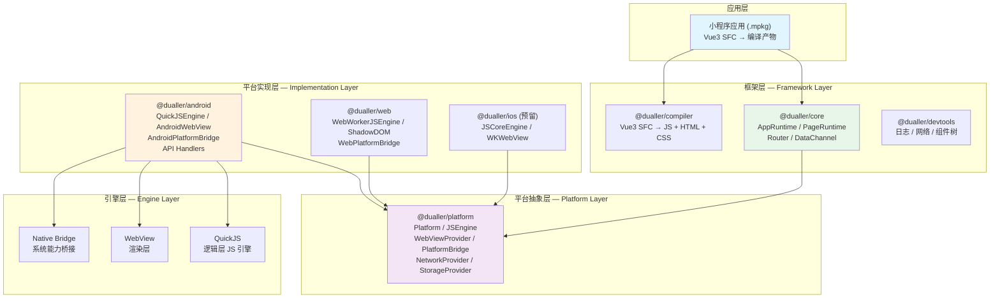
```mermaid
graph TB
    subgraph "应用层"
        APP["小程序应用 (.mpkg)<br/>Vue3 SFC → 编译产物"]
    end

    subgraph "框架层 — Framework Layer"
        COMPILER["@dualler/compiler<br/>Vue3 SFC → JS + HTML + CSS"]
        CORE["@dualler/core<br/>AppRuntime / PageRuntime<br/>Router / DataChannel"]
        DEVTOOLS["@dualler/devtools<br/>日志 / 网络 / 组件树"]
    end

    subgraph "平台抽象层 — Platform Layer"
        PLATFORM["@dualler/platform<br/>Platform / JSEngine<br/>WebViewProvider / PlatformBridge<br/>NetworkProvider / StorageProvider"]
    end

    subgraph "平台实现层 — Implementation Layer"
        ANDROID["@dualler/android<br/>QuickJSEngine / AndroidWebView<br/>AndroidPlatformBridge<br/>API Handlers"]
        WEB["@dualler/web<br/>WebWorkerJSEngine / ShadowDOM<br/>WebPlatformBridge"]
        IOS["@dualler/ios (预留)<br/>JSCoreEngine / WKWebView"]
    end

    subgraph "引擎层 — Engine Layer"
        QUICKJS["QuickJS<br/>逻辑层 JS 引擎"]
        WEBVIEW["WebView<br/>渲染层"]
        NATIVE["Native Bridge<br/>系统能力桥接"]
    end

    APP --> CORE
    APP --> COMPILER
    CORE --> PLATFORM
    ANDROID --> PLATFORM
    WEB --> PLATFORM
    IOS --> PLATFORM
    ANDROID --> QUICKJS
    ANDROID --> WEBVIEW
    ANDROID --> NATIVE

    style APP fill:#e1f5fe
    style CORE fill:#e8f5e9
    style PLATFORM fill:#f3e5f5
    style ANDROID fill:#fff3e0
```

### 2.2 模块依赖关系图

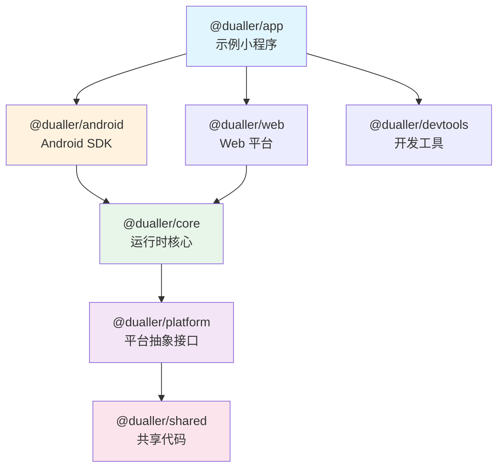
```mermaid
graph TD
    APP["@dualler/app<br/>示例小程序"]
    ANDROID["@dualler/android<br/>Android SDK"]
    WEB["@dualler/web<br/>Web 平台"]
    CORE["@dualler/core<br/>运行时核心"]
    PLATFORM["@dualler/platform<br/>平台抽象接口"]
    SHARED["@dualler/shared<br/>共享代码"]
    DEVTOOLS["@dualler/devtools<br/>开发工具"]

    APP --> ANDROID
    APP --> WEB
    APP --> DEVTOOLS
    ANDROID --> CORE
    WEB --> CORE
    CORE --> PLATFORM
    PLATFORM --> SHARED

    style APP fill:#e1f5fe
    style ANDROID fill:#fff3e0
    style CORE fill:#e8f5e9
    style PLATFORM fill:#f3e5f5
    style SHARED fill:#fce4ec
```

**依赖规则：**
- 上层模块可依赖下层模块，严禁反向依赖
- `@dualler/platform` 仅定义接口，不包含实现
- `@dualler/core` 通过 `Platform` 接口访问平台能力，不直接引用 Android/iOS API
- `@dualler/shared` 为最底层共享模块，仅包含类型定义和工具函数

### 2.3 数据流图

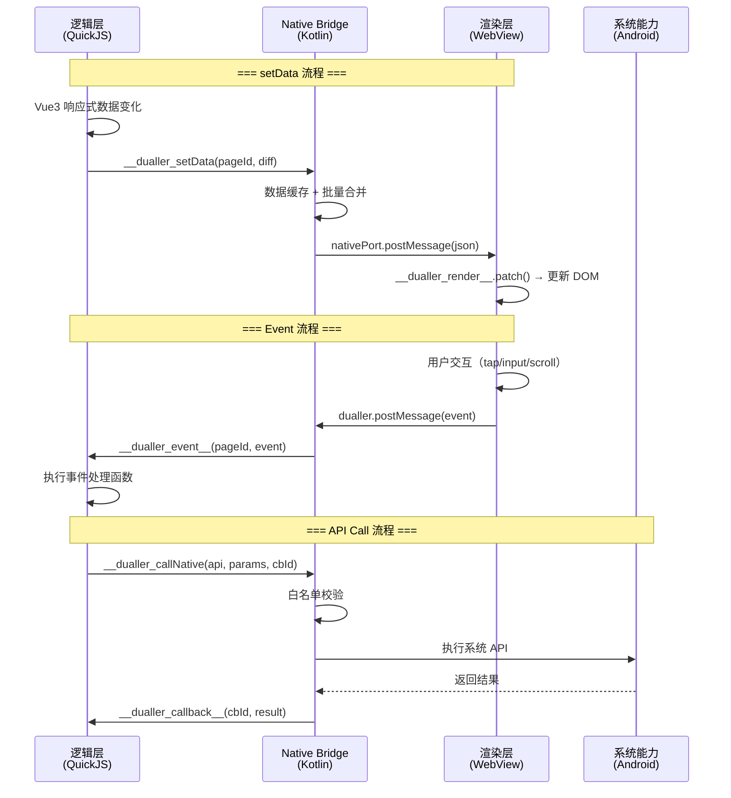
```mermaid
sequenceDiagram
    participant JS as 逻辑层<br/>(QuickJS)
    participant BRIDGE as Native Bridge<br/>(Kotlin)
    participant WV as 渲染层<br/>(WebView)
    participant SYS as 系统能力<br/>(Android)

    Note over JS,WV: === setData 流程 ===
    JS->>JS: Vue3 响应式数据变化
    JS->>BRIDGE: __dualler_setData(pageId, diff)
    BRIDGE->>BRIDGE: 数据缓存 + 批量合并
    BRIDGE->>WV: nativePort.postMessage(json)
    WV->>WV: __dualler_render__.patch() → 更新 DOM

    Note over JS,WV: === Event 流程 ===
    WV->>WV: 用户交互（tap/input/scroll）
    WV->>BRIDGE: dualler.postMessage(event)
    BRIDGE->>JS: __dualler_event__(pageId, event)
    JS->>JS: 执行事件处理函数

    Note over JS,SYS: === API Call 流程 ===
    JS->>BRIDGE: __dualler_callNative(api, params, cbId)
    BRIDGE->>BRIDGE: 白名单校验
    BRIDGE->>SYS: 执行系统 API
    SYS-->>BRIDGE: 返回结果
    BRIDGE->>JS: __dualler_callback__(cbId, result)
```

### 2.4 线程模型图

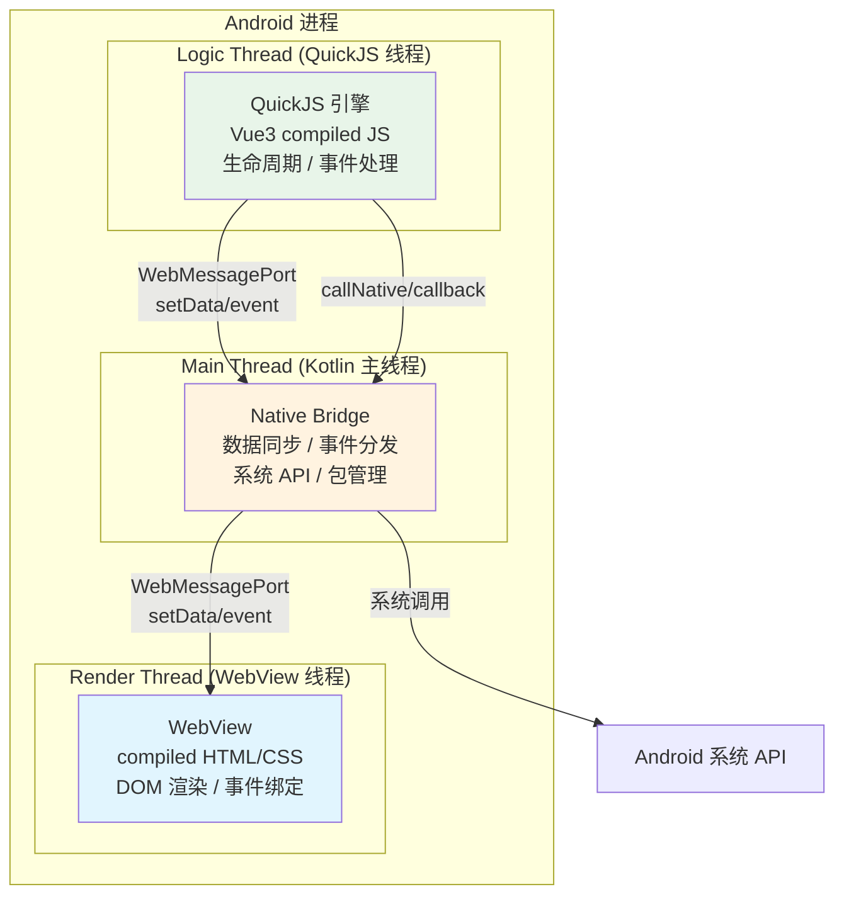
```mermaid
graph TB
    subgraph "Android 进程"
        subgraph "Logic Thread (QuickJS 线程)"
            QJS["QuickJS 引擎<br/>Vue3 compiled JS<br/>生命周期 / 事件处理"]
        end

        subgraph "Render Thread (WebView 线程)"
            WV["WebView<br/>compiled HTML/CSS<br/>DOM 渲染 / 事件绑定"]
        end

        subgraph "Main Thread (Kotlin 主线程)"
            BRIDGE["Native Bridge<br/>数据同步 / 事件分发<br/>系统 API / 包管理"]
        end
    end

    QJS -->|"WebMessagePort<br/>setData/event"| BRIDGE
    BRIDGE -->|"WebMessagePort<br/>setData/event"| WV
    QJS -->|"callNative/callback"| BRIDGE
    BRIDGE -->|"系统调用"| SYS["Android 系统 API"]

    style QJS fill:#e8f5e9
    style WV fill:#e1f5fe
    style BRIDGE fill:#fff3e0
```

**线程职责：**

| 线程 | 职责 | 关键特征 |
|------|------|----------|
| Logic Thread | 运行 QuickJS，执行小程序业务逻辑 | 单线程，无 DOM 访问 |
| Render Thread | 运行 WebView，渲染 UI | 单线程，仅做 DOM 操作 |
| Main Thread | Kotlin 主线程，Bridge 调度 | 协调逻辑层和渲染层 |

**通信通道：**
- Logic ↔ Main：QuickJS JNI 回调（同步）
- Main ↔ Render：WebMessagePort（异步，Android 6.0+）或 evaluateJavascript（降级方案）

---

## 3. @dualler/platform 详细设计

### 3.1 Platform 接口

平台总入口，每个平台（Android/iOS/Web）实现此接口。

```kotlin
package com.dualler.platform

/**
 * 平台抽象接口
 *
 * 职责：提供平台相关的工厂方法和系统能力访问入口
 * 实现：AndroidPlatform、IOSPlatform、WebPlatform、HarmonyPlatform
 * 线程安全：实现类必须保证线程安全
 */
interface Platform {
    /** 平台标识："android" | "ios" | "web" | "harmony" */
    val name: String

    /**
     * 创建 JS 引擎实例
     * @return 新的 JSEngine 实例，调用方负责销毁
     * @throws PlatformException 引擎创建失败
     */
    fun createJSEngine(): JSEngine

    /**
     * 创建 WebView 容器
     * @return 新的 WebViewProvider 实例，调用方负责销毁
     * @throws PlatformException WebView 创建失败
     */
    fun createWebView(): WebViewProvider

    /**
     * 创建 Bridge 实例
     * @return 新的 PlatformBridge 实例
     */
    fun createBridge(): PlatformBridge

    /**
     * 创建包管理器
     * @return PackageManager 实例
     */
    fun createPackageManager(): PackageManager

    /** 网络能力 */
    val network: NetworkProvider

    /** 存储能力 */
    val storage: StorageProvider

    /** 文件能力 */
    val file: FileProvider

    /** 设备能力 */
    val device: DeviceProvider
}
```

### 3.2 JSEngine 接口

```kotlin
/**
 * JS 引擎抽象
 *
 * 职责：在隔离的 JS 上下文中执行脚本、注册回调
 * 实现：QuickJSEngine（Android）、JSCoreEngine（iOS）、WebWorkerJSEngine（Web）
 * 线程安全：不保证线程安全，调用方需自行同步
 */
interface JSEngine {
    /**
     * 执行 JS 脚本
     * @param script JS 脚本内容
     * @param sourceUrl 脚本来源标识（用于错误堆栈）
     * @return 执行结果
     * @throws JSEvalException 脚本执行错误
     */
    fun evaluateScript(script: String, sourceUrl: String = "dualler://inline"): JSValue

    /**
     * 注册 Kotlin 回调到 JS 全局对象
     *
     * 注册后，JS 中可通过 name(args) 调用 Kotlin 函数。
     * 回调在 JS 引擎线程中同步执行。
     *
     * @param name JS 全局函数名
     * @param callback 回调函数，参数为 JSArray，返回值为 JSValue
     */
    fun registerCallback(name: String, callback: (JSArray) -> JSValue)

    /**
     * 注册 Kotlin 对象到 JS
     *
     * 将 Map<String, Function> 注册为 JS 全局对象，
     * 对象的每个属性对应一个可调用函数。
     *
     * @param name JS 全局对象名
     * @param obj 方法映射表
     */
    fun registerObject(name: String, obj: Map<String, (JSArray) -> JSValue>)

    /**
     * 销毁引擎，释放所有资源
     * 销毁后不可再调用其他方法
     */
    fun destroy()
}
```

### 3.3 JSValue 类型体系

```kotlin
/**
 * JS 值类型密封类
 *
 * 用于 Kotlin ↔ JS 的类型安全转换
 * 所有 JS 值都映射到此密封类的子类
 */
sealed class JSValue {
    /** JS undefined */
    object Undefined : JSValue()

    /** JS null */
    object Null : JSValue()

    /** JS boolean */
    data class Boolean(val value: kotlin.Boolean) : JSValue()

    /** JS number（统一为 Double） */
    data class Number(val value: Double) : JSValue()

    /** JS string */
    data class String(val value: kotlin.String) : JSValue()

    /** JS array */
    data class Array(val elements: List<JSValue>) : JSValue()

    /** JS object */
    data class Object(val properties: Map<kotlin.String, JSValue>) : JSValue()

    // === 便捷转换方法 ===

    /** 转为 Kotlin String，非 String 类型返回空字符串 */
    fun toKotlinString(): kotlin.String = (this as? String)?.value ?: ""

    /** 转为 Kotlin Int，非 Number 类型返回 0 */
    fun toInt(): Int = (this as? Number)?.value?.toInt() ?: 0

    /** 转为 Kotlin Double，非 Number 类型返回 0.0 */
    fun toDouble(): Double = (this as? Number)?.value ?: 0.0

    /** 转为 Kotlin Boolean，非 Boolean 类型返回 false */
    fun toBoolean(): kotlin.Boolean = (this as? Boolean)?.value ?: false

    /** 序列化为 JSON 字符串 */
    fun toJson(): kotlin.String

    /** 判断是否为 null 或 undefined */
    fun isNullOrUndefined(): kotlin.Boolean = this is Null || this is Undefined
}

/**
 * JS 数组参数封装
 *
 * 用于接收 JS 函数调用时的参数列表
 */
data class JSArray(val elements: List<JSValue>) {
    /** 获取指定索引的字符串值 */
    fun getString(index: Int): kotlin.String = elements[index].toKotlinString()

    /** 获取指定索引的整数值 */
    fun getInt(index: Int): Int = elements[index].toInt()

    /** 获取指定索引的布尔值 */
    fun getBoolean(index: Int): kotlin.Boolean = elements[index].toBoolean()

    /** 获取指定索引的原始 JSValue */
    fun get(index: Int): JSValue = elements[index]

    /** 参数个数 */
    val size: Int get() = elements.size

    /** 安全获取，越界返回 null */
    fun getOrNull(index: Int): JSValue? = elements.getOrNull(index)
}
```

### 3.4 WebViewProvider 接口

```kotlin
/**
 * WebView 容器抽象
 *
 * 职责：管理渲染层的 HTML 加载、JS 执行、CSS 注入
 * 实现：AndroidWebViewProvider、ShadowDOMWebView
 * 线程安全：所有方法必须在主线程调用（Android）
 */
interface WebViewProvider {
    /**
     * 加载 URL
     * @param url 目标 URL
     */
    fun loadUrl(url: String)

    /**
     * 加载 HTML 内容
     * @param html HTML 字符串
     * @param baseUrl 基础 URL（用于相对路径解析）
     */
    fun loadHtml(html: String, baseUrl: String = "")

    /**
     * 在 WebView 中执行 JS
     * @param script JS 脚本
     * @param callback 执行结果回调（在主线程调用）
     */
    fun evaluateJavascript(script: String, callback: ((String) -> Unit)? = null)

    /**
     * 注入 JS 接口对象
     *
     * 注入后，WebView 中可通过 name.postMessage(message) 向原生发送消息
     *
     * @param name 接口对象名（如 "dualler"）
     * @param handler 消息处理函数
     */
    fun addJavascriptInterface(name: String, handler: (String) -> Unit)

    /**
     * 注入 CSS 样式
     * @param css CSS 内容
     */
    fun injectCSS(css: String)

    /**
     * 注入 JS 文件
     * @param script JS 脚本内容
     */
    fun injectScript(script: String)

    /**
     * 配置 WebView 参数
     * @param config WebView 配置
     */
    fun configure(config: WebViewConfig)

    /** 销毁 WebView，释放资源 */
    fun destroy()
}

/**
 * WebView 配置
 */
data class WebViewConfig(
    /** 是否启用 JavaScript */
    val javaScriptEnabled: Boolean = true,

    /** 是否启用 DOM Storage */
    val domStorageEnabled: Boolean = true,

    /** ⚠️ 安全：是否允许 file:// 访问（默认禁止） */
    val allowFileAccess: Boolean = false,

    /** ⚠️ 安全：是否允许 file:// 跨域访问（默认禁止） */
    val allowFileAccessFromFileURLs: Boolean = false,

    /** ⚠️ 安全：是否允许 file:// 通用访问（默认禁止） */
    val allowUniversalAccessFromFileURLs: Boolean = false,

    /** ⚠️ 安全：是否允许 content:// 访问（默认禁止） */
    val allowContentAccess: Boolean = false,

    /** 缓存模式 */
    val cacheMode: Int = 0,

    /** 自定义 User-Agent */
    val userAgent: String? = null,

    /** 虚拟域名（用于资源拦截） */
    val virtualDomain: String = "dualler.local"
)
```

### 3.5 PlatformBridge 接口

```kotlin
/**
 * 平台 Bridge 抽象
 *
 * 职责：协调逻辑层、渲染层、原生层三方通信
 * 实现：AndroidPlatformBridge、WebPlatformBridge
 * 线程安全：setData 在主线程执行，dispatchEvent 可在任意线程调用
 */
interface PlatformBridge {
    /**
     * 逻辑层 → 渲染层：数据更新
     *
     * 将逻辑层的 setData 数据序列化为 JSON，通过 WebMessagePort 发送给 WebView
     *
     * @param pageId 目标页面 ID
     * @param data 数据变更（key-value 形式）
     */
    fun setData(pageId: String, data: Map<String, Any>)

    /**
     * 渲染层 → 逻辑层：事件分发
     *
     * 将 WebView 的用户交互事件转发给 QuickJS 执行对应的事件处理函数
     *
     * @param pageId 来源页面 ID
     * @param event DOM 事件对象
     */
    fun dispatchEvent(pageId: String, event: DOMEvent)

    /**
     * 逻辑层 → 原生：API 调用
     *
     * 小程序调用 wx.* API 时，通过此方法路由到对应的 API Handler
     *
     * @param api API 名称（如 "request"、"getStorage"）
     * @param params API 参数
     * @param callbackId 回调 ID（用于异步返回结果）
     */
    fun callNative(api: String, params: Map<String, Any>, callbackId: String)

    /**
     * 原生 → 逻辑层：回调
     *
     * API 执行完成后，将结果回传给 QuickJS 中注册的回调函数
     *
     * @param callbackId 回调 ID（与 callNative 中的对应）
     * @param result 执行结果（Success 或 Fail）
     */
    fun invokeCallback(callbackId: String, result: Any)

    /**
     * 原生 → 逻辑层：调用 JS 方法
     *
     * 直接调用指定页面实例上的 JS 方法
     *
     * @param pageId 目标页面 ID
     * @param method 方法名
     * @param params 参数
     */
    fun invokeJS(pageId: String, method: String, params: Any)

    /**
     * 注册系统 API 处理器
     *
     * @param name API 名称
     * @param handler 处理器实现
     */
    fun registerAPI(name: String, handler: APIHandler)
}
```

### 3.6 DOMEvent 数据模型

```kotlin
/**
 * DOM 事件数据
 *
 * 渲染层用户交互事件的统一数据结构
 */
data class DOMEvent(
    /** 事件类型：tap、input、scroll、longpress、touchstart 等 */
    val type: String,

    /** 事件目标元素的 CSS 选择器或元素 ID */
    val target: String,

    /** 当前处理事件的元素 */
    val currentTarget: String,

    /** 事件详情（如 input 的 value、scroll 的 scrollTop） */
    val detail: Map<String, Any>?,

    /** 事件时间戳（毫秒） */
    val timestamp: Long
)
```

### 3.7 APIHandler 与 APIResult

```kotlin
/**
 * 系统 API 处理器接口
 *
 * 每个 wx.* API 对应一个 APIHandler 实现
 */
interface APIHandler {
    /**
     * 执行 API
     * @param params API 参数（从 JS 传入的 JSON 解析）
     * @param callback 结果回调（异步 API 通过此回调返回结果）
     */
    fun invoke(params: Map<String, Any>, callback: (APIResult) -> Unit)
}

/**
 * API 执行结果
 */
sealed class APIResult {
    /** 成功 */
    data class Success(val data: Any) : APIResult()

    /** 失败 */
    data class Fail(val errCode: Int, val errMsg: String) : APIResult()
}
```

### 3.8 系统能力接口

#### 3.8.1 NetworkProvider

```kotlin
/**
 * 网络能力接口
 */
interface NetworkProvider {
    /**
     * 发起 HTTP 请求
     * @param config 请求配置
     * @param callback 结果回调
     */
    fun request(config: NetworkRequest, callback: (NetworkResponse) -> Unit)

    /**
     * 上传文件
     * @param config 上传配置
     * @param callback 结果回调
     */
    fun uploadFile(config: UploadConfig, callback: (NetworkResponse) -> Unit)

    /**
     * 下载文件
     * @param config 下载配置
     * @param callback 进度和结果回调
     */
    fun downloadFile(config: DownloadConfig, callback: (DownloadResult) -> Unit)

    /**
     * 建立 WebSocket 连接
     * @param url WebSocket 地址（wss://）
     * @param callback 事件回调
     */
    fun connectSocket(url: String, callback: SocketCallback)
}

data class NetworkRequest(
    val url: String,                    // 请求 URL
    val method: String = "GET",         // 请求方法
    val headers: Map<String, String> = emptyMap(),  // 请求头
    val data: String? = null,           // 请求体
    val timeout: Long = 30000           // 超时时间（毫秒）
)

data class NetworkResponse(
    val statusCode: Int,                // HTTP 状态码
    val header: Map<String, String>,    // 响应头
    val data: String?,                  // 响应体
    val cookies: List<String>           // Cookies
)

data class UploadConfig(
    val url: String,                    // 上传地址
    val filePath: String,               // 文件路径
    val name: String,                   // 文件字段名
    val formData: Map<String, String> = emptyMap()  // 额外表单数据
)

data class DownloadConfig(
    val url: String,                    // 下载地址
    val filePath: String? = null        // 保存路径（null 则使用临时路径）
)

interface SocketCallback {
    fun onOpen()                        // 连接建立
    fun onMessage(data: String)         // 收到消息
    fun onClose(code: Int, reason: String)  // 连接关闭
    fun onError(error: String)          // 连接错误
}
```

#### 3.8.2 StorageProvider

```kotlin
/**
 * 本地存储接口
 *
 * 对应 wx.getStorageSync / wx.setStorageSync 等 API
 * 每个小程序独立存储空间
 */
interface StorageProvider {
    /** 获取指定 key 的值 */
    fun getItem(key: String): String?

    /** 设置指定 key 的值 */
    fun setItem(key: String, value: String)

    /** 删除指定 key */
    fun removeItem(key: String)

    /** 清空所有存储 */
    fun clear()

    /** 获取所有 key 列表 */
    fun getKeys(): List<String>

    /** 获取存储信息（当前大小、限制大小） */
    fun getInfo(): StorageInfo
}

data class StorageInfo(
    val keys: List<String>,     // 所有 key
    val currentSize: Long,      // 当前占用（字节）
    val limitSize: Long         // 上限（字节）
)
```

#### 3.8.3 FileProvider

```kotlin
/**
 * 文件系统接口
 *
 * 对应 wx.readFile / wx.writeFile 等 API
 * 操作范围限定在小程序沙箱目录内
 */
interface FileProvider {
    fun readFile(path: String, encoding: String = "utf8"): String?
    fun readFileBytes(path: String): ByteArray?
    fun writeFile(path: String, data: String, encoding: String = "utf8"): Boolean
    fun writeFileBytes(path: String, data: ByteArray): Boolean
    fun appendFile(path: String, data: String): Boolean
    fun unlink(path: String): Boolean
    fun mkdir(path: String, recursive: Boolean = true): Boolean
    fun readdir(path: String): List<FileInfo>?
    fun stat(path: String): FileInfo?
    fun saveFile(tempPath: String, destPath: String): String?
}

data class FileInfo(
    val path: String,           // 文件路径
    val size: Long,             // 文件大小（字节）
    val isDirectory: Boolean,   // 是否为目录
    val lastModified: Long      // 最后修改时间戳
)
```

#### 3.8.4 DeviceProvider

```kotlin
/**
 * 设备能力接口
 */
interface DeviceProvider {
    fun getSystemInfo(): SystemInfo
    fun vibrate(type: VibrateType)
    fun getNetworkType(): NetworkType
    fun onNetworkChange(callback: (NetworkType) -> Unit)
    fun offNetworkChange(callback: (NetworkType) -> Unit)
}

data class SystemInfo(
    val brand: String,          // 设备品牌
    val model: String,          // 设备型号
    val pixelRatio: Float,      // 设备像素比
    val screenWidth: Int,       // 屏幕宽度（px）
    val screenHeight: Int,      // 屏幕高度（px）
    val windowWidth: Int,       // 可用窗口宽度
    val windowHeight: Int,      // 可用窗口高度
    val statusBarHeight: Int,   // 状态栏高度
    val language: String,       // 系统语言
    val version: String,        // 系统版本
    val platform: String,       // 平台标识
    val SDKVersion: String      // Dualler SDK 版本
)

enum class VibrateType { SHORT, LONG, HEAVY, MEDIUM, LIGHT }
enum class NetworkType { WIFI, CELLULAR_2G, CELLULAR_3G, CELLULAR_4G, CELLULAR_5G, NONE, UNKNOWN }
```

---

## 4. @dualler/core 详细设计

### 4.1 AppRuntime

应用级运行时，管理整个小程序的生命周期。

#### 4.1.1 类定义

```kotlin
/**
 * 应用级运行时
 *
 * 职责：
 *   1. 初始化 JS 引擎并注入运行时
 *   2. 加载 app.js 逻辑层入口
 *   3. 注册系统 API
 *   4. 管理页面路由
 *   5. 触发应用级生命周期事件
 *
 * 生命周期：created → launching → running → destroying → destroyed
 */
class AppRuntime(
    private val platform: Platform,
    private val config: AppConfig
) {
    private val router: Router = Router(platform)
    private val pageManager: PageManager = PageManager(platform)
    private val appBridge: PlatformBridge = platform.createBridge()
    private var state: AppState = AppState.CREATED

    /** 启动小程序 */
    fun launch(entryPath: String, query: Map<String, String> = emptyMap())

    /** 触发应用生命周期事件 */
    fun triggerLifecycle(event: String, params: Map<String, Any> = emptyMap())

    /** 销毁小程序 */
    fun destroy()

    /** 获取当前状态 */
    fun getState(): AppState
}
```

#### 4.1.2 状态机

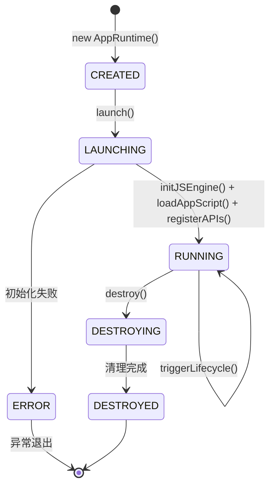
```mermaid
stateDiagram-v2
    [*] --> CREATED : new AppRuntime()
    CREATED --> LAUNCHING : launch()
    LAUNCHING --> RUNNING : initJSEngine() + loadAppScript() + registerAPIs()
    LAUNCHING --> ERROR : 初始化失败
    RUNNING --> DESTROYING : destroy()
    RUNNING --> RUNNING : triggerLifecycle()
    DESTROYING --> DESTROYED : 清理完成
    ERROR --> [*] : 异常退出
    DESTROYED --> [*]
```

#### 4.1.3 初始化时序图

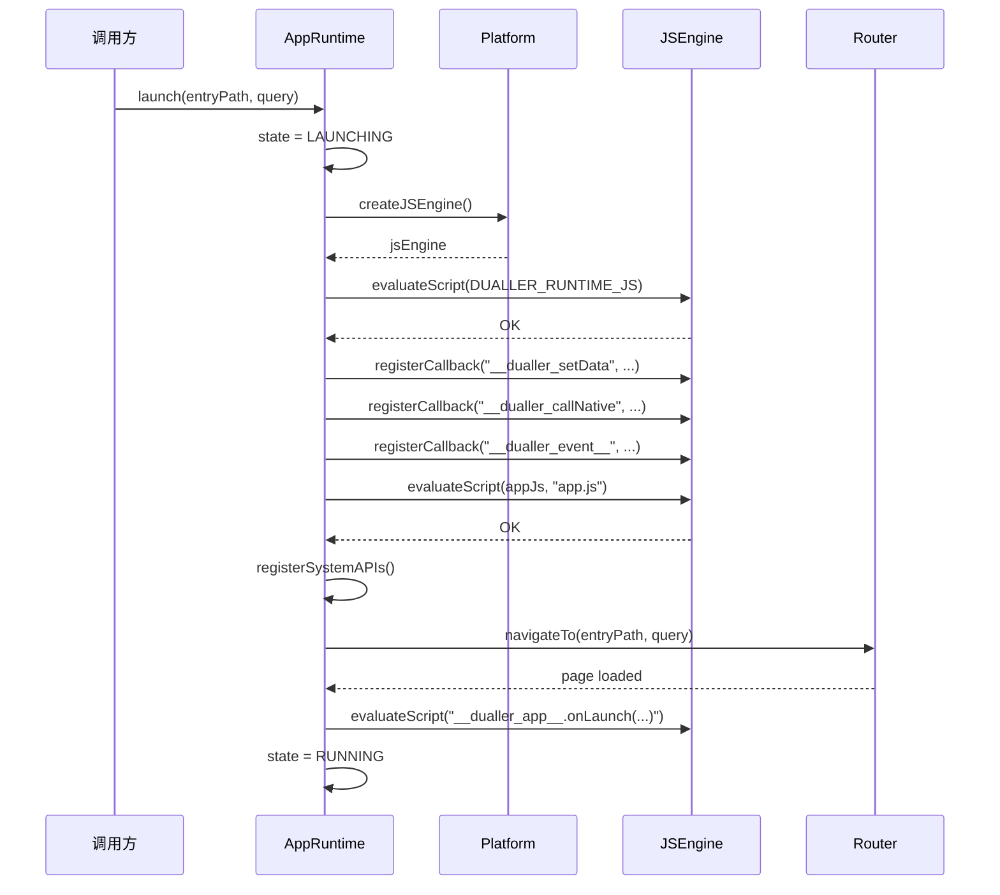
```mermaid
sequenceDiagram
    participant Caller as 调用方
    participant App as AppRuntime
    participant Platform as Platform
    participant JSE as JSEngine
    participant Router as Router

    Caller->>App: launch(entryPath, query)
    App->>App: state = LAUNCHING

    App->>Platform: createJSEngine()
    Platform-->>App: jsEngine

    App->>JSE: evaluateScript(DUALLER_RUNTIME_JS)
    JSE-->>App: OK

    App->>JSE: registerCallback("__dualler_setData", ...)
    App->>JSE: registerCallback("__dualler_callNative", ...)
    App->>JSE: registerCallback("__dualler_event__", ...)

    App->>JSE: evaluateScript(appJs, "app.js")
    JSE-->>App: OK

    App->>App: registerSystemAPIs()
    App->>Router: navigateTo(entryPath, query)
    Router-->>App: page loaded

    App->>JSE: evaluateScript("__dualler_app__.onLaunch(...)")
    App->>App: state = RUNNING
```

#### 4.1.4 方法规格

| 方法 | 参数 | 返回值 | 异常 | 说明 |
|------|------|--------|------|------|
| `launch` | `entryPath: String, query: Map<String, String>` | `Unit` | `InitException` | 启动小程序 |
| `triggerLifecycle` | `event: String, params: Map<String, Any>` | `Unit` | — | 触发生命周期 |
| `destroy` | — | `Unit` | — | 销毁小程序 |
| `getState` | — | `AppState` | — | 获取当前状态 |

```kotlin
enum class AppState {
    CREATED,     // 已创建，未启动
    LAUNCHING,   // 正在初始化
    RUNNING,     // 运行中
    DESTROYING,  // 正在销毁
    DESTROYED,   // 已销毁
    ERROR        // 异常状态
}
```

### 4.2 PageRuntime

页面级运行时，管理单个页面的生命周期和渲染。

#### 4.2.1 类定义

```kotlin
/**
 * 页面级运行时
 *
 * 职责：
 *   1. 加载页面模板到 WebView
 *   2. 管理页面生命周期
 *   3. 处理渲染层消息
 *   4. 缓存首屏数据（PageDataStore）
 *
 * 生命周期：loading → ready → showing → hiding → unloading → destroyed
 */
class PageRuntime(
    val pageId: String,
    private val platform: Platform,
    private val bridge: PlatformBridge
) {
    private val webView: WebViewProvider = platform.createWebView()
    private val dataChannel: DataChannel = DataChannel(bridge)
    private var state: PageState = PageState.LOADING
    private var renderReady: Boolean = false

    /** 加载页面 */
    fun load(query: Map<String, String> = emptyMap())

    /** 数据更新 */
    fun setData(data: Map<String, Any>)

    /** 显示页面 */
    fun show()

    /** 隐藏页面 */
    fun hide()

    /** 卸载页面 */
    fun unload()

    /** 获取当前状态 */
    fun getState(): PageState
}
```

#### 4.2.2 状态机

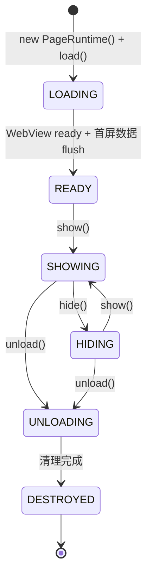
```mermaid
stateDiagram-v2
    [*] --> LOADING : new PageRuntime() + load()
    LOADING --> READY : WebView ready + 首屏数据 flush
    READY --> SHOWING : show()
    SHOWING --> HIDING : hide()
    HIDING --> SHOWING : show()
    SHOWING --> UNLOADING : unload()
    HIDING --> UNLOADING : unload()
    UNLOADING --> DESTROYED : 清理完成
    DESTROYED --> [*]
```

#### 4.2.3 首屏就绪对齐时序图

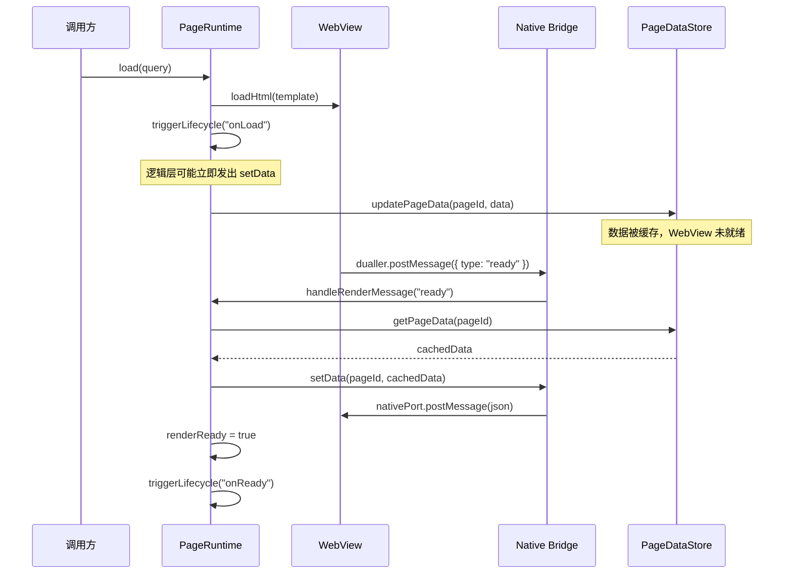
```mermaid
sequenceDiagram
    participant Caller as 调用方
    participant Page as PageRuntime
    participant WV as WebView
    participant Bridge as Native Bridge
    participant PDS as PageDataStore

    Caller->>Page: load(query)
    Page->>WV: loadHtml(template)
    Page->>Page: triggerLifecycle("onLoad")

    Note over Page: 逻辑层可能立即发出 setData
    Page->>PDS: updatePageData(pageId, data)
    Note over PDS: 数据被缓存，WebView 未就绪

    WV->>Bridge: dualler.postMessage({ type: "ready" })
    Bridge->>Page: handleRenderMessage("ready")
    Page->>PDS: getPageData(pageId)
    PDS-->>Page: cachedData
    Page->>Bridge: setData(pageId, cachedData)
    Bridge->>WV: nativePort.postMessage(json)
    Page->>Page: renderReady = true
    Page->>Page: triggerLifecycle("onReady")
```

#### 4.2.4 方法规格

| 方法 | 参数 | 返回值 | 说明 |
|------|------|--------|------|
| `load` | `query: Map<String, String>` | `Unit` | 加载页面，触发 onLoad |
| `setData` | `data: Map<String, Any>` | `Unit` | 更新数据，缓存到 PDS |
| `show` | — | `Unit` | 显示页面，触发 onShow |
| `hide` | — | `Unit` | 隐藏页面，触发 onHide |
| `unload` | — | `Unit` | 卸载页面，触发 onUnload，清理 PDS |

### 4.3 Router

页面路由管理器。

#### 4.3.1 类定义

```kotlin
/**
 * 页面路由管理
 *
 * 职责：管理页面栈，处理 navigateTo / redirectTo / navigateBack / reLaunch / switchTab
 *
 * 页面栈规则：
 *   - navigateTo：压栈，保留当前页
 *   - redirectTo：替换栈顶
 *   - navigateBack：弹出栈顶
 *   - reLaunch：清空栈，压入新页
 *   - switchTab：切换 Tab 页（不销毁，只隐藏/显示）
 */
class Router(private val platform: Platform) {
    private val pageStack = mutableListOf<PageRuntime>()
    private var currentPage: PageRuntime? = null

    /** 保留当前页，跳转到新页面 */
    fun navigateTo(pageId: String, query: Map<String, String> = emptyMap())

    /** 关闭当前页，跳转到新页面 */
    fun redirectTo(pageId: String, query: Map<String, String> = emptyMap())

    /** 关闭当前页，返回上一页或多级 */
    fun navigateBack(delta: Int = 1)

    /** 关闭所有页面，打开新页面 */
    fun reLaunch(pageId: String, query: Map<String, String> = emptyMap())

    /** 切换 Tab 页 */
    fun switchTab(pageId: String)

    /** 清空所有页面 */
    fun clear()

    /** 当前页面路径 */
    val currentPath: String get()

    /** 页面栈大小 */
    val stackSize: Int get()
}
```

#### 4.3.2 页面栈状态机

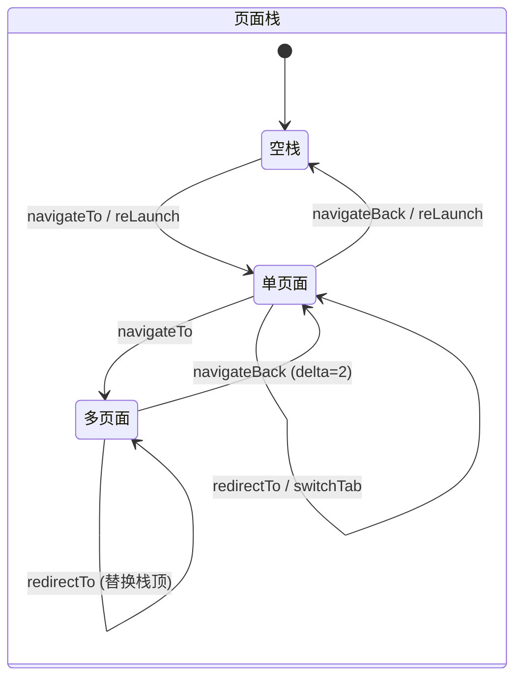
```mermaid
stateDiagram-v2
    state "页面栈" as Stack {
        state "空栈" as Empty
        state "单页面" as Single
        state "多页面" as Multi

        [*] --> Empty
        Empty --> Single : navigateTo / reLaunch
        Single --> Multi : navigateTo
        Multi --> Multi : navigateTo
        Multi --> Single : navigateBack (delta=2)
        Single --> Empty : navigateBack / reLaunch
        Multi --> Multi : redirectTo (替换栈顶)
        Single --> Single : redirectTo / switchTab
    }
```

#### 4.3.3 路由方法行为表

| 方法 | 当前页行为 | 目标页行为 | 页面栈变化 |
|------|-----------|-----------|-----------|
| `navigateTo` | hide() | load() + show() | 压栈 |
| `redirectTo` | unload() | load() + show() | 替换栈顶 |
| `navigateBack` | unload() | show() | 弹出 N 个 |
| `reLaunch` | 全部 unload() | load() + show() | 清空后压入 |
| `switchTab` | hide() | show() | 不变 |

### 4.4 DataChannel

逻辑层与渲染层之间的数据同步通道。

#### 4.4.1 类定义

```kotlin
/**
 * 数据同步通道
 *
 * 优化策略：
 *   1. 路径式 setData — 直接指定更新路径，跳过全量 diff
 *   2. 自动批量合并 — 连续 16ms 内的多次 setData 合并为一次 Bridge 调用
 *   3. 数据上限校验 — 单次传输不超过 256KB，超出则警告并分片
 */
class DataChannel(private val bridge: PlatformBridge) {
    companion object {
        const val MAX_SETDATA_SIZE = 256 * 1024  // 256KB
        const val BATCH_WINDOW_MS = 16L           // 16ms
    }

    /** 全量 setData — diff 后发送变化的字段 */
    fun syncData(pageId: String, newData: Map<String, Any>)

    /** 路径式 setData — 直接指定更新路径 */
    fun setPathData(pageId: String, path: String, value: Any)

    /** 批量 setData — 多个路径更新合并为一次调用 */
    fun batchSetData(pageId: String, updates: Map<String, Any>)
}
```

#### 4.4.2 setData 时序图

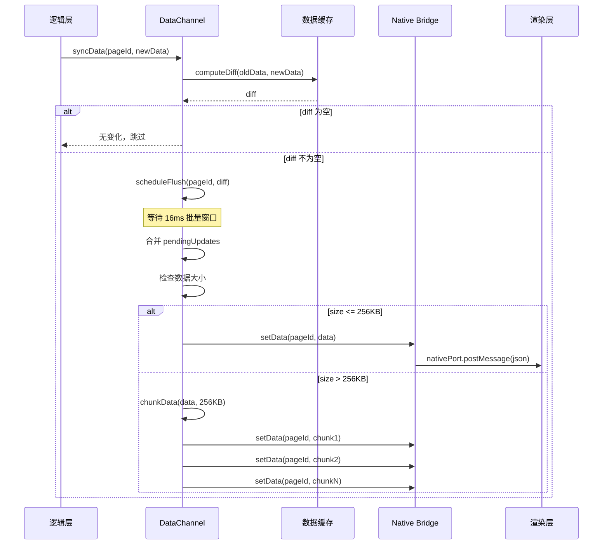
```mermaid
sequenceDiagram
    participant JS as 逻辑层
    participant DC as DataChannel
    participant Cache as 数据缓存
    participant Bridge as Native Bridge
    participant WV as 渲染层

    JS->>DC: syncData(pageId, newData)
    DC->>Cache: computeDiff(oldData, newData)
    Cache-->>DC: diff

    alt diff 为空
        DC-->>JS: 无变化，跳过
    else diff 不为空
        DC->>DC: scheduleFlush(pageId, diff)
        Note over DC: 等待 16ms 批量窗口

        DC->>DC: 合并 pendingUpdates
        DC->>DC: 检查数据大小

        alt size <= 256KB
            DC->>Bridge: setData(pageId, data)
            Bridge->>WV: nativePort.postMessage(json)
        else size > 256KB
            DC->>DC: chunkData(data, 256KB)
            DC->>Bridge: setData(pageId, chunk1)
            DC->>Bridge: setData(pageId, chunk2)
            DC->>Bridge: setData(pageId, chunkN)
        end
    end
```

#### 4.4.3 路径式 setData 流程

```
输入：setPathData("pages/index", "list[0].name", "new value")

步骤：
1. 解析路径 "list[0].name"
2. 更新本地缓存：cache["list"][0]["name"] = "new value"
3. 生成 patch：{ "__path__": "list[0].name", "__value__": "new value" }
4. 入队等待批量合并
5. 16ms 后 flush 到 Bridge
```

### 4.5 PageDataStore

页面数据缓存层，解决双线程架构下的白屏竞态。

```kotlin
/**
 * 页面数据缓存（Bridge 层）
 *
 * 逻辑层产生 setData 后，Bridge 层根据 pageId 缓存最新状态。
 * WebView 加载就绪后，主动发送 ready 事件，Bridge 将缓存数据一次性推送。
 *
 * 解决的问题：WebView 未就绪时，逻辑层的 setData 会丢失。
 */
object PageDataStore {
    private val pageData = mutableMapOf<String, MutableMap<String, Any>>()

    /** 更新页面数据（合并到现有缓存） */
    fun updatePageData(pageId: String, data: Map<String, Any>)

    /** 获取页面完整缓存数据 */
    fun getPageData(pageId: String): Map<String, Any>

    /** 清除页面数据（页面卸载时调用） */
    fun clearPageData(pageId: String)
}
```

### 4.6 ComponentRegistry

内置组件映射表。

```kotlin
/**
 * 内置组件注册表
 *
 * 维护 Dualler 标签名 → HTML 标签名的映射关系
 */
object BuiltinComponents {
    /** 标签映射 */
    val mappings: Map<String, String> = mapOf(
        "view" to "div", "text" to "span", "image" to "img",
        "scroll-view" to "div", "swiper" to "div", "navigator" to "a",
        "button" to "button", "input" to "input", "textarea" to "textarea",
        "video" to "video", "map" to "div", "canvas" to "canvas",
        "web-view" to "iframe", "icon" to "span", "progress" to "div",
        "rich-text" to "div"
    )

    /** 需要同层渲染的原生组件 */
    val nativeComponents: Set<String> = setOf("video", "map", "live-player", "live-pusher")

    /** 获取 HTML 标签名 */
    fun toHtmlTag(component: String): String

    /** 判断是否为内置组件 */
    fun isBuiltin(component: String): Boolean

    /** 判断是否需要同层渲染 */
    fun needsSameLayerRendering(component: String): Boolean
}
```

---

## 5. @dualler/android 详细设计

### 5.1 DuallerSDK 入口

#### 5.1.1 类定义

```kotlin
/**
 * Dualler SDK 主入口（单例）
 *
 * 初始化时机：Application.onCreate()
 * 初始化顺序：创建 Platform → 创建 PackageManager
 */
class DuallerSDK private constructor(
    private val context: Context,
    private val config: DuallerConfig
) {
    private lateinit var platform: AndroidPlatform
    private lateinit var packageManager: AndroidPackageManager

    companion object {
        @Volatile private var instance: DuallerSDK? = null

        /**
         * 初始化 SDK
         * @param context Application Context
         * @param config SDK 配置
         * @return SDK 实例
         * @throws IllegalStateException 重复初始化
         */
        fun init(context: Context, config: DuallerConfig = DuallerConfig()): DuallerSDK

        /** 获取 SDK 实例（必须先调用 init） */
        val instance: DuallerSDK
    }

    /** 启动小程序（从本地路径） */
    fun launchApp(packagePath: String, activity: Activity)

    /** 启动小程序（从 InputStream） */
    fun launchApp(inputStream: InputStream, activity: Activity)

    /** 检查更新并启动 */
    fun launchWithUpdate(appId: String, serverApi: ServerApi, activity: Activity, callback: PackageCallback)

    /** 预下载小程序包 */
    fun prefetch(appId: String, serverApi: ServerApi)

    /** 清理缓存 */
    fun clearCache(appId: String? = null)

    /** 获取缓存大小（字节） */
    fun getCacheSize(appId: String? = null): Long
}

data class DuallerConfig(
    val debug: Boolean = false,          // 调试模式
    val maxPages: Int = 10,              // 最大页面栈深度
    val jsHeapSizeMB: Int = 64,          // QuickJS 堆大小（MB）
    val cacheDir: File? = null,          // 自定义缓存目录
    val maxCacheSizeMB: Int = 200,       // 最大缓存大小（MB）
    val keepVersions: Int = 2            // 保留版本数
)
```

#### 5.1.2 初始化时序图

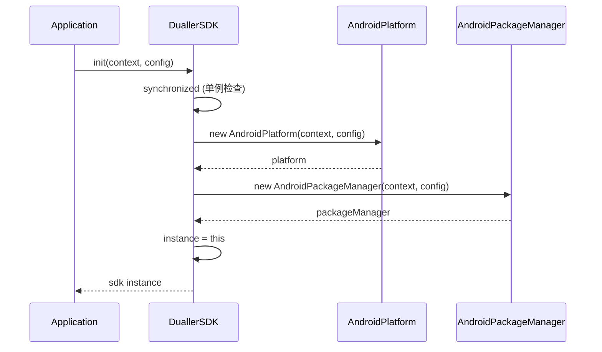
```mermaid
sequenceDiagram
    participant App as Application
    participant SDK as DuallerSDK
    participant Platform as AndroidPlatform
    participant PM as AndroidPackageManager

    App->>SDK: init(context, config)
    SDK->>SDK: synchronized (单例检查)
    SDK->>Platform: new AndroidPlatform(context, config)
    Platform-->>SDK: platform
    SDK->>PM: new AndroidPackageManager(context, config)
    PM-->>SDK: packageManager
    SDK->>SDK: instance = this
    SDK-->>App: sdk instance
```

### 5.2 QuickJSEngine

#### 5.2.1 类定义

```kotlin
/**
 * QuickJS JS 引擎实现
 *
 * 初始化顺序：
 *   1. 创建 QuickJS 运行时
 *   2. 创建 JS 上下文
 *   3. 剔除高危模块（std/os/ScriptInternals）
 *   4. 锁定核心 Bridge 函数
 *   5. 禁用 eval/Function
 *   6. 注入 dualler 运行时
 *   7. 注入 console
 */
class QuickJSEngine(private val heapSizeMB: Int) : JSEngine {

    private val runtime: QuickJSRuntime
    private val context: QuickJSContext

    init {
        // Step 1-2: 创建运行时和上下文
        runtime = QuickJS.createRuntime().apply {
            setMaxStackSize(heapSizeMB * 1024 * 1024)
        }
        context = runtime.createContext()

        // Step 3: 剔除高危模块
        context.evaluate("delete std; delete os; delete ScriptInternals;", "dualler://sandbox")

        // Step 4: 锁定核心 Bridge 函数
        context.evaluate("""
            Object.defineProperty(globalThis, '__dualler_setData', { writable: false, configurable: false });
            Object.defineProperty(globalThis, '__dualler_callNative', { writable: false, configurable: false });
            Object.defineProperty(globalThis, '__dualler_event__', { writable: false, configurable: false });
            Object.defineProperty(globalThis, '__dualler_callback__', { writable: false, configurable: false });
        """.trimIndent(), "dualler://sandbox-lock")

        // Step 5: 禁用 eval/Function
        context.evaluate("""
            globalThis.eval = undefined;
            globalThis.Function = undefined;
        """.trimIndent(), "dualler://sandbox-eval")

        // Step 6: 注入运行时
        context.evaluate(DUALLER_RUNTIME_JS, "dualler://runtime")

        // Step 7: 注入 console
        injectConsole()
    }

    override fun evaluateScript(script: String, sourceUrl: String): JSValue
    override fun registerCallback(name: String, callback: (JSArray) -> JSValue)
    override fun registerObject(name: String, obj: Map<String, (JSArray) -> JSValue>)
    override fun destroy()
}
```

#### 5.2.2 沙箱加固清单

| 措施 | 实现方式 | 目的 |
|------|----------|------|
| 剔除 std/os | `delete std; delete os;` | 防止文件系统/进程逃逸 |
| 锁定 Bridge | `Object.defineProperty(writable: false)` | 防止篡改核心函数 |
| 禁用 eval | `globalThis.eval = undefined` | 防止动态代码执行 |
| 禁用 Function | `globalThis.Function = undefined` | 防止构造器注入 |
| 冻结 console | `Object.freeze(console)` | 防止日志注入 |

### 5.3 WebView 容器

#### 5.3.1 AndroidWebViewProvider

```kotlin
/**
 * Android WebView 渲染容器
 *
 * 安全配置：
 *   - 禁止 file:// 访问
 *   - 使用 WebViewAssetLoader + 虚拟域名
 *   - 禁止混合内容
 */
class AndroidWebViewProvider(private val context: Context) : WebViewProvider {

    private val webView: WebView = WebView(context).apply {
        settings.apply {
            javaScriptEnabled = true
            domStorageEnabled = true
            allowFileAccess = false                    // ⚠️ 安全：禁止 file://
            allowFileAccessFromFileURLs = false        // ⚠️ 安全：禁止跨域
            allowUniversalAccessFromFileURLs = false   // ⚠️ 安全：禁止通用访问
            allowContentAccess = false                 // ⚠️ 安全：禁止 content://
            mixedContentMode = WebSettings.MIXED_CONTENT_NEVER_ALLOW
            useWideViewPort = true
            loadWithOverviewMode = true
        }
        // 虚拟域名资源拦截
        val assetLoader = WebViewAssetLoader.Builder()
            .addPathHandler("/", DuallerAssetHandler(context))
            .build()
        webViewClient = DuallerWebViewClient(assetLoader)
        webChromeClient = DuallerWebChromeClient()
    }

    private val mainHandler = Handler(Looper.getMainLooper())

    override fun loadUrl(url: String) { mainHandler.post { webView.loadUrl(url) } }
    override fun loadHtml(html: String, baseUrl: String) { ... }
    override fun evaluateJavascript(script: String, callback: ((String) -> Unit)?) { ... }
    override fun addJavascriptInterface(name: String, handler: (String) -> Unit) { ... }
    override fun injectCSS(css: String) { ... }
    override fun injectScript(script: String) { ... }
    override fun configure(config: WebViewConfig) { ... }
    override fun destroy() { mainHandler.post { webView.stopLoading(); webView.destroy() } }
}
```

#### 5.3.2 虚拟域名资源拦截

```kotlin
/**
 * 资源拦截器
 *
 * 将 https://{appId}.dualler.local/pages/index/index.html
 * 映射到本地小程序包目录中的文件
 *
 * 优势：
 *   - 同源策略（CORS）正常工作
 *   - 彻底断绝 file:// 逃逸路径
 */
class DuallerWebViewClient(private val assetLoader: WebViewAssetLoader) : WebViewClient() {
    override fun shouldInterceptRequest(view: WebView?, request: WebResourceRequest?): WebResourceResponse? {
        val url = request?.url ?: return null
        if (url.host?.endsWith("dualler.local") == true) {
            // 从 PackageManager 的解压目录中读取对应文件
            val localPath = convertUrlToLocalPath(url)
            val inputStream = packageManager.openFile(localPath)
            return WebResourceResponse(getMimeType(url.toString()), "UTF-8", inputStream)
        }
        return super.shouldInterceptRequest(view, request)
    }
}
```

### 5.4 Native Bridge

#### 5.4.1 AndroidPlatformBridge

```kotlin
/**
 * Android 平台 Bridge 实现
 *
 * 通信通道优先级：
 *   1. WebMessagePort（Android 6.0+，推荐）
 *   2. evaluateJavascript（降级方案）
 */
class AndroidPlatformBridge(private val context: Context) : PlatformBridge {

    private val apiHandlers = mutableMapOf<String, APIHandler>()
    private val mainHandler = Handler(Looper.getMainLooper())
    private val callbacks = mutableMapOf<String, (APIResult) -> Unit>()
    private var nativePort: WebMessagePort? = null
    var jsEngine: JSEngine? = null
    var webViewProvider: WebViewProvider? = null

    init {
        // 注册默认系统 API
        registerAPI("request", NetworkAPIHandler(context))
        registerAPI("getStorage", StorageGetAPIHandler(context))
        registerAPI("setStorage", StorageSetAPIHandler(context))
        registerAPI("removeStorage", StorageRemoveAPIHandler(context))
        registerAPI("getSystemInfo", DeviceInfoAPIHandler(context))
        registerAPI("showToast", ToastAPIHandler(context))
        registerAPI("showModal", ModalAPIHandler(context))
        registerAPI("vibrate", VibrateAPIHandler(context))
        registerAPI("getNetworkType", NetworkTypeAPIHandler(context))
    }

    override fun setData(pageId: String, data: Map<String, Any>) {
        val json = Gson().toJson(data)
        mainHandler.post {
            if (Build.VERSION.SDK_INT >= Build.VERSION_CODES.M && nativePort != null) {
                // ✅ WebMessagePort 通道
                nativePort?.postMessage(WebMessage(json))
            } else {
                // 降级方案
                webViewProvider?.evaluateJavascript(
                    "window.__dualler_render__.patch('$pageId', $json)"
                )
            }
        }
    }

    override fun dispatchEvent(pageId: String, event: DOMEvent) {
        val json = Gson().toJson(event)
        jsEngine?.evaluateScript("__dualler_event__('$pageId', $json)", "bridge://event")
    }

    override fun callNative(api: String, params: Map<String, Any>, callbackId: String) {
        val handler = apiHandlers[api]
        if (handler == null) {
            invokeCallback(callbackId, mapOf("errCode" to -1, "errMsg" to "Unknown API: $api"))
            return
        }
        handler.invoke(params) { result -> invokeCallback(callbackId, result) }
    }

    override fun invokeCallback(callbackId: String, result: Any) {
        val json = Gson().toJson(result)
        jsEngine?.evaluateScript("__dualler_callback__('$callbackId', $json)", "bridge://callback")
    }
}
```

#### 5.4.2 WebMessagePort 初始化

```kotlin
/**
 * 在 WebView 初始化时建立 WebMessagePort 通道
 */
fun initWebMessagePort(webView: WebView) {
    if (Build.VERSION.SDK_INT >= Build.VERSION_CODES.M) {
        val ports = webView.createWebMessageChannel()
        val nativePort = ports[0]
        val webPort = ports[1]

        // 将 webPort 注入给 WebView
        webView.postWebMessage(
            WebMessage("init_tunnel", arrayOf(webPort)),
            Uri.parse("https://*.dualler.local")
        )

        // nativePort 留在 Kotlin 侧，用于后续 setData/Event 传输
        nativePort.setWebMessageCallback(object : WebMessagePort.WebMessageCallback() {
            override fun onMessage(port: WebMessagePort?, message: WebMessage?) {
                logicBridge.dispatch(message?.data)
            }
        })
    }
}
```

### 5.5 API Handler 实现

#### 5.5.1 NetworkAPIHandler

```kotlin
class NetworkAPIHandler(private val context: Context) : APIHandler {
    private val client = OkHttpClient.Builder()
        .connectTimeout(30, TimeUnit.SECONDS)
        .readTimeout(30, TimeUnit.SECONDS)
        .writeTimeout(30, TimeUnit.SECONDS)
        .build()

    override fun invoke(params: Map<String, Any>, callback: (APIResult) -> Unit) {
        val url = params["url"] as? String ?: run {
            callback(APIResult.Fail(-1, "url is required")); return
        }
        val method = (params["method"] as? String ?: "GET").uppercase()
        val headers = params["headers"] as? Map<String, String> ?: emptyMap()
        val data = params["data"]

        val requestBuilder = Request.Builder().url(url)
        headers.forEach { (k, v) -> requestBuilder.addHeader(k, v) }

        val body = if (data != null && method in listOf("POST", "PUT", "PATCH")) {
            val json = if (data is String) data else Gson().toJson(data)
            json.toRequestBody("application/json; charset=utf-8".toMediaType())
        } else null

        requestBuilder.method(method, body)

        client.newCall(requestBuilder.build()).enqueue(object : Callback {
            override fun onResponse(call: Call, response: Response) {
                callback(APIResult.Success(mapOf(
                    "statusCode" to response.code,
                    "header" to response.headers.toMap(),
                    "data" to (response.body?.string() ?: "")
                )))
            }
            override fun onFailure(call: Call, e: IOException) {
                callback(APIResult.Fail(-1, e.message ?: "Network error"))
            }
        })
    }
}
```

#### 5.5.2 API Handler 清单

| API 名称 | Handler 类 | 权限 | 异步 | 说明 |
|----------|-----------|------|------|------|
| `request` | NetworkAPIHandler | NETWORK | ✅ | HTTP 请求 |
| `getStorage` | StorageGetAPIHandler | STORAGE | ❌ | 读取本地存储 |
| `setStorage` | StorageSetAPIHandler | STORAGE | ❌ | 写入本地存储 |
| `removeStorage` | StorageRemoveAPIHandler | STORAGE | ❌ | 删除本地存储 |
| `getSystemInfo` | DeviceInfoAPIHandler | DEVICE | ❌ | 获取设备信息 |
| `showToast` | ToastAPIHandler | NONE | ❌ | 显示 Toast |
| `showModal` | ModalAPIHandler | NONE | ✅ | 显示弹窗 |
| `vibrate` | VibrateAPIHandler | DEVICE | ❌ | 震动 |
| `getNetworkType` | NetworkTypeAPIHandler | DEVICE | ❌ | 获取网络类型 |
| `navigateTo` | NavigateToHandler | NONE | ❌ | 页面跳转 |
| `navigateBack` | NavigateBackHandler | NONE | ❌ | 返回上一页 |

### 5.6 同层渲染

#### 5.6.1 SameLayerRenderer

```kotlin
/**
 * 同层渲染管理器
 *
 * 流程：
 *   1. WebView 加载完成后，扫描 data-native-component 占位符
 *   2. 获取占位符的绝对坐标和尺寸
 *   3. 创建对应的原生 View（VideoView/MapView）
 *   4. 将原生 View 叠加到 WebView 的对应位置
 *   5. 监听滚动事件，同步更新原生 View 位置
 */
class SameLayerRenderer(
    private val webView: WebView,
    private val container: ViewGroup
) {
    private val nativeViews = mutableMapOf<String, View>()

    /** 扫描并挂载原生组件 */
    fun mountNativeComponents() {
        webView.evaluateJavascript("""
            (function() {
                var els = document.querySelectorAll('[data-native-component]');
                var result = [];
                els.forEach(function(el) {
                    var rect = el.getBoundingClientRect();
                    result.push({
                        id: el.getAttribute('data-component-id'),
                        type: el.getAttribute('data-native-component'),
                        left: rect.left, top: rect.top,
                        width: rect.width, height: rect.height
                    });
                });
                return JSON.stringify(result);
            })()
        """) { json ->
            val placeholders = Gson().fromJson(json, Array<NativePlaceholder>::class.java)
            placeholders.forEach { mount(it) }
        }

        // 监听滚动，同步位置
        webView.setOnScrollChangeListener { _, _, scrollY, _, _ ->
            updateNativeViewPositions(scrollY)
        }
    }

    private fun mount(placeholder: NativePlaceholder) {
        val nativeView = when (placeholder.type) {
            "video" -> createVideoView(placeholder.id)
            "map" -> createMapView(placeholder.id)
            else -> return
        }
        nativeView.layoutParams = FrameLayout.LayoutParams(
            placeholder.width, placeholder.height
        ).apply {
            leftMargin = placeholder.left
            topMargin = placeholder.top
        }
        container.addView(nativeView)
        nativeViews[placeholder.id] = nativeView
    }
}
```

### 5.7 Worker 线程

#### 5.7.1 WorkerManager

```kotlin
/**
 * Worker 线程管理器
 *
 * 每个 Worker 是一个独立的 QuickJS 实例，通过 postMessage/onMessage 通信
 * 限制：不能调用 wx.* API，不能访问 DOM
 */
class WorkerManager {
    private val workers = mutableMapOf<String, QuickJSWorker>()

    /** 创建 Worker */
    fun createWorker(workerId: String, scriptPath: String): QuickJSWorker

    /** 获取 Worker */
    fun getWorker(workerId: String): QuickJSWorker?

    /** 终止 Worker */
    fun terminateWorker(workerId: String)

    /** 终止所有 Worker */
    fun terminateAll()
}
```

#### 5.7.2 QuickJSWorker

```kotlin
/**
 * Worker 实例
 *
 * 独立 QuickJS 运行时，注入受限 API：
 *   ✅ postMessage / onMessage
 *   ✅ importScripts（仅本地脚本）
 *   ❌ wx.* API
 *   ❌ DOM 访问
 *   ❌ eval / Function
 */
class QuickJSWorker(private val workerId: String, heapSizeMB: Int = 32) {
    private val engine = QuickJSEngine(heapSizeMB)
    private var messageHandler: ((Any) -> Unit)? = null

    init {
        // 注入 Worker API
        engine.evaluateScript("""
            var onMessage = null;
            function postMessage(data) {
                __worker_postMessage(JSON.stringify(data));
            }
            function importScripts(url) {
                __worker_importScripts(url);
            }
        """.trimIndent(), "worker://init")
    }

    /** 向 Worker 发送消息 */
    fun postMessage(data: Any)

    /** 注册消息回调（主线程侧） */
    fun onMessage(handler: (Any) -> Unit)

    /** 销毁 Worker */
    fun destroy()
}
```

---

## 6. 包管理详细设计

### 6.1 PackageDownloader

#### 6.1.1 类定义

```kotlin
/**
 * 包下载器
 *
 * 职责：从小程序 CDN 下载 .mpkg 包或增量包
 * 特性：支持进度回调、超时控制、SHA-256 校验
 */
class PackageDownloader(private val context: Context) {
    private val client = OkHttpClient.Builder()
        .connectTimeout(30, TimeUnit.SECONDS)
        .readTimeout(60, TimeUnit.SECONDS)
        .build()

    /**
     * 下载文件
     * @param url 下载地址
     * @param destFile 目标文件
     * @param callback 进度和结果回调
     */
    fun download(url: String, destFile: File, callback: (PackageDownloadResult) -> Unit)
}

sealed class PackageDownloadResult {
    data class Progress(val percent: Int, val bytes: Long) : PackageDownloadResult()
    data class Success(val file: File) : PackageDownloadResult()
    data class Failed(val reason: String) : PackageDownloadResult()
}
```

#### 6.1.2 下载状态机

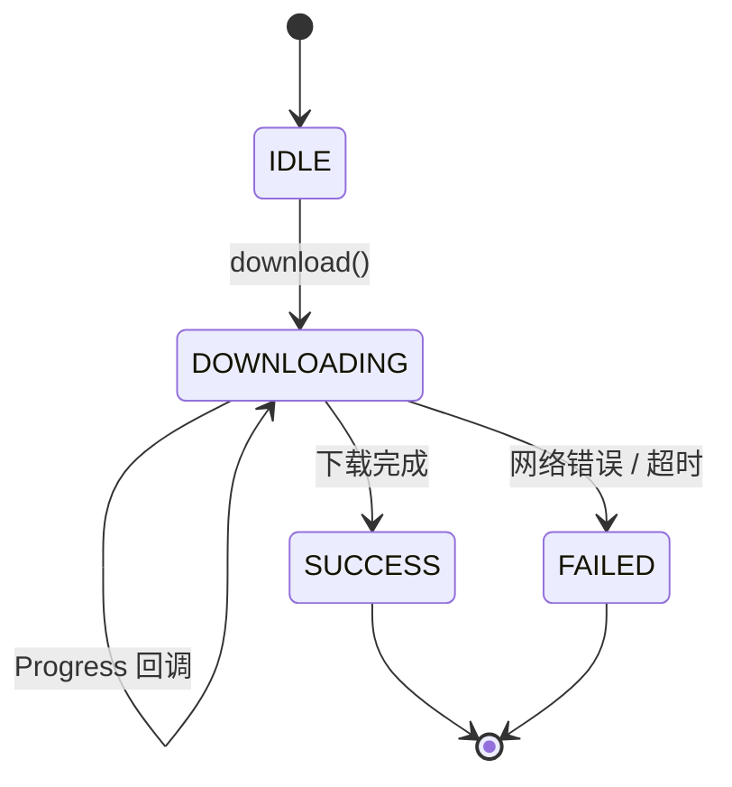
```mermaid
stateDiagram-v2
    [*] --> IDLE
    IDLE --> DOWNLOADING : download()
    DOWNLOADING --> DOWNLOADING : Progress 回调
    DOWNLOADING --> SUCCESS : 下载完成
    DOWNLOADING --> FAILED : 网络错误 / 超时
    SUCCESS --> [*]
    FAILED --> [*]
```

### 6.2 PackagePatcher

#### 6.2.1 类定义

```kotlin
/**
 * 增量包打补丁器
 *
 * 职责：应用 Bsdiff 增量包，生成新版本
 * 流程：校验基准版本 → 复制基础版本 → 应用操作（add/modify/delete）→ 校验完整性
 */
class PackagePatcher {

    /**
     * 应用增量包
     * @param baseDir 基准版本目录
     * @param patchFile 增量包文件
     * @param outputDir 输出目录
     * @return 补丁结果
     */
    fun applyPatch(baseDir: File, patchFile: File, outputDir: File): PatchResult

    /**
     * 生成增量包（服务端工具）
     * @param baseDir 基准版本目录
     * @param targetDir 目标版本目录
     * @param outputFile 输出文件
     */
    fun generatePatch(baseDir: File, targetDir: File, outputFile: File)
}

sealed class PatchResult {
    data class Success(val outputDir: File, val newVersion: String) : PatchResult()
    data class Failed(val reason: String) : PatchResult()
}
```

#### 6.2.2 增量包格式

```json
{
  "baseVersion": "1.0.0",
  "targetVersion": "1.2.0",
  "diffAlgorithm": "bsdiff",
  "operations": [
    { "op": "add", "path": "pages/new/new.js", "size": 1234, "sha256": "abc123" },
    { "op": "modify", "path": "pages/index/index.js", "diffSize": 890, "diffAlgorithm": "bsdiff" },
    { "op": "delete", "path": "pages/old/old.js" }
  ],
  "files": {
    "pages/new/new.js": "<base64 content>",
    "pages/index/index.diff": "<base64 bsdiff data>"
  }
}
```

#### 6.2.3 打补丁流程图

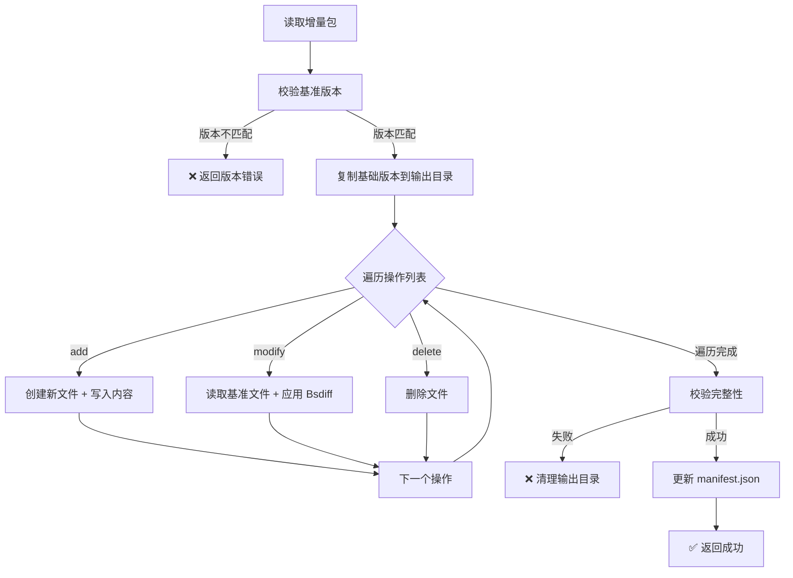
```mermaid
flowchart TD
    START[读取增量包] --> CHECK[校验基准版本]
    CHECK -->|版本不匹配| FAIL1[❌ 返回版本错误]
    CHECK -->|版本匹配| COPY[复制基础版本到输出目录]

    COPY --> LOOP{遍历操作列表}
    LOOP -->|add| ADD[创建新文件 + 写入内容]
    LOOP -->|modify| MODIFY[读取基准文件 + 应用 Bsdiff]
    LOOP -->|delete| DELETE[删除文件]

    ADD --> NEXT[下一个操作]
    MODIFY --> NEXT
    DELETE --> NEXT
    NEXT --> LOOP

    LOOP -->|遍历完成| VERIFY[校验完整性]
    VERIFY -->|失败| FAIL2[❌ 清理输出目录]
    VERIFY -->|成功| UPDATE[更新 manifest.json]
    UPDATE --> SUCCESS[✅ 返回成功]
```

### 6.3 PackageCacheStore

#### 6.3.1 类定义

```kotlin
/**
 * 包缓存管理器
 *
 * 存储结构：
 *   {filesDir}/dualler/packages/{appId}/v{version}/
 *   {filesDir}/dualler/packages/{appId}/temp/
 *
 * 版本管理：
 *   - 保留当前版本 + 上一版本（keepVersions=2）
 *   - LRU 策略清理最旧版本
 */
class PackageCacheStore(private val context: Context) {
    private val prefs = context.getSharedPreferences("dualler_packages", Context.MODE_PRIVATE)
    private val baseDir = File(context.filesDir, "dualler/packages")

    /** 获取当前版本号 */
    fun getCurrentVersion(appId: String): String?

    /** 设置当前版本号 */
    fun setCurrentVersion(appId: String, version: String)

    /** 获取版本目录 */
    fun getVersionDir(appId: String, version: String): File

    /** 获取临时目录 */
    fun getTempDir(appId: String): File

    /** 获取本地包信息 */
    fun getLocalPackage(appId: String): LocalPackage?

    /** 清理旧版本（保留 keepVersions 个） */
    fun cleanOldVersions(appId: String, keepVersions: Int = 2)

    /** 获取缓存大小 */
    fun getCacheSize(appId: String): Long

    /** 清理指定小程序缓存 */
    fun clearCache(appId: String)

    /** 清理所有缓存 */
    fun clearAllCache()
}
```

### 6.4 UpdateScheduler

#### 6.4.1 类定义

```kotlin
/**
 * 更新调度器
 *
 * 职责：根据更新策略选择更新方式（增量/全量/静默）
 */
class UpdateScheduler(
    private val downloader: PackageDownloader,
    private val patcher: PackagePatcher,
    private val cacheStore: PackageCacheStore,
    private val config: DuallerConfig
) {
    /**
     * 检查并执行更新
     * @param appId 小程序 ID
     * @param serverApi 服务端 API
     * @param strategy 更新策略
     * @param callback 结果回调
     */
    fun checkAndUpdate(
        appId: String,
        serverApi: ServerApi,
        strategy: UpdateStrategy,
        callback: PackageCallback
    )
}

enum class UpdateStrategy {
    SILENT,     // 静默更新：用旧版本先启动，后台下载新版本
    IMMEDIATE,  // 立即更新：阻塞等待更新完成
    PREFETCH    // 预下载：仅下载不安装
}
```

#### 6.4.2 更新决策状态机

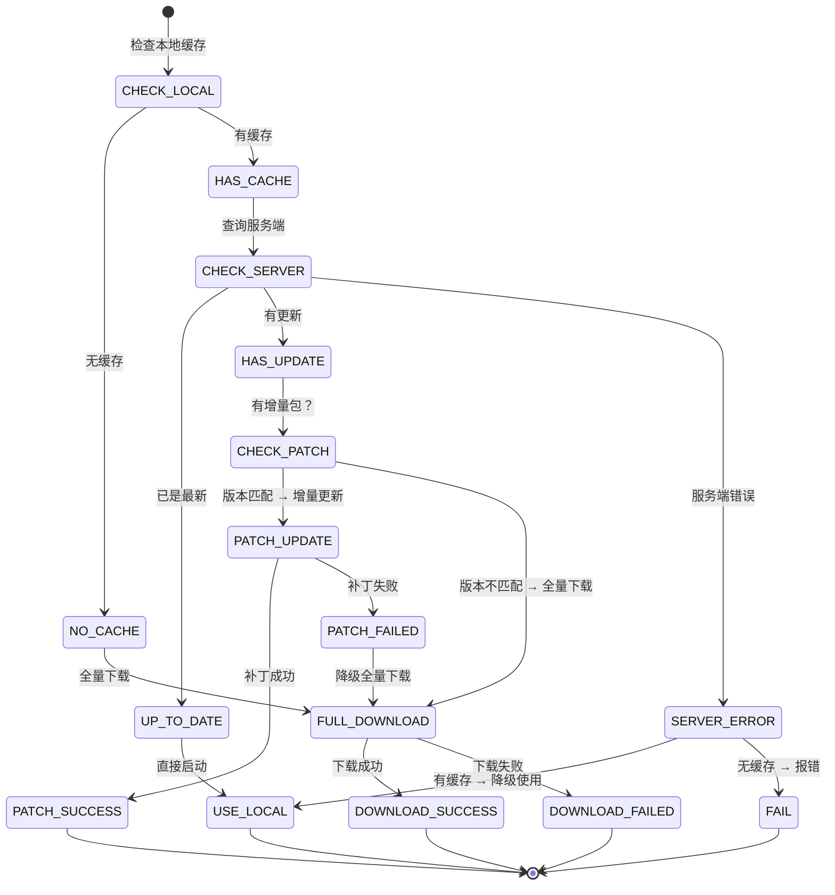
```mermaid
stateDiagram-v2
    [*] --> CHECK_LOCAL : 检查本地缓存
    CHECK_LOCAL --> NO_CACHE : 无缓存
    CHECK_LOCAL --> HAS_CACHE : 有缓存

    NO_CACHE --> FULL_DOWNLOAD : 全量下载

    HAS_CACHE --> CHECK_SERVER : 查询服务端
    CHECK_SERVER --> UP_TO_DATE : 已是最新
    CHECK_SERVER --> HAS_UPDATE : 有更新
    CHECK_SERVER --> SERVER_ERROR : 服务端错误

    UP_TO_DATE --> USE_LOCAL : 直接启动

    HAS_UPDATE --> CHECK_PATCH : 有增量包？
    CHECK_PATCH --> PATCH_UPDATE : 版本匹配 → 增量更新
    CHECK_PATCH --> FULL_DOWNLOAD : 版本不匹配 → 全量下载

    PATCH_UPDATE --> PATCH_SUCCESS : 补丁成功
    PATCH_UPDATE --> PATCH_FAILED : 补丁失败
    PATCH_FAILED --> FULL_DOWNLOAD : 降级全量下载

    FULL_DOWNLOAD --> DOWNLOAD_SUCCESS : 下载成功
    FULL_DOWNLOAD --> DOWNLOAD_FAILED : 下载失败

    SERVER_ERROR --> USE_LOCAL : 有缓存 → 降级使用
    SERVER_ERROR --> FAIL : 无缓存 → 报错

    USE_LOCAL --> [*]
    PATCH_SUCCESS --> [*]
    DOWNLOAD_SUCCESS --> [*]
    DOWNLOAD_FAILED --> [*]
    FAIL --> [*]
```

#### 6.4.3 更新流程时序图

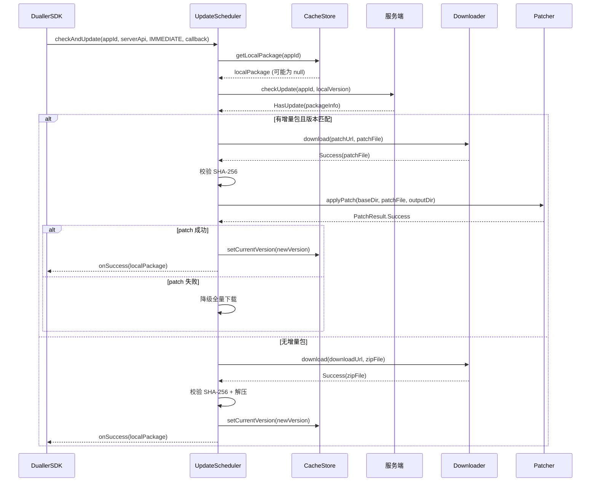
```mermaid
sequenceDiagram
    participant SDK as DuallerSDK
    participant US as UpdateScheduler
    participant Cache as CacheStore
    participant Server as 服务端
    participant DL as Downloader
    participant Patcher as Patcher

    SDK->>US: checkAndUpdate(appId, serverApi, IMMEDIATE, callback)
    US->>Cache: getLocalPackage(appId)
    Cache-->>US: localPackage (可能为 null)

    US->>Server: checkUpdate(appId, localVersion)
    Server-->>US: HasUpdate(packageInfo)

    alt 有增量包且版本匹配
        US->>DL: download(patchUrl, patchFile)
        DL-->>US: Success(patchFile)
        US->>US: 校验 SHA-256
        US->>Patcher: applyPatch(baseDir, patchFile, outputDir)
        Patcher-->>US: PatchResult.Success

        alt patch 成功
            US->>Cache: setCurrentVersion(newVersion)
            US-->>SDK: onSuccess(localPackage)
        else patch 失败
            US->>US: 降级全量下载
        end
    else 无增量包
        US->>DL: download(downloadUrl, zipFile)
        DL-->>US: Success(zipFile)
        US->>US: 校验 SHA-256 + 解压
        US->>Cache: setCurrentVersion(newVersion)
        US-->>SDK: onSuccess(localPackage)
    end
```

### 6.5 SubpackageManager

#### 6.5.1 类定义

```kotlin
/**
 * 分包管理器
 *
 * 职责：
 *   1. 解析 app.json 中的 subpackages 配置
 *   2. 按需下载子包
 *   3. 执行预加载策略
 *   4. 子包版本管理
 */
class SubpackageManager(
    private val downloader: PackageDownloader,
    private val cacheStore: PackageCacheStore,
    private val config: SubpackageConfig
) {
    data class SubpackageConfig(
        val mainPackageMaxSize: Long = 2 * 1024 * 1024,   // 2MB
        val subpackageMaxSize: Long = 2 * 1024 * 1024,    // 2MB
        val totalMaxSize: Long = 20 * 1024 * 1024,        // 20MB
        val preloadMaxPerTrigger: Long = 512 * 1024,       // 512KB
        val preloadMaxTotal: Long = 2 * 1024 * 1024       // 2MB
    )

    /** 从 app.json 加载分包配置 */
    fun loadConfig(appConfig: JSONObject)

    /** 判断页面属于哪个子包 */
    fun findSubpackage(pagePath: String): Subpackage?

    /** 确保子包已加载（按需下载） */
    suspend fun ensureLoaded(subpackageName: String): Boolean

    /** 页面跳转时触发预加载 */
    fun onNavigateToPage(pagePath: String, networkType: String)
}
```

#### 6.5.2 分包加载时序

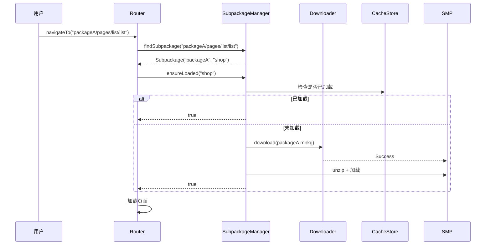
```mermaid
sequenceDiagram
    participant User as 用户
    participant Router as Router
    participant SPM as SubpackageManager
    participant DL as Downloader
    participant Cache as CacheStore

    User->>Router: navigateTo("packageA/pages/list/list")
    Router->>SPM: findSubpackage("packageA/pages/list/list")
    SPM-->>Router: Subpackage("packageA", "shop")

    Router->>SPM: ensureLoaded("shop")
    SPM->>Cache: 检查是否已加载

    alt 已加载
        SPM-->>Router: true
    else 未加载
        SPM->>DL: download(packageA.mpkg)
        DL-->>SMP: Success
        SPM->>SMP: unzip + 加载
        SPM-->>Router: true
    end

    Router->>Router: 加载页面
```

### 6.6 数据结构

```kotlin
/**
 * 服务端返回的包信息
 */
data class PackageInfo(
    val appId: String,              // 小程序 ID
    val version: String,            // 版本号
    val baseVersion: String,        // 基准版本
    val packageSize: Long,          // 包大小（字节）
    val sha256: String,             // 完整包 SHA-256
    val downloadUrl: String,        // 完整包下载地址
    val patchUrl: String?,          // 增量包下载地址（可能无）
    val patchBaseVersion: String?,  // 增量包基准版本
    val patchSha256: String?,       // 增量包 SHA-256
    val forceUpdate: Boolean,       // 是否强制更新
    val minSupportVersion: String   // 最低支持版本
)

/**
 * 本地包信息
 */
data class LocalPackage(
    val appId: String,              // 小程序 ID
    val version: String,            // 版本号
    val installPath: File,          // 安装目录
    val installedAt: Long,          // 安装时间戳
    val status: PackageStatus       // 包状态
)

enum class PackageStatus {
    READY,          // 就绪
    DOWNLOADING,    // 下载中
    PATCHING,       // 打补丁中
    CORRUPTED,      // 损坏
    NEED_UPDATE     // 需要更新
}

sealed class PackageError(val message: String) {
    class DownloadFailed(message: String) : PackageError(message)
    class PatchFailed(message: String) : PackageError(message)
    class VerifyFailed(message: String) : PackageError(message)
    class InsufficientSpace(message: String) : PackageError(message)
    class VersionTooOld(message: String) : PackageError(message)
}
```

---

## 7. 错误处理与恢复

### 7.1 全局错误捕获

#### 7.1.1 DuallerErrorHandler

```kotlin
/**
 * 全局错误管理器
 *
 * 对标微信：
 *   App.onError        → catchUncaughtErrors()
 *   App.onPageNotFound → onPageNotFound()
 *   wx.onError         → registerErrorCallback()
 */
class DuallerErrorHandler {
    private val errorCallbacks = mutableListOf<(ErrorInfo) -> Unit>()
    private val rejectionCallbacks = mutableListOf<(RejectionInfo) -> Unit>()

    data class ErrorInfo(
        val message: String,        // 错误信息
        val stack: String?,         // 堆栈
        val pageId: String?,        // 发生页面
        val timestamp: Long = System.currentTimeMillis()
    )

    data class RejectionInfo(
        val reason: String,         // 拒绝原因
        val promise: String?,       // Promise 描述
        val pageId: String?,        // 发生页面
        val timestamp: Long = System.currentTimeMillis()
    )

    /** 注册全局错误捕获（注入 QuickJS） */
    fun catchUncaughtErrors(jsEngine: JSEngine)

    /** 注册未处理 Promise 拒绝捕获 */
    fun catchUnhandledRejections(jsEngine: JSEngine)

    /** 处理来自 JS 层的错误 */
    fun onError(info: ErrorInfo)

    /** 处理来自 JS 层的未处理 Promise 拒绝 */
    fun onRejection(info: RejectionInfo)

    /** 注册错误回调 */
    fun registerErrorCallback(callback: (ErrorInfo) -> Unit)

    /** 注册 Promise 拒绝回调 */
    fun registerRejectionCallback(callback: (RejectionInfo) -> Unit)
}
```

#### 7.1.2 JS 层错误捕获注入

```javascript
// 注入到 QuickJS 的错误捕获代码
(function() {
    // 全局错误处理器
    globalThis.__dualler_error__ = function(message, stack) {
        __dualler_callNative('__error', JSON.stringify({
            message: message,
            stack: stack,
            pageId: __dualler_currentPage__ || 'unknown'
        }), '');
    };

    // 包装 Bridge 调用，添加错误边界
    globalThis.__dualler_safeCall = function(fn) {
        try {
            return fn.apply(this, arguments);
        } catch (e) {
            __dualler_error__(e.message, e.stack || '');
            return undefined;
        }
    };
})();
```

### 7.2 组件级错误隔离

#### 7.2.1 ComponentErrorBoundary

```kotlin
/**
 * 组件错误隔离
 *
 * 设计原则：单个组件的渲染错误不应导致整个页面白屏
 * 实现：try-catch 包装组件渲染，失败时显示降级 UI
 */
class ComponentErrorBoundary {

    /**
     * 包装组件渲染
     * @param pageId 页面 ID
     * @param componentId 组件 ID
     * @param renderFn 正常渲染函数
     * @param fallbackFn 降级渲染函数（默认显示错误占位符）
     */
    fun wrapWithErrorBoundary(
        pageId: String,
        componentId: String,
        renderFn: () -> Unit,
        fallbackFn: () -> Unit = { renderErrorPlaceholder(componentId) }
    ) {
        try {
            renderFn()
        } catch (e: Exception) {
            Log.e("Dualler", "Component render error: $componentId in $pageId", e)
            fallbackFn()
            reportComponentError(pageId, componentId, e)
        }
    }
}
```

### 7.3 崩溃恢复

#### 7.3.1 CrashRecoveryManager

```kotlin
/**
 * 崩溃恢复管理器
 *
 * 机制：
 *   1. 在关键生命周期节点保存应用状态
 *   2. 启动时检测是否为崩溃恢复
 *   3. 30 秒内重启视为崩溃恢复
 *   4. 恢复到崩溃前的页面和数据
 */
class CrashRecoveryManager(
    private val context: Context,
    private val storage: StorageProvider
) {
    companion object {
        private const val KEY_APP_STATE = "__dualler_crash_state__"
        private const val KEY_LAST_PAGE = "__dualler_last_page__"
        private const val KEY_LAST_TIMESTAMP = "__dualler_last_timestamp__"
        private const val CRASH_TIMEOUT_MS = 30_000L  // 30 秒
    }

    /** 保存当前应用状态 */
    fun saveAppState(appId: String, currentPage: String, data: Map<String, Any>)

    /** 检测是否为崩溃恢复启动 */
    fun detectCrashRecovery(appId: String): CrashRecoveryInfo?

    /** 执行崩溃恢复 */
    fun recover(appId: String, info: CrashRecoveryInfo, appRuntime: AppRuntime)

    /** 清除恢复数据（防止循环恢复） */
    fun clearRecoveryData(appId: String)

    data class CrashRecoveryInfo(
        val lastPage: String,           // 崩溃前页面
        val savedState: Map<String, Any>, // 保存的状态
        val crashedAt: Long,            // 崩溃时间
        val recoveredAt: Long           // 恢复时间
    )
}
```

#### 7.3.2 崩溃恢复状态机

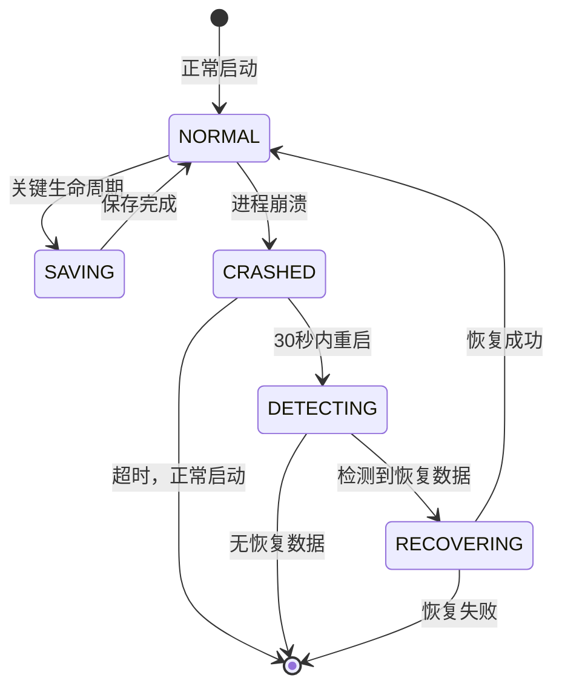
```mermaid
stateDiagram-v2
    [*] --> NORMAL : 正常启动
    NORMAL --> SAVING : 关键生命周期
    SAVING --> NORMAL : 保存完成

    NORMAL --> CRASHED : 进程崩溃
    CRASHED --> DETECTING : 30秒内重启
    CRASHED --> [*] : 超时，正常启动

    DETECTING --> RECOVERING : 检测到恢复数据
    DETECTING --> [*] : 无恢复数据

    RECOVERING --> NORMAL : 恢复成功
    RECOVERING --> [*] : 恢复失败
```

### 7.4 错误码表

| 错误码 | 错误信息 | 严重级别 | 处理建议 |
|--------|----------|----------|----------|
| 10001 | JS 引擎初始化失败 | FATAL | 提示用户重启 App |
| 10002 | WebView 创建失败 | FATAL | 提示用户重启 App |
| 10003 | app.js 加载失败 | ERROR | 检查包完整性，重新下载 |
| 10004 | 页面模板加载失败 | ERROR | 跳过该页面，上报错误 |
| 20001 | 网络请求失败 | WARN | 重试或提示用户检查网络 |
| 20002 | 域名不在白名单 | ERROR | 拒绝请求，记录审计日志 |
| 20003 | 请求超时 | WARN | 重试 |
| 30001 | 存储空间不足 | WARN | 清理旧数据 |
| 30002 | 存储 key 不存在 | INFO | 返回空值 |
| 40001 | 文件不存在 | WARN | 返回错误码 |
| 40002 | 文件写入失败 | ERROR | 检查权限和空间 |
| 50001 | 包下载失败 | ERROR | 重试或降级使用本地版本 |
| 50002 | 包校验失败（SHA-256 不匹配） | ERROR | 重新下载 |
| 50003 | 增量包打补丁失败 | WARN | 降级全量下载 |
| 50004 | 包解压失败 | ERROR | 重新下载 |
| 60001 | 组件渲染失败 | WARN | 显示降级 UI |
| 60002 | 未知 API 调用 | WARN | 返回错误码 |
| 70001 | 权限未授权 | INFO | 弹出权限确认弹窗 |
| 70002 | 权限被拒绝 | INFO | 返回错误码 |

### 7.5 错误上报

```kotlin
/**
 * 错误上报管道
 */
class ErrorReporter(private val serverApi: ServerApi, private val appId: String) {

    /** 上报 JS 运行时错误 */
    fun reportError(error: DuallerErrorHandler.ErrorInfo) {
        serverApi.reportError(ErrorReport(
            appId = appId,
            type = "js_error",
            message = error.message,
            stack = error.stack,
            pageId = error.pageId,
            deviceInfo = getDeviceInfo(),
            timestamp = error.timestamp
        ))
    }

    /** 上报性能指标 */
    fun reportPerformance(metric: PerformanceMetric)

    data class ErrorReport(
        val appId: String,
        val type: String,           // "js_error" | "render_error" | "api_error"
        val message: String,
        val stack: String?,
        val pageId: String?,
        val deviceInfo: Map<String, Any>,
        val timestamp: Long
    )

    data class PerformanceMetric(
        val appId: String,
        val type: String,           // "first_paint" | "set_data" | "page_load"
        val value: Long,            // 毫秒
        val pageId: String?,
        val timestamp: Long
    )
}
```

---

## 8. 接口规约

### 8.1 Bridge 消息协议

#### 8.1.1 统一消息格式

```json
{
  "id": "msg_001",
  "type": "setData | event | api | callback | lifecycle",
  "target": "logic | render | native",
  "method": "具体方法名",
  "pageId": "pages/index",
  "payload": {},
  "timestamp": 1717651200000
}
```

#### 8.1.2 消息类型定义

| type | 方向 | target | payload 结构 | 说明 |
|------|------|--------|-------------|------|
| `setData` | Logic → Render | render | `{ data: Record<string, any> }` | 数据更新 |
| `event` | Render → Logic | logic | `{ event: string, target: string, detail: any }` | 用户交互 |
| `api` | Logic → Native | native | `{ api: string, params: any, callbackId: string }` | 系统 API |
| `callback` | Native → Logic | logic | `{ callbackId: string, result: any }` | API 回调 |
| `lifecycle` | Core → All | all | `{ event: string, params: any }` | 生命周期 |

### 8.2 系统 API 契约

#### 8.2.1 wx.request

| 维度 | 说明 |
|------|------|
| **功能** | 发起 HTTP 请求 |
| **权限** | NETWORK |
| **异步** | ✅ |

**入参：**

| 参数 | 类型 | 必填 | 默认值 | 说明 |
|------|------|------|--------|------|
| url | string | ✅ | — | 请求 URL（必须在白名单内） |
| method | string | ❌ | "GET" | 请求方法 |
| headers | object | ❌ | {} | 请求头 |
| data | string/object | ❌ | null | 请求体 |
| timeout | number | ❌ | 30000 | 超时时间（ms） |
| success | function | ❌ | — | 成功回调 |
| fail | function | ❌ | — | 失败回调 |

**出参（success）：**

| 参数 | 类型 | 说明 |
|------|------|------|
| statusCode | number | HTTP 状态码 |
| header | object | 响应头 |
| data | string | 响应体 |

**错误码：**

| errCode | errMsg | 说明 |
|---------|--------|------|
| -1 | Network error | 网络错误 |
| -2 | Timeout | 请求超时 |
| -3 | Domain not in whitelist | 域名不在白名单 |

#### 8.2.2 wx.getStorageSync

| 维度 | 说明 |
|------|------|
| **功能** | 同步读取本地存储 |
| **权限** | STORAGE |
| **异步** | ❌ |

**入参：**

| 参数 | 类型 | 必填 | 说明 |
|------|------|------|------|
| key | string | ✅ | 存储 key |

**出参：**

| 参数 | 类型 | 说明 |
|------|------|------|
| data | any | 存储的值（key 不存在返回空字符串） |

#### 8.2.3 wx.setStorageSync

| 维度 | 说明 |
|------|------|
| **功能** | 同步写入本地存储 |
| **权限** | STORAGE |
| **异步** | ❌ |

**入参：**

| 参数 | 类型 | 必填 | 说明 |
|------|------|------|------|
| key | string | ✅ | 存储 key |
| data | any | ✅ | 存储的值 |

#### 8.2.4 wx.getSystemInfo

| 维度 | 说明 |
|------|------|
| **功能** | 获取设备信息 |
| **权限** | DEVICE |
| **异步** | ✅ |

**出参（success）：**

| 参数 | 类型 | 说明 |
|------|------|------|
| brand | string | 设备品牌 |
| model | string | 设备型号 |
| pixelRatio | number | 设备像素比 |
| screenWidth | number | 屏幕宽度（px） |
| screenHeight | number | 屏幕高度（px） |
| windowWidth | number | 可用窗口宽度 |
| windowHeight | number | 可用窗口高度 |
| statusBarHeight | number | 状态栏高度 |
| language | string | 系统语言 |
| version | string | 系统版本 |
| platform | string | "android" |
| SDKVersion | string | Dualler 版本 |

### 8.3 app.json 配置格式

```json
{
  "appId": "com.example.myapp",
  "appName": "我的小程序",
  "version": "1.0.0",
  "pages": [
    "pages/index/index",
    "pages/detail/detail"
  ],
  "window": {
    "navigationBarBackgroundColor": "#000000",
    "navigationBarTitleText": "我的小程序",
    "navigationBarTextStyle": "white",
    "backgroundColor": "#ffffff",
    "enablePullDownRefresh": false
  },
  "tabBar": {
    "color": "#999999",
    "selectedColor": "#1a73e8",
    "backgroundColor": "#ffffff",
    "list": [
      {
        "pagePath": "pages/index/index",
        "text": "首页",
        "iconPath": "assets/icons/home.png",
        "selectedIconPath": "assets/icons/home-active.png"
      }
    ]
  },
  "subpackages": [
    {
      "root": "packageA",
      "name": "shop",
      "pages": ["pages/list/list", "pages/detail/detail"]
    }
  ],
  "preloadRule": {
    "pages/index/index": {
      "network": "all",
      "packages": ["shop"]
    }
  },
  "domainWhitelist": {
    "request": ["https://api.example.com"],
    "websocket": ["wss://ws.example.com"]
  },
  "permission": {
    "scope.userLocation": { "desc": "用于获取您的位置信息" }
  },
  "security": {
    "enableAuditLog": true,
    "maxStorageSize": 10485760,
    "allowEval": false,
    "httpsOnly": true
  }
}
```

### 8.4 manifest.json 配置格式

```json
{
  "appId": "com.example.myapp",
  "version": "1.2.0",
  "compilerVersion": "1.0.0",
  "minPlatformVersion": "1.0.0",
  "pages": [
    "pages/index/index",
    "pages/detail/detail"
  ],
  "components": [
    "components/my-button/my-button"
  ],
  "files": {
    "app.js": { "sha256": "a1b2c3", "size": 5678 },
    "pages/index/index.js": { "sha256": "d4e5f6", "size": 1234 },
    "pages/index/index.html": { "sha256": "g7h8i9", "size": 567 },
    "pages/index/index.css": { "sha256": "j0k1l2", "size": 890 }
  },
  "totalSize": 45678,
  "buildTime": "2026-06-10T12:00:00Z"
}
```

---

*文档结束*

---

---

---

---

