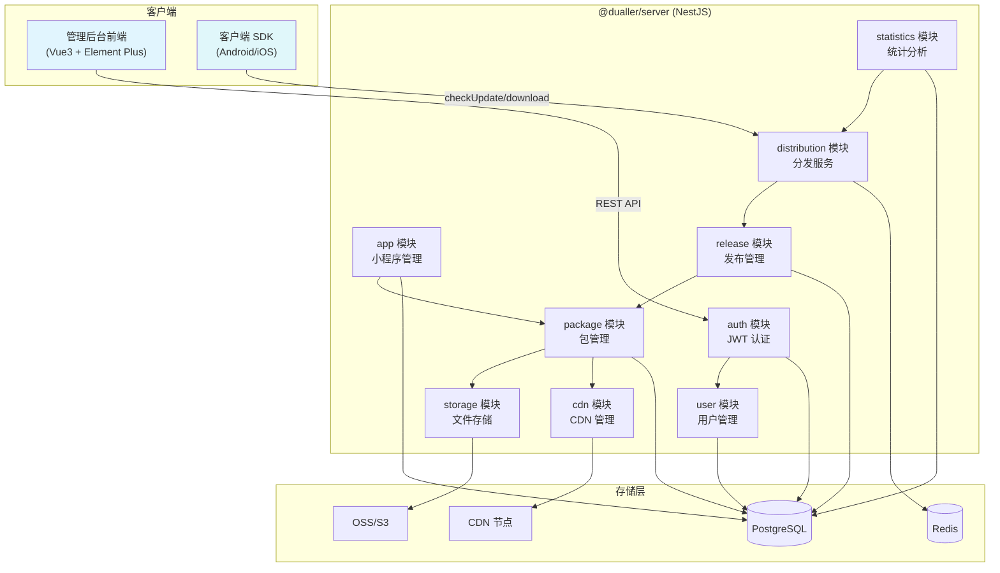
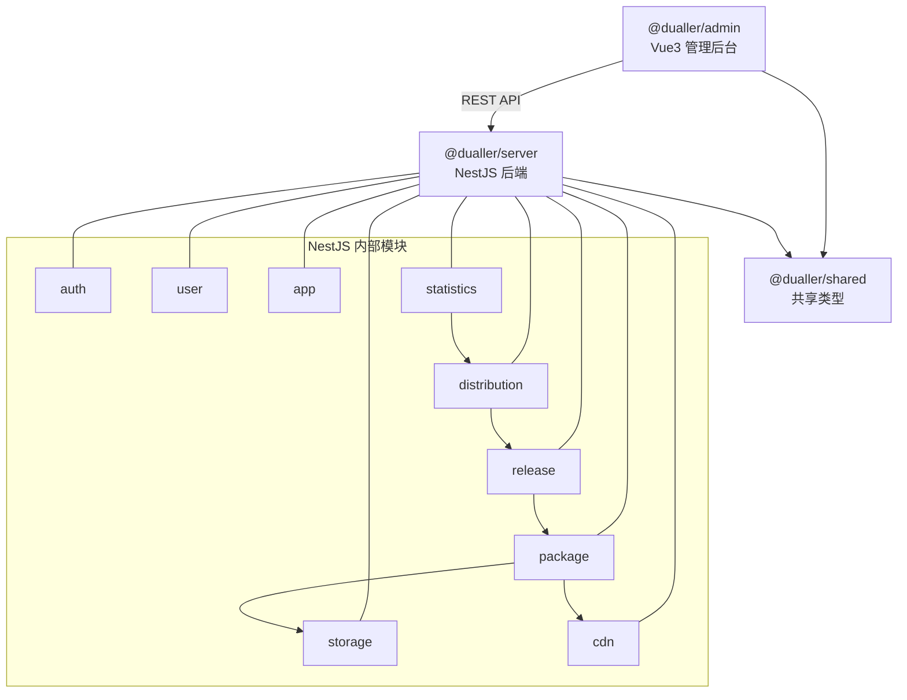
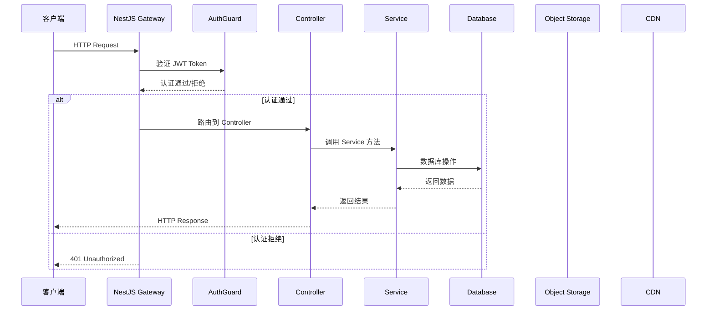
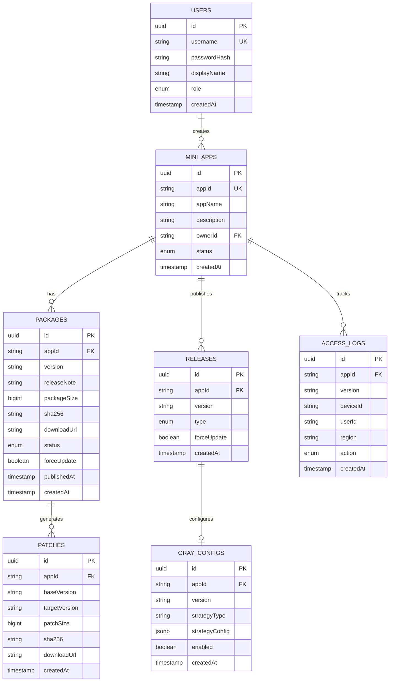

# Dualler 服务端 — 软件详细设计文档（SDD）

> **项目名称**：Dualler Server & Admin
> **文档版本**：v1.0
> **日期**：2026-06-10
> **状态**：初稿
> **范围**：@dualler/server（NestJS 后端）+ @dualler/admin（Vue3 管理后台）

---

## 1. 概述

### 1.1 文档目的

本文档是 Dualler 小程序平台服务端的软件详细设计文档，覆盖：
- `@dualler/server` — NestJS 后端服务（包管理、分发、灰度、统计）
- `@dualler/admin` — Vue3 管理后台（上传、审核、发布、数据看板）
- `@dualler/shared` — 前后端共享类型和工具

### 1.2 适用范围

| 维度 | 说明 |
|------|------|
| **适用模块** | @dualler/server、@dualler/admin、@dualler/shared |
| **不适用模块** | 客户端 SDK（见 Dualler-Client-SDK-SDD.md） |
| **目标读者** | 后端开发工程师、前端开发工程师、架构师 |
| **技术栈** | NestJS + TypeORM + PostgreSQL + Redis + Vue3 + Element Plus |

### 1.3 技术选型

| 组件 | 技术选型 | 说明 |
|------|----------|------|
| 后端框架 | NestJS | TypeScript、模块化、依赖注入 |
| 数据库 | PostgreSQL | 关系型，支持 JSON 字段 |
| 缓存 | Redis | 热点数据缓存、会话管理 |
| ORM | TypeORM | 数据库访问层 |
| 认证 | JWT + Passport | 无状态认证 |
| 文件存储 | OSS/S3/本地 | 可插拔存储抽象 |
| CDN | 阿里云/腾讯云/自建 | 可插拔 CDN 抽象 |
| 前端框架 | Vue3 + TypeScript | 组合式 API |
| UI 组件 | Element Plus | 企业级 UI 库 |
| 状态管理 | Pinia | Vue3 官方推荐 |
| 构建工具 | Vite | 快速开发构建 |

---

## 2. 系统架构

### 2.1 整体架构图



### 2.2 模块依赖关系



### 2.3 请求处理流程



---

## 3. @dualler/shared 共享层

### 3.1 类型定义

#### 3.1.1 包信息类型

```typescript
// packages/shared/src/types/package.ts

/** 小程序包信息（服务端返回给客户端） */
export interface PackageInfo {
  appId: string;
  version: string;
  baseVersion: string;
  packageSize: number;
  sha256: string;
  downloadUrl: string;
  patchUrl: string | null;
  patchBaseVersion: string | null;
  patchSha256: string | null;
  forceUpdate: boolean;
  minSupportVersion: string;
  releaseNote: string;
}

/** 更新检查结果 */
export interface UpdateCheckResponse {
  needUpdate: boolean;
  packageInfo: PackageInfo | null;
}

/** 包上传请求 */
export interface UploadPackageRequest {
  appId: string;
  version: string;
  releaseNote: string;
}

/** 灰度策略 */
export interface GrayStrategy {
  type: 'percentage' | 'region' | 'userWhitelist' | 'device' | 'combined';
  config: Record<string, any>;
}

/** 灰度配置 */
export interface GrayReleaseConfig {
  packageId: string;
  strategy: GrayStrategy;
  enabled: boolean;
}
```

#### 3.1.2 API 类型

```typescript
// packages/shared/src/types/api.ts

/** 统一 API 响应格式 */
export interface ApiResponse<T = any> {
  code: number;       // 0=成功，非0=错误
  message: string;
  data: T;
}

/** 分页请求 */
export interface PaginationRequest {
  page: number;
  pageSize: number;
}

/** 分页响应 */
export interface PaginationResponse<T> {
  items: T[];
  total: number;
  page: number;
  pageSize: number;
}

/** 统计概览 */
export interface StatisticsOverview {
  dau: number;        // 日活用户
  uv: number;         // 独立访客
  downloadCount: number;
  versionDistribution: Record<string, number>;
}
```

#### 3.1.3 错误码定义

```typescript
// packages/shared/src/constants/error-codes.ts

export enum ErrorCode {
  SUCCESS = 0,
  PARAM_INVALID = 10001,
  AUTH_FAILED = 10002,
  NOT_FOUND = 10003,
  PERMISSION_DENIED = 10004,

  APP_NOT_FOUND = 20001,
  APP_ALREADY_EXISTS = 20002,
  VERSION_EXISTS = 20003,
  VERSION_NOT_FOUND = 20004,

  PACKAGE_UPLOAD_FAILED = 30001,
  PACKAGE_TOO_LARGE = 30002,
  PACKAGE_VERIFY_FAILED = 30003,
  PATCH_GENERATE_FAILED = 30004,

  RELEASE_FORBIDDEN = 40001,
  GRAY_CONFIG_INVALID = 40002,

  INTERNAL_ERROR = 99999,
}
```

---

## 4. @dualler/server 详细设计

### 4.1 认证模块（auth）

#### 4.1.1 模块结构

```typescript
// packages/server/src/auth/
├── auth.module.ts
├── auth.controller.ts      // 登录/注册/Token 刷新
├── auth.service.ts         // 认证逻辑
├── jwt.strategy.ts         // JWT 策略
├── auth.guard.ts           // 认证守卫
├── admin.guard.ts          // 管理员权限守卫
└── dto/
    ├── login.dto.ts
    └── register.dto.ts
```

#### 4.1.2 AuthController

```typescript
@Controller('auth')
export class AuthController {
  constructor(private readonly authService: AuthService) {}

  /** 登录 */
  @Post('login')
  @HttpCode(HttpStatus.OK)
  async login(@Body() dto: LoginDto): Promise<ApiResponse<{ token: string; user: UserDto }>> {
    return this.authService.login(dto);
  }

  /** 注册 */
  @Post('register')
  async register(@Body() dto: RegisterDto): Promise<ApiResponse<UserDto>> {
    return this.authService.register(dto);
  }

  /** 刷新 Token */
  @Post('refresh')
  @UseGuards(AuthGuard)
  async refresh(@Request() req): Promise<ApiResponse<{ token: string }>> {
    return this.authService.refreshToken(req.user);
  }
}
```

#### 4.1.3 AuthService

```typescript
@Injectable()
export class AuthService {
  constructor(
    @InjectRepository(User) private userRepo: Repository<User>,
    private jwtService: JwtService,
  ) {}

  /** 登录 */
  async login(dto: LoginDto): Promise<{ token: string; user: UserDto }> {
    const user = await this.userRepo.findOne({ where: { username: dto.username } });
    if (!user || !await bcrypt.compare(dto.password, user.passwordHash)) {
      throw new UnauthorizedException(ErrorCode.AUTH_FAILED, '用户名或密码错误');
    }
    const token = this.generateToken(user);
    return { token, user: this.toDto(user) };
  }

  /** 注册 */
  async register(dto: RegisterDto): Promise<UserDto> {
    const exists = await this.userRepo.findOne({ where: { username: dto.username } });
    if (exists) {
      throw new ConflictException(ErrorCode.APP_ALREADY_EXISTS, '用户名已存在');
    }
    const passwordHash = await bcrypt.hash(dto.password, 10);
    const user = this.userRepo.create({ ...dto, passwordHash, role: 'user' });
    await this.userRepo.save(user);
    return this.toDto(user);
  }

  /** 生成 JWT Token */
  private generateToken(user: User): string {
    const payload = { sub: user.id, username: user.username, role: user.role };
    return this.jwtService.sign(payload, { expiresIn: '7d' });
  }
}
```

#### 4.1.4 JWT 策略

```typescript
@Injectable()
export class JwtStrategy extends PassportStrategy(Strategy) {
  constructor() {
    super({
      jwtFromRequest: ExtractJwt.fromAuthHeaderAsBearerToken(),
      ignoreExpiration: false,
      secretOrKey: process.env.JWT_SECRET,
    });
  }

  async validate(payload: any): Promise<JwtPayload> {
    return { userId: payload.sub, username: payload.username, role: payload.role };
  }
}
```

### 4.2 用户模块（user）

#### 4.2.1 实体定义

```typescript
@Entity('users')
export class User {
  @PrimaryGeneratedColumn('uuid')
  id: string;

  @Column({ unique: true, length: 64 })
  username: string;

  @Column({ length: 128 })
  passwordHash: string;

  @Column({ length: 64, nullable: true })
  displayName: string;

  @Column({ type: 'enum', enum: ['admin', 'user'], default: 'user' })
  role: 'admin' | 'user';

  @CreateDateColumn()
  createdAt: Date;

  @UpdateDateColumn()
  updatedAt: Date;
}
```

#### 4.2.2 UserService

```typescript
@Injectable()
export class UserService {
  constructor(@InjectRepository(User) private repo: Repository<User>) {}

  async findAll(query: PaginationRequest): Promise<PaginationResponse<UserDto>> {
    const [items, total] = await this.repo.findAndCount({
      skip: (query.page - 1) * query.pageSize,
      take: query.pageSize,
      order: { createdAt: 'DESC' },
    });
    return { items: items.map(this.toDto), total, ...query };
  }

  async findById(id: string): Promise<UserDto> { ... }
  async update(id: string, dto: UpdateUserDto): Promise<UserDto> { ... }
  async delete(id: string): Promise<void> { ... }
}
```

### 4.3 小程序管理模块（app）

#### 4.3.1 实体定义

```typescript
@Entity('mini_apps')
export class MiniApp {
  @PrimaryGeneratedColumn('uuid')
  id: string;

  @Column({ unique: true, length: 128 })
  appId: string;            // 小程序唯一标识（如 com.example.myapp）

  @Column({ length: 128 })
  appName: string;

  @Column({ type: 'text', nullable: true })
  description: string;

  @Column({ length: 512, nullable: true })
  iconUrl: string;

  @Column({ length: 64 })
  ownerId: string;          // 创建者 ID

  @Column({ type: 'enum', enum: ['draft', 'active', 'disabled'], default: 'draft' })
  status: 'draft' | 'active' | 'disabled';

  @CreateDateColumn()
  createdAt: Date;

  @UpdateDateColumn()
  updatedAt: Date;
}
```

#### 4.3.2 AppController

```typescript
@Controller('apps')
@UseGuards(AuthGuard)
export class AppController {
  constructor(private readonly appService: AppService) {}

  /** 创建小程序 */
  @Post()
  async create(@Body() dto: CreateAppDto, @Request() req): Promise<ApiResponse<MiniAppDto>> {
    return this.appService.create(dto, req.user.userId);
  }

  /** 获取小程序列表 */
  @Get()
  async findAll(@Query() query: PaginationRequest): Promise<ApiResponse<PaginationResponse<MiniAppDto>>> {
    return this.appService.findAll(query);
  }

  /** 获取小程序详情 */
  @Get(':id')
  async findOne(@Param('id') id: string): Promise<ApiResponse<MiniAppDto>> {
    return this.appService.findOne(id);
  }

  /** 更新小程序 */
  @Put(':id')
  async update(@Param('id') id: string, @Body() dto: UpdateAppDto): Promise<ApiResponse<MiniAppDto>> {
    return this.appService.update(id, dto);
  }

  /** 删除小程序 */
  @Delete(':id')
  @UseGuards(AdminGuard)
  async delete(@Param('id') id: string): Promise<ApiResponse<void>> {
    return this.appService.delete(id);
  }
}
```

### 4.4 包管理模块（package）

#### 4.4.1 实体定义

```typescript
@Entity('packages')
export class Package {
  @PrimaryGeneratedColumn('uuid')
  id: string;

  @Column({ length: 128 })
  appId: string;

  @Column({ length: 32 })
  version: string;

  @Column({ type: 'text', nullable: true })
  releaseNote: string;

  @Column({ type: 'bigint' })
  packageSize: number;

  @Column({ length: 64 })
  sha256: string;

  @Column({ length: 512 })
  downloadUrl: string;

  @Column({ type: 'enum', enum: ['draft', 'published', 'unpublished'], default: 'draft' })
  status: 'draft' | 'published' | 'unpublished';

  @Column({ default: false })
  forceUpdate: boolean;

  @Column({ length: 32, nullable: true })
  minSupportVersion: string;

  @Column({ type: 'timestamp', nullable: true })
  publishedAt: Date;

  @CreateDateColumn()
  createdAt: Date;

  @UpdateDateColumn()
  updatedAt: Date;
}

@Entity('patches')
export class Patch {
  @PrimaryGeneratedColumn('uuid')
  id: string;

  @Column({ length: 128 })
  appId: string;

  @Column({ length: 32 })
  baseVersion: string;

  @Column({ length: 32 })
  targetVersion: string;

  @Column({ type: 'bigint' })
  patchSize: number;

  @Column({ length: 64 })
  sha256: string;

  @Column({ length: 512 })
  downloadUrl: string;

  @CreateDateColumn()
  createdAt: Date;
}
```

#### 4.4.2 PackageService

```typescript
@Injectable()
export class PackageService {
  constructor(
    @InjectRepository(Package) private packageRepo: Repository<Package>,
    @InjectRepository(Patch) private patchRepo: Repository<Patch>,
    private storageService: StorageService,
    private cdnService: CDNService,
    private patchGenerator: PatchGeneratorService,
  ) {}

  /** 上传包 */
  async upload(appId: string, file: Express.Multer.File, dto: UploadPackageDto): Promise<Package> {
    // 1. 校验包大小
    if (file.size > 20 * 1024 * 1024) {
      throw new BadRequestException(ErrorCode.PACKAGE_TOO_LARGE, '包大小超过 20MB');
    }

    // 2. 计算 SHA-256
    const sha256 = calculateSHA256(file.buffer);

    // 3. 上传到对象存储
    const remotePath = `packages/${appId}/${dto.version}.mpkg`;
    const downloadUrl = await this.storageService.upload(file.buffer, remotePath);

    // 4. 保存包记录
    const pkg = this.packageRepo.create({
      appId, version: dto.version, releaseNote: dto.releaseNote,
      packageSize: file.size, sha256, downloadUrl, status: 'draft',
    });
    await this.packageRepo.save(pkg);

    // 5. 异步生成增量包
    this.generatePatchAsync(appId, dto.version);

    return pkg;
  }

  /** 发布 */
  async publish(packageId: string): Promise<Package> {
    const pkg = await this.packageRepo.findOneBy({ id: packageId });
    if (!pkg) throw new NotFoundException(ErrorCode.VERSION_NOT_FOUND);

    pkg.status = 'published';
    pkg.publishedAt = new Date();
    await this.packageRepo.save(pkg);

    // 刷新 CDN 缓存
    await this.cdnService.refreshCache([pkg.downloadUrl]);

    return pkg;
  }

  /** 下架 */
  async unpublish(packageId: string): Promise<Package> { ... }

  /** 查询版本列表 */
  async findByAppId(appId: string, query: PaginationRequest): Promise<PaginationResponse<Package>> { ... }

  /** 异步生成增量包 */
  private async generatePatchAsync(appId: string, newVersion: string) {
    const prevVersion = await this.packageRepo.findOne({
      where: { appId, status: 'published' },
      order: { createdAt: 'DESC' },
    });
    if (!prevVersion) return;

    try {
      const patchUrl = await this.patchGenerator.generate(
        appId, prevVersion.version, newVersion
      );
      const patch = this.patchRepo.create({
        appId, baseVersion: prevVersion.version, targetVersion: newVersion,
        patchUrl, sha256: '', patchSize: 0,
      });
      await this.patchRepo.save(patch);
    } catch (e) {
      console.error('Patch generation failed:', e);
    }
  }
}
```

### 4.5 发布管理模块（release）

#### 4.5.1 实体定义

```typescript
@Entity('releases')
export class Release {
  @PrimaryGeneratedColumn('uuid')
  id: string;

  @Column({ length: 128 })
  appId: string;

  @Column({ length: 32 })
  version: string;

  @Column({ type: 'enum', enum: ['gray', 'full', 'unpublished'], default: 'gray' })
  type: 'gray' | 'full' | 'unpublished';

  @Column({ default: false })
  forceUpdate: boolean;

  @CreateDateColumn()
  createdAt: Date;
}

@Entity('gray_configs')
export class GrayConfig {
  @PrimaryGeneratedColumn('uuid')
  id: string;

  @Column({ length: 128 })
  appId: string;

  @Column({ length: 32 })
  version: string;

  @Column({ type: 'enum', enum: ['percentage', 'region', 'userWhitelist', 'device'] })
  strategyType: string;

  @Column({ type: 'jsonb' })
  strategyConfig: Record<string, any>;

  @Column({ default: true })
  enabled: boolean;

  @CreateDateColumn()
  createdAt: Date;
}
```

#### 4.5.2 GrayReleaseService

```typescript
@Injectable()
export class GrayReleaseService {
  constructor(
    @InjectRepository(GrayConfig) private grayRepo: Repository<GrayConfig>,
    @InjectRepository(Package) private packageRepo: Repository<Package>,
  ) {}

  /**
   * 判断客户端是否应获取新版本
   */
  async shouldServeNewVersion(
    appId: string,
    clientVersion: string,
    deviceId: string,
    userId?: string,
    region?: string,
  ): Promise<Package | null> {
    // 1. 查找最新的已发布版本
    const latestPkg = await this.packageRepo.findOne({
      where: { appId, status: 'published' },
      order: { createdAt: 'DESC' },
    });
    if (!latestPkg || latestPkg.version === clientVersion) return null;

    // 2. 检查灰度配置
    const grayConfig = await this.grayRepo.findOne({
      where: { appId, version: latestPkg.version, enabled: true },
    });

    if (!grayConfig) return latestPkg; // 无灰度配置，全量发布

    // 3. 执行灰度判断
    const isInGray = this.evaluateGrayStrategy(
      grayConfig.strategyType,
      grayConfig.strategyConfig,
      deviceId, userId, region
    );

    return isInGray ? latestPkg : null;
  }

  /**
   * 灰度策略评估
   */
  private evaluateGrayStrategy(
    type: string,
    config: Record<string, any>,
    deviceId: string,
    userId?: string,
    region?: string,
  ): boolean {
    switch (type) {
      case 'percentage': {
        const hash = Math.abs(this.hashCode(deviceId));
        return hash % 100 < config.percent;
      }
      case 'region':
        return config.regions.includes(region);
      case 'userWhitelist':
        return config.userIds.includes(userId);
      case 'device':
        return config.brands?.includes(deviceId) || false;
      default:
        return false;
    }
  }
}
```

### 4.6 分发模块（distribution）

#### 4.6.1 DistributionController

```typescript
@Controller('packages')
export class DistributionController {
  constructor(
    private readonly grayService: GrayReleaseService,
    private readonly packageService: PackageService,
  ) {}

  /**
   * 检查更新
   * GET /api/v1/packages/:appId/check?version=1.0.0
   */
  @Get(':appId/check')
  async checkUpdate(
    @Param('appId') appId: string,
    @Query('version') version: string,
    @Headers('x-device-id') deviceId: string,
    @Headers('x-user-id') userId: string,
    @Headers('x-region') region: string,
  ): Promise<ApiResponse<UpdateCheckResponse>> {
    const pkg = await this.grayService.shouldServeNewVersion(
      appId, version, deviceId, userId, region
    );

    if (!pkg) {
      return { code: 0, message: 'ok', data: { needUpdate: false, packageInfo: null } };
    }

    // 查询是否有增量包
    const patch = await this.packageService.findPatch(appId, version, pkg.version);

    const packageInfo: PackageInfo = {
      appId: pkg.appId,
      version: pkg.version,
      baseVersion: pkg.version,
      packageSize: pkg.packageSize,
      sha256: pkg.sha256,
      downloadUrl: pkg.downloadUrl,
      patchUrl: patch?.downloadUrl ?? null,
      patchBaseVersion: patch?.baseVersion ?? null,
      patchSha256: patch?.sha256 ?? null,
      forceUpdate: pkg.forceUpdate,
      minSupportVersion: pkg.minSupportVersion,
      releaseNote: pkg.releaseNote,
    };

    return { code: 0, message: 'ok', data: { needUpdate: true, packageInfo } };
  }
}
```

### 4.7 存储模块（storage）

#### 4.7.1 存储抽象

```typescript
/** 存储提供者接口 */
export interface StorageProvider {
  upload(buffer: Buffer, remotePath: string): Promise<string>;
  download(remotePath: string): Promise<Buffer>;
  delete(remotePath: string): Promise<void>;
  getSignedUrl(remotePath: string, expiresIn?: number): Promise<string>;
}

/** 存储服务（可插拔） */
@Injectable()
export class StorageService {
  private provider: StorageProvider;

  constructor(private configService: ConfigService) {
    const providerType = configService.get('STORAGE_PROVIDER', 'local');
    switch (providerType) {
      case 'oss':
        this.provider = new AliyunOSSProvider(configService);
        break;
      case 's3':
        this.provider = new AWSS3Provider(configService);
        break;
      default:
        this.provider = new LocalStorageProvider(configService);
    }
  }

  async upload(buffer: Buffer, remotePath: string): Promise<string> {
    return this.provider.upload(buffer, remotePath);
  }

  async download(remotePath: string): Promise<Buffer> {
    return this.provider.download(remotePath);
  }
}
```

### 4.8 CDN 模块（cdn）

```typescript
@Injectable()
export class CDNService {
  constructor(private configService: ConfigService) {}

  /** 刷新 CDN 缓存 */
  async refreshCache(urls: string[]): Promise<void> {
    const provider = this.configService.get('CDN_PROVIDER', 'aliyun');
    // 调用对应 CDN API 刷新缓存
    switch (provider) {
      case 'aliyun':
        await this.refreshAliyunCDN(urls);
        break;
      case 'tencent':
        await this.refreshTencentCDN(urls);
        break;
    }
  }

  /** 预热 CDN */
  async warmup(urls: string[]): Promise<void> { ... }
}
```

### 4.9 统计模块（statistics）

#### 4.9.1 实体定义

```typescript
@Entity('access_logs')
export class AccessLog {
  @PrimaryGeneratedColumn('uuid')
  id: string;

  @Column({ length: 128 })
  appId: string;

  @Column({ length: 32 })
  version: string;

  @Column({ length: 128, nullable: true })
  deviceId: string;

  @Column({ length: 128, nullable: true })
  userId: string;

  @Column({ length: 64, nullable: true })
  region: string;

  @Column({ type: 'enum', enum: ['check', 'download_full', 'download_patch', 'launch'] })
  action: 'check' | 'download_full' | 'download_patch' | 'launch';

  @CreateDateColumn()
  createdAt: Date;
}
```

#### 4.9.2 StatisticsService

```typescript
@Injectable()
export class StatisticsService {
  constructor(@InjectRepository(AccessLog) private logRepo: Repository<AccessLog>) {}

  /** 记录访问日志 */
  async log(appId: string, version: string, action: string, meta: Partial<AccessLog>): Promise<void> {
    const log = this.logRepo.create({ appId, version, action, ...meta });
    await this.logRepo.save(log);
  }

  /** 获取统计概览 */
  async getOverview(appId: string, startDate: Date, endDate: Date): Promise<StatisticsOverview> {
    // DAU
    const dau = await this.logRepo
      .createQueryBuilder('log')
      .select('COUNT(DISTINCT log.deviceId)', 'count')
      .where('log.appId = :appId', { appId })
      .andWhere('log.action = :action', { action: 'launch' })
      .andWhere('log.createdAt BETWEEN :start AND :end', { start: startDate, end: endDate })
      .getRawOne();

    // 版本分布
    const versionDist = await this.logRepo
      .createQueryBuilder('log')
      .select('log.version', 'version')
      .addSelect('COUNT(*)', 'count')
      .where('log.appId = :appId', { appId })
      .andWhere('log.action = :action', { action: 'launch' })
      .groupBy('log.version')
      .getRawMany();

    return {
      dau: parseInt(dau?.count || '0'),
      uv: 0,
      downloadCount: 0,
      versionDistribution: Object.fromEntries(versionDist.map(v => [v.version, parseInt(v.count)])),
    };
  }
}
```

---

## 5. @dualler/admin 详细设计

### 5.1 前端架构

```
packages/admin/src/
├── main.ts                     # Vue 入口
├── App.vue
├── router/
│   └── index.ts                # 路由配置
├── stores/                     # Pinia 状态管理
│   ├── user.ts                 # 用户状态
│   ├── app.ts                  # 小程序状态
│   └── package.ts              # 包管理状态
├── api/                        # API 请求封装
│   ├── request.ts              # Axios 拦截器
│   ├── auth.ts                 # 认证 API
│   ├── app.ts                  # 小程序 API
│   ├── package.ts              # 包管理 API
│   └── statistics.ts           # 统计 API
├── layouts/
│   ├── DefaultLayout.vue       # 默认布局（侧边栏 + 顶栏）
│   └── BlankLayout.vue         # 空白布局（登录页）
├── views/
│   ├── login/LoginView.vue
│   ├── dashboard/DashboardView.vue
│   ├── app/
│   │   ├── AppListView.vue
│   │   ├── AppDetailView.vue
│   │   └── AppCreateView.vue
│   ├── package/
│   │   ├── PackageUploadView.vue
│   │   ├── PackageListView.vue
│   │   └── PatchManageView.vue
│   ├── release/
│   │   ├── ReleaseView.vue
│   │   └── GrayReleaseView.vue
│   └── statistics/
│       ├── OverviewView.vue
│       └── DetailView.vue
├── components/                 # 公共组件
│   ├── PackageUploader.vue
│   ├── VersionTimeline.vue
│   ├── GrayConfigForm.vue
│   └── StatsChart.vue
└── styles/
    ├── variables.scss
    └── global.scss
```

### 5.2 路由配置

```typescript
// packages/admin/src/router/index.ts
const routes: RouteRecordRaw[] = [
  {
    path: '/login',
    component: BlankLayout,
    children: [{ path: '', component: LoginView }],
  },
  {
    path: '/',
    component: DefaultLayout,
    meta: { requiresAuth: true },
    children: [
      { path: '', redirect: '/dashboard' },
      { path: 'dashboard', component: DashboardView },
      { path: 'apps', component: AppListView },
      { path: 'apps/create', component: AppCreateView },
      { path: 'apps/:id', component: AppDetailView },
      { path: 'apps/:id/packages', component: PackageListView },
      { path: 'apps/:id/packages/upload', component: PackageUploadView },
      { path: 'apps/:id/packages/:pkgId/release', component: ReleaseView },
      { path: 'apps/:id/packages/:pkgId/gray', component: GrayReleaseView },
      { path: 'apps/:id/statistics', component: OverviewView },
    ],
  },
];
```

### 5.3 状态管理（Pinia）

#### 5.3.1 用户状态

```typescript
// packages/admin/src/stores/user.ts
export const useUserStore = defineStore('user', () => {
  const token = ref<string | null>(localStorage.getItem('token'));
  const user = ref<UserDto | null>(null);

  const isLoggedIn = computed(() => !!token.value);

  async function login(username: string, password: string) {
    const res = await authApi.login({ username, password });
    token.value = res.data.token;
    user.value = res.data.user;
    localStorage.setItem('token', res.data.token);
  }

  function logout() {
    token.value = null;
    user.value = null;
    localStorage.removeItem('token');
  }

  return { token, user, isLoggedIn, login, logout };
});
```

#### 5.3.2 小程序状态

```typescript
// packages/admin/src/stores/app.ts
export const useAppStore = defineStore('app', () => {
  const apps = ref<MiniAppDto[]>([]);
  const currentApp = ref<MiniAppDto | null>(null);

  async function fetchApps() {
    const res = await appApi.getList();
    apps.value = res.data.items;
  }

  async function fetchApp(id: string) {
    const res = await appApi.getDetail(id);
    currentApp.value = res.data;
  }

  return { apps, currentApp, fetchApps, fetchApp };
});
```

### 5.4 API 请求封装

```typescript
// packages/admin/src/api/request.ts
const request = axios.create({
  baseURL: import.meta.env.VITE_API_BASE_URL || '/api/v1',
  timeout: 30000,
});

// 请求拦截器：添加 Token
request.interceptors.request.use((config) => {
  const userStore = useUserStore();
  if (userStore.token) {
    config.headers.Authorization = `Bearer ${userStore.token}`;
  }
  return config;
});

// 响应拦截器：统一错误处理
request.interceptors.response.use(
  (response) => {
    const data = response.data as ApiResponse;
    if (data.code !== 0) {
      ElMessage.error(data.message);
      return Promise.reject(data);
    }
    return data;
  },
  (error) => {
    if (error.response?.status === 401) {
      const userStore = useUserStore();
      userStore.logout();
      router.push('/login');
    }
    return Promise.reject(error);
  }
);
```

### 5.5 核心页面设计

#### 5.5.1 数据看板（DashboardView）

```
┌─────────────────────────────────────────────────────────┐
│  数据看板                                                │
│                                                          │
│  ┌──────────┐ ┌──────────┐ ┌──────────┐ ┌──────────┐   │
│  │ 小程序数  │ │ 今日 DAU │ │ 今日下载 │ │ 版本覆盖 │   │
│  │   12     │ │  1,234   │ │   456    │ │  98.5%   │   │
│  └──────────┘ └──────────┘ └──────────┘ └──────────┘   │
│                                                          │
│  ┌──────────────────────────────────────────────────┐   │
│  │  DAU 趋势图（折线图，近 7 天）                      │   │
│  └──────────────────────────────────────────────────┘   │
│                                                          │
│  ┌──────────────────────┐ ┌──────────────────────┐     │
│  │  版本分布（饼图）      │ │  最新发布（时间线）    │     │
│  └──────────────────────┘ └──────────────────────┘     │
└─────────────────────────────────────────────────────────┘
```

#### 5.5.2 灰度配置（GrayConfigForm）

```vue
<template>
  <el-form :model="form" label-width="120px">
    <el-form-item label="灰度策略">
      <el-radio-group v-model="form.strategyType">
        <el-radio value="percentage">按百分比</el-radio>
        <el-radio value="region">按地区</el-radio>
        <el-radio value="userWhitelist">按用户白名单</el-radio>
        <el-radio value="device">按设备</el-radio>
      </el-radio-group>
    </el-form-item>

    <el-form-item v-if="form.strategyType === 'percentage'" label="灰度比例">
      <el-slider v-model="form.config.percent" :max="100" show-input />
    </el-form-item>

    <el-form-item v-if="form.strategyType === 'region'" label="灰度地区">
      <el-select v-model="form.config.regions" multiple>
        <el-option v-for="r in regions" :key="r" :label="r" :value="r" />
      </el-select>
    </el-form-item>

    <el-form-item>
      <el-button type="primary" @click="onSubmit">保存配置</el-button>
    </el-form-item>
  </el-form>
</template>
```

---

## 6. 数据库设计

### 6.1 ER 图



### 6.2 DDL

```sql
-- 用户表
CREATE TABLE users (
    id              UUID PRIMARY KEY DEFAULT gen_random_uuid(),
    username        VARCHAR(64) UNIQUE NOT NULL,
    password_hash   VARCHAR(128) NOT NULL,
    display_name    VARCHAR(64),
    role            VARCHAR(16) DEFAULT 'user',
    created_at      TIMESTAMP DEFAULT NOW(),
    updated_at      TIMESTAMP DEFAULT NOW()
);

-- 小程序表
CREATE TABLE mini_apps (
    id              UUID PRIMARY KEY DEFAULT gen_random_uuid(),
    app_id          VARCHAR(128) UNIQUE NOT NULL,
    app_name        VARCHAR(128) NOT NULL,
    description     TEXT,
    icon_url        VARCHAR(512),
    owner_id        UUID REFERENCES users(id),
    status          VARCHAR(16) DEFAULT 'draft',
    created_at      TIMESTAMP DEFAULT NOW(),
    updated_at      TIMESTAMP DEFAULT NOW()
);

-- 包表
CREATE TABLE packages (
    id              UUID PRIMARY KEY DEFAULT gen_random_uuid(),
    app_id          VARCHAR(128) NOT NULL,
    version         VARCHAR(32) NOT NULL,
    release_note    TEXT,
    package_size    BIGINT NOT NULL,
    sha256          VARCHAR(64) NOT NULL,
    download_url    VARCHAR(512) NOT NULL,
    status          VARCHAR(16) DEFAULT 'draft',
    force_update    BOOLEAN DEFAULT FALSE,
    min_support_ver VARCHAR(32),
    published_at    TIMESTAMP,
    created_at      TIMESTAMP DEFAULT NOW(),
    updated_at      TIMESTAMP DEFAULT NOW(),
    UNIQUE (app_id, version)
);
CREATE INDEX idx_packages_app_status ON packages(app_id, status);

-- 增量包表
CREATE TABLE patches (
    id              UUID PRIMARY KEY DEFAULT gen_random_uuid(),
    app_id          VARCHAR(128) NOT NULL,
    base_version    VARCHAR(32) NOT NULL,
    target_version  VARCHAR(32) NOT NULL,
    patch_size      BIGINT NOT NULL,
    sha256          VARCHAR(64) NOT NULL,
    download_url    VARCHAR(512) NOT NULL,
    created_at      TIMESTAMP DEFAULT NOW(),
    UNIQUE (app_id, base_version, target_version)
);

-- 发布记录表
CREATE TABLE releases (
    id              UUID PRIMARY KEY DEFAULT gen_random_uuid(),
    app_id          VARCHAR(128) NOT NULL,
    version         VARCHAR(32) NOT NULL,
    type            VARCHAR(16) DEFAULT 'gray',
    force_update    BOOLEAN DEFAULT FALSE,
    created_at      TIMESTAMP DEFAULT NOW()
);

-- 灰度配置表
CREATE TABLE gray_configs (
    id              UUID PRIMARY KEY DEFAULT gen_random_uuid(),
    app_id          VARCHAR(128) NOT NULL,
    version         VARCHAR(32) NOT NULL,
    strategy_type   VARCHAR(32) NOT NULL,
    strategy_config JSONB NOT NULL,
    enabled         BOOLEAN DEFAULT TRUE,
    created_at      TIMESTAMP DEFAULT NOW()
);

-- 访问统计表
CREATE TABLE access_logs (
    id              UUID PRIMARY KEY DEFAULT gen_random_uuid(),
    app_id          VARCHAR(128) NOT NULL,
    version         VARCHAR(32) NOT NULL,
    device_id       VARCHAR(128),
    user_id         VARCHAR(128),
    region          VARCHAR(64),
    action          VARCHAR(32) NOT NULL,
    created_at      TIMESTAMP DEFAULT NOW()
);
CREATE INDEX idx_access_logs_app_time ON access_logs(app_id, created_at);
CREATE INDEX idx_access_logs_action ON access_logs(action, created_at);
```

---

## 7. API 总览

| 方法 | 路径 | 说明 | 权限 |
|------|------|------|------|
| POST | /auth/login | 登录 | 公开 |
| POST | /auth/register | 注册 | 公开 |
| POST | /auth/refresh | 刷新 Token | 需认证 |
| GET | /users | 用户列表 | 管理员 |
| GET | /users/:id | 用户详情 | 需认证 |
| PUT | /users/:id | 更新用户 | 需认证 |
| DELETE | /users/:id | 删除用户 | 管理员 |
| POST | /apps | 创建小程序 | 需认证 |
| GET | /apps | 小程序列表 | 需认证 |
| GET | /apps/:id | 小程序详情 | 需认证 |
| PUT | /apps/:id | 更新小程序 | 需认证 |
| DELETE | /apps/:id | 删除小程序 | 管理员 |
| POST | /packages/upload | 上传包 | 需认证 |
| GET | /packages?appId= | 版本列表 | 需认证 |
| PUT | /packages/:id/publish | 发布 | 需认证 |
| PUT | /packages/:id/unpublish | 下架 | 需认证 |
| PUT | /packages/:id/gray | 灰度配置 | 需认证 |
| POST | /packages/:appId/patch | 生成增量包 | 需认证 |
| GET | /packages/:appId/check | 检查更新 | 公开 |
| GET | /statistics/overview | 统计概览 | 需认证 |
| GET | /statistics/detail | 详细统计 | 需认证 |

---

*文档结束*
