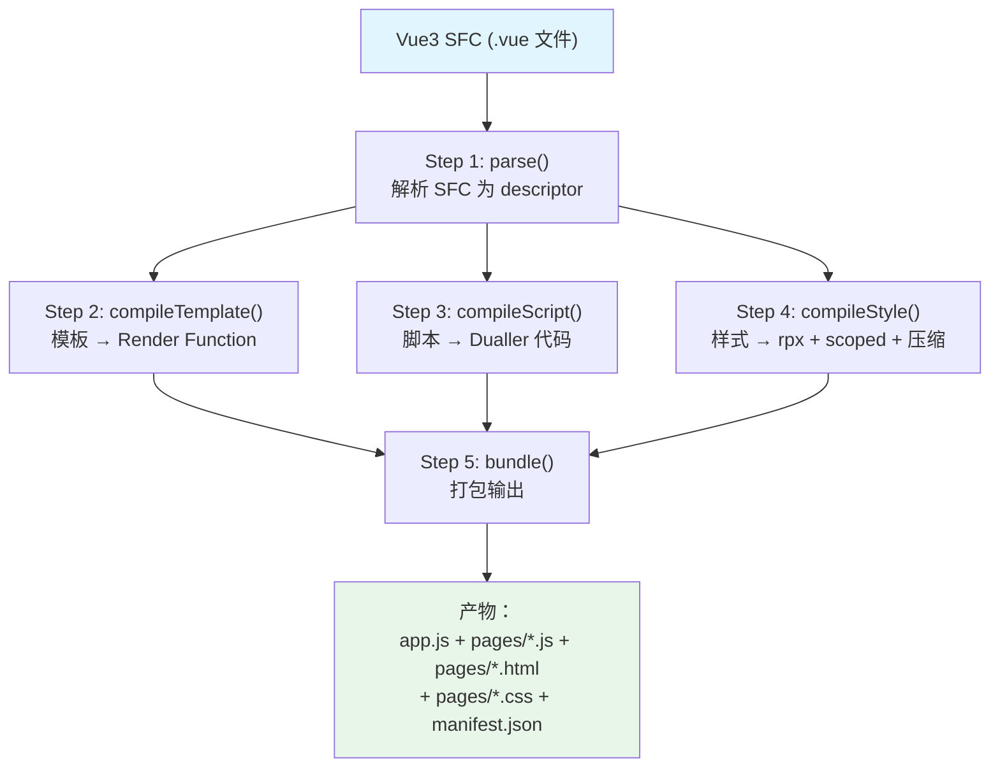
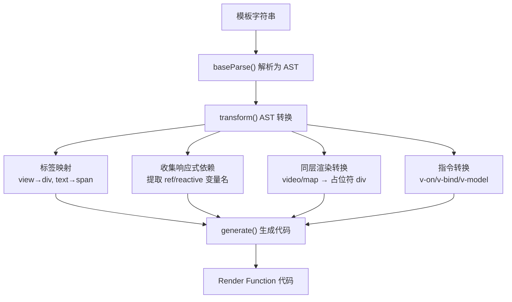
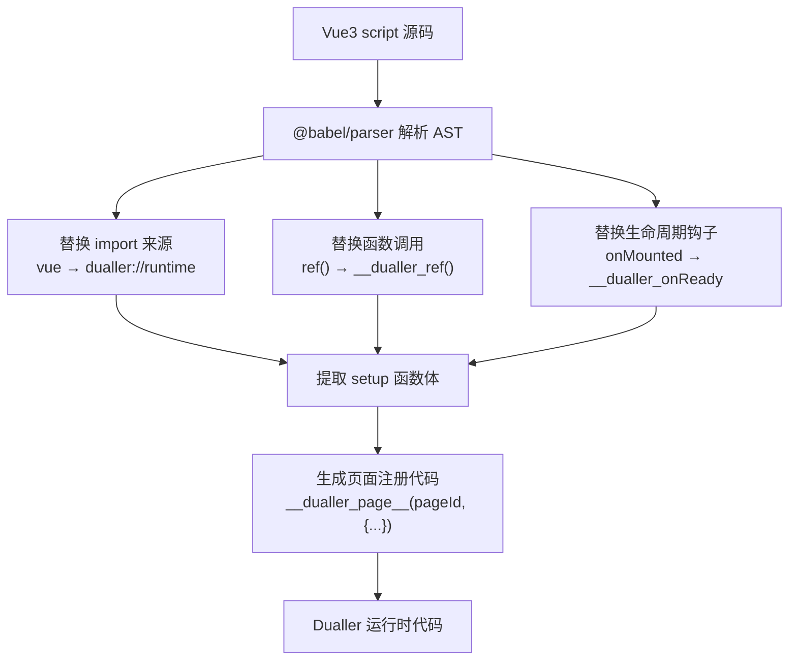
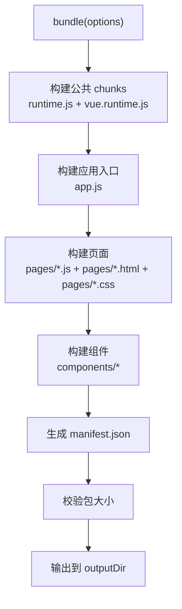
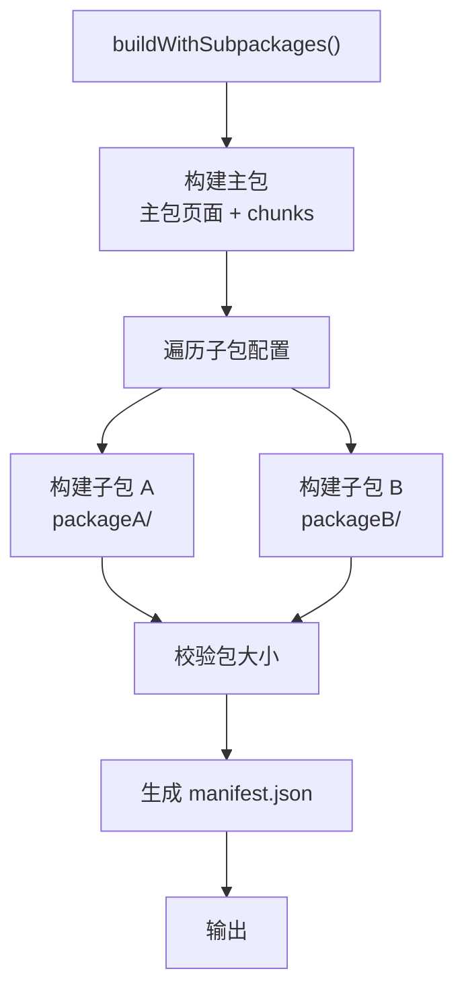
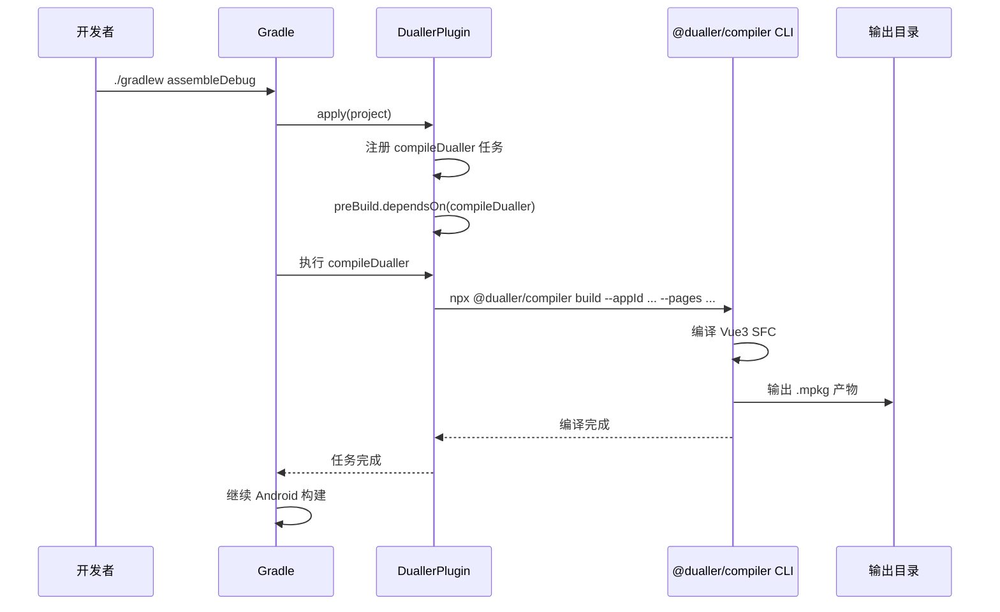

# Dualler 工具链 — 软件详细设计文档（SDD）

> **项目名称**：Dualler Toolchain
> **文档版本**：v1.0
> **日期**：2026-06-10
> **状态**：初稿
> **范围**：@dualler/compiler（Vue3 编译器）+ @dualler/gradle-plugin（Gradle 插件）

---

## 1. 概述

### 1.1 文档目的

本文档是 Dualler 小程序工具链的软件详细设计文档，覆盖：
- `@dualler/compiler` — Vue3 SFC 编译器（纯 TypeScript CLI）
- `@dualler/gradle-plugin` — Android 构建集成（极薄 Kotlin 壳）

### 1.2 适用范围

| 维度 | 说明 |
|------|------|
| **适用模块** | @dualler/compiler、@dualler/gradle-plugin |
| **不适用模块** | 客户端 SDK、服务端（见对应 SDD） |
| **目标读者** | 编译器开发工程师、构建工具开发工程师 |
| **技术栈** | TypeScript、Vue3 Compiler、Babel、PostCSS、esbuild、Kotlin Gradle Plugin |

### 1.3 编译器职责

| 职责 | 说明 |
|------|------|
| SFC 解析 | 解析 .vue 文件为 template/script/style 三部分 |
| 模板编译 | Vue3 template → Render Function（纯 JSON VNode） |
| 脚本编译 | Vue3 setup() → Dualler 运行时代码 |
| 样式编译 | rpx → vw 转换 + scoped CSS + 压缩 |
| 包构建 | 拆包策略 + 打包输出 + manifest 生成 |
| 分包支持 | 主包/子包分离 + 大小校验 |

---

## 2. 编译流程

### 2.1 整体流程图



### 2.2 编译产物结构

```
output/
├── app.js                    # 应用入口（逻辑层）
├── app.json                  # 全局配置
├── manifest.json             # 编译清单
├── chunks/                   # 公共基础库
│   ├── runtime.js            # Dualler 运行时
│   └── vue.runtime.js        # Vue3 裁剪版
├── pages/
│   ├── index/
│   │   ├── index.js          # 页面逻辑
│   │   ├── index.html        # 页面模板
│   │   └── index.css         # 页面样式
│   └── detail/
│       ├── detail.js
│       ├── detail.html
│       └── detail.css
└── components/
    └── my-button/
        ├── my-button.js
        ├── my-button.html
        └── my-button.css
```

---

## 3. @dualler/compiler 详细设计

### 3.1 模块结构

```
packages/compiler/
├── package.json
├── tsconfig.json
└── src/
    ├── index.ts                    # 编译器 API 入口
    ├── cli.ts                      # CLI 入口
    ├── parser/
    │   ├── sfc-parser.ts           # SFC 解析器
    │   ├── template-compiler.ts    # 模板 → Render Function
    │   ├── script-compiler.ts      # 脚本 → Dualler 代码
    │   └── style-compiler.ts       # 样式编译
    ├── codegen/
    │   └── render-function.ts      # Render Function 代码生成
    ├── bundler/
    │   ├── package-bundler.ts      # 打包器
    │   ├── subpackage-bundler.ts   # 分包构建器
    │   └── manifest-generator.ts   # manifest.json 生成
    ├── postcss-scoped-plugin.ts    # PostCSS scoped 插件
    └── test/
        ├── sfc-parser.test.ts
        ├── template-compiler.test.ts
        ├── script-compiler.test.ts
        └── bundler.test.ts
```

### 3.2 SFC 解析器（sfc-parser）

#### 3.2.1 接口定义

```typescript
// packages/compiler/src/parser/sfc-parser.ts

import { SFCDescriptor } from '@vue/compiler-sfc'

export interface SFCLangInfo {
  templateLang: string;    // 'html' | 'pug'
  scriptLang: string;      // 'js' | 'ts'
  styleLang: string;       // 'css' | 'scss' | 'less'
}

export interface SFCParseResult {
  descriptor: SFCDescriptor;
  langInfo: SFCLangInfo;
}

/**
 * 解析 Vue3 SFC 文件
 *
 * @param source SFC 源码
 * @param filename 文件名（用于错误定位）
 * @return 解析结果
 * @throws SFCParseError 解析失败
 */
export function parseSFC(source: string, filename: string): SFCParseResult
```

#### 3.2.2 内置组件标签列表

```typescript
const DUELLER_BUILTIN_TAGS = new Set([
  // 布局
  'view', 'text', 'image', 'scroll-view', 'swiper', 'swiper-item',
  // 表单
  'button', 'input', 'textarea', 'checkbox', 'radio', 'picker',
  'slider', 'switch',
  // 多媒体
  'video', 'audio', 'camera', 'map', 'canvas',
  // 导航
  'navigator',
  // 其他
  'web-view', 'icon', 'progress', 'rich-text',
  'live-player', 'live-pusher'
]);

export function isDuallerComponent(tag: string): boolean {
  return DUELLER_BUILTIN_TAGS.has(tag);
}
```

### 3.3 模板编译器（template-compiler）

#### 3.3.1 接口定义

```typescript
// packages/compiler/src/parser/template-compiler.ts

export interface CompileTemplateOptions {
  /** 是否生产模式 */
  isProduction?: boolean;
  /** 自定义组件列表 */
  customComponents?: string[];
}

export interface CompileTemplateResult {
  /** 生成的 Render 函数代码 */
  code: string;
  /** 依赖的响应式变量列表 */
  deps: string[];
  /** 使用的原生组件列表（需同层渲染） */
  nativeComponents: string[];
  /** Source map */
  map?: string;
}

/**
 * 编译 Dualler 模板为 Vue3 Render Function
 *
 * 输入: <view class="box">{{ msg }}</view>
 * 输出: function render(ctx) { return h('div', { class: 'box' }, [h('__text__', {}, [ctx.msg])]) }
 *
 * @param template 模板字符串
 * @param options 编译选项
 * @return 编译结果
 */
export function compileTemplate(
  template: string,
  options?: CompileTemplateOptions
): CompileTemplateResult
```

#### 3.3.2 标签映射规则

```typescript
const TAG_MAP: Record<string, string> = {
  'view': 'div',
  'text': 'span',
  'image': 'img',
  'scroll-view': 'div',      // 添加 data-scroll="true"
  'swiper': 'div',           // 添加 data-swiper="true"
  'swiper-item': 'div',
  'navigator': 'a',
  'web-view': 'iframe',
  'icon': 'span',
  'progress': 'div',
  'rich-text': 'div',
};

// 需要同层渲染的原生组件（编译为占位符）
const NATIVE_COMPONENTS = new Set(['video', 'map', 'live-player', 'live-pusher']);
```

#### 3.3.3 编译流程



#### 3.3.4 同层渲染占位符生成

```typescript
/**
 * 将 <video> 编译为占位符 div
 *
 * 输入：<video src="..." autoplay></video>
 * 输出：<div data-native-component="video"
 *          data-component-id="video_001"
 *          style="width:100%;height:200px;">
 *       </div>
 */
function transformNativeComponent(node: ElementNode) {
  if (NATIVE_COMPONENTS.has(node.tag)) {
    node.tag = 'div';
    node.props.push(
      createAttributeNode('data-native-component', node.tag),
      createAttributeNode('data-component-id', `${node.tag}_${generateId()}`),
      createAttributeNode('style', 'width:100%;height:200px;')
    );
  }
}
```

### 3.4 脚本编译器（script-compiler）

#### 3.4.1 接口定义

```typescript
// packages/compiler/src/parser/script-compiler.ts

export interface CompileScriptOptions {
  /** 页面 ID */
  pageId: string;
  /** 是否生产模式 */
  isProduction?: boolean;
}

/**
 * 编译 Vue3 <script> 为 Dualler 运行时代码
 *
 * 转换规则：
 *   - ref() → __dualler_ref()
 *   - reactive() → __dualler_reactive()
 *   - computed() → __dualler_computed()
 *   - watch() → __dualler_watch()
 *   - onMounted() → __dualler_onReady()
 *   - onUnmounted() → __dualler_onUnload()
 *
 * @param source 脚本源码
 * @param options 编译选项
 * @return 编译后的代码
 */
export function compileScript(source: string, options: CompileScriptOptions): string
```

#### 3.4.2 API 映射表

```typescript
const VUE_TO_DUALLER_MAP: Record<string, string> = {
  // 响应式
  'ref': '__dualler_ref',
  'reactive': '__dualler_reactive',
  'computed': '__dualler_computed',
  'watch': '__dualler_watch',
  'watchEffect': '__dualler_watchEffect',
  'toRef': '__dualler_toRef',
  'toRefs': '__dualler_toRefs',

  // 生命周期
  'onMounted': '__dualler_onReady',
  'onUnmounted': '__dualler_onUnload',
  'onShow': '__dualler_onShow',
  'onHide': '__dualler_onHide',
  'onLoad': '__dualler_onLoad',

  // 工具
  'nextTick': '__dualler_nextTick',
};
```

#### 3.4.3 编译流程



#### 3.4.4 输出示例

```javascript
// 编译器输出
__dualler_page__('pages/index', {
  setup() {
    const count = __dualler_ref(0);
    const doubleCount = __dualler_computed(() => count.value * 2);

    function increment() {
      count.value++;
    }

    __dualler_onReady(() => {
      console.log('page ready');
    });

    return { count, doubleCount, increment };
  }
});
```

### 3.5 样式编译器（style-compiler）

#### 3.5.1 接口定义

```typescript
// packages/compiler/src/parser/style-compiler.ts

export interface CompileStyleOptions {
  /** 是否 scoped */
  scoped?: boolean;
  /** 页面/组件 ID（用于 scope hash） */
  id?: string;
  /** 是否压缩 */
  minify?: boolean;
  /** rpx 转换基准宽度（默认 750） */
  designWidth?: number;
}

/**
 * 编译样式
 *   - rpx → vw 转换
 *   - scoped CSS → 添加 [data-v-xxxx] 属性选择器
 *   - 压缩输出
 *
 * @param source CSS 源码
 * @param options 编译选项
 * @return 编译后的 CSS
 */
export async function compileStyle(
  source: string,
  options?: CompileStyleOptions
): Promise<string>
```

#### 3.5.2 PostCSS 插件

**rpx → vw 转换插件：**

```typescript
function rpxToPxPlugin(designWidth: number): postcss.Plugin {
  return {
    postcssPlugin: 'dualler-rpx-to-vw',
    Declaration(decl) {
      if (decl.value.includes('rpx')) {
        decl.value = decl.value.replace(
          /(\d+(?:\.\d+)?)rpx/g,
          (_, num) => `${(parseFloat(num) / 750 * 100).toFixed(4)}vw`
        );
      }
    }
  };
}
rpxToPxPlugin.postcss = true;
```

**Scoped CSS 插件：**

```typescript
function scopedPlugin(id: string): postcss.Plugin {
  return {
    postcssPlugin: 'dualler-scoped',
    Rule(rule) {
      rule.selector = addScopeToSelector(rule.selector, id);
    }
  };
}

function addScopeToSelector(selector: string, id: string): string {
  const scopeAttr = `[data-v-${id}]`;
  return selector.replace(/([^,]+)/g, (match) => {
    const trimmed = match.trim();
    if (trimmed.startsWith(':') || trimmed.startsWith('::')) return match;
    return `${match}${scopeAttr}`;
  });
}
```

### 3.6 包构建器（package-bundler）

#### 3.6.1 接口定义

```typescript
// packages/compiler/src/bundler/package-bundler.ts

export interface BundleOptions {
  /** 小程序 appId */
  appId: string;
  /** 入口文件 */
  entry: string;
  /** 页面列表 */
  pages: string[];
  /** 组件列表 */
  components: string[];
  /** 输出目录 */
  outputDir: string;
  /** 是否压缩 */
  minify?: boolean;
  /** 是否生成 source map */
  sourceMap?: boolean;
}

export interface BundleResult {
  /** 输出文件列表 */
  files: Map<string, FileInfo>;
  /** manifest.json 内容 */
  manifest: Manifest;
}

export interface FileInfo {
  path: string;
  sha256: string;
  size: number;
}

export interface Manifest {
  appId: string;
  version: string;
  compilerVersion: string;
  pages: string[];
  components: string[];
  files: Record<string, FileInfo>;
  totalSize: number;
  buildTime: string;
}

/**
 * 构建小程序包
 *
 * 拆包策略：
 *   - chunks/：公共基础库（runtime、vue runtime）→ 低频变更
 *   - pages/：页面业务代码 → 高频变更
 *   - components/：组件代码 → 中频变更
 *
 * @param options 构建选项
 * @return 构建结果
 */
export async function bundle(options: BundleOptions): Promise<BundleResult>
```

#### 3.6.2 构建流程



#### 3.6.3 包大小校验

```typescript
const MAIN_PACKAGE_MAX = 2 * 1024 * 1024;    // 2MB
const SUB_PACKAGE_MAX = 2 * 1024 * 1024;     // 2MB
const TOTAL_MAX = 20 * 1024 * 1024;           // 20MB

function validatePackageSize(files: Map<string, FileInfo>, subpackages: SubpackageConfig[]) {
  // 主包大小
  let mainSize = 0;
  files.forEach((info, path) => {
    if (!subpackages.some(pkg => path.startsWith(pkg.root + '/'))) {
      mainSize += info.size;
    }
  });
  if (mainSize > MAIN_PACKAGE_MAX) {
    throw new Error(`Main package size ${(mainSize/1024).toFixed(0)}KB exceeds 2MB limit`);
  }

  // 子包大小
  for (const pkg of subpackages) {
    let pkgSize = 0;
    files.forEach((info, path) => {
      if (path.startsWith(pkg.root + '/')) pkgSize += info.size;
    });
    if (pkgSize > SUB_PACKAGE_MAX) {
      throw new Error(`Subpackage "${pkg.name}" exceeds 2MB limit`);
    }
  }

  // 总大小
  const totalSize = Array.from(files.values()).reduce((sum, f) => sum + f.size, 0);
  if (totalSize > TOTAL_MAX) {
    throw new Error(`Total package size exceeds 20MB limit`);
  }
}
```

### 3.7 分包构建器（subpackage-bundler）

#### 3.7.1 接口定义

```typescript
// packages/compiler/src/bundler/subpackage-bundler.ts

export interface SubpackageConfig {
  root: string;           // 子包根目录
  name: string;           // 子包名称
  pages: string[];        // 页面列表
  isIndependent?: boolean; // 是否独立分包
}

/**
 * 分包构建
 *
 * 将页面按 subpackages 配置分配到不同的输出目录
 *
 * @param options 构建选项
 * @param subpackages 分包配置
 * @return 构建结果
 */
export async function buildWithSubpackages(
  options: BundleOptions,
  subpackages: SubpackageConfig[]
): Promise<BundleResult>
```

#### 3.7.2 分包构建流程



### 3.8 编译器入口（compile）

#### 3.8.1 接口定义

```typescript
// packages/compiler/src/index.ts

export interface CompileOptions {
  appId: string;
  entry: string;
  pages: string[];
  components: string[];
  outputDir: string;
  minify?: boolean;
  sourceMap?: boolean;
  designWidth?: number;
}

export interface CompileResult {
  success: boolean;
  manifest?: Manifest;
  errors?: CompileError[];
}

export interface CompileError {
  file: string;
  message: string;
  line?: number;
  column?: number;
}

/**
 * 编译入口：Vue3 SFC → Dualler 小程序包
 *
 * 流程：
 *   1. parse() — 解析 SFC 为 descriptor（校验语法）
 *   2. bundle() — 打包输出（含拆包策略）
 *
 * @param options 编译选项
 * @return 编译结果
 */
export async function compile(options: CompileOptions): Promise<CompileResult>
```

### 3.9 CLI 入口

#### 3.9.1 命令行接口

```typescript
// packages/compiler/src/cli.ts

/**
 * CLI 入口
 *
 * 用法：
 *   npx @dualler/compiler build \
 *     --appId com.example.myapp \
 *     --entry src/app.vue \
 *     --pages src/pages/index.vue,src/pages/detail.vue \
 *     --components src/components/my-button.vue \
 *     --outputDir dist \
 *     --minify true
 */
async function main() {
  const args = parseArgs(process.argv.slice(2));

  if (!args.appId || !args.entry || !args.pages) {
    console.error(`
Usage: dualler-compiler build [options]

Required:
  --appId        小程序 appId
  --entry        入口文件路径
  --pages        页面文件列表（逗号分隔）

Optional:
  --components   组件文件列表（逗号分隔）
  --outputDir    输出目录（默认 ./dist）
  --minify       是否压缩（默认 true）
  --sourceMap    是否生成 source map（默认 false）
  --designWidth  设计稿宽度（默认 750）
`);
    process.exit(1);
  }

  const result = await compile({
    appId: args.appId,
    entry: resolve(args.entry),
    pages: args.pages.split(',').map(p => resolve(p.trim())),
    components: args.components?.split(',').map(c => resolve(c.trim())) ?? [],
    outputDir: resolve(args.outputDir || './dist'),
    minify: args.minify !== 'false',
    sourceMap: args.sourceMap === 'true',
    designWidth: parseInt(args.designWidth || '750', 10),
  });

  if (result.success) {
    console.log('✅ Build succeeded!');
    process.exit(0);
  } else {
    console.error('❌ Build failed:');
    result.errors?.forEach(e => console.error(`   ${e.file}: ${e.message}`));
    process.exit(1);
  }
}
```

---

## 4. @dualler/gradle-plugin 详细设计

### 4.1 模块结构

```
packages/gradle-plugin/
├── build.gradle.kts
└── src/
    ├── main/
    │   ├── kotlin/
    │   │   └── com/dualler/plugin/
    │   │       ├── DuallerPlugin.kt      # Plugin 入口
    │   │       └── DuallerExtension.kt   # 配置 DSL
    │   └── resources/
    │       └── META-INF/
    │           └── gradle-plugins/
    │               └── com.dualler.gradle-plugin.properties
    └── test/
        └── kotlin/
            └── DuallerPluginTest.kt
```

### 4.2 DuallerPlugin

```kotlin
// packages/gradle-plugin/src/main/kotlin/com/dualler/plugin/DuallerPlugin.kt

package com.dualler.plugin

import org.gradle.api.Plugin
import org.gradle.api.Project

/**
 * Dualler Gradle Plugin
 *
 * 职责单一：在 Android 构建流程中调用 @dualler/compiler CLI
 * 编译逻辑全部在 TypeScript 端，这里只是一个薄壳
 */
class DuallerPlugin : Plugin<Project> {
    override fun apply(project: Project) {
        val extension = project.extensions.create("dualler", DuallerExtension::class.java)

        project.tasks.register("compileDualler") { task ->
            task.group = "dualler"
            task.description = "Compile Vue3 SFC to Dualler mini-program package"

            task.doLast {
                val args = buildList {
                    add("npx")
                    add("@dualler/compiler")
                    add("build")
                    add("--appId"); add(extension.appId)
                    add("--entry"); add(extension.entry)
                    add("--pages"); add(extension.pages.joinToString(","))
                    if (extension.components.isNotEmpty()) {
                        add("--components"); add(extension.components.joinToString(","))
                    }
                    add("--outputDir"); add(extension.outputDir.absolutePath)
                    add("--minify"); add(extension.options.minify.toString())
                    add("--sourceMap"); add(extension.options.sourceMap.toString())
                }

                project.exec { exec ->
                    exec.commandLine(args)
                    exec.workingDir = project.projectDir
                }
            }
        }

        // 挂接到 Android 构建流程
        project.tasks.findByName("preBuild")?.dependsOn("compileDualler")
    }
}
```

### 4.3 DuallerExtension

```kotlin
// packages/gradle-plugin/src/main/kotlin/com/dualler/plugin/DuallerExtension.kt

package com.dualler.plugin

import java.io.File

/**
 * Gradle DSL 配置扩展
 *
 * 使用方式：
 * ```
 * dualler {
 *     appId = "com.example.myapp"
 *     entry = "src/app.vue"
 *     pages = listOf("src/pages/index.vue", "src/pages/detail.vue")
 *     components = listOf("src/components/my-button.vue")
 *     outputDir = buildDir.resolve("dualler/dist")
 *
 *     options {
 *         minify = true
 *         sourceMap = false
 *     }
 * }
 * ```
 */
open class DuallerExtension {
    /** 小程序 appId */
    var appId: String = ""

    /** 入口文件路径 */
    var entry: String = ""

    /** 页面文件列表 */
    var pages: List<String> = emptyList()

    /** 组件文件列表 */
    var components: List<String> = emptyList()

    /** 输出目录 */
    var outputDir: File = File("build/dualler/dist")

    /** 编译选项 */
    val options = CompileOptions()

    fun options(block: CompileOptions.() -> Unit) = options.apply(block)
}

open class CompileOptions {
    /** 是否压缩 */
    var minify: Boolean = true

    /** 是否生成 source map */
    var sourceMap: Boolean = false
}
```

### 4.4 插件注册

```properties
# packages/gradle-plugin/src/main/resources/META-INF/gradle-plugins/com.dualler.gradle-plugin.properties
implementation-class=com.dualler.plugin.DuallerPlugin
```

### 4.5 构建集成流程



---

## 5. 依赖关系

### 5.1 @dualler/compiler 依赖

```json
{
  "dependencies": {
    "@vue/compiler-sfc": "^3.4.0",
    "@vue/compiler-dom": "^3.4.0",
    "@babel/parser": "^7.24.0",
    "@babel/traverse": "^7.24.0",
    "@babel/generator": "^7.24.0",
    "@babel/types": "^7.24.0",
    "postcss": "^8.4.0",
    "cssnano": "^6.0.0",
    "esbuild": "^0.20.0"
  },
  "devDependencies": {
    "typescript": "^5.3.0",
    "vitest": "^1.0.0"
  }
}
```

### 5.2 @dualler/gradle-plugin 依赖

```kotlin
// build.gradle.kts
dependencies {
    implementation(gradleApi())
    implementation("org.jetbrains.kotlin:kotlin-stdlib:1.9.0")
    testImplementation("org.junit.jupiter:junit-jupiter:5.10.0")
}
```

---

## 6. 测试策略

### 6.1 编译器测试

| 测试类型 | 覆盖范围 | 工具 |
|----------|----------|------|
| 单元测试 | SFC 解析、模板编译、脚本编译、样式编译 | Vitest |
| 集成测试 | 完整编译流程、分包构建 | Vitest |
| 快照测试 | 编译产物输出 | Vitest snapshot |

### 6.2 测试用例示例

```typescript
// packages/compiler/src/test/template-compiler.test.ts
describe('compileTemplate', () => {
  it('should map view to div', () => {
    const result = compileTemplate('<view class="box">hello</view>');
    expect(result.code).toContain("h('div'");
  });

  it('should handle native components', () => {
    const result = compileTemplate('<video src="..."></video>');
    expect(result.nativeComponents).toContain('video');
    expect(result.code).toContain('data-native-component');
  });

  it('should collect reactive deps', () => {
    const result = compileTemplate('<view>{{ count }}</view>');
    expect(result.deps).toContain('count');
  });
});
```

---

*文档结束*
