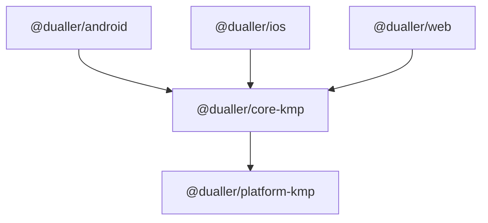
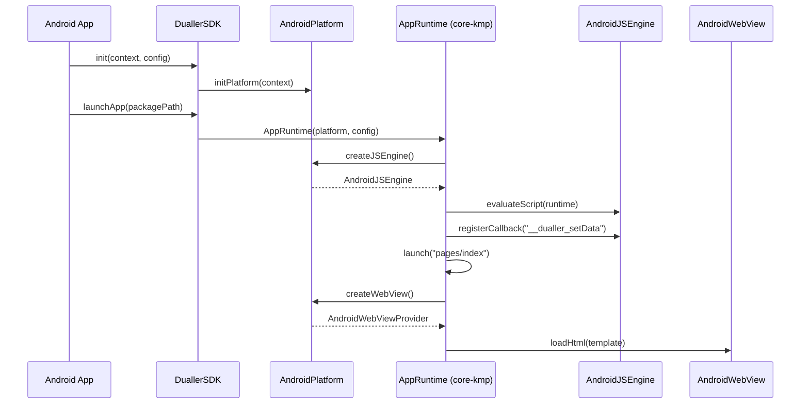

# Dualler 客户端 SDK KMP 实施设计

> **日期**：2026-06-10
> **状态**：已确认
> **基于**：Dualler-Client-SDK-SDD.md v1.0

---

## 1. 决策摘要

| 决策项 | 选择 | 理由 |
|--------|------|------|
| **技术栈** | Kotlin Multiplatform | 跨平台共享核心逻辑 |
| **目标平台** | Android + iOS + Web (JS) | 覆盖主流平台 |
| **实施方案** | 方案 A：共享核心 + expect/actual | 符合 SDD 分层，渐进式迁移 |
| **实施顺序** | platform → core → android | 按 SDD 章节顺序推进 |
| **项目结构** | 新建 KMP 包（不改造现有） | 不影响现有代码 |

---

## 2. 项目结构

```
dualler/
├── packages/
│   ├── platform-kmp/               # @dualler/platform-kmp
│   │   ├── build.gradle.kts
│   │   └── src/
│   │       ├── commonMain/kotlin/com/dualler/platform/
│   │       │   ├── Platform.kt
│   │       │   ├── JSEngine.kt
│   │       │   ├── WebViewProvider.kt
│   │       │   ├── PlatformBridge.kt
│   │       │   ├── provider/
│   │       │   │   ├── NetworkProvider.kt
│   │       │   │   ├── StorageProvider.kt
│   │       │   │   ├── FileProvider.kt
│   │       │   │   └── DeviceProvider.kt
│   │       │   ├── model/
│   │       │   │   ├── JSValue.kt
│   │       │   │   ├── DOMEvent.kt
│   │       │   │   ├── BridgeMessage.kt
│   │       │   │   ├── PackageInfo.kt
│   │       │   │   └── APIResult.kt
│   │       │   └── security/
│   │       │       ├── SecurityPolicy.kt
│   │       │       └── Permission.kt
│   │       ├── androidMain/kotlin/com/dualler/platform/
│   │       │   └── AndroidPlatform.kt
│   │       ├── iosMain/kotlin/com/dualler/platform/
│   │       │   └── IOSPlatform.kt
│   │       └── jsMain/kotlin/com/dualler/platform/
│   │           └── WebPlatform.kt
│   │
│   ├── core-kmp/                   # @dualler/core-kmp
│   │   ├── build.gradle.kts
│   │   └── src/
│   │       ├── commonMain/kotlin/com/dualler/core/
│   │       │   ├── AppRuntime.kt
│   │       │   ├── PageRuntime.kt
│   │       │   ├── Router.kt
│   │       │   ├── DataChannel.kt
│   │       │   ├── ComponentRegistry.kt
│   │       │   ├── PageDataStore.kt
│   │       │   └── model/
│   │       │       ├── AppConfig.kt
│   │       │       ├── PageConfig.kt
│   │       │       └── RouterConfig.kt
│   │       └── commonTest/kotlin/com/dualler/core/
│   │           ├── MockPlatform.kt
│   │           ├── RouterTest.kt
│   │           └── DataChannelTest.kt
│   │
│   ├── android/                    # Android 壳（改造）
│   ├── ios/                        # iOS 壳（新增）
│   └── web/                        # Web 壳（改造）
```

---

## 3. 模块依赖



---

## 4. platform-kmp 设计

### 4.1 核心接口（commonMain）

**Platform 接口：**

```kotlin
interface Platform {
    val name: String
    fun createJSEngine(): JSEngine
    fun createWebView(): WebViewProvider
    fun createBridge(): PlatformBridge
    val network: NetworkProvider
    val storage: StorageProvider
    val file: FileProvider
    val device: DeviceProvider
}

expect fun getPlatform(): Platform
```

**JSEngine 接口：**

```kotlin
interface JSEngine {
    fun evaluateScript(script: String, sourceUrl: String = "dualler://inline"): JSValue
    fun registerCallback(name: String, callback: (JSArray) -> JSValue)
    fun registerObject(name: String, obj: Map<String, (JSArray) -> JSValue>)
    fun destroy()
}
```

**JSValue 类型体系：**

```kotlin
sealed class JSValue {
    object Undefined : JSValue()
    object Null : JSValue()
    data class Boolean(val value: kotlin.Boolean) : JSValue()
    data class Number(val value: Double) : JSValue()
    data class String(val value: kotlin.String) : JSValue()
    data class Array(val elements: List<JSValue>) : JSValue()
    data class Object(val properties: Map<kotlin.String, JSValue>) : JSValue()
}
```

### 4.2 平台 actual 实现

**Android：**

```kotlin
// androidMain
class AndroidPlatform(private val context: Context) : Platform {
    override val name = "android"
    override fun createJSEngine(): JSEngine = AndroidJSEngine(context)
    override fun createWebView(): WebViewProvider = AndroidWebViewProvider(context)
    override fun createBridge(): PlatformBridge = AndroidPlatformBridge(context)
    // ...
}

actual fun getPlatform(): Platform = platformInstance!!
fun initPlatform(context: Context) { platformInstance = AndroidPlatform(context) }
```

**iOS：**

```kotlin
// iosMain
class IOSPlatform : Platform { ... }
actual fun getPlatform(): Platform = IOSPlatform()
```

**Web：**

```kotlin
// jsMain
class WebPlatform : Platform { ... }
actual fun getPlatform(): Platform = WebPlatform()
```

---

## 5. core-kmp 设计

### 5.1 设计原则

- **纯 Kotlin**：commonMain 中零平台 API 依赖
- **平台交互**：全部通过 Platform 接口
- **可测试**：通过 MockPlatform 进行单元测试

### 5.2 AppRuntime

```kotlin
class AppRuntime(
    private val platform: Platform,
    private val config: AppConfig
) {
    // 状态机：CREATED → LAUNCHING → RUNNING → DESTROYING → DESTROYED
    suspend fun launch(entryPath: String, query: Map<String, String> = emptyMap())
    fun triggerLifecycle(event: String, params: Map<String, Any> = emptyMap())
    fun destroy()
}
```

### 5.3 Router

```kotlin
class Router(private val platform: Platform) {
    fun navigateTo(pageId: String, query: Map<String, String> = emptyMap())
    fun redirectTo(pageId: String, query: Map<String, String> = emptyMap())
    fun navigateBack(delta: Int = 1)
    fun reLaunch(pageId: String, query: Map<String, String> = emptyMap())
    fun switchTab(pageId: String)
    fun clear()
}
```

### 5.4 DataChannel

```kotlin
class DataChannel(private val bridge: PlatformBridge) {
    fun syncData(pageId: String, newData: Map<String, Any>)
    fun setPathData(pageId: String, path: String, value: Any)
    // 16ms 批量合并 + 256KB 大小校验
}
```

---

## 6. Android 壳层

### 6.1 改造策略

现有 `packages/android` 添加对 core-kmp 的依赖：

```kotlin
dependencies {
    implementation(project(":core-kmp"))
    implementation(project(":platform-kmp"))
}
```

### 6.2 AndroidJSEngine

```kotlin
class AndroidJSEngine(private val context: Context) : JSEngine {
    private val runtime = QuickJS.createRuntime()
    private val jsContext = runtime.createContext()

    init {
        // 沙箱加固：剔除 std/os，锁定 Bridge，禁用 eval
    }

    override fun evaluateScript(script: String, sourceUrl: String): JSValue { ... }
    override fun registerCallback(name: String, callback: (JSArray) -> JSValue) { ... }
    override fun destroy() { jsContext.close(); runtime.close() }
}
```

### 6.3 集成流程



---

## 7. 测试策略

| 层级 | 位置 | 覆盖范围 | 工具 |
|------|------|----------|------|
| 单元测试 | core-kmp/commonTest | Router、DataChannel | kotlin.test |
| 集成测试 | core-kmp/commonTest | AppRuntime 生命周期 | MockPlatform |
| 平台测试 | androidTest | AndroidJSEngine、WebView | JUnit |
| E2E 测试 | androidTest | 完整启动流程 | Espresso |

---

## 8. 实施计划

### Phase 1: platform-kmp（5 天）

| 任务 | 产出 | 验收标准 |
|------|------|----------|
| 创建 KMP 项目结构 | build.gradle.kts | `./gradlew :platform-kmp:build` 通过 |
| 定义 Platform 接口 | Platform.kt | 编译通过 |
| 定义 JSEngine 接口 | JSEngine.kt + JSValue.kt | 编译通过 |
| 定义 WebView 接口 | WebViewProvider.kt | 编译通过 |
| 定义 Bridge 接口 | PlatformBridge.kt | 编译通过 |
| 定义数据模型 | DOMEvent/PackageInfo/APIResult | 序列化通过 |
| Android actual 桩 | AndroidPlatform.kt | getPlatform() 返回实例 |

### Phase 2: core-kmp（5 天）

| 任务 | 产出 | 验收标准 |
|------|------|----------|
| AppRuntime | AppRuntime.kt | 状态机转换正确 |
| Router | Router.kt | 5 种路由方法正确 |
| DataChannel | DataChannel.kt | 批量合并 + 大小校验 |
| PageDataStore | PageDataStore.kt | 缓存读写正确 |
| MockPlatform | MockPlatform.kt | 可用于测试 |
| 单元测试 | RouterTest + DataChannelTest | 全部通过 |

### Phase 3: Android 壳（7 天）

| 任务 | 产出 | 验收标准 |
|------|------|----------|
| AndroidJSEngine | AndroidJSEngine.kt | QuickJS 集成 + 沙箱加固 |
| AndroidWebView | AndroidWebViewProvider.kt | HTML 加载 + JS 执行 |
| AndroidBridge | AndroidPlatformBridge.kt | setData + event 分发 |
| DuallerSDK | DuallerSDK.kt | 完整启动流程 |
| E2E 测试 | hello world 小程序 | 启动 + 显示 + 交互 |

### Phase 4: 补充实现（8 天）

| 任务 | 产出 | 验收标准 |
|------|------|----------|
| 包管理子系统 | PackageDownloader/Patcher/CacheStore | 下载 + 增量更新 |
| 错误处理子系统 | DuallerErrorHandler/CrashRecovery | 全局错误捕获 |
| iOS 壳实现 | IOSJSEngine/IOSWebView | 基本启动流程 |
| Web 壳实现 | WebJSEngine/WebWebView | 浏览器演示 |

---

## 9. 关键风险

| 风险 | 影响 | 缓解措施 |
|------|------|----------|
| KMP expect/actual 限制 | 某些平台 API 无法在 commonMain 使用 | 接口隔离，平台实现在各 sourceSet |
| QuickJS JNI 兼容性 | KMP Android target 与 JNI 交互 | AndroidJSEngine 在 androidMain 中直接调用 |
| iOS JSCore 集成 | KMP iOS target 调用 JSCore | 使用 KMP 的 iOS interop |
| Web Worker 通信 | JS target 与 Worker 通信 | 使用 kotlinx.coroutines 的 Channel |

---

*设计完成，待用户确认后调用 writing-plans 生成实施计划*
